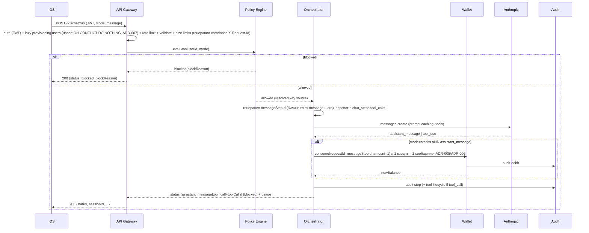
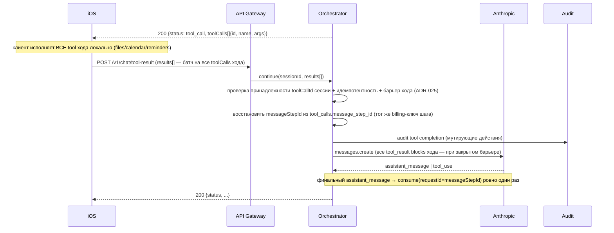

# 01 — Architecture

## Топология
Один deployable: **модульный монолит** на FastAPI (см. [ADR-001](adr/ADR-001-stack-choice.md)). Модули — это внутренние пакеты Python с чёткими границами, а не отдельные сервисы. PostgreSQL — единственное хранилище состояния. Redis — rate limiting и кэш policy/idempotency-меток.

> **Позиционирование ([ADR-022](adr/ADR-022-optional-project-and-tool-gating.md)).** Основная задача сервиса — **агрегатор Claude для iOS («чистый чат»)**: работает без проекта (`projectId` опционален) и без website-инструментов. Генерация сайтов (Website Builder, server-side `site.*`) — **опциональная, второстепенная** фича, активируемая наличием `projectId` у сессии.

> **Провайдер-абстракция LLM ([ADR-033](adr/ADR-033-llm-provider-abstraction.md)).** Узел «Anthropic API» на диаграмме — частный случай абстрактного **LLM-провайдера**. Chat Orchestrator вызывает нейтральный `LLMClient` (реализации: `AnthropicClient` / `OpenAIClient`), выбираемый env **`LLM_PROVIDER`, дефолт `anthropic`**. Сервис разворачивается мульти-инстансно на разных провайдерах **одним кодом** (не форк): anthropic-инстансы (`broadnova.shop`/`avelyraweb.shop`) + OpenAI-инстанс (3-й, Chat Completions API). **Один провайдер на инстанс** — БД хранит wire-формат своего провайдера. Провайдер-специфичная (де)сериализация — внутри клиента; orchestrator/персист провайдер-агностичны. Детали — [chat-orchestrator/03-architecture.md §Провайдер-абстракция LLM](modules/chat-orchestrator/03-architecture.md#провайдер-абстракция-llm-anthropic--openai-adr-033).

```mermaid
flowchart TB
    iOS[iOS App] -->|HTTPS + JWT| GW[API Gateway<br/>auth, rate limit, validation]

    GW --> ORCH[Chat Orchestrator]
    GW --> POL[Policy Engine]
    GW --> WAL[Wallet / Ledger]
    GW --> SUB[Subscription Service]
    GW --> BYOK[BYOK Service]

    ADMIN_IN[Operator] -->|HTTPS + X-Admin-Token| ADMGW[/v1/admin/* require_admin]
    ADMGW --> ADM[Admin Module]
    ADM --> WAL

    BR[Browser] -->|signed URL| PVGW[/v1/preview/* signed URL]
    PVGW --> WB[Website Builder]
    ORCH -.->|server-side tools site.*<br/>only if session has projectId| WB

    ORCH --> POL
    ORCH --> WAL
    ORCH --> BYOK
    ORCH --> AUD[Audit Service]
    WAL --> AUD
    POL --> SUB
    POL --> WAL
    POL --> BYOK

    ORCH -->|messages API<br/>+ prompt caching| ANTH[(Anthropic API)]
    SUB -->|transaction verification| APPLE[(Apple StoreKit /<br/>App Store Server API)]
    BYOK -->|encrypt/decrypt DEK| KMS[(KMS / equivalent)]

    GW -.->|tool_call| iOS
    iOS -.->|tool_result| GW

    subgraph Storage
      PG[(PostgreSQL 16)]
      RDS[(Redis)]
    end
    ORCH --> PG
    POL --> PG
    WAL --> PG
    SUB --> PG
    BYOK --> PG
    AUD --> PG
    WB --> PG
    ADM --> AUD
    WB --> AUD
    GW --> RDS

    subgraph Observability [Observability cross-cutting]
      MET[Metrics] 
      LOG[Structured logs]
      TR[Traces]
    end
```

## Модули (18 + наблюдаемость)
> 9 базовых/реализованных (1–9) + 8 расширения Figma-gap (10–17, спроектированы — backend по спринтам, см. [figma-gap-analysis.md](figma-gap-analysis.md)) + Auth (18, встроенный issuer — спроектирован, [ADR-018](adr/ADR-018-embedded-auth-issuer.md)).

| # | Модуль | Ответственность | Документация |
|---|---|---|---|
| 1 | **API Gateway** | Auth (verify JWT), ленивый провижининг `users` по `sub` ([ADR-007](adr/ADR-007-lazy-user-provisioning.md)), rate limit, валидация запросов, size-лимиты, correlation id, маршрутизация на use-cases. Размещает admin-роуты (`require_admin`), публичный preview-роут (signed URL) и auth-роуты выпуска токенов (модуль 18). | [modules/api-gateway](modules/api-gateway/README.md) |
| 2 | **Chat Orchestrator** | Вызовы Claude (messages API + prompt caching), управление tool-loop state, формирование `status` ответа. | [modules/chat-orchestrator](modules/chat-orchestrator/README.md) |
| 3 | **Policy Engine** | Чистая функция решения доступа на основе подписки/trial/кредитов/BYOK. Источник истины бизнес-правил. | [modules/policy-engine](modules/policy-engine/README.md) |
| 4 | **Wallet / Ledger** | Баланс кредитов, атомарные идемпотентные списания, история транзакций. | [modules/wallet-ledger](modules/wallet-ledger/README.md) |
| 5 | **Subscription** | Sync/verification StoreKit транзакций, статус подписки. | [modules/subscription](modules/subscription/README.md) |
| 6 | **BYOK** | Envelope-шифрование пользовательского ключа, toggle, delete, routing генерации на ключ пользователя. | [modules/byok](modules/byok/README.md) |
| 7 | **Audit** | Запись всех мутирующих tool-действий и billing trace; неизменяемый журнал. | [modules/audit](modules/audit/README.md) |
| 8 | **Admin** | Операторские действия под изолированной admin-авторизацией ([ADR-009](adr/ADR-009-admin-token-auth.md)): начисление кредитов (`grant`), read-only просмотр кошелька. Тонкая обёртка над Wallet. | [modules/admin](modules/admin/README.md) |
| 9 | **Website Builder** (**опциональная** фича) | Хранение сгенерированных сайтов (`projects`/`site_files`), server-side tools `site.*` ([ADR-011](adr/ADR-011-server-side-tools.md)), backend-hosted preview по signed URL ([ADR-010](adr/ADR-010-backend-hosted-preview.md)). **Активна только когда сессия создана с `projectId`** ([ADR-022](adr/ADR-022-optional-project-and-tool-gating.md)); основной поток — «чистый чат» без проекта. | [modules/website-builder](modules/website-builder/README.md) |
| 10 | **Chats** | CRUD/список/поиск/rename/pin/delete чатов + steps-view, поверх `chat_sessions`/`chat_steps`. Не вызывает Anthropic. | [modules/chats](modules/chats/README.md) |
| 11 | **Profile** | `displayName` + производный человекочитаемый `accountId`. | [modules/profile](modules/profile/README.md) |
| 12 | **Preferences** | `default_assistant_mode` (chat/code, [ADR-012](adr/ADR-012-assistant-mode-vs-billing-mode.md)), notif toggle, Code-defaults. | [modules/preferences](modules/preferences/README.md) |
| 13 | **Workspaces** | Рабочие пространства чатов (name/desc/instructions/files) — **не** website-builder `projects` ([ADR-013](adr/ADR-013-workspace-projects-vs-website-builder.md)). | [modules/workspaces](modules/workspaces/README.md) |
| 14 | **Snippets** | Сохранённые код-фрагменты (Code-режим). | [modules/snippets](modules/snippets/README.md) |
| 15 | **Attachments** | Мультимодальные вложения. **MVP — inline base64 в `/chat/run`** ([ADR-020](adr/ADR-020-inline-base64-attachments-mvp.md), реализует chat-orchestrator); двухшаговая модель upload→ссылка ([ADR-014](adr/ADR-014-multimodal-attachments.md)) **отложена** ([TD-015](100-known-tech-debt.md)). | [modules/attachments](modules/attachments/README.md) |
| 16 | **Token Purchase** | Consumable StoreKit IAP → идемпотентный grant кредитов ([ADR-015](adr/ADR-015-consumable-token-iap.md)), отдельно от подписки. | [modules/token-purchase](modules/token-purchase/README.md) |
| 17 | **Notifications** | Toggle (в preferences) + регистрация APNs device-токена. Отправка push → [TD-011](100-known-tech-debt.md). | [modules/notifications](modules/notifications/README.md) |
| 18 | **Auth** | **Встроенный issuer** ([ADR-018](adr/ADR-018-embedded-auth-issuer.md), закрывает [Q-005-1](99-open-questions.md)): выпуск RS256 JWT (`/v1/auth/register|token|refresh`, `jwks`), device-based identity, refresh-rotation. Верификация — существующим `JwtVerifier` (API Gateway). | [modules/auth](modules/auth/README.md) |
| — | **Observability** | Cross-cutting: метрики, структурированные логи с correlation id, трейсы, алерты. | этот документ + [05-security.md](05-security.md) |

> **Расширение Figma-gap (2026-06-02):** модули 10–17 добавлены по результатам [figma-gap-analysis.md](figma-gap-analysis.md). Это внутренние пакеты монолита (не сервисы). Биллинг/policy/tool-loop инварианты сохранены. Терминология: `assistant_mode` (тип ассистента chat/code) ≠ `billing_mode` (= `chat_sessions.mode`, оплата credits/byok) — [ADR-012](adr/ADR-012-assistant-mode-vs-billing-mode.md); workspace-проекты ≠ website-builder `projects` — [ADR-013](adr/ADR-013-workspace-projects-vs-website-builder.md).

## Границы и зависимости
- **Policy Engine** — чистая логика без побочных эффектов; читает данные через Subscription/Wallet/BYOK репозитории, но сам ничего не мутирует.
- **Chat Orchestrator** — единственный, кто вызывает Anthropic. Перед генерацией обязательно дёргает Policy Engine; при `mode=credits` после успешной генерации инициирует списание через Wallet.
- **Wallet** — единственный, кто пишет в `ledger_transactions` и `wallets`. Атомарность через транзакцию БД + idempotency key.
- **BYOK** — единственный, кто расшифровывает ключи; отдаёт plaintext ключ только Chat Orchestrator in-memory на время вызова, не логирует.
- **Audit** — только append. Никто не редактирует/удаляет audit-записи.

## Основной поток /v1/chat/run



## Tool-loop поток



## Tool-calling протокол: client-side vs server-side ([ADR-011](adr/ADR-011-server-side-tools.md), [ADR-026](adr/ADR-026-global-server-side-tools-and-time-now.md))
Три класса tools, различаются по доменному имени (статические реестры):
- **client-side** — `files.*`, `calendar.*`, `reminders.*`: backend **только инициирует** tool-call (`status=tool_call`),
  исполняет **iOS-клиент** локально и возвращает `tool_result` через `/v1/chat/tool-result`. Backend сам не исполняет.
- **server-side, project-scoped** — `site.*` (website-builder, `SERVER_SIDE_TOOLS`): исполняет **backend** немедленно в tool-loop (пишет в своё хранилище),
  формирует `tool_result` сам и продолжает цикл к Anthropic **без round-trip к iOS**. **Требует проекта** ([ADR-022](adr/ADR-022-optional-project-and-tool-gating.md): только при `project_id IS NOT NULL`). Server-side tool-call **НЕ** отдаётся
  клиенту как `status=tool_call`. Guard на число server-side раундов (`MAX_SERVER_TOOL_ROUNDS`, дефолт 16).
- **server-side, global** — `time.now` (`GLOBAL_SERVER_SIDE_TOOLS`, [ADR-026](adr/ADR-026-global-server-side-tools-and-time-now.md)): исполняет **backend** в tool-loop (как `site.*`), но **БЕЗ проекта** — предлагается Claude **всегда** (включая «чистый чат»). Маршрутизируется до project-scoped ветки, без `external_project_id`. Решает репорт «модель не знает текущую дату» (UTC + опц. локальное время по IANA `tz`). Не мутирующий.
- Все мутирующие действия (`files.write`, `files.mkdir`, `calendar.create_events`, `reminders.create`, **`site.write_file`, `site.delete`**) имеют audit-запись. `time.now` — read-only, не мутирующий.
- Список tools и строго типизированные схемы args/result — [modules/chat-orchestrator/02-api-contracts.md](modules/chat-orchestrator/02-api-contracts.md) (client-side + `time.now`) и [modules/website-builder/02-api-contracts.md](modules/website-builder/02-api-contracts.md) (server-side `site.*`).

## Наблюдаемость
Cross-cutting слой, реализуется в API Gateway middleware + утилитах модулей.

**Метрики (Prometheus exposition):**
- `chat_run_latency_seconds` (histogram, p50/p95) — латентность оркестрации.
- `blocked_requests_total{reason}` — счётчик бизнес-блокировок (`status=blocked`) по `reason` ∈ blockReason enum **без** `rate_limited` (rate_limited — gateway-concern, всегда HTTP `429`, не `status=blocked`, BLK-7b — см. [09-e2e-testing.md](09-e2e-testing.md)).
- `http_responses_total{status="429"}` — счётчик транспортных rate-limit отказов (gateway), используется вместо `blocked_requests_total` для отслеживания rate_limited.
- `wallet_debit_total{result=success|fail}`.
- `tool_call_roundtrip_latency_seconds` (histogram) — от tool_call до tool_result.
- `byok_usage_share` (gauge/ratio) — доля запросов через BYOK.
- `token_usage_total{direction=input|output,model}`.
- `anthropic_upstream_errors_total{status_code,error_type}` — счётчик upstream-отказов Anthropic (для алертинга/видимости частоты; [TD-014](100-known-tech-debt.md)). Лейблы — bounded enum (`error_type` из фиксированного набора Anthropic, `status_code` числовой/`none` для timeout/connection), без user-content. **Сохранена как legacy** (обратная совместимость дашбордов/тестов).
- `llm_upstream_errors_total{provider,status_code,error_type}` — провайдер-агностичный счётчик upstream-отказов LLM ([ADR-033 §10](adr/ADR-033-llm-provider-abstraction.md), `provider ∈ {anthropic, openai}`). Введён **параллельно** с legacy `anthropic_upstream_errors_total` (на anthropic-пути инкрементируются обе; OpenAI-путь пишет только эту). Те же bounded-enum лейблы + `provider`.

**Логи (structured JSON):** correlation id = `requestId` (per-HTTP-request, `X-Request-Id`, для трейсов/логов — НЕ billing-ключ) + `sessionId` в каждой записи; для billing-записей дополнительно `messageStepId`. policy decision log; billing decision log; tool lifecycle log; **upstream error log** (событие `anthropic_upstream_error` — camelCase лог-ключи `status_code`/`errorType`/`errorMessage`/`anthropicRequestId`/`model`/`exceptionClass`; значения `errorType`/`errorMessage`/`anthropicRequestId` — из полей-источника тела ошибки Anthropic `error.type`/`error.message`/SDK `request_id`; уровень по матрице WARNING(4xx, вкл. 429)/ERROR(5xx+timeout/connection); [TD-014](100-known-tech-debt.md), **канонический контракт ключей** — [modules/chat-orchestrator/03-architecture.md §Логирование upstream-ошибок Anthropic](modules/chat-orchestrator/03-architecture.md#логирование-upstream-ошибок-anthropic-td-014)). Запрещено логировать секреты — api-key, BYOK-ключ, user-content (см. [05-security.md](05-security.md)).

**Трейсы:** OpenTelemetry, span на gateway → policy → orchestrator → anthropic / wallet.

## Внешние интеграции (реальные)
- **Anthropic API** — chat-оркестрация, prompt caching. Ключ сервиса — env/secret manager.
- **Apple StoreKit / App Store Server API** — верификация транзакций подписки. Реализовано: реальная проверка JWS — разбор `x5c` цепочки сертификатов, верификация цепочки до доверенного Apple root CA (загружается из `APPSTORE_ROOT_CERT_DIR`), проверка подписи JWS публичным ключом leaf-сертификата (ES256), валидация payload (`bundleId`, environment). **Fail-closed:** при незаданном `APPSTORE_ROOT_CERT_DIR` верификатор отказывается помечать транзакцию проверенной (HTTP 422), а не принимает непроверяемую. Поставка Apple root CAs в prod — операционное требование (Q-007-1), не отдельный tech-debt: fail-closed дефолт безопасен, отдельный TD не заводится.
- **KMS (или эквивалент)** — генерация/расшифровка DEK для envelope encryption BYOK. Реализован стабильный интерфейс `KmsClient` (`encrypt_dek`/`decrypt_dek`); реализация `LocalKmsClient` — реальный AES-256-GCM wrap DEK под master-key из `KMS_LOCAL_MASTER_KEY` (DEK никогда не хранится в plaintext). **На MVP `LocalKmsClient` используется и в prod** (решение пользователя 2026-06-02, master key — через secret manager/env на VPS). Облачный провайдер подключается в тот же интерфейс — [Q-002-1](99-open-questions.md) (post-MVP, не блокер).

## Служебные endpoint (реализованы)
| Метод/путь | Назначение |
|---|---|
| `GET /health` | liveness — процесс жив. |
| `GET /healthz` | алиас `/health` (healthcheck Traefik/smoke, [ADR-017](adr/ADR-017-shared-server-traefik-deploy.md)); `200 {status:"ok"}`. |
| `GET /ready` | readiness — БД (`SELECT 1`) и Redis (`ping`) доступны; иначе 503. |
| `GET /metrics` | Prometheus exposition (`prometheus-client`). Если задан `METRICS_SCRAPE_TOKEN` — требует заголовок `X-Scrape-Token`, иначе 403. |

Бизнес-маршруты (`/v1/chat/*`, `/v1/policy/*`, `/v1/wallet/*`, `/v1/subscription/*`, `/v1/byok/*`, `/v1/admin/*`, `/v1/preview/*`) — см. `modules/<M>/02-api-contracts.md`.

> `/v1/admin/*` — изолированная admin-авторизация `X-Admin-Token` ([ADR-009](adr/ADR-009-admin-token-auth.md)), **без** пользовательского JWT/provisioning.
> `/v1/preview/{projectId}/{token}/{path:path}` — публичная отдача статики по signed URL ([ADR-010](adr/ADR-010-backend-hosted-preview.md)), **без** пользовательского JWT (авторизация в подписи).
