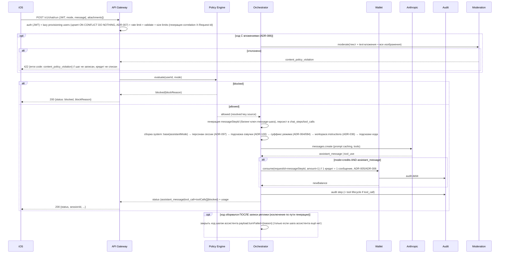
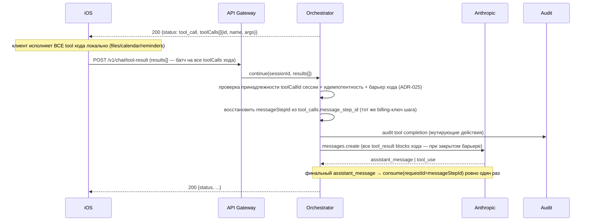

# 01 — Architecture

## Топология
Один deployable: **модульный монолит** на FastAPI (см. [ADR-001](adr/ADR-001-stack-choice.md)). Модули — это внутренние пакеты Python с чёткими границами, а не отдельные сервисы. PostgreSQL — единственное хранилище состояния. Redis — rate limiting и кэш policy/idempotency-меток.

> **Позиционирование ([ADR-022](adr/ADR-022-optional-project-and-tool-gating.md)).** Основная задача сервиса — **агрегатор Claude для iOS («чистый чат»)**: работает без проекта (`projectId` опционален) и без website-инструментов. Генерация сайтов (Website Builder, server-side `site.*`) — **опциональная, второстепенная** фича, активируемая наличием `projectId` у сессии.

> **Провайдер-абстракция LLM ([ADR-033](adr/ADR-033-llm-provider-abstraction.md)).** Узел «Anthropic API» на диаграмме — частный случай абстрактного **LLM-провайдера**. Chat Orchestrator вызывает нейтральный `LLMClient` (реализации: `AnthropicClient` / `OpenAIClient`), выбираемый env **`LLM_PROVIDER`, дефолт `anthropic`**. Сервис разворачивается мульти-инстансно на разных провайдерах **одним кодом** (не форк): часть действующих инстансов работает на Anthropic, часть — на OpenAI. Какой инстанс на каком провайдере — **только** в реестре [07-deployment.md §CI/CD INSTANCES-loop](07-deployment.md#cicd-контракт-instances-loop-мульти-инстанс) (колонка «провайдер»); здесь состав не дублируется, поскольку копия перечня протухает в момент добавления следующего инстанса. **Один провайдер на инстанс** — БД хранит wire-формат своего провайдера. Провайдер-специфичная (де)сериализация — внутри клиента; orchestrator/персист провайдер-агностичны. Детали — [chat-orchestrator/03-architecture.md §Провайдер-абстракция LLM](modules/chat-orchestrator/03-architecture.md#провайдер-абстракция-llm-anthropic--openai-adr-033).

```mermaid
flowchart TB
    iOS[iOS App] -->|HTTPS + JWT| GW[API Gateway<br/>auth, rate limit, validation]

    GW --> ORCH[Chat Orchestrator]
    GW --> POL[Policy Engine]
    GW --> WAL[Wallet / Ledger]
    GW --> SUB[Subscription Service]
    GW --> BYOK[BYOK Service]

    ADMIN_IN[Operator] -->|HTTPS + X-Admin-Token| ADMGW[/v1/admin/* require_admin]
    ADMGW --> ADM[Admin Module]
    ADM --> WAL

    BR[Browser] -->|signed URL| PVGW[/v1/preview/* signed URL]
    PVGW --> WB[Website Builder]
    ORCH -.->|server-side tools site.*<br/>only if session has projectId| WB

    ORCH --> POL
    ORCH --> WAL
    ORCH --> BYOK
    ORCH --> AUD[Audit Service]
    WAL --> AUD
    POL --> SUB
    POL --> WAL
    POL --> BYOK

    ORCH -->|messages API<br/>+ prompt caching| ANTH[(Anthropic API)]
    SUB -->|transaction verification| APPLE[(Apple StoreKit /<br/>App Store Server API)]
    BYOK -->|encrypt/decrypt DEK| KMS[(KMS / equivalent)]

    GW -.->|tool_call| iOS
    iOS -.->|tool_result| GW

    subgraph Storage
      PG[(PostgreSQL 16)]
      RDS[(Redis)]
    end
    ORCH --> PG
    POL --> PG
    WAL --> PG
    SUB --> PG
    BYOK --> PG
    AUD --> PG
    WB --> PG
    ADM --> AUD
    WB --> AUD
    GW --> RDS

    subgraph Observability [Observability cross-cutting]
      MET[Metrics] 
      LOG[Structured logs]
      TR[Traces]
    end
```

## Модули
> 9 базовых/реализованных (1–9) + 8 расширения Figma-gap (10–17, см. [figma-gap-analysis.md](figma-gap-analysis.md)) + Auth (18, встроенный issuer, [ADR-018](adr/ADR-018-embedded-auth-issuer.md)) + модули, добавленные позже (19+).
>
> **Число модулей здесь намеренно НЕ фиксируется цифрой в заголовке** (прежнее «18 + наблюдаемость» протухло молча — каталог модулей рос, заголовок нет). Единственный первоисточник состава — каталог [`docs/modules/`](modules/); таблица ниже — его читаемая проекция.

| # | Модуль | Ответственность | Документация |
|---|---|---|---|
| 1 | **API Gateway** | Auth (verify JWT), ленивый провижининг `users` по `sub` ([ADR-007](adr/ADR-007-lazy-user-provisioning.md)), rate limit, валидация запросов, size-лимиты, correlation id, маршрутизация на use-cases. Размещает admin-роуты (`require_admin`), публичный preview-роут (signed URL) и auth-роуты выпуска токенов (модуль 18). | [modules/api-gateway](modules/api-gateway/README.md) |
| 2 | **Chat Orchestrator** | Вызовы Claude (messages API + prompt caching), управление tool-loop state, формирование `status` ответа. | [modules/chat-orchestrator](modules/chat-orchestrator/README.md) |
| 3 | **Policy Engine** | Чистая функция решения доступа на основе подписки/trial/кредитов/BYOK. Источник истины бизнес-правил. | [modules/policy-engine](modules/policy-engine/README.md) |
| 4 | **Wallet / Ledger** | Баланс кредитов, атомарные идемпотентные списания, история транзакций. | [modules/wallet-ledger](modules/wallet-ledger/README.md) |
| 5 | **Subscription** | Sync/verification StoreKit транзакций, статус подписки. | [modules/subscription](modules/subscription/README.md) |
| 6 | **BYOK** | Envelope-шифрование пользовательского ключа, toggle, delete, routing генерации на ключ пользователя. | [modules/byok](modules/byok/README.md) |
| 7 | **Audit** | Запись всех мутирующих tool-действий и billing trace; неизменяемый журнал. | [modules/audit](modules/audit/README.md) |
| 8 | **Admin** | Операторские действия под изолированной admin-авторизацией ([ADR-009](adr/ADR-009-admin-token-auth.md)): начисление кредитов (`grant`), read-only просмотр кошелька. Тонкая обёртка над Wallet. | [modules/admin](modules/admin/README.md) |
| 9 | **Website Builder** (**опциональная** фича) | Хранение сгенерированных сайтов (`projects`/`site_files`), server-side tools `site.*` ([ADR-011](adr/ADR-011-server-side-tools.md)), backend-hosted preview по signed URL ([ADR-010](adr/ADR-010-backend-hosted-preview.md)). **Активна только когда сессия создана с `projectId`** ([ADR-022](adr/ADR-022-optional-project-and-tool-gating.md)); основной поток — «чистый чат» без проекта. | [modules/website-builder](modules/website-builder/README.md) |
| 10 | **Chats** | CRUD/список/поиск/rename/pin/delete чатов + steps-view, поверх `chat_sessions`/`chat_steps`. Не вызывает Anthropic. | [modules/chats](modules/chats/README.md) |
| 11 | **Profile** | `displayName` + производный человекочитаемый `accountId`. | [modules/profile](modules/profile/README.md) |
| 12 | **Preferences** | `default_assistant_mode` (chat/code, [ADR-012](adr/ADR-012-assistant-mode-vs-billing-mode.md)), notif toggle, Code-defaults. | [modules/preferences](modules/preferences/README.md) |
| 13 | **Workspaces** | Рабочие пространства чатов (name/desc/instructions + файлы-знания BYTEA, инъекция instructions/файлов в чаты проекта) — **не** website-builder `projects` ([ADR-013](adr/ADR-013-workspace-projects-vs-website-builder.md)). Реализация — [ADR-036](adr/ADR-036-workspaces-implementation.md) (Поставка 3, миграция `0011`, файлы самодостаточны без `attachments`). | [modules/workspaces](modules/workspaces/README.md) |
| 14 | **Snippets** | Сохранённые код-фрагменты (Code-режим). | [modules/snippets](modules/snippets/README.md) |
| 15 | **Attachments** | Мультимодальные вложения. **MVP — inline base64 в `/chat/run`** ([ADR-020](adr/ADR-020-inline-base64-attachments-mvp.md), реализует chat-orchestrator); двухшаговая модель upload→ссылка ([ADR-014](adr/ADR-014-multimodal-attachments.md)) **отложена** ([TD-015](100-known-tech-debt.md)). | [modules/attachments](modules/attachments/README.md) |
| 16 | **Token Purchase** | Consumable StoreKit IAP → идемпотентный grant кредитов ([ADR-015](adr/ADR-015-consumable-token-iap.md)), отдельно от подписки. | [modules/token-purchase](modules/token-purchase/README.md) |
| 17 | **Notifications** | Toggle (в preferences) + регистрация APNs device-токена. Отправка push → [TD-011](100-known-tech-debt.md). | [modules/notifications](modules/notifications/README.md) |
| 18 | **Auth** | **Встроенный issuer** ([ADR-018](adr/ADR-018-embedded-auth-issuer.md), закрывает [Q-005-1](99-open-questions.md)): выпуск RS256 JWT (`/v1/auth/register\|token\|refresh`, `jwks`), device-based identity, refresh-rotation. **Sign in with Apple** ([ADR-043](adr/ADR-043-sign-in-with-apple.md), закрывает [Q-018-2](99-open-questions.md)): `/v1/auth/apple` — верификация Apple identity token → НАША пара, кросс-девайс аккаунт (`auth_identities`). Верификация НАШИХ токенов — существующим `JwtVerifier` (API Gateway). | [modules/auth](modules/auth/README.md) |
| 19 | **Media Generation** | Генерация изображений и видео через fal.ai ([ADR-060](adr/ADR-060-media-generation-fal.md)): каталог моделей, постановка задачи со списанием кредитов, опрос до терминала с возвратом при провале, лента, прокси ассетов по signed URL ([ADR-085](adr/ADR-085-media-asset-download-proxy.md)). Активируется per-instance (`FAL_API_KEY`). | [modules/media-generation](modules/media-generation/README.md) |
| 20 | **Documents** | Персистентные **текстовые** документы чата ([ADR-090](adr/ADR-090-chat-documents.md)): `chat_documents`, REST `/v1/chats/{sessionId}/documents[/{documentId}][/download]` (скачивание под JWT, **не** по signed URL — контраст с [ADR-085](adr/ADR-085-media-asset-download-proxy.md)), global server-side tools `document.*`. Скоуп — чат: удаление чата удаляет документы. Проекция изменений хода в ответ — `ChatResponse.documents[]` ([ADR-101](adr/ADR-101-chat-response-documents.md); **код написан, покрыт автотестами, слит в `main` и выкачен на инстансы; ревью не проходило**). **Не путать** с `files.*` (устройство пользователя), `site.*` (сайт) и файлами-знаниями workspace. | [modules/documents](modules/documents/README.md) |
| — | **Moderation (cross-cutting)** | Проверка пользовательского контента перед платной операцией и перед выдачей результата ([ADR-086](adr/ADR-086-ugc-moderation.md)): один провайдер (`omni-moderation-latest`) на чат-вложения, промпты/референсы генерации и результаты image-генерации. **Не зависит от `LLM_PROVIDER`**, собственного API наружу не имеет, вердикт отдаётся полем `moderation` задачи и кодом `content_policy_violation`. | [ADR-086](adr/ADR-086-ugc-moderation.md), [05-security.md §Модерация UGC](05-security.md#модерация-пользовательского-контента-ugc-adr-086) |
| — | **Observability** | Cross-cutting: метрики, структурированные логи с correlation id, трейсы, алерты. | этот документ + [05-security.md](05-security.md) |

> Таблица не перечисляет все пакеты `src/app/` (billing-adapty, billing-cloudpayments, memory, request_logs/CRM и др. описаны собственными модульными ТЗ в [`docs/modules/`](modules/)) — состав смотреть там.

> **Расширение Figma-gap (2026-06-02):** модули 10–17 добавлены по результатам [figma-gap-analysis.md](figma-gap-analysis.md). Это внутренние пакеты монолита (не сервисы). Биллинг/policy/tool-loop инварианты сохранены. Терминология: `assistant_mode` (тип ассистента chat/code) ≠ `billing_mode` (= `chat_sessions.mode`, оплата credits/byok) — [ADR-012](adr/ADR-012-assistant-mode-vs-billing-mode.md); workspace-проекты ≠ website-builder `projects` — [ADR-013](adr/ADR-013-workspace-projects-vs-website-builder.md).

## Границы и зависимости
- **Policy Engine** — чистая логика без побочных эффектов; читает данные через Subscription/Wallet/BYOK репозитории, но сам ничего не мутирует.
- **Chat Orchestrator** — единственный, кто вызывает Anthropic. Перед генерацией обязательно дёргает Policy Engine; при `mode=credits` после успешной генерации инициирует списание через Wallet.
- **Wallet** — единственный, кто пишет в `ledger_transactions` и `wallets`. Атомарность через транзакцию БД + idempotency key.
- **BYOK** — единственный, кто расшифровывает ключи; отдаёт plaintext ключ только Chat Orchestrator in-memory на время вызова, не логирует.
- **Audit** — только append. Никто не редактирует/удаляет audit-записи.
- **Moderation** ([ADR-086](adr/ADR-086-ugc-moderation.md)) — cross-cutting сервис без собственного API. Вызывается ровно из четырёх мест: `ChatOrchestrator.run` (ход с вложениями), `MediaGenerationService.submit` (промпт + клиентские референсы, **до** `wallet.consume`), `MediaGenerationService._advance` (результат image-генерации, **после** списания ⇒ с возвратом кредитов), `MediaGenerationService.upload_reference_image`. Больше ниоткуда: единственные точки вызова — условие того, что модерацию нельзя обойти, отправив запрос «мимо» слоя.

## Основной поток /v1/chat/run

```mermaid
sequenceDiagram
    participant C as iOS
    participant GW as API Gateway
    participant P as Policy Engine
    participant O as Orchestrator
    participant W as Wallet
    participant A as Anthropic
    participant AU as Audit

    participant M as Moderation
    C->>GW: POST /v1/chat/run (JWT, mode, message[, attachments])
    GW->>GW: auth (JWT) + lazy provisioning users (upsert ON CONFLICT DO NOTHING, ADR-007) + rate limit + validate + size limits (генерация correlation X-Request-Id)
    opt ход С вложениями (ADR-086)
        O->>M: moderate(текст + text-вложения + все изображения)
        alt отклонено
            M-->>GW: content_policy_violation
            GW-->>C: 422 {error.code: content_policy_violation}  // шаг не записан, кредит не списан
        end
    end
    GW->>P: evaluate(userId, mode)
    alt blocked
        P-->>GW: blocked(blockReason)
        GW-->>C: 200 {status: blocked, blockReason}
    else allowed
        P-->>O: allowed (resolved key source)
        O->>O: генерация messageStepId (билинг-ключ message-шага), персист в chat_steps/tool_calls
        O->>O: сборка system: base(assistantMode) → персонаж сессии (ADR-097) → подсказка озвучки (ADR-100) → суффикс режима (ADR-064/084) → workspace.instructions (ADR-036) → подсказки хода
        O->>A: messages.create (prompt caching, tools)
        A-->>O: assistant_message | tool_use
        alt mode=credits AND assistant_message
            O->>W: consume(requestId=messageStepId, amount=1)  // 1 кредит = 1 сообщение, ADR-005/ADR-006
            W->>AU: audit debit
            W-->>O: newBalance
        end
        O->>AU: audit step (+ tool lifecycle if tool_call)
        O-->>GW: status (assistant_message|tool_call+toolCalls[]|blocked) + usage
        GW-->>C: 200 {status, sessionId, ...}
    end
    opt ход оборвался ПОСЛЕ записи реплики (исключение по пути генерации)
        O->>O: закрыть ход шагом ассистента payload.turnFailed={reason} (только если шага ассистента ещё нет)
    end
```

> **Слои `system` собираются заново на КАЖДОМ обращении к модели** — и на turn 0, и на каждом витке tool-loop: `system` не является частью истории сообщений. Порядок слоёв жёстко зафиксирован (персонаж [ADR-097](adr/ADR-097-character-personas.md) — до подсказки озвучки [ADR-100](adr/ADR-100-assistant-speech-output.md), она — до суффикса режима, инструкции пользователя — после всех трёх) и живёт целиком в одном месте: [modules/chat-orchestrator/03-architecture.md §Порядок слоёв системного промта](modules/chat-orchestrator/03-architecture.md#порядок-слоёв-системного-промта). Добавляя новый слой, дополняй **и** ту схему, **и** эту диаграмму.
>
> **Диаграмма выше — полный порядок хода, включая шаг модерации ([ADR-086](adr/ADR-086-ugc-moderation.md)).** Модерация вызывается **только** на ходе с непустым `attachments[]`, **после** валидации вложений и **до** записи user-шага (то есть до Policy и до вызова провайдера). Ход без вложений идёт как раньше. Отказ — технический `422 content_policy_violation`, **не** бизнес-`blocked`: он описывает содержимое запроса, а не права пользователя, поэтому в `blockReason` не входит и правило «blocked = 200» ([ADR-004](adr/ADR-004-blocked-http-200.md)) на него не распространяется.
>
> **Контраст с media-генерацией (обе стороны помечены).** В чате списание идёт **после** успешной генерации, поэтому «модерация до списания» там выполняется автоматически. В `/v1/media/*` кредиты списываются **на сабмите**, поэтому там порядок «модерация → `wallet.consume`» — явный нормативный инвариант ([ADR-086 §4](adr/ADR-086-ugc-moderation.md), [media-generation/03-architecture.md](modules/media-generation/03-architecture.md)), а результат дополнительно проверяется **после** списания и потому обязан возвращать кредиты. Правило одного потока на другой не переносить.
>
> ⛔ **Инвариант закрытия хода: транспорт можно оборвать в любой момент, ход — нельзя** ([modules/chat-orchestrator/03-architecture.md §Закрытие хода](modules/chat-orchestrator/03-architecture.md#закрытие-хода-пометки-turnfailed-и-interrupted-adr-104)). Шаг пользователя коммитится **до** сетевого вызова к провайдеру, поэтому откат транзакции его уже не достаёт: ход, брошенный без шага ассистента, оставляет реплику **без ответа**, и на следующем ходу модель отвечает на неё, а не на новую (прод `avelyra` 2026-09-09). Отсюда шаг `opt` в диаграмме. ⛔ **Предикат «есть ли ответ» — это «есть ли ЗАВЕРШАЮЩИЙ шаг ассистента», а не «есть ли хоть один»** ([ADR-104 §13.1](adr/ADR-104-voice-mode-websocket.md#131-закрытие-хода-на-ноге-continuation--предикат-завершающего-шага)): шаг, несущий только блоки `tool_use`, не ответил, а **попросил** устройство, и за ним по построению ожидается continuation. Иначе инвариант выполняется на первой ноге и молча не выполняется на ноге `continuation` — там assistant-шаг уже есть всегда. Норма — свойство ХОДА, а не транспорта: действует и на сокете, и на `POST /v1/chat/tool-result`. **Пометок ДВЕ, и они не выводятся одна из другой:** `payload.turnFailed` — ход **сломался** (кредит **не** списывается), `payload.interrupted` — ход **остановлен пользователем** в голосовом режиме ([ADR-104 §5](adr/ADR-104-voice-mode-websocket.md); кредит списывается **полностью**, потому что пользователь услышал ответ и остановил его сам). Обе стороны помечены, правило одной на другую не переносить.
>
> **У этого хода два потоковых транспорта, и оба отдают ТОТ ЖЕ `ChatResponse`.** `POST /v1/chat/v2/run/stream` — SSE, односторонний, один запрос = один ход ([ADR-069](adr/ADR-069-sse-text-streaming.md)). `/v1/chat/voice` — WebSocket голосового режима, двусторонний, много ходов на соединение и прерывание **сообщением** ([ADR-104](adr/ADR-104-voice-mode-websocket.md)). Оркестратор, policy, модерация, история, барьер хода и биллинг **хода** у них общие и о транспорте не знают; второй формы ответа не заводится. ⚠️ **Общим не является тарификация СИНТЕЗА:** на SSE её нет вовсе, а на сокете она есть и записывается **при закрытии озвученного assistant-шага** — тем же ключом `tts:{stepId}:{voiceId}`, что и у кнопки «прослушать», потому что раньше `stepId` не существует ([ADR-104 §6](adr/ADR-104-voice-mode-websocket.md), [ADR-100 §9](adr/ADR-100-assistant-speech-output.md)). Единица — **шаг**, а не ход. Правило «списание в той же транзакции запроса» верно для `POST /v1/chat/speech` и на сокет **не** переносится: транзакции запроса там нет.

## Tool-loop поток

```mermaid
sequenceDiagram
    participant C as iOS
    participant GW as API Gateway
    participant O as Orchestrator
    participant A as Anthropic
    participant AU as Audit

    O-->>C: 200 {status: tool_call, toolCalls[]{id, name, args}}
    Note over C: клиент исполняет ВСЕ tool хода локально (files/calendar/reminders)
    C->>GW: POST /v1/chat/tool-result (results[] — батч на все toolCalls хода)
    GW->>O: continue(sessionId, results[])
    O->>O: проверка принадлежности toolCallId сессии + идемпотентность + барьер хода (ADR-025)
    O->>O: восстановить messageStepId из tool_calls.message_step_id (тот же billing-ключ шага)
    O->>AU: audit tool completion (мутирующие действия)
    O->>A: messages.create (все tool_result blocks хода — при закрытом барьере)
    A-->>O: assistant_message | tool_use
    Note over O,A: финальный assistant_message → consume(requestId=messageStepId) ровно один раз
    O-->>C: 200 {status, ...}
```

## Tool-calling протокол: client-side vs server-side ([ADR-011](adr/ADR-011-server-side-tools.md), [ADR-026](adr/ADR-026-global-server-side-tools-and-time-now.md))
Три класса tools, различаются по доменному имени (статические реестры):
- **client-side** — `files.*`, `calendar.*`, `reminders.*`, `git.*` ([ADR-094](adr/ADR-094-code-assistant-tools.md)), `maps.*` ([ADR-102](adr/ADR-102-mapkit-client-tools.md)): backend **только инициирует** tool-call (`status=tool_call`),
  исполняет **iOS-клиент** локально и возвращает `tool_result` через `/v1/chat/tool-result`. Backend сам не исполняет.
  - **Результат client-side инструмента backend НЕ валидирует** — проверяется только размер (`SIZE_LIMIT_TOOL_RESULT`); содержимое непрозрачно и уходит модели как есть. Поэтому контракт формы результата обязан доходить до модели **описанием инструмента**, а не только документацией — корень дефекта [ADR-027](adr/ADR-027-calendar-read-contract-alignment.md) и причина требований [ADR-102 §5](adr/ADR-102-mapkit-client-tools.md) к форме результата карт.
  - **Клиентский вызов, который приложение исполнить не умеет, оставляет ход незавершённым**: барьер [ADR-025](adr/ADR-025-parallel-tool-calls-and-max-tokens-truncation.md) продолжает ход только когда каждый client-side вызов получил `completed`/`errored`, а ни таймаута, ни сборщика «протухших» вызовов нет. Отсюда инстанс-флаги, выключенные по умолчанию: `CODE_TOOLS_ENABLED` (ось D) и `MAPS_TOOLS_ENABLED` (ось E).
- **server-side, project-scoped** — `site.*` (website-builder, `SERVER_SIDE_TOOLS`): исполняет **backend** немедленно в tool-loop (пишет в своё хранилище),
  формирует `tool_result` сам и продолжает цикл к Anthropic **без round-trip к iOS**. **Требует проекта** ([ADR-022](adr/ADR-022-optional-project-and-tool-gating.md): только при `project_id IS NOT NULL`). Server-side tool-call **НЕ** отдаётся
  клиенту как `status=tool_call`. Guard на число server-side раундов (`MAX_SERVER_TOOL_ROUNDS`, дефолт 16).
- **server-side, global** — `time.now`, `quiz.generate` (`GLOBAL_SERVER_SIDE_TOOLS`, [ADR-026](adr/ADR-026-global-server-side-tools-and-time-now.md)/[ADR-064](adr/ADR-064-study-learn-quiz-generation-mode.md)): исполняет **backend** в tool-loop (как `site.*`), но **БЕЗ проекта**. Маршрутизируются до project-scoped ветки, без `external_project_id`. Не мутирующие.
  - `time.now` — предлагается Claude **всегда** (включая «чистый чат»); решает репорт «модель не знает текущую дату» (UTC + опц. локальное время по IANA `tz`).
  - `quiz.generate` — предлагается **только** при `generationMode=study_learn` в `/v1/chat/v2/*` (ось C гейтинга, [ADR-064 §3](adr/ADR-064-study-learn-quiz-generation-mode.md)); выдаёт пул вопросов квиза, который уходит клиенту полем `ChatResponse.quiz`. **«Global» = «не требует проекта», а не «доступен всегда»** — правило `time.now` на него не переносится; на legacy `/v1/chat/run` он не предлагается по построению (там эффективный режим всегда `general`).
- Все мутирующие действия (`files.write`, `files.mkdir`, `calendar.create_events`, `reminders.create`, **`site.write_file`, `site.delete`**) имеют audit-запись. `time.now` и `quiz.generate` — read-only, не мутирующие.
- **Валидация args инструмента: два режима отказа (не путать).** По умолчанию невалидные args → `422` на весь ход. Инструменты из реестра `ARGS_DEGRADE_TOOLS` (`quiz.generate`, `media.*`, `document.*`, `files.patch`, `maps.*`) вместо этого **деградируют** в tool-result error, и модель исправляется в том же ходе ([ADR-064 §5](adr/ADR-064-study-learn-quiz-generation-mode.md), [ADR-102 §8](adr/ADR-102-mapkit-client-tools.md)) — потому что их ограничения не гарантирует ни один провайдер (strict-режим у tools не используется), а у карт часть правил (парность полей при `coordinates`/`at`) вообще не выражается в JSON Schema без `oneOf`.
- Список tools и строго типизированные схемы args/result — [modules/chat-orchestrator/02-api-contracts.md](modules/chat-orchestrator/02-api-contracts.md) (client-side + `time.now` + `quiz.generate` + `maps.*`) и [modules/website-builder/02-api-contracts.md](modules/website-builder/02-api-contracts.md) (server-side `site.*`). Оси гейтинга набора — **пять** (проект / assistant_mode / режим генерации / `CODE_TOOLS_ENABLED` / `MAPS_TOOLS_ENABLED`) — [modules/chat-orchestrator/03-architecture.md §Оси гейтинга tool-набора](modules/chat-orchestrator/03-architecture.md#оси-гейтинга-tool-набора-adr-022--adr-026--adr-064).

## Наблюдаемость
Cross-cutting слой, реализуется в API Gateway middleware + утилитах модулей.

> ⛔ **Закрытый перечень значений лейбла обязан нести ПРЕДИКАТ ОТНЕСЕНИЯ — иначе это форма без
> содержания.** Норма действует на **любой** лейбл, которым продюсер КЛАССИФИЦИРУЕТ ИСХОД
> (`reason`, `result`, `error_type`, `blame` и любой будущий), и на одноимённые поля структурных
> логов — не только на метрики. Требования: (а) рядом с перечнем выписано, **какой наблюдаемый
> факт ветки** даёт какое значение — вычислимо, а не «по смыслу»; (б) перечень **покрывает все
> исходы** ветки, которая его пишет: исход, не подходящий ни под одно значение, — повод
> **расширить перечень** (в пределе — значение `unexpected`), а не отнести к ближайшему; (в)
> предикат проверяется **в обе стороны** — и против недооценки (дорогой исход помечен безобидным
> лейблом), и против переоценки (штатный исход помечен тревожным). Переоценка не «безопаснее»:
> шумное значение внутри серии приучает игнорировать серию целиком, и вместе с шумом перестают
> замечать дорогой случай. Образец исполнения — [ADR-099 §10.0](adr/ADR-099-crm-admin-economics-and-instance-settings.md).
> Лейбл-**измерение** (`scope`, `provider`, `direction`, `model`) под норму не подпадает: он не
> классифицирует исход, а называет, о чём серия.

**Метрики (Prometheus exposition):**
- `chat_run_latency_seconds` (histogram, p50/p95) — латентность оркестрации.
- `blocked_requests_total{reason}` — счётчик бизнес-блокировок (`status=blocked`) по `reason` ∈ blockReason enum **без** `rate_limited` (rate_limited — gateway-concern, всегда HTTP `429`, не `status=blocked`, BLK-7b — см. [09-e2e-testing.md](09-e2e-testing.md)).
- `http_responses_total{status="429"}` — счётчик транспортных rate-limit отказов (gateway), используется вместо `blocked_requests_total` для отслеживания rate_limited.
- `wallet_debit_total{result=success|fail}`.
- `tool_call_roundtrip_latency_seconds` (histogram) — от tool_call до tool_result.
- `byok_usage_share` (gauge/ratio) — доля запросов через BYOK.
- `token_usage_total{direction=input|output,model}`.
- `anthropic_upstream_errors_total{status_code,error_type}` — счётчик upstream-отказов Anthropic (для алертинга/видимости частоты; [TD-014](100-known-tech-debt.md)). Лейблы — bounded enum (`error_type` из фиксированного набора Anthropic, `status_code` числовой/`none` для timeout/connection), без user-content. **Сохранена как legacy** (обратная совместимость дашбордов/тестов).
- `quiz_generate_total{result=ok|invalid_quiz|tool_not_available}` — **обязателен** ([ADR-065 §3](adr/ADR-065-study-learn-advertisement-gate-and-history-spoiler-strip.md)): исходы инструмента `quiz.generate`. Единственный инструмент, чей контракт **ожидает** отказов и **проектирует** повтор ([ADR-064 §5](adr/ADR-064-study-learn-quiz-generation-mode.md)): систематически кривая модель жжёт раунды до `MAX_SERVER_TOOL_ROUNDS`, завершает ход ошибкой и **кредит не списывает** — платит оператор, а прочие серии молчат (`blocked_requests_total` не растёт — это не policy-блок; `llm_upstream_errors_total` не растёт — апстрим отвечает `200`). Метки — bounded enum, без содержимого квиза. Образец — `site_file_write_total`/`token_purchase_total`.
- `llm_upstream_errors_total{provider,status_code,error_type}` — провайдер-агностичный счётчик upstream-отказов LLM ([ADR-033 §10](adr/ADR-033-llm-provider-abstraction.md), `provider ∈ {anthropic, openai}`). Введён **параллельно** с legacy `anthropic_upstream_errors_total` (на anthropic-пути инкрементируются обе; OpenAI-путь пишет только эту). Те же bounded-enum лейблы + `provider`.
- `chat_unpriced_steps_total{model,reason}` — **обязателен** ([ADR-092 §7](adr/ADR-092-crm-daily-costs-endpoint.md), [ADR-079 §1](adr/ADR-079-crm-provider-cost-duration-payments.md)): вызовы LLM, для которых **нет закупочной цены**. `reason ∈ {unknown_model | no_model | no_token_counts}` (bounded enum); `model` — имя из `chat_steps.usage.model`, то же ограниченное множество, по которому уже метится `token_usage_total`, либо `"none"`, если имени нет. **Продюсер — WRITE-path чата: одна запись на LLM-вызов, в момент создания шага** (`report_chat_step_pricing`, `src/app/pricing/provider_prices.py:239-255`). **НЕ read-path CRM:** оттуда серия считала бы рендеры (один рендер карточки оценивает тот же шаг дважды) и молчала бы, пока оператор не откроет CRM, — ровно в той слепой зоне, ради которой заведена. Зачем нужна: неоценимый вызов обнуляет стоимость своего хода, оператор видит пустую «Себестоимость», внешне неотличимую от «трафика не было», и **ничто другое об этом не сигналит** — вызов удался и был оплачен (`blocked_requests_total` не растёт — это не policy-блок; `llm_upstream_errors_total` не растёт — апстрим ответил `200`). Именно эта тишина позволила дрейфу имени модели идти незамеченным.

- **Оверлеи операторских правок ([ADR-099 §10](adr/ADR-099-crm-admin-economics-and-instance-settings.md)) — пять серий, у каждой назван producer → consumer:**
  - `admin_overrides_active{scope}` (gauge, `scope ∈ {products, tariffs, settings}`) — producer: обновление снимка; consumer: ответ на «правит ли кто-то этот инстанс из CRM» без доступа к БД.
  - **`admin_overrides_snapshot_age_seconds`** (gauge) — **обязательна**: возраст снимка > 3× окна обновления означает, что фоновый обновитель умер и **правки оператора не применяются**, при том что запись через admin-ручку по-прежнему отвечает `200`. Ничто другое об этом не сигналит — ровно та тишина, ради которой заведена `chat_unpriced_steps_total`.
  - `admin_overrides_refresh_failures_total{reason}` (counter, `reason ∈ {schema_mismatch, db_error, unexpected}`) — producer: ветка отказа обновления; consumer: разбор инцидента «почему снимок устарел». **Перечень закрыт И имеет предикат отнесения** ([ADR-099 §10.0](adr/ADR-099-crm-admin-economics-and-instance-settings.md)): `schema_mismatch` = `ProgrammingError` (миграции нет / форма разошлась), `db_error` = `SQLAlchemyError` **не** `ProgrammingError` (соединение, таймаут, пул), `unexpected` = отказ **не** является ошибкой БД вовсе (дефект нашего кода). Перечень без предиката — форма без содержания: отказ, отнесённый «по похожести», посылает дежурного не туда и обесценивает всю серию.
  - `admin_override_rejected_total{scope,reason}` (counter, `reason ∈ {unknown_id, type_mismatch, out_of_range, undeclared_bound, source_kind_missing, unsupported_field, conflict}`) — producer: валидация пишущих ручек; consumer: «оператор бьётся в форму, а мы её молча отвергаем». **Перечень — РАЗБИЕНИЕ по одному измерению «ГДЕ лежит несоответствие»** (семь мест, семь значений — ровно одно на место), а не список накопленных случаев ([ADR-099 §10.0](adr/ADR-099-crm-admin-economics-and-instance-settings.md)): `unknown_id` = идентификатора нет в реестре; `type_mismatch` = **форма присланного** (тип, `options`, либо тело не несёт ни одного изменяемого поля); `out_of_range` = форма верна, нарушена **объявленная** граница (верхняя граница `limits`, `tariff_decimal_places`, `constraints` `min_items`/`max_items`/`max_length`); `undeclared_bound` = значение внутри всех объявленных границ, но нарушена граница, которой мы **не объявляли и объявить нечем** (нижняя граница `tokens` тарифа; нижняя граница `tokens` продукта, зависящая от `purchase_kind`) — отсюда `400`, а не `422` ([ADR-099 §11](adr/ADR-099-crm-admin-economics-and-instance-settings.md)); `source_kind_missing` = запрос **несёт `tokens`**, но класс покупки не задан ни оверлеем, ни источником продукта ([TD-043](100-known-tech-debt.md)); `unsupported_field` = сервис **не ведёт величину вовсе** (`avatar_tokens`); `conflict` = версия либо **межэлементный** инвариант/дубликат. ⚠️ **`source_tokens_missing` из перечня СНЯТ** — после перевода колонок оверлея в nullable ([ADR-099 §6.1](adr/ADR-099-crm-admin-economics-and-instance-settings.md)) у него не остаётся достижимой ветки-producer'а, а объявленное значение без producer'а есть мёртвый лейбл. HTTP-код отказа от лейбла **не зависит** и по нему не меняется. Тот же словарь — у поля `reason` лога `admin_override_value_ignored` (достижимы три значения из семи), второго словаря об одном факте не заводится. ⚠️ **Статус:** перечень нормативен, код приводится к нему фронтом работ [ADR-099 §14](adr/ADR-099-crm-admin-economics-and-instance-settings.md) (на 2026-09-08, ночь: код ещё эмитирует `source_tokens_missing` и не эмитирует `undeclared_bound`).
  - `media_price_legacy_overquote{model}` (gauge 0/1) — producer: сборка `GET /v1/media/models`; consumer: сигнал «поячеечный тариф стал непредставим мультипликативной формулой, и **уже выпущенные** сборки показывают цену выше фактической» ([TD-036](100-known-tech-debt.md)). Списание при этом верное — расхождение только в показанном.

**Логи (structured JSON):** correlation id = `requestId` (per-HTTP-request, `X-Request-Id`, для трейсов/логов — НЕ billing-ключ) + `sessionId` в каждой записи; для billing-записей дополнительно `messageStepId`. policy decision log; billing decision log; tool lifecycle log; **upstream error log** (событие `anthropic_upstream_error` — camelCase лог-ключи `status_code`/`errorType`/`errorMessage`/`anthropicRequestId`/`model`/`exceptionClass`; значения `errorType`/`errorMessage`/`anthropicRequestId` — из полей-источника тела ошибки Anthropic `error.type`/`error.message`/SDK `request_id`; уровень по матрице WARNING(4xx, вкл. 429)/ERROR(5xx+timeout/connection); [TD-014](100-known-tech-debt.md), **канонический контракт ключей** — [modules/chat-orchestrator/03-architecture.md §Логирование upstream-ошибок Anthropic](modules/chat-orchestrator/03-architecture.md#логирование-upstream-ошибок-anthropic-td-014)). **unpriced step log** (событие `chat_step_unpriced`, WARNING, поля `model`/`reason` — те же значения, что у лейблов `chat_unpriced_steps_total`; [ADR-092 §7](adr/ADR-092-crm-daily-costs-endpoint.md)): **одна строка на пару `(model, reason)` на процесс** — счётчик несёт частоту, лог несёт имя один раз. За пределом `_LOGGED_UNPRICED_CAP` = 256 различных пар пишется **один** `chat_step_unpriced_log_capped` (`distinct_names`), после чего лог **умолкает** и единственным репортёром остаётся счётчик: имена приходят неограниченным множеством, и кап, который перестаёт запоминать, но продолжает писать, превратил бы свой худший случай во флуд WARNING. **Логи правок инстанса — перечень задан ПРИЗНАКОМ, а не составом ([ADR-099 §10](adr/ADR-099-crm-admin-economics-and-instance-settings.md)):** лог-событие этой поверхности — всякий вызов `log_event` в `src/app/instance_config/` и в `src/app/admin/economics_service.py`; **замер на 2026-09-08 — шесть** (список имён дважды оказывался неполным, поэтому норма живёт в признаке, а число датировано). Это: `admin_override_applied` (`scope`/`id`/`previous`/`next`/`actorClaim`), **`admin_overrides_snapshot_changed`** (`products`/`tariffs`/`settings` — состав оверлеев; пишется **на изменении состава**, а не на каждом тике окна: тик раз в 30 с на 41 инстансе дал бы поток, в котором изменение не видно; это носитель меры (б) [ADR-099 §2](adr/ADR-099-crm-admin-economics-and-instance-settings.md) — без него класс ошибки «правлю `.env`, ничего не меняется» остаётся без наблюдателя), `admin_overrides_refresh_failed` (`reason`), `admin_override_value_ignored` (`setting_id`/`reason` — сохранённая строка **игнорируется**, инстанс продолжает работать на env/дефолте; `reason` берётся из того же словаря, что у `admin_override_rejected_total`: `unknown_id` — строка-сирота от снятой настройки, `out_of_range` — нарушен `constraints`, `type_mismatch` — тип или `options`), **пара** `media_price_table_non_representable` / `media_price_table_representable_again` (`model`) — пишется **только на переходе**, и объявлять одну половину нельзя: без второй закрытие инцидента не наблюдаемо ничем, кроме скрейпа. Значения настроек в логах и аудите допустимы **как следствие того, что секретов в этой поверхности нет по контракту** ([ADR-099 §8.2](adr/ADR-099-crm-admin-economics-and-instance-settings.md)), а не как отдельное послабление. Запрещено логировать секреты — api-key, BYOK-ключ, user-content (см. [05-security.md](05-security.md)).

> **Конвенция структурного лога — `log_event(logger, level, event, **fields)`** (`src/app/observability/logging.py:46-48`). `JsonFormatter` (`:25-27`) читает **только** `record.extra_fields`, который проставляет `log_event`; прямой `logger.*(..., extra={...})` кладёт значения в атрибуты `LogRecord`, куда форматтер не смотрит, и поля **молча не доезжают до JSON**. 11 таких мест зафиксированы как [TD-034](100-known-tech-debt.md).

**Трейсы:** OpenTelemetry, span на gateway → policy → orchestrator → anthropic / wallet.

## Внешние интеграции (реальные)
- **Anthropic API** — chat-оркестрация, prompt caching. Ключ сервиса — env/secret manager.
- **Apple StoreKit / App Store Server API** — верификация транзакций подписки. Реализовано: реальная проверка JWS — разбор `x5c` цепочки сертификатов, верификация цепочки до доверенного Apple root CA (загружается из `APPSTORE_ROOT_CERT_DIR`), проверка подписи JWS публичным ключом leaf-сертификата (ES256), валидация payload (`bundleId`, environment). **Fail-closed:** при незаданном `APPSTORE_ROOT_CERT_DIR` верификатор отказывается помечать транзакцию проверенной (HTTP 422), а не принимает непроверяемую. Поставка Apple root CAs в prod — операционное требование (Q-007-1), не отдельный tech-debt: fail-closed дефолт безопасен, отдельный TD не заводится.
- **broadapps** (`pay.broadapps.dev`, фронтит YooKassa) — RU-контур: создание платёжной ссылки ([ADR-051](adr/ADR-051-cloudpayments-checkout-payment-link.md)), верификация платежей и входящий колбэк ([ADR-054](adr/ADR-054-cloudpayments-webhook-payment-verification.md)), отмена подписки, каталог продуктов и эксперименты пейволла ([ADR-098](adr/ADR-098-broadapps-paywall-experiments-and-default-product.md)). Секрет — `CLOUDPAYMENTS_API_TOKEN`, хост фиксирован конфигом (нет SSRF). **Инвариант идентичности ([ADR-098 §1](adr/ADR-098-broadapps-paywall-experiments-and-default-product.md)): во всех наших ИСХОДЯЩИХ вызовах `user_id` = JWT `sub`, никогда не из тела клиента** — один человек обязан быть у поставщика одним пользователем. Обратное направление (идентификатор, пришедший ОТ поставщика) резолвится трёхступенчато ([ADR-053](adr/ADR-053-cloudpayments-webhook-user-resolution-via-auth-devices.md)/[ADR-055](adr/ADR-055-adapty-webhook-user-resolution-via-auth-devices.md)) — это компенсация уже случившегося расщепления, а не разрешение слать наружу разные идентификаторы.
- **KMS (или эквивалент)** — генерация/расшифровка DEK для envelope encryption BYOK. Реализован стабильный интерфейс `KmsClient` (`encrypt_dek`/`decrypt_dek`); реализация `LocalKmsClient` — реальный AES-256-GCM wrap DEK под master-key из `KMS_LOCAL_MASTER_KEY` (DEK никогда не хранится в plaintext). **На MVP `LocalKmsClient` используется и в prod** (решение пользователя 2026-06-02, master key — через secret manager/env на VPS). Облачный провайдер подключается в тот же интерфейс — [Q-002-1](99-open-questions.md) (post-MVP, не блокер).

## Служебные endpoint (реализованы)
| Метод/путь | Назначение |
|---|---|
| `GET /health` | liveness — процесс жив. |
| `GET /healthz` | алиас `/health` (healthcheck Traefik/smoke, [ADR-017](adr/ADR-017-shared-server-traefik-deploy.md)); `200 {status:"ok"}`. |
| `GET /ready` | readiness — БД (`SELECT 1`) и Redis (`ping`) доступны; иначе 503. |
| `GET /metrics` | Prometheus exposition (`prometheus-client`). Если задан `METRICS_SCRAPE_TOKEN` — требует заголовок `X-Scrape-Token`, иначе 403. |

Бизнес-маршруты (`/v1/chat/*`, `/v1/policy/*`, `/v1/wallet/*`, `/v1/subscription/*`, `/v1/byok/*`, `/v1/admin/*`, `/v1/preview/*`) — см. `modules/<M>/02-api-contracts.md`.

> `/v1/admin/*` — изолированная admin-авторизация `X-Admin-Token` ([ADR-009](adr/ADR-009-admin-token-auth.md)), **без** пользовательского JWT/provisioning.
> `/v1/preview/{projectId}/{token}/{path:path}` — публичная отдача статики по signed URL ([ADR-010](adr/ADR-010-backend-hosted-preview.md)), **без** пользовательского JWT (авторизация в подписи).
