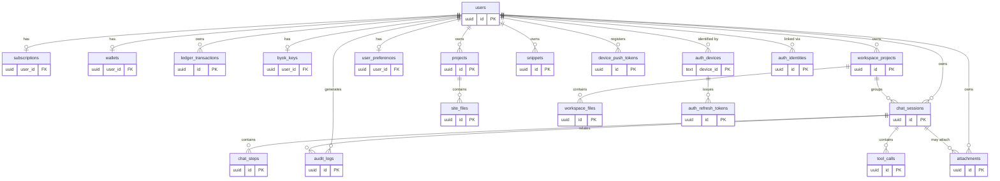

# 03 — Data Model

PostgreSQL 16. **21 таблица спроектирована; 15 активны на MVP, 3 отложены** (`snippets`, `attachments`, `device_push_tokens` — миграция `0004` их **не создаёт**). `auth_identities` — Sign in with Apple (миграция `0012`, [ADR-043](adr/ADR-043-sign-in-with-apple.md)), спроектирована, ожидает реализации; `adapty_webhook_events` — миграция `0008`. `workspace_projects`/`workspace_files` — **Поставка 3 (миграция `0011`)**, реализуются ([ADR-036](adr/ADR-036-workspaces-implementation.md), собственное BYTEA-хранение, не зависят от `attachments`). Активные на MVP: 9 базовых + `projects`/`site_files` website-builder + 1 расширения Figma-gap Sprint 1 (`user_preferences`) + 2 встроенного auth-issuer (`auth_devices`, `auth_refresh_tokens`, [ADR-018](adr/ADR-018-embedded-auth-issuer.md)). Отдельно про `attachments`: таблица **спроектирована, но на MVP не создаётся** — двухшаговый transport [ADR-014](adr/ADR-014-multimodal-attachments.md) Superseded ([TD-015](100-known-tech-debt.md)), chat-вложения на MVP реализуются inline base64 без таблицы ([ADR-020](adr/ADR-020-inline-base64-attachments-mvp.md)). UUID v4 (`gen_random_uuid()` из `pgcrypto`). Все timestamp — `timestamptz`, UTC. Деньги/кредиты — целочисленные (минимальная неделимая единица), без float.

> Расширение (2026-06-02, Figma-gap, см. [figma-gap-analysis.md](figma-gap-analysis.md)): новые таблицы и колонки спроектированы как expand-only миграции (`0004`+). Затронутые ADR: [ADR-012](adr/ADR-012-assistant-mode-vs-billing-mode.md) (`assistant_mode`), [ADR-013](adr/ADR-013-workspace-projects-vs-website-builder.md) (workspaces), [ADR-014](adr/ADR-014-multimodal-attachments.md) (attachments — **спроектирована, реализация отложена**, transport Superseded → [TD-015](100-known-tech-debt.md); MVP — inline base64 [ADR-020](adr/ADR-020-inline-base64-attachments-mvp.md)), [ADR-015](adr/ADR-015-consumable-token-iap.md) (consumable IAP — без новой таблицы). На MVP миграция `0004` создаёт только Sprint-1 объекты (`user_preferences`, поля `chat_sessions`/`users`); `workspace_projects`/`workspace_files`/`snippets`/`attachments`/`device_push_tokens` — Sprint-2/3, **не созданы**.

## ER-диаграмма



## Enum-типы
```sql
CREATE TYPE subscription_status AS ENUM ('active', 'expired', 'none');
CREATE TYPE ledger_tx_type     AS ENUM ('credit', 'debit');
CREATE TYPE byok_key_status    AS ENUM ('valid', 'invalid', 'missing');
CREATE TYPE chat_mode          AS ENUM ('credits', 'byok');  -- billing_mode (способ оплаты), ADR-012 — НЕ переименовывается
CREATE TYPE chat_role          AS ENUM ('user', 'assistant', 'tool');
CREATE TYPE tool_call_status   AS ENUM ('pending', 'completed', 'errored');
CREATE TYPE assistant_mode     AS ENUM ('chat', 'code');  -- ADR-012: тип ассистента (НЕ способ оплаты)
CREATE TYPE attachment_kind    AS ENUM ('image', 'document');  -- ADR-014
```

### Расширение enum `byok_key_status` ([ADR-016](adr/ADR-016-extended-byok-statuses.md), миграция `0004`)
Дизайн различает больше состояний BYOK-ключа, чем исходные `valid|invalid|missing`. Enum расширяется **добавлением** значений (обратная совместимость: старые значения сохраняются, маппятся 1:1):
```sql
ALTER TYPE byok_key_status ADD VALUE 'validating';  -- Checking (валидация в процессе)
ALTER TYPE byok_key_status ADD VALUE 'offline';     -- сетевая ошибка при валидации (не 401)
ALTER TYPE byok_key_status ADD VALUE 'expired';     -- ключ отозван/истёк (был valid, стал недействителен)
-- 'valid' (Connected+Active), 'invalid' (401 Unauthorized), 'missing' (Not set) — без изменений
```
> Семантика и маппинг на дизайн-статусы (Not set / Checking / Connected+Active / Invalid / Offline / Expired) — [ADR-016](adr/ADR-016-extended-byok-statuses.md), [modules/byok/02-api-contracts.md](modules/byok/02-api-contracts.md). Обратная совместимость: `valid|invalid|missing` остаются валидны, активная модель возвращается отдельным полем (не enum).

## DDL

### 1. users
```sql
CREATE TABLE users (
    id            UUID PRIMARY KEY DEFAULT gen_random_uuid(),
    created_at    TIMESTAMPTZ NOT NULL DEFAULT now(),
    trial_used    BOOLEAN NOT NULL DEFAULT FALSE,  -- BR-1: lifetime trial flag
    display_name  TEXT  -- ADR Figma-gap: человекочитаемое имя профиля (nullable; экран Profile), миграция 0004
);
```
> `display_name` добавлен для экрана Profile (модуль `profile`). Nullable: до первого редактирования имя не задано. Человекочитаемый `accountId` (формат `8472-1936-AXQ5`) **не хранится** в БД — это **детерминированная производная** от `user_id` (вычисляется на лету в `profile`-слое, см. [modules/profile/03-architecture.md](modules/profile/03-architecture.md)), поэтому колонки для него нет.
> `trial_used` добавлен к минимальной модели ТЗ для реализации BR-1 (ровно 1 trial lifetime). Альтернатива через count в audit отвергнута: флаг проще и атомарнее.
> **`users.id` ≡ JWT `sub`** (UUID, выдаёт доверенный issuer). Строка создаётся **лениво** при первом аутентифицированном запросе — идемпотентным upsert `INSERT INTO users (id) VALUES (:sub) ON CONFLICT (id) DO NOTHING` в API Gateway (`get_current_user`), до любой FK-зависимой вставки. Endpoint регистрации нет. На write-path `id` всегда задаётся явно из `sub`; `DEFAULT gen_random_uuid()` — технический fallback, не доменный путь идентичности. См. [ADR-007](adr/ADR-007-lazy-user-provisioning.md), [05-security.md](05-security.md#модель-идентичности-и-провижининг-пользователей).

### 2. subscriptions
```sql
CREATE TABLE subscriptions (
    user_id     UUID PRIMARY KEY REFERENCES users(id) ON DELETE CASCADE,
    status      subscription_status NOT NULL DEFAULT 'none',
    plan        TEXT,
    expires_at  TIMESTAMPTZ,
    updated_at  TIMESTAMPTZ NOT NULL DEFAULT now()
);
CREATE INDEX ix_subscriptions_expires_at ON subscriptions (expires_at);
```

### 3. wallets
```sql
CREATE TABLE wallets (
    user_id     UUID PRIMARY KEY REFERENCES users(id) ON DELETE CASCADE,
    balance     BIGINT NOT NULL DEFAULT 0,
    updated_at  TIMESTAMPTZ NOT NULL DEFAULT now(),
    CONSTRAINT ck_wallets_balance_nonneg CHECK (balance >= 0)  -- AC-3: no negative
);
```

### 4. ledger_transactions
```sql
CREATE TABLE ledger_transactions (
    id              UUID PRIMARY KEY DEFAULT gen_random_uuid(),
    user_id         UUID NOT NULL REFERENCES users(id) ON DELETE CASCADE,
    type            ledger_tx_type NOT NULL,
    amount          BIGINT NOT NULL CHECK (amount > 0),
    meta            JSONB NOT NULL DEFAULT '{}'::jsonb,  -- usage/model, без секретов
    idempotency_key TEXT NOT NULL,
    created_at      TIMESTAMPTZ NOT NULL DEFAULT now()
);
-- AC-3: повторное списание по тому же idempotency_key не списывает повторно.
-- Для credits-debit idempotency_key = messageStepId (единый на message-шаг, ADR-006), НЕ requestId Gateway.
-- Для grant idempotency_key = transactionId периода подписки.
CREATE UNIQUE INDEX ux_ledger_idempotency ON ledger_transactions (user_id, idempotency_key);
CREATE INDEX ix_ledger_user_created ON ledger_transactions (user_id, created_at DESC);
```

### 5. byok_keys
```sql
CREATE TABLE byok_keys (
    user_id         UUID PRIMARY KEY REFERENCES users(id) ON DELETE CASCADE,
    encrypted_key   BYTEA NOT NULL,                 -- ciphertext (AES-GCM)
    encrypted_dek   BYTEA NOT NULL,                 -- DEK, зашифрованный KMS (envelope)
    nonce           BYTEA NOT NULL,                 -- AES-GCM nonce
    key_status      byok_key_status NOT NULL DEFAULT 'missing',
    enabled         BOOLEAN NOT NULL DEFAULT FALSE,
    provider        TEXT NULL,                       -- ADR-044 (миграция 0013): провайдер ключа ('anthropic'/'openai'), определён детектором префиксов; NULL=легаси/нераспознан
    updated_at      TIMESTAMPTZ NOT NULL DEFAULT now()
);
```
> Plaintext ключ никогда не хранится. См. [ADR-003](adr/ADR-003-byok-envelope-encryption.md). Поля `encrypted_dek`, `nonce` добавлены к минимальной модели ТЗ для envelope encryption.
> **Колонка `provider` ([ADR-044](adr/ADR-044-multi-provider-byok.md), миграция `0013`, expand-only без backfill):** провайдер BYOK-ключа определяется **по самому ключу** (детектор префиксов `sk-ant-`→anthropic / `sk-`/`sk-proj-`→openai), независимо от `LLM_PROVIDER` инстанса. `TEXT` (не enum) — расширяемость без `ALTER TYPE`; значения `{anthropic, openai}` валидируются приложением. `NULL` = легаси-строка до миграции или нераспознанный формат → fallback-детект по расшифрованному ключу на генерации. Позволяет отдавать `activeModel`/статус без расшифровки ключа.

### 6. chat_sessions
```sql
CREATE TABLE chat_sessions (
    id                   UUID PRIMARY KEY DEFAULT gen_random_uuid(),
    user_id              UUID NOT NULL REFERENCES users(id) ON DELETE CASCADE,
    project_id           TEXT,           -- website-builder external project id (НЕ workspace), см. ADR-013. NULLABLE с миграции 0007 (ADR-022): NULL = «чистый чат» без website-builder (site.* не предлагаются); непустая строка = website-builder доступен. Фиксируется при создании сессии.
    mode                 chat_mode NOT NULL,  -- billing_mode (credits|byok), ADR-012
    -- Расширение Figma-gap, миграция 0004 (только title/assistant_mode/is_pinned):
    title                TEXT,           -- заголовок чата (автоген из 1-го сообщения или rename), nullable
    assistant_mode       assistant_mode NOT NULL DEFAULT 'chat',  -- тип ассистента, ADR-012
    model                TEXT,           -- выбранная модель (provider-id из allowlist), NULLABLE с миграции 0010 (ADR-034): NULL = дефолтная модель инстанса (ANTHROPIC_MODEL/OPENAI_MODEL). Фиксируется при создании сессии, на resume берётся из сессии. Биллинг не зависит от модели (ADR-006).
    workspace_project_id UUID REFERENCES workspace_projects(id) ON DELETE SET NULL,  -- привязка к workspace, ADR-013/ADR-036, nullable; Поставка 3 (миграция 0011). До 0011 — колонки нет (workspaceProjectId в списке чатов = заглушка null).
    is_pinned            BOOLEAN NOT NULL DEFAULT FALSE,  -- закрепление в списке чатов
    created_at           TIMESTAMPTZ NOT NULL DEFAULT now(),
    updated_at           TIMESTAMPTZ NOT NULL DEFAULT now()
);
CREATE INDEX ix_sessions_user_updated ON chat_sessions (user_id, updated_at DESC);
-- Список чатов: закреплённые сверху, затем по свежести (модуль chats).
CREATE INDEX ix_sessions_user_pinned_updated ON chat_sessions (user_id, is_pinned DESC, updated_at DESC);
CREATE INDEX ix_sessions_workspace ON chat_sessions (workspace_project_id) WHERE workspace_project_id IS NOT NULL;
-- Поиск по заголовку (модуль chats). Дефолт: ILIKE по title + поиск по тексту 1-го user-сообщения.
-- Полнотекстовый GIN-индекс — TD при росте объёма (см. modules/chats/03-architecture.md).
```
> TTL/expiry сессии — [Q-001-1](99-open-questions.md). Дефолт: «soft TTL 24h по `updated_at`», задаётся на уровне приложения.
> **Расширение Figma-gap:** `title`/`assistant_mode`/`workspace_project_id`/`is_pinned` — добавлены для экранов Home (список/поиск/rename/pin чатов), Code-режима ([ADR-012](adr/ADR-012-assistant-mode-vs-billing-mode.md)) и workspace-проектов ([ADR-013](adr/ADR-013-workspace-projects-vs-website-builder.md)). `project_id` (website-builder) и `workspace_project_id` (рабочее пространство) — **разные поля**, не путать ([ADR-013](adr/ADR-013-workspace-projects-vs-website-builder.md)). Автогенерация `title` — модуль `chats` ([modules/chats/03-architecture.md](modules/chats/03-architecture.md)).
> **`project_id` → nullable (миграция `0007`, expand-only, [ADR-022](adr/ADR-022-optional-project-and-tool-gating.md)):** `ALTER TABLE chat_sessions ALTER COLUMN project_id DROP NOT NULL`. Существующие строки сохраняют значение; новые сессии без `projectId` → `NULL` («чистый чат», website-builder отключён, `site.*` не предлагаются Claude). Бэкфилл не требуется; существующие индексы не меняются. `projectId` фиксируется при создании сессии (как `mode`/`assistant_mode`); при resume берётся из сессии.

### 7. chat_steps
```sql
CREATE TABLE chat_steps (
    id              UUID PRIMARY KEY DEFAULT gen_random_uuid(),
    seq             BIGINT GENERATED ALWAYS AS IDENTITY,  -- ADR-021: монотонный порядок реконструкции (НЕ created_at); миграция 0006
    session_id      UUID NOT NULL REFERENCES chat_sessions(id) ON DELETE CASCADE,
    message_step_id UUID NOT NULL,  -- billing message-step id: единый на пользовательский message-шаг (все его tool-раунды); ключ идемпотентности debit (ADR-006)
    role            chat_role NOT NULL,
    payload         JSONB NOT NULL,    -- content blocks (assistant text / tool_use / tool_result), нормализованы (только wire-валидные поля Anthropic; служебные SDK-поля типа `caller` вырезаны — ADR-021)
    usage           JSONB,             -- {inputTokens, outputTokens, model, cacheReadTokens, cacheWriteTokens}
    created_at      TIMESTAMPTZ NOT NULL DEFAULT now()  -- информационный timestamp; НЕ порядковый ключ (порядок — по seq, ADR-021)
);
-- Реконструкция истории и поиск следующего шага сортируют по seq (ADR-021), НЕ по (created_at, id).
CREATE INDEX ix_steps_session_seq ON chat_steps (session_id, seq);
CREATE INDEX ix_steps_message_step ON chat_steps (message_step_id);
```
> `seq` ([ADR-021](adr/ADR-021-deterministic-step-order-and-block-normalization.md), миграция `0006`) — глобальный монотонный identity, присваивается БД при INSERT в порядке вставки. **Порядок шагов сессии определяется `seq`, НЕ `created_at`.** `created_at` — transaction-time `now()`: для шагов, записанных в одной транзакции (server-side tool-loop `site.*`, [ADR-011](adr/ADR-011-server-side-tools.md): `tool_use` + `tool_result`), он одинаков, а UUID-tie-break по `id` случаен → раньше давал orphan `tool_result` → Anthropic `400` → `502` (BUG-5). `seq` гарантирует `tool_use` < `tool_result` по порядку вставки. `created_at` остаётся информационным (отдаётся в `steps[].createdAt`).
> `message_step_id` генерируется Orchestrator в `/chat/run` при старте нового пользовательского message-шага и переиспользуется всеми записями шага (включая ответы после re-entry из `/chat/tool-result`) до финального assistant_message. Это значение передаётся в `Wallet.consume` как `idempotency_key` debit — гарантирует «ровно 1 списание на message-шаг» (ADR-005, ADR-006). Не путать с `requestId` Gateway (per-HTTP-request correlation id).
> `payload` нормализуется перед персистом ([ADR-021](adr/ADR-021-deterministic-step-order-and-block-normalization.md)): хранятся только wire-валидные поля Anthropic Messages API; служебные поля SDK (`caller` из `block.model_dump()` и любые будущие аннотации) вырезаются, чтобы не реплеиться на wire. Raw `tool_use.id` (`toolu_...`) сохраняется дословно — инвариант [ADR-008](adr/ADR-008-provider-tool-use-id.md) не нарушается.

### 8. tool_calls
```sql
CREATE TABLE tool_calls (
    id                   UUID PRIMARY KEY DEFAULT gen_random_uuid(),
    session_id           UUID NOT NULL REFERENCES chat_sessions(id) ON DELETE CASCADE,
    message_step_id      UUID NOT NULL,  -- billing message-step id шага, к которому относится tool-call; tool-result переиспользует его для всех раундов до финального assistant_message
    tool_name            TEXT NOT NULL,
    provider_tool_use_id TEXT NOT NULL,  -- raw Anthropic tool_use.id ("toolu_..."), для согласованности tool_result.tool_use_id с историей (ADR-008)
    args                 JSONB NOT NULL,
    status               tool_call_status NOT NULL DEFAULT 'pending',
    result               JSONB,            -- tool_result от клиента (для идемпотентности)
    created_at           TIMESTAMPTZ NOT NULL DEFAULT now(),
    completed_at         TIMESTAMPTZ
);
CREATE INDEX ix_tool_calls_session ON tool_calls (session_id, created_at);
```
> `result` добавлен к минимальной модели ТЗ: нужен для идемпотентности повторной отправки tool-result (см. [ADR-005](adr/ADR-005-idempotency-ledger.md)). `toolCallId` = `tool_calls.id` (доменный UUID, публичный для iOS); принадлежность проверяется по `session_id`. `message_step_id` позволяет `/chat/tool-result` определить, к какому пользовательскому message-шагу относится re-entry, и переиспользовать тот же billing-ключ для debit на финальном assistant_message.
> `provider_tool_use_id` хранит **raw** `tool_use.id` от Anthropic (формат `toolu_...`, **не** UUID), записывается при разборе `tool_use` в `/chat/run`. При continuation `tool_result.tool_use_id` берётся из этого поля — Anthropic требует точного совпадения с `tool_use.id` предыдущего assistant-хода в истории. Доменный `id` (UUID) наружу не подменяет это значение. Тип `TEXT` (формат провайдера произвольный, не парсится как UUID), `NOT NULL` — tool_call всегда создаётся из конкретного `tool_use` блока ответа Anthropic. См. [ADR-008](adr/ADR-008-provider-tool-use-id.md).

### 9. audit_logs
```sql
CREATE TABLE audit_logs (
    id          UUID PRIMARY KEY DEFAULT gen_random_uuid(),
    user_id     UUID NOT NULL REFERENCES users(id) ON DELETE CASCADE,
    session_id  UUID REFERENCES chat_sessions(id) ON DELETE SET NULL,
    event_type  TEXT NOT NULL,    -- tool_mutation | billing_debit | policy_decision | byok_change
    payload     JSONB NOT NULL,   -- без секретов/ключей
    created_at  TIMESTAMPTZ NOT NULL DEFAULT now()
);
CREATE INDEX ix_audit_user_created ON audit_logs (user_id, created_at DESC);
CREATE INDEX ix_audit_event_type ON audit_logs (event_type, created_at DESC);
```
> Append-only на уровне приложения (нет UPDATE/DELETE из кода). Жёсткий запрет ревизий — потенциальный TD, см. [100-known-tech-debt.md](100-known-tech-debt.md#td-001).

### 10. projects (website-builder)
```sql
CREATE TABLE projects (
    id                  UUID PRIMARY KEY DEFAULT gen_random_uuid(),
    user_id             UUID NOT NULL REFERENCES users(id) ON DELETE CASCADE,
    external_project_id TEXT NOT NULL,   -- клиентский projectId (= chat_sessions.project_id)
    created_at          TIMESTAMPTZ NOT NULL DEFAULT now(),
    updated_at          TIMESTAMPTZ NOT NULL DEFAULT now()
);
CREATE UNIQUE INDEX ux_projects_user_external ON projects (user_id, external_project_id);
CREATE INDEX ix_projects_user ON projects (user_id, updated_at DESC);
```

### 11. site_files (website-builder)
```sql
CREATE TABLE site_files (
    id           UUID PRIMARY KEY DEFAULT gen_random_uuid(),
    project_id   UUID NOT NULL REFERENCES projects(id) ON DELETE CASCADE,
    path         TEXT NOT NULL,           -- нормализованный относительный путь (без ".."/абсолютных/NUL)
    content      BYTEA NOT NULL,
    content_type TEXT NOT NULL,           -- из content-type allowlist
    size         BIGINT NOT NULL CHECK (size >= 0),
    updated_at   TIMESTAMPTZ NOT NULL DEFAULT now()
);
CREATE UNIQUE INDEX ux_site_files_project_path ON site_files (project_id, path);
CREATE INDEX ix_site_files_project ON site_files (project_id);
```
> Таблицы website-builder. Детали (лимиты размера/числа файлов, изоляция владельца, content-type allowlist, threat model
> отдачи контента) — [modules/website-builder/04-data-model.md](modules/website-builder/04-data-model.md),
> [modules/website-builder/05-security.md](modules/website-builder/05-security.md), [ADR-010](adr/ADR-010-backend-hosted-preview.md).
> Контент в БД на старте; миграция в object-storage — [TD-009](100-known-tech-debt.md).

---

## Таблицы расширения Figma-gap (expand-only)

> **Статус по миграциям (MVP).** Из таблиц этого раздела миграцией `0004` создаётся **только `user_preferences` (таблица 12)** (вместе с полями `chat_sessions`/`users` и enum — см. выше). `workspace_projects` (13), `snippets` (15), `device_push_tokens` (17) — Спринт 2/3, **отдельные будущие миграции** (НЕ `0004`). `workspace_files` (14) и `attachments` (16) — **отложены** ([TD-015](100-known-tech-debt.md), на MVP миграцией не создаются; chat-вложения MVP — inline base64 [ADR-020](adr/ADR-020-inline-base64-attachments-mvp.md)). DDL ниже — зафиксированные контракты; per-table заметки уточняют статус каждой.

### 12. user_preferences ([ADR-012](adr/ADR-012-assistant-mode-vs-billing-mode.md), модуль `preferences`)
```sql
CREATE TABLE user_preferences (
    user_id                UUID PRIMARY KEY REFERENCES users(id) ON DELETE CASCADE,
    default_assistant_mode assistant_mode NOT NULL DEFAULT 'chat',  -- дефолтный тип ассистента (chat|code)
    notifications_enabled  BOOLEAN NOT NULL DEFAULT FALSE,          -- toggle уведомлений (модуль notifications); дефолт FALSE — privacy-by-default, iOS запрашивает системное разрешение сначала ([ADR-032](adr/ADR-032-notifications-enabled-default-false.md))
    code_defaults          JSONB NOT NULL DEFAULT '{}'::jsonb,      -- дефолты Code-context (язык и т.п.), без секретов
    updated_at             TIMESTAMPTZ NOT NULL DEFAULT now()
);
```
> Строка создаётся лениво (upsert при первом GET/PATCH preferences) либо отдаётся дефолтами, если отсутствует. `notifications_enabled` — единый источник настройки уведомлений; регистрация push-токенов — `device_push_tokens` (таблица 17).

### 13. workspace_projects ([ADR-013](adr/ADR-013-workspace-projects-vs-website-builder.md), [ADR-036](adr/ADR-036-workspaces-implementation.md), модуль `workspaces`)
> **Поставка 3 (миграция `0011`).** Создаётся вместе с `workspace_files` и `chat_sessions.workspace_project_id`.
```sql
CREATE TABLE workspace_projects (
    id            UUID PRIMARY KEY DEFAULT gen_random_uuid(),
    user_id       UUID NOT NULL REFERENCES users(id) ON DELETE CASCADE,
    name          TEXT NOT NULL,
    description   TEXT,
    instructions  TEXT,           -- кастомный system-prompt («Use a professional tone…»), nullable
    created_at    TIMESTAMPTZ NOT NULL DEFAULT now(),
    updated_at    TIMESTAMPTZ NOT NULL DEFAULT now()
);
CREATE INDEX ix_workspace_projects_user ON workspace_projects (user_id, updated_at DESC);
```
> Рабочее пространство чатов. **Не путать** с website-builder `projects` ([ADR-013](adr/ADR-013-workspace-projects-vs-website-builder.md)). `instructions` добавляются к base-system-prompt **после** assistant_mode prompt при генерации в сессии этого workspace ([ADR-036 §3](adr/ADR-036-workspaces-implementation.md)).

### 14. workspace_files ([ADR-036](adr/ADR-036-workspaces-implementation.md), модуль `workspaces`)
> **Поставка 3 (миграция `0011`).** [ADR-036 §4](adr/ADR-036-workspaces-implementation.md) перевёл хранение файлов-знаний на **собственный BYTEA** (образец `site_files`), **НЕ** через `attachments` — фича разблокирована, не зависит от отложенного `attachments` ([TD-015](100-known-tech-debt.md)). Загрузка — inline base64; при загрузке извлекается `extracted_text` (pypdf для PDF, decode для текста). Object storage — [TD-027](100-known-tech-debt.md) (как [TD-009](100-known-tech-debt.md) для `site_files`).
```sql
CREATE TABLE workspace_files (
    id                   UUID PRIMARY KEY DEFAULT gen_random_uuid(),
    workspace_project_id UUID NOT NULL REFERENCES workspace_projects(id) ON DELETE CASCADE,
    filename             TEXT NOT NULL,
    content              BYTEA NOT NULL,                 -- сырые байты файла (BYTEA; TD-027)
    media_type           TEXT NOT NULL,                  -- из allowlist (Q-020-1)
    size                 BIGINT NOT NULL CHECK (size >= 0),
    extracted_text       TEXT,                           -- извлечённый текст (document/text) или NULL (image)
    created_at           TIMESTAMPTZ NOT NULL DEFAULT now(),
    updated_at           TIMESTAMPTZ NOT NULL DEFAULT now()
);
CREATE INDEX ix_workspace_files_project ON workspace_files (workspace_project_id);
```
> Прикреплённый файл-контекст workspace. Сырые байты хранятся в `workspace_files.content` (`BYTEA`, образец `site_files`), извлечённый текст — в `extracted_text`. Собственное хранилище байтов, зависимости от `attachments` нет ([ADR-036 §4](adr/ADR-036-workspaces-implementation.md), [TD-027](100-known-tech-debt.md)).

### 15. snippets (модуль `snippets`, Code-режим)
```sql
CREATE TABLE snippets (
    id             UUID PRIMARY KEY DEFAULT gen_random_uuid(),
    user_id        UUID NOT NULL REFERENCES users(id) ON DELETE CASCADE,
    title          TEXT NOT NULL,
    language       TEXT NOT NULL,        -- TypeScript|Python|SQL|… (фильтр All/<lang>); свободная строка, нормализуется приложением
    code           TEXT NOT NULL,
    tags           TEXT[] NOT NULL DEFAULT '{}',
    source_chat_id UUID REFERENCES chat_sessions(id) ON DELETE SET NULL,  -- «сохранено из чата», nullable
    created_at     TIMESTAMPTZ NOT NULL DEFAULT now(),
    updated_at     TIMESTAMPTZ NOT NULL DEFAULT now()
);
CREATE INDEX ix_snippets_user_created ON snippets (user_id, created_at DESC);
CREATE INDEX ix_snippets_user_language ON snippets (user_id, language);
```
> Сохранённые код-фрагменты. `language` — свободная строка с нормализацией (фильтр UI All/TypeScript/Python/SQL). Поиск — ILIKE по `title`/`code`. `source_chat_id` поддерживает действие «Open in Chat».

### 16. attachments ([ADR-014](adr/ADR-014-multimodal-attachments.md), модуль `attachments`)
> ⚠️ **Спроектирована, реализация отложена — на MVP таблица НЕ создаётся.** Двухшаговый transport (отдельный `POST /v1/attachments` + персист байтов) [ADR-014](adr/ADR-014-multimodal-attachments.md) — **Superseded** для MVP ([TD-015](100-known-tech-debt.md)). Chat-вложения на MVP реализуются **inline base64** в `/v1/chat/run` без таблицы и без персиста байтов ([ADR-020](adr/ADR-020-inline-base64-attachments-mvp.md)). DDL ниже — зафиксированный путь для будущей двухшаговой модели; миграция `0004` его **не применяет**.
```sql
CREATE TABLE attachments (
    id             UUID PRIMARY KEY DEFAULT gen_random_uuid(),
    user_id        UUID NOT NULL REFERENCES users(id) ON DELETE CASCADE,
    session_id     UUID REFERENCES chat_sessions(id) ON DELETE SET NULL,  -- проставляется при первом использовании в /chat/run; до того NULL (orphan)
    kind           attachment_kind NOT NULL,         -- image | document
    media_type     TEXT NOT NULL,                    -- из allowlist (image/jpeg, …, application/pdf, text/plain)
    filename       TEXT,                              -- исходное имя (nullable)
    content        BYTEA NOT NULL,                    -- байты вложения (на старте в БД; миграция в object-storage — TD-009)
    size           BIGINT NOT NULL CHECK (size >= 0),
    extracted_text TEXT,                              -- для document (PDF/text): извлечённый текст, подаётся Claude как контекст; nullable
    created_at     TIMESTAMPTZ NOT NULL DEFAULT now()
);
CREATE INDEX ix_attachments_user_created ON attachments (user_id, created_at DESC);
CREATE INDEX ix_attachments_session ON attachments (session_id) WHERE session_id IS NOT NULL;
-- Orphan-очистка (session_id IS NULL, старше ATTACHMENT_ORPHAN_TTL) — TD-010 (без фонового джоба на старте).
```
> Хранилище байтов вложений мультимодального ввода **и** файлов-контекста workspace (общее, [ADR-014](adr/ADR-014-multimodal-attachments.md)) — **только в двухшаговой модели, отложенной на MVP** ([TD-015](100-known-tech-debt.md); MVP — inline base64 [ADR-020](adr/ADR-020-inline-base64-attachments-mvp.md)). Лимиты MVP (мультимодальный ввод inline base64): image ≤ 5 MB, document ≤ 8 MB, total ≤ 10 MB, ≤ 10/сообщение — заданы env `ATTACHMENT_*` ([ADR-020](adr/ADR-020-inline-base64-attachments-mvp.md), точные ключи — [07-deployment.md](07-deployment.md)). Лимиты в [modules/attachments/05-security.md](modules/attachments/05-security.md) (напр. document ≤ 10 MB) относятся к **отложенной двухшаговой upload-модели** ([TD-015](100-known-tech-debt.md)), а не к MVP. media_type allowlist — [Q-020-1](99-open-questions.md), [modules/attachments/05-security.md](modules/attachments/05-security.md), [Q-014-1](99-open-questions.md)/[Q-014-2](99-open-questions.md). Контент в БД (двухшаговая модель) → [TD-009](100-known-tech-debt.md); orphan-retention → [TD-010](100-known-tech-debt.md).

### 17. device_push_tokens (модуль `notifications`)
```sql
CREATE TABLE device_push_tokens (
    id           UUID PRIMARY KEY DEFAULT gen_random_uuid(),
    user_id      UUID NOT NULL REFERENCES users(id) ON DELETE CASCADE,
    device_id    TEXT NOT NULL,            -- из JWT claim / X-Device-Id
    push_token   TEXT NOT NULL,            -- APNs device token
    platform     TEXT NOT NULL DEFAULT 'ios',
    updated_at   TIMESTAMPTZ NOT NULL DEFAULT now()
);
CREATE UNIQUE INDEX ux_push_tokens_user_device ON device_push_tokens (user_id, device_id);
CREATE INDEX ix_push_tokens_user ON device_push_tokens (user_id);
```
> Регистрация APNs-токена устройства. Один токен на `(user_id, device_id)` (upsert при перерегистрации). **Само отправление push** (APNs-клиент, триггеры) — вне scope этого прохода, вынесено в [TD-011](100-known-tech-debt.md): на старте только хранение настройки (`user_preferences.notifications_enabled`) и регистрация токена. См. [modules/notifications/00-overview.md](modules/notifications/00-overview.md).

---

## Таблицы встроенного auth-issuer (миграция `0005`, expand-only, [ADR-018](adr/ADR-018-embedded-auth-issuer.md))

### 18. auth_devices (модуль `auth`)
```sql
CREATE TABLE auth_devices (
    device_id    TEXT PRIMARY KEY,                                  -- стабильный id устройства (клиент или сгенерированный backend)
    user_id      UUID NOT NULL REFERENCES users(id) ON DELETE CASCADE,
    created_at   TIMESTAMPTZ NOT NULL DEFAULT now(),
    last_seen_at TIMESTAMPTZ NOT NULL DEFAULT now()
);
CREATE INDEX ix_auth_devices_user ON auth_devices (user_id);
```
> Маппинг `deviceId → userId` (device-based identity, find-or-create). `device_id` — PK (одно устройство = одна идентичность). Гонка одновременной регистрации одного `deviceId` разрешается `ON CONFLICT (device_id) DO NOTHING` + повторное чтение. `register` провижинит родительскую `users`-строку явно ([ADR-007](adr/ADR-007-lazy-user-provisioning.md), [ADR-018](adr/ADR-018-embedded-auth-issuer.md)).

### 19. auth_refresh_tokens (модуль `auth`)
```sql
CREATE TABLE auth_refresh_tokens (
    id          UUID PRIMARY KEY DEFAULT gen_random_uuid(),
    user_id     UUID NOT NULL REFERENCES users(id) ON DELETE CASCADE,
    device_id   TEXT NOT NULL REFERENCES auth_devices(device_id) ON DELETE CASCADE,
    token_hash  TEXT NOT NULL,                       -- sha256(opaque refresh token), НЕ plaintext
    expires_at  TIMESTAMPTZ NOT NULL,
    used_at     TIMESTAMPTZ,                          -- single-use rotation
    revoked_at  TIMESTAMPTZ,                          -- ревокация цепочки (reuse-детект/logout)
    created_at  TIMESTAMPTZ NOT NULL DEFAULT now()
);
CREATE UNIQUE INDEX ux_refresh_token_hash ON auth_refresh_tokens (token_hash);
CREATE INDEX ix_refresh_user_device ON auth_refresh_tokens (user_id, device_id);
```
> Opaque refresh-token — **только** хэш в БД (никогда plaintext). Валиден ⟺ `used_at IS NULL AND revoked_at IS NULL AND expires_at > now()`. Single-use rotation + reuse-детект → ревокация всей цепочки устройства. Очистка истёкших/использованных строк — [TD-013](100-known-tech-debt.md) (не блокер MVP). Детали — [modules/auth/04-data-model.md](modules/auth/04-data-model.md), [modules/auth/05-security.md](modules/auth/05-security.md).

> `users` для встроенного issuer **не меняется**: идентичность по-прежнему `users.id ≡ sub` (UUID, теперь выдаёт **встроенный** issuer вместо внешнего; [ADR-018](adr/ADR-018-embedded-auth-issuer.md) закрывает [Q-005-1](99-open-questions.md)). Endpoint регистрации **появляется** (`POST /v1/auth/register`) — это не противоречит [ADR-007](adr/ADR-007-lazy-user-provisioning.md): register провижинит `users` явно, lazy-provisioning остаётся fallback.

## Таблица Adapty webhook (миграция `0008`, [ADR-029](adr/ADR-029-adapty-subscription-webhook.md), модуль `billing-adapty`)

### 20. adapty_webhook_events (модуль `billing-adapty`)
```sql
CREATE TABLE adapty_webhook_events (
    event_id     TEXT PRIMARY KEY,                                  -- внешний event_id Adapty; точка идемпотентности (UNIQUE)
    user_id      UUID NOT NULL REFERENCES users(id) ON DELETE CASCADE,
    event_type   TEXT NOT NULL,                                     -- нормализованный (lower) тип события Adapty
    payload      JSONB NOT NULL,                                    -- распарсенный объект события (аудит/диагностика); без секретов
    processed_at TIMESTAMPTZ NOT NULL DEFAULT now()
);
CREATE INDEX ix_adapty_webhook_events_user_id ON adapty_webhook_events (user_id);
```
> Журнал обработанных событий Adapty и **точка дедупликации доставки события**: `INSERT ... ON CONFLICT (event_id) DO NOTHING RETURNING event_id` (`event_id` = `profile_event_id`, [ADR-047](adr/ADR-047-adapty-real-payload-format-and-grant-idempotency.md)) в одной транзакции с upsert `subscriptions` + (для granting) `WalletService.grant(idempotency_key="adapty-txn:{transaction_id}")`. Повтор `event_id` → ничего не вставлено → `200 duplicate` без побочных эффектов. **Дедуп события (PK по `profile_event_id`) и идемпотентность начисления (ledger `adapty-txn:{transaction_id}`) разведены** ([ADR-047 §C](adr/ADR-047-adapty-real-payload-format-and-grant-idempotency.md)): одна покупка = несколько событий с разными `profile_event_id`, но одним `transaction_id` → грант **один на период**. `payload` хранит распарсенный объект (не сырые байты); bearer-секрет в нём отсутствует (он в заголовке). Детали — [modules/billing-adapty/04-data-model.md](modules/billing-adapty/04-data-model.md).

## Таблица CloudPayments webhook (миграция `0014`, [ADR-050](adr/ADR-050-cloudpayments-webhook.md), модуль `billing-cloudpayments`)

### 22. cloudpayments_webhook_events (модуль `billing-cloudpayments`)
```sql
CREATE TABLE cloudpayments_webhook_events (
    transaction_id text        PRIMARY KEY,                          -- TransactionId (top-level); точка дедупа доставки события (UNIQUE)
    user_id        uuid        NOT NULL REFERENCES users(id) ON DELETE CASCADE,  -- AccountId, нормализован к lower → UUID
    product_id     text        NOT NULL,                             -- Data.product_id
    kind           text        NOT NULL,                             -- subscription | tokens
    payload        jsonb       NOT NULL,                             -- САНИТИЗИРОВАННАЯ проекция (без карт-PII/токена)
    processed_at   timestamptz NOT NULL DEFAULT now()
);
CREATE INDEX ix_cloudpayments_webhook_events_user_id ON cloudpayments_webhook_events (user_id);
```
> Журнал применённых платёжных событий агрегатора **broadapps** (CloudPayments-формат, RU-путь) и **точка дедупликации доставки**: `INSERT ... ON CONFLICT (transaction_id) DO NOTHING RETURNING` в одной транзакции с (для `subscription`) upsert `subscriptions` `ON CONFLICT(user_id)` + `WalletService.grant(idempotency_key="cp-txn:{transaction_id}")`. Повтор `TransactionId` → `200 {"code":0}` (`duplicate`) без побочных эффектов. **Дедуп события (PK по `TransactionId`) и идемпотентность начисления (ledger `cp-txn:{transaction_id}`) разведены** ([ADR-050 §4](adr/ADR-050-cloudpayments-webhook.md)). **`payload` — только санитизированный allowlist** (`transactionId`/`productId`/`kind`/`status`/`operationType`/`amount`/`currency`/`testMode`/`billingIntervalUnit`/`billingIntervalCount`/`billingPhase`/`subscriptionId`); **карт-данные (`CardFirstSix`/`CardLastFour`/`Issuer`/`CardType`) и bearer НЕ хранятся** (отличие от `adapty_webhook_events`, где карт-данных нет). Строки пишутся **только на `applied`**. Детали — [modules/billing-cloudpayments/04-data-model.md](modules/billing-cloudpayments/04-data-model.md). Миграция `0014` (expand-only, цепочка `0013`→`0014`, single head).

## Таблица Sign in with Apple (миграция `0012`, [ADR-043](adr/ADR-043-sign-in-with-apple.md), модуль `auth`)

### 21. auth_identities (модуль `auth`)
```sql
CREATE TABLE auth_identities (
    id          UUID PRIMARY KEY DEFAULT gen_random_uuid(),
    user_id     UUID NOT NULL REFERENCES users(id) ON DELETE CASCADE,
    provider    TEXT NOT NULL,                       -- 'apple' (расширяемо: email/google/...)
    subject     TEXT NOT NULL,                       -- провайдерский стабильный id (apple sub)
    email       TEXT,                                -- опционально (может быть private-relay)
    created_at  TIMESTAMPTZ NOT NULL DEFAULT now()
);
CREATE UNIQUE INDEX ux_auth_identities_provider_subject ON auth_identities (provider, subject);
CREATE INDEX ix_auth_identities_user ON auth_identities (user_id);
```
> Внешние identity-провайдеры (Sign in with Apple на старте, [ADR-043](adr/ADR-043-sign-in-with-apple.md)). `UNIQUE(provider, subject)` — кросс-девайс резолв (один Apple-аккаунт = один `userId`) и гонко-безопасность (`ON CONFLICT (provider, subject) DO NOTHING` + повторное чтение, образец `auth_devices`). Apple identity token верифицируется (`AppleIdentityVerifier`), но **не хранится**; в БД попадают только `subject`/`email`. Связывание apple_sub↔userId, конфликты — [ADR-043 §5](adr/ADR-043-sign-in-with-apple.md), [modules/auth/03-architecture.md](modules/auth/03-architecture.md#sign-in-with-apple-adr-043). Миграция `0012` (expand-only, цепочка `0011`→`0012`, single head).

## Колонка `byok_keys.provider` (миграция `0013`, [ADR-044](adr/ADR-044-multi-provider-byok.md), модуль `byok`)
```sql
ALTER TABLE byok_keys ADD COLUMN provider TEXT NULL;
```
> Мульти-провайдерный BYOK ([ADR-044](adr/ADR-044-multi-provider-byok.md)): провайдер BYOK-ключа (`anthropic`/`openai`) определяется детектором префиксов по самому ключу, независимо от `LLM_PROVIDER`. Expand-only, **без backfill** (легаси-строки → `NULL` → fallback-детект по plaintext на генерации). Цепочка `0012`→`0013`, single head (`down_revision='0012'`). DDL колонки — [§5 byok_keys](#5-byok_keys).

## Инварианты
- `wallets.balance >= 0` — БД CHECK + проверка в Wallet (двойная защита).
- **Изоляция website-builder:** `site_files` → `projects` → `users` (FK `ON DELETE CASCADE`); доступ к файлам только через
  проект владельца. `projects.user_id` всегда соответствует существующей строке `users` (lazy-provisioning, [ADR-007](adr/ADR-007-lazy-user-provisioning.md)). Лимиты файла/проекта/числа файлов и path-traversal guard — на уровне приложения ([modules/website-builder/05-security.md](modules/website-builder/05-security.md)).
- Идемпотентность списания — `ux_ledger_idempotency (user_id, idempotency_key)`. Для credits-debit `idempotency_key` = `messageStepId` (= `chat_steps.message_step_id`/`tool_calls.message_step_id`), единый на пользовательский message-шаг; гарантирует ровно 1 debit на шаг независимо от числа tool-раундов и re-entry. Это **не** `requestId` Gateway.
- `users.trial_used` переключается в `TRUE` ровно один раз (атомарный `UPDATE ... WHERE trial_used = FALSE`).
- **Двойственность tool-id (ADR-008):** `tool_calls.id` (UUID) — публичный доменный `toolCallId` для iOS-контракта; `tool_calls.provider_tool_use_id` (TEXT, `toolu_...`) — внутренний id для согласованности истории Anthropic. Связь 1:1 в пределах записи. Наружу (`toolCall.id` в ответах API, `/chat/tool-result` request) фигурирует **только** доменный UUID; в `tool_result.tool_use_id` запроса к Anthropic — **только** `provider_tool_use_id`. Реплеемые `chat_steps.payload` хранят raw anthropic id и согласованы с `provider_tool_use_id` по построению.
- **Порядок шагов сессии (ADR-021):** реконструкция истории (`list_steps`) и поиск следующего шага (`next_step_after`) сортируют `chat_steps` по `seq` (монотонный identity), **НЕ** по `(created_at, id)`. `created_at` — информационный transaction-time timestamp, не порядковый ключ (несколько шагов одной транзакции имеют равный `created_at`; UUID-`id` не монотонный). `seq` гарантирует порядок вставки `tool_use` < `tool_result` в server-side tool-loop (устранён orphan tool_result → Anthropic 400, BUG-5).
- **Нормализация content-блоков (ADR-021):** в `chat_steps.payload` хранятся только wire-валидные поля Anthropic Messages API; служебные поля SDK (`caller` и т.п.) вырезаются перед персистом и не попадают в реплей к Anthropic. Raw `tool_use.id` сохраняется дословно (ADR-008).
- В `meta`, `payload`, `usage`, `args`, `result` запрещено хранить API-ключи и секреты.
- Любая FK-зависимая вставка (`subscriptions`/`wallets`/`byok_keys`/`ledger_transactions`/`chat_sessions`/`audit_logs`/`user_preferences`/`workspace_projects`/`snippets`/`attachments`/`device_push_tokens`/`auth_identities`) выполняется только после того, как строка `users` для `sub` гарантированно существует. Исключение для `auth_identities` ([ADR-043](adr/ADR-043-sign-in-with-apple.md)): родительская `users` создаётся в том же потоке Apple-входа (привязка к существующему device-`userId` ИЛИ явный `INSERT users(uuid4())` для нового аккаунта) — FK гарантируется до INSERT identity (родительская `users` создаётся в потоке Apple-входа), а **не** lazy-провижинингом gateway. Прямой FK-violation на отсутствующем `users` — дефект провижининга.
- **`adapty_webhook_events` — исключение из lazy-provisioning:** вебхук Adapty НЕ провижинит `users` (нет доверенного JWT-`sub`). `customer_user_id` из тела события сначала проверяется по существующим `users`; отсутствующий → `200 ignored/user_not_found`, без вставки `users`/`adapty_webhook_events` ([ADR-029](adr/ADR-029-adapty-subscription-webhook.md)). FK гарантируется явной проверкой существования пользователя ДО INSERT, а не провижинингом.
- **`cloudpayments_webhook_events` — то же исключение:** вебхук broadapps (CloudPayments) НЕ провижинит `users`. `AccountId` (нормализованный к lower → UUID) сначала проверяется по существующим `users`; отсутствующий → `200 {"code":0}` (`user_not_found`), без вставки `users`/`cloudpayments_webhook_events` ([ADR-050](adr/ADR-050-cloudpayments-webhook.md)). FK гарантируется явной проверкой ДО INSERT.
- **Изоляция расширения (Figma-gap):** `workspace_files` → `workspace_projects` → `users` (BYTEA-контент в `workspace_files`, [ADR-036](adr/ADR-036-workspaces-implementation.md), без FK на `attachments`); `snippets`/`attachments`/`device_push_tokens` → `users` (все FK `ON DELETE CASCADE`). Доступ только владельца (`user_id == sub`). `chat_sessions.workspace_project_id` — `ON DELETE SET NULL` (чат переживает удаление workspace, [ADR-036 §5](adr/ADR-036-workspaces-implementation.md)); `attachments.session_id` — `ON DELETE SET NULL`.
- **Терминология mode (ADR-012):** `chat_sessions.mode` (enum `chat_mode`) = `billing_mode` (credits|byok, способ оплаты); `chat_sessions.assistant_mode` (enum `assistant_mode`) = тип ассистента (chat|code). Это **разные ортогональные** поля. `chat_sessions.project_id` (TEXT, website-builder) ≠ `chat_sessions.workspace_project_id` (UUID FK, рабочее пространство) ([ADR-013](adr/ADR-013-workspace-projects-vs-website-builder.md)).
- **Источники credit-tx (ADR-006 + ADR-015 + ADR-029 + ADR-050):** `ledger_transactions.type='credit'` создаётся (а) StoreKit subscription period grant (idempotency = `sub-grant:{transactionId}`), (б) consumable token purchase (idempotency = consumable `transactionId`, `meta.source='token_purchase'`), (в) **Adapty subscription grant** (idempotency = `adapty-txn:{transaction_id}` ([ADR-047](adr/ADR-047-adapty-real-payload-format-and-grant-idempotency.md), не `event_id`), `reason='adapty_subscription'`, [ADR-029](adr/ADR-029-adapty-subscription-webhook.md)), (г) **admin subscription grant** (idempotency = `admin-sub-grant:{idempotencyKey}`, [ADR-048](adr/ADR-048-admin-subscription-grant.md)), либо (д) **CloudPayments/broadapps grant** (idempotency = `cp-txn:{transaction_id}`, `reason='cloudpayments_subscription'`\|`'cloudpayments_tokens'`, [ADR-050](adr/ADR-050-cloudpayments-webhook.md)). Все идемпотентны по `ux_ledger_idempotency`. **Инвариант анти-double-grant:** namespace'ы путей **различны** (`sub-grant:*` / `adapty-txn:*` / `admin-sub-grant:*` / `cp-txn:*`), поэтому одна покупка, прошедшая НЕСКОЛЬКО путей, начислится многократно — на одном `userId`/инстансе используется ОДИН путь платежей (RU-путь `cp-txn:*` ↔ avelyra/broadapps; Apple-пути `sub-grant:*`/`adapty-txn:*`); см. [05-security.md](05-security.md), [ADR-029](adr/ADR-029-adapty-subscription-webhook.md)/[ADR-050](adr/ADR-050-cloudpayments-webhook.md). Списание (`type='debit'`) — без изменений (1 кредит = 1 сообщение).

## Расширения PostgreSQL
```sql
CREATE EXTENSION IF NOT EXISTS pgcrypto;  -- gen_random_uuid()
```
