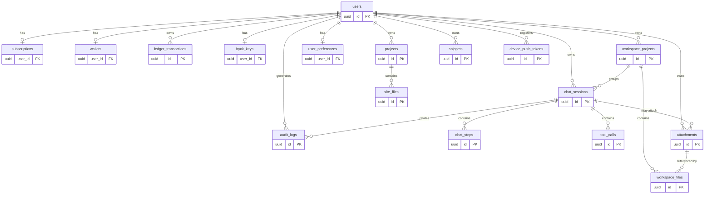

# 03 — Data Model

PostgreSQL 16. **17 таблиц** (9 базовых + `projects`/`site_files` website-builder + 6 расширения Figma-gap: `user_preferences`, `workspace_projects`, `workspace_files`, `snippets`, `attachments`, `device_push_tokens`). UUID v4 (`gen_random_uuid()` из `pgcrypto`). Все timestamp — `timestamptz`, UTC. Деньги/кредиты — целочисленные (минимальная неделимая единица), без float.

> Расширение (2026-06-02, Figma-gap, см. [figma-gap-analysis.md](figma-gap-analysis.md)): новые таблицы и колонки спроектированы как expand-only миграции (`0004`+). Затронутые ADR: [ADR-012](adr/ADR-012-assistant-mode-vs-billing-mode.md) (`assistant_mode`), [ADR-013](adr/ADR-013-workspace-projects-vs-website-builder.md) (workspaces), [ADR-014](adr/ADR-014-multimodal-attachments.md) (attachments), [ADR-015](adr/ADR-015-consumable-token-iap.md) (consumable IAP — без новой таблицы).

## ER-диаграмма



## Enum-типы
```sql
CREATE TYPE subscription_status AS ENUM ('active', 'expired', 'none');
CREATE TYPE ledger_tx_type     AS ENUM ('credit', 'debit');
CREATE TYPE byok_key_status    AS ENUM ('valid', 'invalid', 'missing');
CREATE TYPE chat_mode          AS ENUM ('credits', 'byok');  -- billing_mode (способ оплаты), ADR-012 — НЕ переименовывается
CREATE TYPE chat_role          AS ENUM ('user', 'assistant', 'tool');
CREATE TYPE tool_call_status   AS ENUM ('pending', 'completed', 'errored');
CREATE TYPE assistant_mode     AS ENUM ('chat', 'code');  -- ADR-012: тип ассистента (НЕ способ оплаты)
CREATE TYPE attachment_kind    AS ENUM ('image', 'document');  -- ADR-014
```

### Расширение enum `byok_key_status` ([ADR-016](adr/ADR-016-extended-byok-statuses.md), миграция `0004`)
Дизайн различает больше состояний BYOK-ключа, чем исходные `valid|invalid|missing`. Enum расширяется **добавлением** значений (обратная совместимость: старые значения сохраняются, маппятся 1:1):
```sql
ALTER TYPE byok_key_status ADD VALUE 'validating';  -- Checking (валидация в процессе)
ALTER TYPE byok_key_status ADD VALUE 'offline';     -- сетевая ошибка при валидации (не 401)
ALTER TYPE byok_key_status ADD VALUE 'expired';     -- ключ отозван/истёк (был valid, стал недействителен)
-- 'valid' (Connected+Active), 'invalid' (401 Unauthorized), 'missing' (Not set) — без изменений
```
> Семантика и маппинг на дизайн-статусы (Not set / Checking / Connected+Active / Invalid / Offline / Expired) — [ADR-016](adr/ADR-016-extended-byok-statuses.md), [modules/byok/02-api-contracts.md](modules/byok/02-api-contracts.md). Обратная совместимость: `valid|invalid|missing` остаются валидны, активная модель возвращается отдельным полем (не enum).

## DDL

### 1. users
```sql
CREATE TABLE users (
    id            UUID PRIMARY KEY DEFAULT gen_random_uuid(),
    created_at    TIMESTAMPTZ NOT NULL DEFAULT now(),
    trial_used    BOOLEAN NOT NULL DEFAULT FALSE,  -- BR-1: lifetime trial flag
    display_name  TEXT  -- ADR Figma-gap: человекочитаемое имя профиля (nullable; экран Profile), миграция 0004
);
```
> `display_name` добавлен для экрана Profile (модуль `profile`). Nullable: до первого редактирования имя не задано. Человекочитаемый `accountId` (формат `8472-1936-AXQ5`) **не хранится** в БД — это **детерминированная производная** от `user_id` (вычисляется на лету в `profile`-слое, см. [modules/profile/03-architecture.md](modules/profile/03-architecture.md)), поэтому колонки для него нет.
> `trial_used` добавлен к минимальной модели ТЗ для реализации BR-1 (ровно 1 trial lifetime). Альтернатива через count в audit отвергнута: флаг проще и атомарнее.
> **`users.id` ≡ JWT `sub`** (UUID, выдаёт доверенный issuer). Строка создаётся **лениво** при первом аутентифицированном запросе — идемпотентным upsert `INSERT INTO users (id) VALUES (:sub) ON CONFLICT (id) DO NOTHING` в API Gateway (`get_current_user`), до любой FK-зависимой вставки. Endpoint регистрации нет. На write-path `id` всегда задаётся явно из `sub`; `DEFAULT gen_random_uuid()` — технический fallback, не доменный путь идентичности. См. [ADR-007](adr/ADR-007-lazy-user-provisioning.md), [05-security.md](05-security.md#модель-идентичности-и-провижининг-пользователей).

### 2. subscriptions
```sql
CREATE TABLE subscriptions (
    user_id     UUID PRIMARY KEY REFERENCES users(id) ON DELETE CASCADE,
    status      subscription_status NOT NULL DEFAULT 'none',
    plan        TEXT,
    expires_at  TIMESTAMPTZ,
    updated_at  TIMESTAMPTZ NOT NULL DEFAULT now()
);
CREATE INDEX ix_subscriptions_expires_at ON subscriptions (expires_at);
```

### 3. wallets
```sql
CREATE TABLE wallets (
    user_id     UUID PRIMARY KEY REFERENCES users(id) ON DELETE CASCADE,
    balance     BIGINT NOT NULL DEFAULT 0,
    updated_at  TIMESTAMPTZ NOT NULL DEFAULT now(),
    CONSTRAINT ck_wallets_balance_nonneg CHECK (balance >= 0)  -- AC-3: no negative
);
```

### 4. ledger_transactions
```sql
CREATE TABLE ledger_transactions (
    id              UUID PRIMARY KEY DEFAULT gen_random_uuid(),
    user_id         UUID NOT NULL REFERENCES users(id) ON DELETE CASCADE,
    type            ledger_tx_type NOT NULL,
    amount          BIGINT NOT NULL CHECK (amount > 0),
    meta            JSONB NOT NULL DEFAULT '{}'::jsonb,  -- usage/model, без секретов
    idempotency_key TEXT NOT NULL,
    created_at      TIMESTAMPTZ NOT NULL DEFAULT now()
);
-- AC-3: повторное списание по тому же idempotency_key не списывает повторно.
-- Для credits-debit idempotency_key = messageStepId (единый на message-шаг, ADR-006), НЕ requestId Gateway.
-- Для grant idempotency_key = transactionId периода подписки.
CREATE UNIQUE INDEX ux_ledger_idempotency ON ledger_transactions (user_id, idempotency_key);
CREATE INDEX ix_ledger_user_created ON ledger_transactions (user_id, created_at DESC);
```

### 5. byok_keys
```sql
CREATE TABLE byok_keys (
    user_id         UUID PRIMARY KEY REFERENCES users(id) ON DELETE CASCADE,
    encrypted_key   BYTEA NOT NULL,                 -- ciphertext (AES-GCM)
    encrypted_dek   BYTEA NOT NULL,                 -- DEK, зашифрованный KMS (envelope)
    nonce           BYTEA NOT NULL,                 -- AES-GCM nonce
    key_status      byok_key_status NOT NULL DEFAULT 'missing',
    enabled         BOOLEAN NOT NULL DEFAULT FALSE,
    updated_at      TIMESTAMPTZ NOT NULL DEFAULT now()
);
```
> Plaintext ключ никогда не хранится. См. [ADR-003](adr/ADR-003-byok-envelope-encryption.md). Поля `encrypted_dek`, `nonce` добавлены к минимальной модели ТЗ для envelope encryption.

### 6. chat_sessions
```sql
CREATE TABLE chat_sessions (
    id                   UUID PRIMARY KEY DEFAULT gen_random_uuid(),
    user_id              UUID NOT NULL REFERENCES users(id) ON DELETE CASCADE,
    project_id           TEXT NOT NULL,  -- website-builder external project id (НЕ workspace), см. ADR-013
    mode                 chat_mode NOT NULL,  -- billing_mode (credits|byok), ADR-012
    -- Расширение Figma-gap (миграция 0004):
    title                TEXT,           -- заголовок чата (автоген из 1-го сообщения или rename), nullable
    assistant_mode       assistant_mode NOT NULL DEFAULT 'chat',  -- тип ассистента, ADR-012
    workspace_project_id UUID REFERENCES workspace_projects(id) ON DELETE SET NULL,  -- привязка к workspace, ADR-013, nullable
    is_pinned            BOOLEAN NOT NULL DEFAULT FALSE,  -- закрепление в списке чатов
    created_at           TIMESTAMPTZ NOT NULL DEFAULT now(),
    updated_at           TIMESTAMPTZ NOT NULL DEFAULT now()
);
CREATE INDEX ix_sessions_user_updated ON chat_sessions (user_id, updated_at DESC);
-- Список чатов: закреплённые сверху, затем по свежести (модуль chats).
CREATE INDEX ix_sessions_user_pinned_updated ON chat_sessions (user_id, is_pinned DESC, updated_at DESC);
CREATE INDEX ix_sessions_workspace ON chat_sessions (workspace_project_id) WHERE workspace_project_id IS NOT NULL;
-- Поиск по заголовку (модуль chats). Дефолт: ILIKE по title + поиск по тексту 1-го user-сообщения.
-- Полнотекстовый GIN-индекс — TD при росте объёма (см. modules/chats/03-architecture.md).
```
> TTL/expiry сессии — [Q-001-1](99-open-questions.md). Дефолт: «soft TTL 24h по `updated_at`», задаётся на уровне приложения.
> **Расширение Figma-gap:** `title`/`assistant_mode`/`workspace_project_id`/`is_pinned` — добавлены для экранов Home (список/поиск/rename/pin чатов), Code-режима ([ADR-012](adr/ADR-012-assistant-mode-vs-billing-mode.md)) и workspace-проектов ([ADR-013](adr/ADR-013-workspace-projects-vs-website-builder.md)). `project_id` (website-builder) и `workspace_project_id` (рабочее пространство) — **разные поля**, не путать ([ADR-013](adr/ADR-013-workspace-projects-vs-website-builder.md)). Автогенерация `title` — модуль `chats` ([modules/chats/03-architecture.md](modules/chats/03-architecture.md)).

### 7. chat_steps
```sql
CREATE TABLE chat_steps (
    id              UUID PRIMARY KEY DEFAULT gen_random_uuid(),
    session_id      UUID NOT NULL REFERENCES chat_sessions(id) ON DELETE CASCADE,
    message_step_id UUID NOT NULL,  -- billing message-step id: единый на пользовательский message-шаг (все его tool-раунды); ключ идемпотентности debit (ADR-006)
    role            chat_role NOT NULL,
    payload         JSONB NOT NULL,    -- content blocks (assistant text / tool_use / tool_result)
    usage           JSONB,             -- {inputTokens, outputTokens, model, cacheReadTokens, cacheWriteTokens}
    created_at      TIMESTAMPTZ NOT NULL DEFAULT now()
);
CREATE INDEX ix_steps_session_created ON chat_steps (session_id, created_at);
CREATE INDEX ix_steps_message_step ON chat_steps (message_step_id);
```
> `message_step_id` генерируется Orchestrator в `/chat/run` при старте нового пользовательского message-шага и переиспользуется всеми записями шага (включая ответы после re-entry из `/chat/tool-result`) до финального assistant_message. Это значение передаётся в `Wallet.consume` как `idempotency_key` debit — гарантирует «ровно 1 списание на message-шаг» (ADR-005, ADR-006). Не путать с `requestId` Gateway (per-HTTP-request correlation id).

### 8. tool_calls
```sql
CREATE TABLE tool_calls (
    id                   UUID PRIMARY KEY DEFAULT gen_random_uuid(),
    session_id           UUID NOT NULL REFERENCES chat_sessions(id) ON DELETE CASCADE,
    message_step_id      UUID NOT NULL,  -- billing message-step id шага, к которому относится tool-call; tool-result переиспользует его для всех раундов до финального assistant_message
    tool_name            TEXT NOT NULL,
    provider_tool_use_id TEXT NOT NULL,  -- raw Anthropic tool_use.id ("toolu_..."), для согласованности tool_result.tool_use_id с историей (ADR-008)
    args                 JSONB NOT NULL,
    status               tool_call_status NOT NULL DEFAULT 'pending',
    result               JSONB,            -- tool_result от клиента (для идемпотентности)
    created_at           TIMESTAMPTZ NOT NULL DEFAULT now(),
    completed_at         TIMESTAMPTZ
);
CREATE INDEX ix_tool_calls_session ON tool_calls (session_id, created_at);
```
> `result` добавлен к минимальной модели ТЗ: нужен для идемпотентности повторной отправки tool-result (см. [ADR-005](adr/ADR-005-idempotency-ledger.md)). `toolCallId` = `tool_calls.id` (доменный UUID, публичный для iOS); принадлежность проверяется по `session_id`. `message_step_id` позволяет `/chat/tool-result` определить, к какому пользовательскому message-шагу относится re-entry, и переиспользовать тот же billing-ключ для debit на финальном assistant_message.
> `provider_tool_use_id` хранит **raw** `tool_use.id` от Anthropic (формат `toolu_...`, **не** UUID), записывается при разборе `tool_use` в `/chat/run`. При continuation `tool_result.tool_use_id` берётся из этого поля — Anthropic требует точного совпадения с `tool_use.id` предыдущего assistant-хода в истории. Доменный `id` (UUID) наружу не подменяет это значение. Тип `TEXT` (формат провайдера произвольный, не парсится как UUID), `NOT NULL` — tool_call всегда создаётся из конкретного `tool_use` блока ответа Anthropic. См. [ADR-008](adr/ADR-008-provider-tool-use-id.md).

### 9. audit_logs
```sql
CREATE TABLE audit_logs (
    id          UUID PRIMARY KEY DEFAULT gen_random_uuid(),
    user_id     UUID NOT NULL REFERENCES users(id) ON DELETE CASCADE,
    session_id  UUID REFERENCES chat_sessions(id) ON DELETE SET NULL,
    event_type  TEXT NOT NULL,    -- tool_mutation | billing_debit | policy_decision | byok_change
    payload     JSONB NOT NULL,   -- без секретов/ключей
    created_at  TIMESTAMPTZ NOT NULL DEFAULT now()
);
CREATE INDEX ix_audit_user_created ON audit_logs (user_id, created_at DESC);
CREATE INDEX ix_audit_event_type ON audit_logs (event_type, created_at DESC);
```
> Append-only на уровне приложения (нет UPDATE/DELETE из кода). Жёсткий запрет ревизий — потенциальный TD, см. [100-known-tech-debt.md](100-known-tech-debt.md#td-001).

### 10. projects (website-builder)
```sql
CREATE TABLE projects (
    id                  UUID PRIMARY KEY DEFAULT gen_random_uuid(),
    user_id             UUID NOT NULL REFERENCES users(id) ON DELETE CASCADE,
    external_project_id TEXT NOT NULL,   -- клиентский projectId (= chat_sessions.project_id)
    created_at          TIMESTAMPTZ NOT NULL DEFAULT now(),
    updated_at          TIMESTAMPTZ NOT NULL DEFAULT now()
);
CREATE UNIQUE INDEX ux_projects_user_external ON projects (user_id, external_project_id);
CREATE INDEX ix_projects_user ON projects (user_id, updated_at DESC);
```

### 11. site_files (website-builder)
```sql
CREATE TABLE site_files (
    id           UUID PRIMARY KEY DEFAULT gen_random_uuid(),
    project_id   UUID NOT NULL REFERENCES projects(id) ON DELETE CASCADE,
    path         TEXT NOT NULL,           -- нормализованный относительный путь (без ".."/абсолютных/NUL)
    content      BYTEA NOT NULL,
    content_type TEXT NOT NULL,           -- из content-type allowlist
    size         BIGINT NOT NULL CHECK (size >= 0),
    updated_at   TIMESTAMPTZ NOT NULL DEFAULT now()
);
CREATE UNIQUE INDEX ux_site_files_project_path ON site_files (project_id, path);
CREATE INDEX ix_site_files_project ON site_files (project_id);
```
> Таблицы website-builder. Детали (лимиты размера/числа файлов, изоляция владельца, content-type allowlist, threat model
> отдачи контента) — [modules/website-builder/04-data-model.md](modules/website-builder/04-data-model.md),
> [modules/website-builder/05-security.md](modules/website-builder/05-security.md), [ADR-010](adr/ADR-010-backend-hosted-preview.md).
> Контент в БД на старте; миграция в object-storage — [TD-009](100-known-tech-debt.md).

---

## Таблицы расширения Figma-gap (миграция `0004`, expand-only)

### 12. user_preferences ([ADR-012](adr/ADR-012-assistant-mode-vs-billing-mode.md), модуль `preferences`)
```sql
CREATE TABLE user_preferences (
    user_id                UUID PRIMARY KEY REFERENCES users(id) ON DELETE CASCADE,
    default_assistant_mode assistant_mode NOT NULL DEFAULT 'chat',  -- дефолтный тип ассистента (chat|code)
    notifications_enabled  BOOLEAN NOT NULL DEFAULT TRUE,           -- toggle уведомлений (модуль notifications)
    code_defaults          JSONB NOT NULL DEFAULT '{}'::jsonb,      -- дефолты Code-context (язык и т.п.), без секретов
    updated_at             TIMESTAMPTZ NOT NULL DEFAULT now()
);
```
> Строка создаётся лениво (upsert при первом GET/PATCH preferences) либо отдаётся дефолтами, если отсутствует. `notifications_enabled` — единый источник настройки уведомлений; регистрация push-токенов — `device_push_tokens` (таблица 17).

### 13. workspace_projects ([ADR-013](adr/ADR-013-workspace-projects-vs-website-builder.md), модуль `workspaces`)
```sql
CREATE TABLE workspace_projects (
    id            UUID PRIMARY KEY DEFAULT gen_random_uuid(),
    user_id       UUID NOT NULL REFERENCES users(id) ON DELETE CASCADE,
    name          TEXT NOT NULL,
    description   TEXT,
    instructions  TEXT,           -- кастомный system-prompt («Use a professional tone…»), nullable
    created_at    TIMESTAMPTZ NOT NULL DEFAULT now(),
    updated_at    TIMESTAMPTZ NOT NULL DEFAULT now()
);
CREATE INDEX ix_workspace_projects_user ON workspace_projects (user_id, updated_at DESC);
```
> Рабочее пространство чатов. **Не путать** с website-builder `projects` ([ADR-013](adr/ADR-013-workspace-projects-vs-website-builder.md)). `instructions` добавляются к base-system-prompt при генерации в сессии этого workspace.

### 14. workspace_files ([ADR-013](adr/ADR-013-workspace-projects-vs-website-builder.md), [ADR-014](adr/ADR-014-multimodal-attachments.md), модуль `workspaces`)
```sql
CREATE TABLE workspace_files (
    id                   UUID PRIMARY KEY DEFAULT gen_random_uuid(),
    workspace_project_id UUID NOT NULL REFERENCES workspace_projects(id) ON DELETE CASCADE,
    attachment_id        UUID NOT NULL REFERENCES attachments(id) ON DELETE CASCADE,  -- байты/extracted_text — в attachments (ADR-014)
    created_at           TIMESTAMPTZ NOT NULL DEFAULT now()
);
CREATE UNIQUE INDEX ux_workspace_files ON workspace_files (workspace_project_id, attachment_id);
CREATE INDEX ix_workspace_files_project ON workspace_files (workspace_project_id);
```
> Прикреплённый файл-контекст workspace. Сами байты и `extracted_text` хранятся в `attachments` ([ADR-014](adr/ADR-014-multimodal-attachments.md)) — единое хранилище байтов для вложений сообщений и файлов workspace, без дублирования BYTEA-логики.

### 15. snippets (модуль `snippets`, Code-режим)
```sql
CREATE TABLE snippets (
    id             UUID PRIMARY KEY DEFAULT gen_random_uuid(),
    user_id        UUID NOT NULL REFERENCES users(id) ON DELETE CASCADE,
    title          TEXT NOT NULL,
    language       TEXT NOT NULL,        -- TypeScript|Python|SQL|… (фильтр All/<lang>); свободная строка, нормализуется приложением
    code           TEXT NOT NULL,
    tags           TEXT[] NOT NULL DEFAULT '{}',
    source_chat_id UUID REFERENCES chat_sessions(id) ON DELETE SET NULL,  -- «сохранено из чата», nullable
    created_at     TIMESTAMPTZ NOT NULL DEFAULT now(),
    updated_at     TIMESTAMPTZ NOT NULL DEFAULT now()
);
CREATE INDEX ix_snippets_user_created ON snippets (user_id, created_at DESC);
CREATE INDEX ix_snippets_user_language ON snippets (user_id, language);
```
> Сохранённые код-фрагменты. `language` — свободная строка с нормализацией (фильтр UI All/TypeScript/Python/SQL). Поиск — ILIKE по `title`/`code`. `source_chat_id` поддерживает действие «Open in Chat».

### 16. attachments ([ADR-014](adr/ADR-014-multimodal-attachments.md), модуль `attachments`)
```sql
CREATE TABLE attachments (
    id             UUID PRIMARY KEY DEFAULT gen_random_uuid(),
    user_id        UUID NOT NULL REFERENCES users(id) ON DELETE CASCADE,
    session_id     UUID REFERENCES chat_sessions(id) ON DELETE SET NULL,  -- проставляется при первом использовании в /chat/run; до того NULL (orphan)
    kind           attachment_kind NOT NULL,         -- image | document
    media_type     TEXT NOT NULL,                    -- из allowlist (image/jpeg, …, application/pdf, text/plain)
    filename       TEXT,                              -- исходное имя (nullable)
    content        BYTEA NOT NULL,                    -- байты вложения (на старте в БД; миграция в object-storage — TD-009)
    size           BIGINT NOT NULL CHECK (size >= 0),
    extracted_text TEXT,                              -- для document (PDF/text): извлечённый текст, подаётся Claude как контекст; nullable
    created_at     TIMESTAMPTZ NOT NULL DEFAULT now()
);
CREATE INDEX ix_attachments_user_created ON attachments (user_id, created_at DESC);
CREATE INDEX ix_attachments_session ON attachments (session_id) WHERE session_id IS NOT NULL;
-- Orphan-очистка (session_id IS NULL, старше ATTACHMENT_ORPHAN_TTL) — TD-010 (без фонового джоба на старте).
```
> Хранилище байтов вложений мультимодального ввода **и** файлов-контекста workspace (общее, [ADR-014](adr/ADR-014-multimodal-attachments.md)). Лимиты (image ≤ 5 MB, document ≤ 10 MB, ≤ 10/сообщение) и media_type allowlist — [modules/attachments/05-security.md](modules/attachments/05-security.md), [Q-014-1](99-open-questions.md)/[Q-014-2](99-open-questions.md). Контент в БД на старте → [TD-009](100-known-tech-debt.md); orphan-retention → [TD-010](100-known-tech-debt.md).

### 17. device_push_tokens (модуль `notifications`)
```sql
CREATE TABLE device_push_tokens (
    id           UUID PRIMARY KEY DEFAULT gen_random_uuid(),
    user_id      UUID NOT NULL REFERENCES users(id) ON DELETE CASCADE,
    device_id    TEXT NOT NULL,            -- из JWT claim / X-Device-Id
    push_token   TEXT NOT NULL,            -- APNs device token
    platform     TEXT NOT NULL DEFAULT 'ios',
    updated_at   TIMESTAMPTZ NOT NULL DEFAULT now()
);
CREATE UNIQUE INDEX ux_push_tokens_user_device ON device_push_tokens (user_id, device_id);
CREATE INDEX ix_push_tokens_user ON device_push_tokens (user_id);
```
> Регистрация APNs-токена устройства. Один токен на `(user_id, device_id)` (upsert при перерегистрации). **Само отправление push** (APNs-клиент, триггеры) — вне scope этого прохода, вынесено в [TD-011](100-known-tech-debt.md): на старте только хранение настройки (`user_preferences.notifications_enabled`) и регистрация токена. См. [modules/notifications/00-overview.md](modules/notifications/00-overview.md).

## Инварианты
- `wallets.balance >= 0` — БД CHECK + проверка в Wallet (двойная защита).
- **Изоляция website-builder:** `site_files` → `projects` → `users` (FK `ON DELETE CASCADE`); доступ к файлам только через
  проект владельца. `projects.user_id` всегда соответствует существующей строке `users` (lazy-provisioning, [ADR-007](adr/ADR-007-lazy-user-provisioning.md)). Лимиты файла/проекта/числа файлов и path-traversal guard — на уровне приложения ([modules/website-builder/05-security.md](modules/website-builder/05-security.md)).
- Идемпотентность списания — `ux_ledger_idempotency (user_id, idempotency_key)`. Для credits-debit `idempotency_key` = `messageStepId` (= `chat_steps.message_step_id`/`tool_calls.message_step_id`), единый на пользовательский message-шаг; гарантирует ровно 1 debit на шаг независимо от числа tool-раундов и re-entry. Это **не** `requestId` Gateway.
- `users.trial_used` переключается в `TRUE` ровно один раз (атомарный `UPDATE ... WHERE trial_used = FALSE`).
- **Двойственность tool-id (ADR-008):** `tool_calls.id` (UUID) — публичный доменный `toolCallId` для iOS-контракта; `tool_calls.provider_tool_use_id` (TEXT, `toolu_...`) — внутренний id для согласованности истории Anthropic. Связь 1:1 в пределах записи. Наружу (`toolCall.id` в ответах API, `/chat/tool-result` request) фигурирует **только** доменный UUID; в `tool_result.tool_use_id` запроса к Anthropic — **только** `provider_tool_use_id`. Реплеемые `chat_steps.payload` хранят raw anthropic id и согласованы с `provider_tool_use_id` по построению.
- В `meta`, `payload`, `usage`, `args`, `result` запрещено хранить API-ключи и секреты.
- Любая FK-зависимая вставка (`subscriptions`/`wallets`/`byok_keys`/`ledger_transactions`/`chat_sessions`/`audit_logs`/`user_preferences`/`workspace_projects`/`snippets`/`attachments`/`device_push_tokens`) выполняется только после того, как строка `users` для `sub` гарантированно существует — обеспечивается ленивым провижинингом в gateway ([ADR-007](adr/ADR-007-lazy-user-provisioning.md)). Прямой FK-violation на отсутствующем `users` — дефект провижининга.
- **Изоляция расширения (Figma-gap):** `workspace_files` → `workspace_projects` → `users`; `snippets`/`attachments`/`device_push_tokens` → `users` (все FK `ON DELETE CASCADE`). Доступ только владельца (`user_id == sub`). `chat_sessions.workspace_project_id` и `attachments.session_id` — `ON DELETE SET NULL` (чат/сессия переживает удаление workspace/при отвязке).
- **Терминология mode (ADR-012):** `chat_sessions.mode` (enum `chat_mode`) = `billing_mode` (credits|byok, способ оплаты); `chat_sessions.assistant_mode` (enum `assistant_mode`) = тип ассистента (chat|code). Это **разные ортогональные** поля. `chat_sessions.project_id` (TEXT, website-builder) ≠ `chat_sessions.workspace_project_id` (UUID FK, рабочее пространство) ([ADR-013](adr/ADR-013-workspace-projects-vs-website-builder.md)).
- **Источники credit-tx (ADR-006 + ADR-015):** `ledger_transactions.type='credit'` создаётся (а) subscription period grant (idempotency = `transactionId` периода) либо (б) consumable token purchase (idempotency = consumable `transactionId`, `meta.source='token_purchase'`). Оба идемпотентны по `ux_ledger_idempotency`. Списание (`type='debit'`) — без изменений (1 кредит = 1 сообщение).

## Расширения PostgreSQL
```sql
CREATE EXTENSION IF NOT EXISTS pgcrypto;  -- gen_random_uuid()
```
