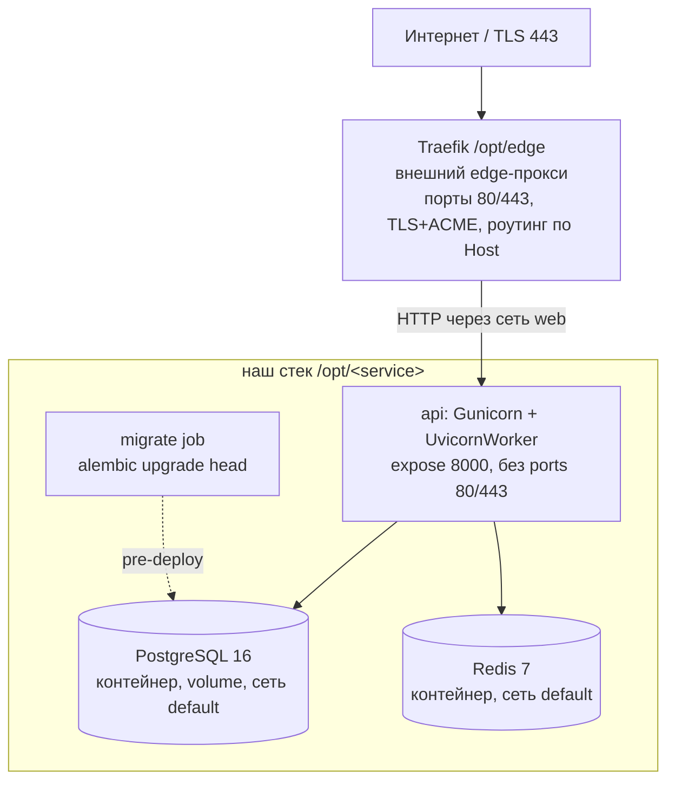

# 07 — Deployment

## Артефакт
Один Docker-образ (multi-stage, base `python:3.12-slim`), запускается через Gunicorn + UvicornWorker. Stateless — состояние в PostgreSQL/Redis. Образ **собирается на сервере** из исходников в `/opt/<service>` (явный `docker compose build api migrate`, затем `up -d --no-build` — см. [§Процедура деплоя](#процедура-деплоя-github-actions--ssh)), не пушится из registry ([ADR-017](adr/ADR-017-shared-server-traefik-deploy.md)).

## Топология MVP — общий сервер за внешним Traefik
Deploy-target зафиксирован ([ADR-017](adr/ADR-017-shared-server-traefik-deploy.md), решение владельца инфраструктуры 2026-06-02, ревизует [TD-005](100-known-tech-debt.md)): сервис размещается на **общем Linux-сервере** (Ubuntu 22.04, `87.239.135.154`, root), где уже работают другие сервисы (`music-backend`) и **общий edge-прокси Traefik** в `/opt/edge`. Наш сервис — каталог `/opt/<service>` (например `/opt/claude-ios`), встраивается в Traefik через docker-labels и внешнюю сеть `web`.



Состав нашего `docker compose`-стека в `/opt/<service>` (Traefik — **вне** нашего стека):
- **Traefik** — НЕ наш контейнер. Общий edge-прокси владельца сервера (`/opt/edge`): держит порты 80/443, терминирует TLS, авто-выпускает Let's Encrypt-сертификаты, роутит по доменам. Наш стек **не содержит** reverse-proxy и **не управляет** TLS/ACME.
- **api** — Docker-образ приложения (Gunicorn + UvicornWorker). `expose: 8000` (uvicorn/gunicorn), **без** `ports:` для 80/443 (конфликт с Traefik запрещён). Подключён к двум сетям: `web` (`external: true`, общая с Traefik) и `default` (внутренняя для PG/Redis). Снаружи доступен **только** через Traefik по сети `web`.
- **postgres** — PostgreSQL 16 в контейнере с persistent volume. **Только** в сети `default`, **без публикации портов** (бэкап — `pg_dump` по cron на хосте + offsite-копия).
- **redis** — Redis 7 в контейнере (rate limit, idempotency, policy cache). **Только** в сети `default`, **без публикации портов**.
- **migrate** — одноразовый job (`alembic upgrade head`), запускается до старта `api` при каждом релизе.
- Single-region, single-host (общий с другими сервисами). Состояние — в volume PostgreSQL + Redis; образ `api` — stateless.

> **Жёсткие требования к нашему `docker-compose` (от владельца сервера, [ADR-017](adr/ADR-017-shared-server-traefik-deploy.md)):**
> 1. НЕ публиковать порты 80/443 (никаких `ports: 80/443`) — иначе конфликт с Traefik. Только `expose` внутреннего `8000`.
> 2. `api` — в сети `web` (`external: true`, общая с Traefik) + `default` (внутренняя для PG/Redis).
> 3. Маршрут — через docker-labels (Traefik подхватит, см. ниже).
> 4. SSL/nginx/Caddy НЕ настраивать — TLS целиком Traefik. `postgres`/`redis` — только в `default`, без публикации портов.
> 5. Внешняя сеть `web` создаётся на сервере однократно: `docker network create web` (уже создана).
> 6. `DOCKER_MIN_API_VERSION=1.24` уже задан на сервере — не трогать.

> **PostgreSQL/Redis: контейнерные vs managed.** На MVP — контейнерные в том же стеке (минимум инфраструктуры). При росте нагрузки — вынос на managed без изменения контрактов приложения (`DATABASE_URL`/`REDIS_URL`). Бэкап контейнерного PG (`pg_dump` + offsite) **обязателен** до приёма реальных пользователей — см. prod-checklist.

### Маршрутизация через Traefik docker-labels
Traefik обнаруживает наш `api` через labels на сервисе `api` в `docker-compose`. Значения зафиксированы: `SERVICE_DOMAIN=broadnova.shop` ([Q-017-1](99-open-questions.md)), `TRAEFIK_CERTRESOLVER=le` ([Q-017-2](99-open-questions.md)):
```
traefik.enable=true
traefik.docker.network=web
traefik.http.routers.<service>.rule=Host(`${SERVICE_DOMAIN}`)
traefik.http.routers.<service>.entrypoints=websecure
traefik.http.routers.<service>.tls.certresolver=${TRAEFIK_CERTRESOLVER}   # опционален: le — default на websecure
traefik.http.services.<service>.loadbalancer.server.port=8000
```
- `${SERVICE_DOMAIN}` — домен сервиса = `broadnova.shop` ([Q-017-1](99-open-questions.md)); A-запись `broadnova.shop` → `87.239.135.154` **обязана существовать до запуска** (ACME-challenge Traefik).
- `${TRAEFIK_CERTRESOLVER}` — имя ACME-certresolver общего Traefik = `le` (`/opt/edge`, [Q-017-2](99-open-questions.md)). Владелец сервера сделал `le` **дефолтным** на entrypoint `websecure` (`--entrypoints.websecure.http.tls.certresolver=le`), поэтому этот label **опционален** — сертификат выпустится автоматически для любого HTTPS-роутера. Явный label `tls.certresolver=le` **рекомендован для надёжности** (детерминированность при изменении дефолта).
- `loadbalancer.server.port=8000` — Traefik проксирует на внутренний `8000` контейнера `api` по сети `web`.

### Биндинг и доступ
- `api` **не** публикует 80/443; снаружи доступен только через Traefik (сеть `web`). Прямой доступ из интернета к `api`/`postgres`/`redis` закрыт отсутствием публикации портов + изоляцией сетей.
- `TRUSTED_PROXY_IPS` в prod **обязан** содержать адрес/подсеть **Traefik** (docker-сеть `web`). Traefik проставляет `X-Forwarded-For`; без доверия к нему per-IP rate limit видит IP Traefik, а не клиента. См. [05-security.md](05-security.md#доверенный-reverse-proxy-и-определение-client-ip-anti-spoofing) и [§Конфигурация](#конфигурация-env).

## Reverse-proxy / LB — операционные требования к `/v1/preview/*`
Приложение отдаёт пользовательский (Claude-сгенерированный) HTML/JS на `GET /v1/preview/{projectId}/{token}/{path}` со **своими** sandbox-заголовками (ADR-010, [05-security.md](05-security.md#backend-hosted-preview-отдача-пользовательского-htmljs-adr-010)): `Content-Security-Policy: sandbox ...`, `X-Content-Type-Options: nosniff`, `X-Frame-Options: SAMEORIGIN`, `Cache-Control: private, no-store`, без cookies. Этот путь **исключён** из дефолтных security-заголовков middleware, чтобы отдать собственную политику.

Reverse-proxy / LB (в нашей схеме — **внешний Traefik**) **ОБЯЗАН** на `/v1/preview/*`:
- **не перетирать и не дублировать** заголовки ответа (`Content-Security-Policy`, `X-Frame-Options`, `X-Content-Type-Options`, `Cache-Control`) — pass-through as-is. Не навешивать глобальный `X-Frame-Options: DENY` / общий CSP, применяемый к остальным путям.
- **не добавлять `Set-Cookie`** и не инжектить session/affinity-cookies на этот префикс (превью открывается прямой ссылкой, авторизация — в signed URL, не в cookie).
- глобальные политики безопасности прокси для прочих путей (HSTS, `X-Frame-Options: DENY`) применять **в обход** `/v1/preview/*` (отдельный route/middleware без переопределения заголовков приложения).

> **Операционное требование к владельцу Traefik ([ADR-017](adr/ADR-017-shared-server-traefik-deploy.md)).** Reverse-proxy теперь — общий **внешний** Traefik (`/opt/edge`), вне нашего репозитория. Контракт pass-through выше — требование к его конфигурации Host-роутера нашего домена: не навешивать на `/v1/preview/*` глобальные header-/cookie-middleware Traefik, которые перетрут sandbox-заголовки приложения (ADR-010). По умолчанию Traefik **не** модифицирует заголовки ответа без явных middleware — требование сводится к «не добавлять header/cookie-middleware на роутер нашего домена для `/v1/preview/*`».

Прежние Caddy/nginx-артефакты (legacy, DEPRECATED: [`infra/legacy/Caddyfile`](../infra/legacy/Caddyfile), [`infra/legacy/nginx.conf.example`](../infra/legacy/nginx.conf.example)) в этой схеме **не используются** (TLS/reverse-proxy — внешний Traefik) — перенесены в `infra/legacy/` с DEPRECATED-баннером. См. [§Prod-артефакты](#prod-артефакты-источник-истины--реальные-файлы-в-репозитории).

**Изоляция origin (операционно, [Q-010-3](99-open-questions.md), не блокер):** старт — single-origin `/v1/preview/*` + sandbox-заголовки (самодостаточно). Prod-рекомендация — вынести превью на отдельный поддомен `preview.<domain>`, чтобы даже при обходе CSP пользовательский JS не имел same-origin доступа к API. При вводе поддомена то же требование pass-through заголовков и запрет cookies сохраняется.

## Конфигурация (env)
| Переменная | Назначение |
|---|---|
| `DATABASE_URL` | `postgresql+asyncpg://<POSTGRES_USER>:<POSTGRES_PASSWORD>@postgres:5432/<POSTGRES_DB>` — **собирается из `POSTGRES_USER`/`POSTGRES_PASSWORD`/`POSTGRES_DB` целиком**; все три должны совпадать со значением URL. На клоне — свои значения (см. [clone `.env`-контракт](#clone-env-контракт-ключи-claude-ios)). |
| `POSTGRES_USER` / `POSTGRES_DB` / `POSTGRES_PASSWORD` | креды контейнерного PostgreSQL. `POSTGRES_PASSWORD` — **секрет** (secret manager). Входят в `DATABASE_URL` целиком. На клоне — свои. |
| `KMS_KEY_ID` | идентификатор облачного KMS-ключа. **На MVP пуст** — используется `LocalKmsClient` (in-process AES-256-GCM под `KMS_LOCAL_MASTER_KEY`, облачного KMS нет, [Q-002-1](99-open-questions.md), [ADR-003](adr/ADR-003-byok-envelope-encryption.md)). Заполняется только при миграции на облачный KMS (post-MVP). |
| `REDIS_URL` | `redis://...` |
| `ANTHROPIC_API_KEY` | сервисный ключ Claude (mode=credits) |
| `ANTHROPIC_MODEL` | дефолтная модель |
| `ANTHROPIC_MAX_TOKENS` | output-бюджет на вызов, дефолт **`16000`** ([ADR-025](adr/ADR-025-parallel-tool-calls-and-max-tokens-truncation.md)); прежний `4096` обрезал генерацию кода/файлов. Non-streaming. **Per-instance** — задать на каждом инстансе. |
| `ANTHROPIC_TIMEOUT_SECONDS` | таймаут upstream-вызова, дефолт **`120`** ([ADR-025](adr/ADR-025-parallel-tool-calls-and-max-tokens-truncation.md), поднят с 60 под длинную генерацию при `max_tokens=16000`). |
| `JWT_ISSUER` / `JWT_AUDIENCE` | issuer/audience выпускаемых и проверяемых JWT. Для встроенного issuer: `JWT_ISSUER=https://broadnova.shop`, `JWT_AUDIENCE=claude-ios` ([ADR-018](adr/ADR-018-embedded-auth-issuer.md)). |
| `JWT_PRIVATE_KEY` / `JWT_PRIVATE_KEY_PATH` | **СЕКРЕТ** — приватный RS256-ключ подписи (встроенный issuer). PEM-строка с `\n`-экранированием **или** путь к файлу (приоритет у `*_PATH`). Только secret manager / mounted-файл, под redaction. **Должен быть сконфигурирован до публичного запуска** (без него `/v1/auth/*` → `503`). [Q-005-1](99-open-questions.md) Closed ([ADR-018](adr/ADR-018-embedded-auth-issuer.md)). |
| `JWT_PUBLIC_KEY` / `JWT_PUBLIC_KEY_PATH` | публичный RS256-ключ (verify + `/v1/auth/jwks`). PEM-строка (`\n`-экранирование) или файл-путь. Не секрет. |
| `JWT_KID` | идентификатор ключа (`kid` в заголовке JWT / JWKS); задел под ротацию. |
| `JWT_JWKS_URL` | **опционально** — verify-only режим внешнего issuer (Apple Sign-In/Firebase, [Q-018-2](99-open-questions.md)). Для встроенного issuer не используется (verify по `JWT_PUBLIC_KEY`). |
| `AUTH_ACCESS_TTL_SECONDS` / `AUTH_REFRESH_TTL_SECONDS` | TTL access-token (дефолт `3600`) / refresh-token (дефолт `2592000`). [ADR-018](adr/ADR-018-embedded-auth-issuer.md). |
| `AUTH_RATE_LIMIT_PER_IP` / `AUTH_JWKS_ENABLED` | rate-limit `/v1/auth/*` per IP (дефолт `10`/min) / видимость `GET /v1/auth/jwks` (дефолт `true`). |
| `KMS_LOCAL_MASTER_KEY` | мастер-ключ для envelope encryption BYOK на MVP (`LocalKmsClient`, реальный AES-256-GCM wrap DEK, [ADR-003](adr/ADR-003-byok-envelope-encryption.md)). Высокоэнтропийный (32 байта base64), **только через secret manager/env на сервере** (`.env` в `/opt/<service>`), под redaction. Миграция на облачный KMS — post-MVP ([Q-002-1](99-open-questions.md)). |
| `APPSTORE_*` | App Store Server API credentials (`APPSTORE_ENVIRONMENT`/`APPSTORE_BUNDLE_ID`/`APPSTORE_ROOT_CERT_DIR`) |
| `STOREKIT_TEST_MODE` | env-флаг тестовой верификации StoreKit. Дефолт `false` (**prod fail-closed, реальная JWS-верификация**). `true` — принимает HS256-тестовую транзакцию (только e2e/CI). При `true` — WARNING в лог на старте. См. [09-e2e-testing.md §2](09-e2e-testing.md#2-storekit_test_mode--env-gated-режим-тестовой-верификации), [TD-007](100-known-tech-debt.md). |
| `STOREKIT_TEST_SECRET` | общий секрет (HS256) для тестовых транзакций. Обязателен при `STOREKIT_TEST_MODE=true` (пусто → test-mode не активируется). Секрет, под redaction. **В prod не задаётся.** |
| `SUBSCRIPTION_CREDITS_PER_PERIOD` | кредитов на период подписки (grant), дефолт `1000` (ADR-006) |
| `ADMIN_API_SECRET` | изолированный admin-секрет для `X-Admin-Token` (`/v1/admin/*`). Высокоэнтропийный, secret manager. Под redaction. Не задан → admin-API недоступен (всегда `401`). См. [ADR-009](adr/ADR-009-admin-token-auth.md). |
| `ADMIN_API_SECRET_PREV` | предыдущий admin-секрет на grace-период ротации (опц.). Пусто вне ротации. Под redaction. |
| `ADMIN_RATE_LIMIT_PER_MIN` | rate limit `/v1/admin/*` per source IP, дефолт `10`. |
| `PREVIEW_URL_SECRET` | секрет HMAC для preview signed URL (`/v1/preview/*`). Высокоэнтропийный, secret manager, отдельный от прочих. Под redaction. См. [ADR-010](adr/ADR-010-backend-hosted-preview.md). |
| `PREVIEW_URL_TTL_SECONDS` | TTL preview signed URL, дефолт `900` (15 мин). |
| `PREVIEW_MAX_FILE_BYTES` | лимит размера одного файла сайта, дефолт `1048576` (1 MB). |
| `PREVIEW_MAX_PROJECT_BYTES` | лимит суммарного размера проекта, дефолт `10485760` (10 MB). |
| `PREVIEW_MAX_FILES` | лимит числа файлов в проекте, дефолт `200`. |
| `MAX_SERVER_TOOL_ROUNDS` | guard числа последовательных server-side (`site.*`) tool-раундов на message-шаг, дефолт `16` ([ADR-011](adr/ADR-011-server-side-tools.md)). |
| `TOKEN_PRODUCTS` | маппинг consumable-продуктов `productId→credits` (JSON), напр. `{"tokens_1500":1500,"tokens_600":600,"tokens_250":250,"tokens_100":100}`. Источник числа кредитов на покупку токенов (server-side, [ADR-015](adr/ADR-015-consumable-token-iap.md)). |
| `ADAPTY_WEBHOOK_SECRET` | **(Adapty, [ADR-029](adr/ADR-029-adapty-subscription-webhook.md))** статический bearer-секрет для `POST /v1/billing/adapty/webhook` (`Authorization: Bearer <...>`). Высокоэнтропийный (≥ 32 байта), secret manager, **per-instance** (свой на каждый инстанс), отдельный от прочих. Под redaction. **Не задан → эндпоинт `500`** (мис-конфигурация). Задаётся также оператором в **Adapty UI** при настройке вебхука (то же значение). |
| `ADAPTY_PRODUCT_TOKENS` | **(Adapty)** маппинг `vendor_product_id→tokens` (JSON), напр. `{"sub_monthly":1000,"sub_yearly":1000}`. Источник числа кредитов на грант по событию подписки ([ADR-029](adr/ADR-029-adapty-subscription-webhook.md)). Дефолт `{}` (всё идёт через fallback). |
| `ADAPTY_SUBSCRIPTION_TOKENS_GRANT` | **(Adapty)** fallback-число кредитов на грант, если `vendor_product_id` отсутствует в `ADAPTY_PRODUCT_TOKENS`. Целое > 0, дефолт `1000` ([ADR-029](adr/ADR-029-adapty-subscription-webhook.md)). Отдельно от `SUBSCRIPTION_CREDITS_PER_PERIOD` (StoreKit-путь) для независимой калибровки. |
| `BYOK_DEFAULT_MODEL` | активная модель, возвращаемая в BYOK-ответе при `keyStatus=valid` (`activeModel`), напр. `claude-sonnet-4-6` ([ADR-016](adr/ADR-016-extended-byok-statuses.md)). |
| `ATTACHMENT_MAX_BYTES_IMAGE` | лимит размера одного image-вложения inline base64, дефолт `5242880` (5 MB) ([ADR-020](adr/ADR-020-inline-base64-attachments-mvp.md)). |
| `ATTACHMENT_MAX_BYTES_DOCUMENT` | лимит размера одного document-вложения inline base64, дефолт `8388608` (8 MB) ([ADR-020](adr/ADR-020-inline-base64-attachments-mvp.md)). |
| `ATTACHMENT_TOTAL_BYTES` | суммарный лимит размера вложений в одном запросе, дефолт `10485760` (10 MB) ([ADR-020](adr/ADR-020-inline-base64-attachments-mvp.md)). |
| `ATTACHMENT_MAX_COUNT` | макс. число вложений на сообщение, дефолт `10` ([ADR-020](adr/ADR-020-inline-base64-attachments-mvp.md)). |
| `ATTACHMENT_PDF_MAX_PAGES` | guard числа страниц PDF (анти-decompression-bomb, `pypdf`), дефолт `100` ([ADR-020](adr/ADR-020-inline-base64-attachments-mvp.md)). |
| `ATTACHMENT_REQUEST_BODY_LIMIT` | повышенный transport-лимит тела для роута `/v1/chat/run` под inline base64, дефолт `12582912` (12 MB) ([ADR-020](adr/ADR-020-inline-base64-attachments-mvp.md), [05-security.md](05-security.md#повышенный-transport-лимит-для-v1chatrun-inline-base64-вложения-adr-020)). |
| `ATTACHMENT_EXTRACT_MAX_CHARS`, `ATTACHMENT_ORPHAN_TTL` | **не задаются на MVP** — относятся к отложенной двухшаговой upload-модели attachments ([TD-015](100-known-tech-debt.md), транспорт [ADR-014](adr/ADR-014-multimodal-attachments.md) Superseded). Orphan-очистка — [TD-010](100-known-tech-debt.md). |
| `WORKSPACE_CONTEXT_MAX_CHARS` | лимит суммарного контекста workspace-файлов, инжектируемого в prompt, дефолт `200000` ([ADR-013](adr/ADR-013-workspace-projects-vs-website-builder.md), [Q-013-1](99-open-questions.md)). |
| `CHAT_TITLE_MAX_CHARS` | макс. длина автогенерируемого заголовка чата, дефолт `60` (модуль chats). |
| `APNS_*` | credentials APNs для отправки push (`APNS_KEY_ID`/`APNS_TEAM_ID`/`APNS_AUTH_KEY`/`APNS_TOPIC`). **Не задаются в этом проходе** — отправка push отложена ([TD-011](100-known-tech-debt.md)). |
| `RATE_LIMIT_*` | значения rate limits |
| `SIZE_LIMIT_*` | size-лимиты payload |
| `TRUSTED_PROXY_IPS` | comma-separated список IP/CIDR доверенных reverse-proxy/LB. Дефолт `""` → XFF/X-Real-IP не доверяются, используется socket peer IP. **В prod ОБЯЗАН** содержать адрес/подсеть **внешнего Traefik** — подсеть docker-сети `web` (через неё Traefik проксирует на `api`). Иначе `client_ip` берётся как IP Traefik, и per-IP rate limit неработоспособен ([ADR-017](adr/ADR-017-shared-server-traefik-deploy.md), [05-security.md](05-security.md#доверенный-reverse-proxy-и-определение-client-ip-anti-spoofing)). Подсеть `web` — `docker network inspect web` (поле `IPAM.Config.Subnet`) на сервере; для bridge-сети по умолчанию вида `172.x.0.0/16`. |
| `TRUSTED_PROXY_HOP_COUNT` | число доверенных proxy-хопов перед приложением (chained LB/CDN). Дефолт `1`. Client IP берётся `(hop_count + 1)`-м справа из `X-Forwarded-For`. |
| `DB_POOL_SIZE` | размер пула соединений БД на процесс. Дефолт `10`. |
| `DB_MAX_OVERFLOW` | доп. соединения сверх `DB_POOL_SIZE` под пик. Дефолт `5`. |
| `DB_POOL_TIMEOUT` | таймаут ожидания соединения из пула, сек. Дефолт `30`. |
| `DB_POOL_RECYCLE` | принудительный recycle соединения, сек (борьба с idle-timeout на стороне PG/proxy). Дефолт `1800`. |
| `METRICS_SCRAPE_TOKEN` | если задан — `GET /metrics` требует заголовок `X-Scrape-Token` с этим значением (иначе 403). Пусто → endpoint открыт, защищать сетевой политикой. |
| `COMPOSE_PROJECT_NAME` | **(мульти-инстанс, [ADR-017](adr/ADR-017-shared-server-traefik-deploy.md) §Мульти-инстанс)** имя docker-compose project = инстанс-префикс. Подставляется как `${COMPOSE_PROJECT_NAME:-claude-ios}` в image-теги (`<proj>-backend:prod`) и Traefik router/service-имена (`routers.<proj>`/`services.<proj>`). **Дефолт `claude-ios`** = текущее захардкоженное значение (инвариант обратной совместимости). На живом broadnova.shop **не задаётся** (= no-op). На клоне — имя инстанса (напр. `avelyra`), и деплой выполняется с `-p <proj>`. Public, не секрет. См. [§Мульти-инстанс](#мульти-инстанс--клонирование-сервиса). |
| `SERVICE_DOMAIN` | домен сервиса для Traefik Host-роутера (label `Host(`broadnova.shop`)`) и ACME-сертификата. **Значение для живого инстанса: `broadnova.shop`** ([Q-017-1](99-open-questions.md)); A-запись → `87.239.135.154` до запуска. **На клоне — домен клона** (напр. `avelyraweb.shop`, [§Мульти-инстанс](#мульти-инстанс--клонирование-сервиса)). TLS/ACME выпускает внешний Traefik, не приложение ([ADR-017](adr/ADR-017-shared-server-traefik-deploy.md)). |
| `TRAEFIK_CERTRESOLVER` | имя ACME-certresolver общего Traefik для label `tls.certresolver`. **Значение: `le`** (`/opt/edge`, [Q-017-2](99-open-questions.md)). `le` — **default на entrypoint `websecure`**, поэтому label опционален (сертификат выпускается автоматически), но явное указание рекомендовано для надёжности. TLS/ACME выпускает внешний Traefik, не приложение ([ADR-017](adr/ADR-017-shared-server-traefik-deploy.md)). |
| `OTEL_EXPORTER_OTLP_ENDPOINT` | трейсы |
| `LOG_LEVEL` | уровень логирования |
| `DOCS_ENABLED` | вкл/выкл OpenAPI-документацию (`/docs`, `/redoc`, `/openapi.json`). Дефолт `true` (dev/CI/staging). В prod рекомендуется `false` — не раскрывать схему API публично; при `false` эти пути отдают `404`. См. [08-api-documentation.md](08-api-documentation.md#r7-доступность-docs-в-prod-env-флаг). |

Все секреты — из secret manager, не из plaintext `.env` в prod.

### Sizing пула соединений БД
Эффективное число коннектов к PostgreSQL: `(DB_POOL_SIZE + DB_MAX_OVERFLOW) * workers * replicas`.
Это значение **обязано** оставаться ниже `max_connections` PostgreSQL (с запасом на служебные/админ-сессии).

Пример для MVP (один контейнер `api`, Gunicorn `-w 4`, 1 реплика, дефолты пула):
`(10 + 5) * 4 * 1 = 60` коннектов. Контейнерный PostgreSQL по умолчанию `max_connections = 100` — запас достаточный. При увеличении воркеров/реплик пересчитать:
- Формула: `(DB_POOL_SIZE + DB_MAX_OVERFLOW) * workers * replicas < Postgres max_connections` (с запасом на админ-/служебные сессии).
- Либо снизить `DB_POOL_SIZE`/`workers`, либо поднять `max_connections` PostgreSQL, либо вынести пуллинг на PgBouncer (transaction mode).
- `DB_MAX_OVERFLOW` — буфер под кратковременные пики, не постоянная ёмкость; держать малым.
Калибровать под фактический `max_connections` инстанса до prod-выката (см. prod-checklist).

## Локальный подъём и e2e-override
Локальный/single-host стек — `docker-compose.yml` (postgres + redis + migrate + api). Базовый compose публикует `postgres`/`redis` на `127.0.0.1:5432`/`6379`.

Для e2e/локального прогона на хостах, где порты 5432/6379 уже заняты нативными сервисами, есть отдельный override `docker-compose.e2e.yml`:

```
docker compose -f docker-compose.yml -f docker-compose.e2e.yml up -d
```

- `docker-compose.e2e.yml` снимает публикацию хост-портов `postgres`/`redis` (`ports: !reset []`); `api`/`migrate` ходят к ним по имени сервиса во внутренней сети — хост-порты им не нужны. `api` сохраняет `127.0.0.1:8000`.
- Override — отдельный e2e-артефакт, **семантику base `docker-compose.yml` не меняет**.
- **Минимальная версия Docker Compose: v2.24+** (синтаксис `!reset []`). Процедура e2e-прогона — [09-e2e-testing.md §3.3](09-e2e-testing.md#33-процедура-подъёма-bring-up).

## Prod-артефакты (источник истины — реальные файлы в репозитории)
Devops заводит/обновляет артефакты под топологию shared-server + Traefik ([ADR-017](adr/ADR-017-shared-server-traefik-deploy.md)). Документация ниже **обязана** совпадать с этими файлами — при расхождении правится та сторона, что отстала.

| Файл | Назначение |
|---|---|
| [`docker-compose.prod.yml`](../docker-compose.prod.yml) | Prod-стек под Traefik: `api` (Gunicorn+Uvicorn, **`expose: 8000`, без `ports:` 80/443**, в сетях `web` external + `default`, Traefik-labels) + `postgres` 16 (volume, **только** `default`, без портов) + `redis` 7 (**только** `default`, без портов) + одноразовый `migrate`-job. Образ `api`/`migrate` собирается **на сервере** (`build:`), не из registry. Секреты — из `.env`. **Нет** reverse-proxy/Caddy-сервиса (TLS — внешний Traefik). **Мульти-инстанс ([ADR-017](adr/ADR-017-shared-server-traefik-deploy.md) §Мульти-инстанс): devops параметризует image-теги и Traefik router/service-имена через `${COMPOSE_PROJECT_NAME:-claude-ios}`** (дефолт = текущее `claude-ios`, инвариант обратной совместимости — `compose config` идентичен для существующего `.env`). См. [§Мульти-инстанс](#мульти-инстанс--клонирование-сервиса). |
| [`.env.prod.example`](../.env.prod.example) | Шаблон prod-конфигурации/секретов (копируется в `.env` в `/opt/<service>` на сервере, заполняется из secret manager). Должен включать `SERVICE_DOMAIN=broadnova.shop` ([Q-017-1](99-open-questions.md)), `TRAEFIK_CERTRESOLVER=le` ([Q-017-2](99-open-questions.md)) и `TRUSTED_PROXY_IPS` = подсеть docker-сети `web`. **Мульти-инстанс ([ADR-017](adr/ADR-017-shared-server-traefik-deploy.md) §Мульти-инстанс): devops добавляет закомментированный `COMPOSE_PROJECT_NAME` (дефолт `claude-ios`)** — на живом broadnova.shop остаётся незаданным (no-op), на клоне раскомментируется со своим значением. Перечень переменных — [§Конфигурация (env)](#конфигурация-env), [prod-checklist](#prod-readiness-checklist-must-configure-before-launch). В образ не попадает. |
| [`.github/workflows/ci.yml`](../.github/workflows/ci.yml) | Основной CI-pipeline + **gated deploy-job**. Jobs `quality` (ruff format/check + mypy), `test` (pytest c coverage-gate), `build-image` (сборка Docker-образа), затем `deploy` с `needs: [quality, test, build-image]` и `if: github.ref == 'refs/heads/main' && success()`. Deploy запускается **только** после зелёного прохождения всех CI-jobs на ветке `main`; при красном CI deploy не стартует. **Мульти-инстанс ([ADR-017](adr/ADR-017-shared-server-traefik-deploy.md) §Мульти-инстанс): devops добавляет `INSTANCES`-loop** (`dir:project`, `claude-ios:claude-ios` первым → backward-compat no-op) — deploy-job итерирует по инстансам. Спека — [§CI/CD INSTANCES-loop](#cicd-контракт-instances-loop-мульти-инстанс). См. [§CI/CD (gate)](#cicd-gate), [§Процедура деплоя](#процедура-деплоя-github-actions--ssh). |
| [`.github/workflows/deploy.yml`](../.github/workflows/deploy.yml) | **Ручной** deploy-workflow (`workflow_dispatch` only, **без** push-триггера) — резервный запуск выкатки вручную (напр. повторный деплой без нового коммита). Шаги **идентичны** deploy-job в `ci.yml` (`appleboy/ssh-action`, `script_stop: false`; remote-скрипт под `set -uo pipefail` без `-e`): SSH на сервер (`SSH_HOST`/`SSH_USER`/`SSH_PRIVATE_KEY` из GitHub Secrets) → per-instance loop по `$INSTANCES` `build api migrate` → `run --rm migrate` → `up -d --no-build` → readiness-gate (health `${proj}-api-1`) → NON-FATAL smoke `/healthz`; реальные сбои копятся в `$FAILED`, финальный `exit 1` краснит job. См. [§Процедура деплоя](#процедура-деплоя-github-actions--ssh), [§CI/CD INSTANCES-loop](#cicd-контракт-instances-loop-мульти-инстанс). |
| [`docker-compose.prod.observability.yml`](../docker-compose.prod.observability.yml) | Опциональный overlay наблюдаемости (Prometheus scrape `/metrics` и т.п.) поверх prod-стека. Подключается через `-f docker-compose.prod.yml -f docker-compose.prod.observability.yml`. Конфиги — [`infra/observability/`](../infra/observability/). См. [§Наблюдаемость в проде](#наблюдаемость-в-проде). |

> **Legacy-артефакты (DEPRECATED, НЕ используются в схеме shared-server + Traefik, [ADR-017](adr/ADR-017-shared-server-traefik-deploy.md)).** Reverse-proxy и TLS — ответственность внешнего Traefik, не наша. Следующие файлы — наследие прежней VPS+Caddy-схемы ([TD-005](100-known-tech-debt.md)); перенесены в `infra/legacy/` с DEPRECATED-баннером и в текущей топологии **не подключаются** (не актуальная схема):
> - [`infra/legacy/Caddyfile`](../infra/legacy/Caddyfile) — наш Caddy не используется (TLS/ACME у Traefik). DEPRECATED.
> - [`infra/legacy/nginx.conf.example`](../infra/legacy/nginx.conf.example) — наш nginx не используется. DEPRECATED.
> - [`infra/legacy/deploy-vps.sh`](../infra/legacy/deploy-vps.sh) — VPS/SSH-специализация под registry+immutable-tag; заменена GitHub Actions SSH workflow (per-instance loop: `git pull --ff-only` → explicit `build` → `migrate` → `up -d --no-build` → readiness-gate, см. [§Процедура деплоя](#процедура-деплоя-github-actions--ssh)). DEPRECATED.

## Процедура деплоя (GitHub Actions → SSH)
Деплой на общий сервер ([ADR-017](adr/ADR-017-shared-server-traefik-deploy.md)). Образ **собирается на сервере** из исходников (нет registry/immutable-tag).

**Триггер деплоя — gated job в `ci.yml`, не отдельный параллельный workflow.** `deploy`-job в [`.github/workflows/ci.yml`](../.github/workflows/ci.yml) объявлен с `needs: [quality, test, build-image]` и `if: github.ref == 'refs/heads/main' && success()`: deploy выполняется **только после** успешного прохождения всех CI-jobs (lint/format/type-check + test + build-image) на ветке `main`. При красном CI (любой fail в `quality`/`test`/`build-image`) deploy **не стартует** — нет выкатки непрошедшего проверки кода. Ручной запуск без нового коммита — через `deploy.yml` (`workflow_dispatch`, см. [§Prod-артефакты](#prod-артефакты-источник-истины--реальные-файлы-в-репозитории)).

Сами шаги выкатки (SSH по серверу) **идентичны** в gated deploy-job (`ci.yml`) и ручном `deploy.yml` — это per-instance loop по `$INSTANCES` (полная спека — [§CI/CD INSTANCES-loop](#cicd-контракт-instances-loop-мульти-инстанс)). Деплой-скрипт выполняется под `set -uo pipefail` **намеренно без `-e`** (см. ниже), а `appleboy/ssh-action` вызывается с `script_stop: false` (иначе action инжектит `set -e` поверх нашего и оборвёт loop на первой же ненулевой команде).

```
# GitHub Actions step (appleboy/ssh-action, script_stop: false):
set -uo pipefail   # NO `-e` — loop ОБЯЗАН пройти ВСЕ инстансы; per-instance ошибки копятся в $FAILED
INSTANCES="claude-ios:claude-ios avelyra:avelyra"   # claude-ios первым (backward-compat)
FAILED=""
for entry in $INSTANCES; do
  dir="${entry%%:*}"; proj="${entry##*:}"
  cd "/opt/$dir"                                  || { FAILED="$FAILED $proj"; continue; }
  git pull --ff-only                              || { FAILED="$FAILED $proj"; continue; }
  # (1) explicit build (реальная ошибка сборки => fail инстанса)
  docker compose -p "$proj" -f docker-compose.prod.yml --env-file .env build api migrate \
                                                  || { FAILED="$FAILED $proj"; continue; }
  # (2) explicit migrate ПЕРЕД api (реальная ошибка миграции => fail инстанса)
  docker compose -p "$proj" -f docker-compose.prod.yml --env-file .env run --rm migrate \
                                                  || { FAILED="$FAILED $proj"; continue; }
  # (3) start only — rc НЕ доверяется (фиксируется в up_rc, решает readiness-gate)
  up_rc=0
  docker compose -p "$proj" -f docker-compose.prod.yml --env-file .env up -d --no-build || up_rc=$?
  # (4) readiness-gate: poll health контейнера ${proj}-api-1 = healthy (30×2s ≈ 60s)
  ready=0
  for i in $(seq 1 30); do
    h="$(docker inspect "${proj}-api-1" --format '{{.State.Health.Status}}' 2>/dev/null || echo none)"
    [ "$h" = "healthy" ] && { ready=1; break; }
    sleep 2
  done
  [ "$ready" -eq 1 ] || { docker logs "${proj}-api-1" --tail 40 || true; FAILED="$FAILED $proj"; continue; }
  # (5) per-instance smoke по SERVICE_DOMAIN из /opt/$dir/.env — NON-FATAL (warning, не fail)
  # ... curl -fsS https://$SERVICE_DOMAIN/healthz (12×5s); неуспех => ::warning, не FAILED
done
docker image prune -f || true
# Job RED iff хотя бы один инстанс РЕАЛЬНО упал (cd/pull/build/migrate/api-not-healthy):
[ -n "$FAILED" ] && { echo "::error::instance(s) failed:$FAILED"; exit 1; }
```

GitHub Secrets (обязательны для workflow): `SSH_HOST=87.239.135.154`, `SSH_USER=root`, `SSH_PRIVATE_KEY` (приватный ключ для SSH; публичный — в `~/.ssh/authorized_keys` на сервере).

**Почему `set -uo pipefail` БЕЗ `-e` + `script_stop: false` (намеренно, не баг).** `-e` оборвал бы loop на первой ненулевой команде первого инстанса — и второй инстанс (avelyra) никогда бы не задеплоился. Вместо обрыва deploy-скрипт:
- пропускает `-e` и ловит **реальные** ошибки явными rc-проверками (`cd`/`git pull --ff-only`/`build`/`migrate`) — на ошибке инстанс заносится в `$FAILED` и loop делает `continue` к следующему (один сбойный инстанс **не** обрывает остальные);
- аккумулирует упавшие инстансы в `$FAILED` и в конце, **вне** loop и **вне** любого guard, делает `exit 1` если `$FAILED` непуст — реальный сбой любого инстанса краснит job;
- `script_stop: false` обязателен: при `true` action инжектит `set -e` в remote-скрипт поверх нашего `set -uo pipefail`, что вернуло бы поведение обрыва на первой ошибке.

Что делает workflow по шагам **на каждый инстанс** (`dir:project` из `$INSTANCES`, claude-ios первым):

1. **SSH на сервер** (`appleboy/ssh-action`, `script_stop: false`), затем loop по `$INSTANCES`; для инстанса `cd /opt/<dir>` (каталог стека: `docker-compose.prod.yml` + `.env`; сеть `web` уже создана). Неуспех `cd` → `$FAILED` + `continue`.
2. **`git pull --ff-only`** — подтянуть актуальный код в `/opt/<dir>`. Неуспех → `$FAILED` + `continue`.
3. **Build (явный):** `docker compose -p <proj> -f docker-compose.prod.yml --env-file .env build api migrate` — собирает образ `api`/`migrate` **на сервере**. Реальная ошибка сборки → `$FAILED` + `continue`.
4. **Миграции (явные, ПЕРЕД api):** `docker compose -p <proj> ... run --rm migrate` (= `alembic upgrade head`, цепочка `0001`→`0007`) — до старта нового `api`. Миграции expand/contract (backward-compatible), старый `api` продолжает работать на время накатки. Реальная ошибка миграции → `$FAILED` + `continue`.
5. **Старт (только up, без build):** `docker compose -p <proj> ... up -d --no-build` — поднимает новый `api` (образ уже собран в шаге 3). **rc этой команды НЕ доверяется** (фиксируется в `up_rc` через `|| up_rc=$?`): one-shot `migrate`-зависимость и BuildKit-сессия могут вернуть транзиентный non-zero при здоровом `api`. Источник истины готовности — readiness-gate (шаг 6), а не rc `up`.
6. **Readiness-gate (источник истины):** poll `docker inspect ${proj}-api-1 --format '{{.State.Health.Status}}'` = `healthy`, 30 попыток × 2s (≈60s; compose healthcheck = `GET /ready`: db+redis). Не стал healthy → `::error` + `docker logs ... --tail 40` + `$FAILED` + `continue` (РЕАЛЬНЫЙ сбой инстанса).
7. **Per-instance smoke (NON-FATAL):** `curl -fsS https://$SERVICE_DOMAIN/healthz` по домену из `/opt/<dir>/.env` (12×5s). Неуспех → `::warning` (на первом деплое DNS/ACME-сертификат могут ещё «устаканиваться»), **не** заносит в `$FAILED`. Нет `SERVICE_DOMAIN` в `.env` → smoke для этого инстанса пропускается.
8. **Финал (вне loop):** `docker image prune -f` (best-effort); если `$FAILED` непуст → `::error` + `exit 1` (job RED). Иначе job зелёный.

> **Источник истины готовности — readiness-gate, не rc `up`.** Переход с прежнего совмещённого `docker compose up -d --build` на явные шаги build → migrate → `up -d --no-build` → readiness-gate устранил инцидент: совмещённая команда фьюзила в один exit code три разные операции (BuildKit-сборку, one-shot `migrate`-зависимость с `restart:"no"`, старт `api`) и отдавала транзиентный non-zero сразу после `api Started`, что под прежним `set -e`/`script_stop:true` обрывало loop **до** второго инстанса и ложно краснило job, хотя `api` поднимался healthy. Теперь build/migrate — явные шаги с rc-проверкой (ловят **реальные** ошибки), а готовность `api` верифицируется readiness-gate'ом (а не ненадёжным rc `up`).

## Мульти-инстанс / клонирование сервиса

> Расширение [ADR-017](adr/ADR-017-shared-server-traefik-deploy.md) (раздел «Мульти-инстанс», 2026-06-10). Паттерн портирован из соседнего сервиса lovable-ai и **упрощён** под архитектуру claude-ios (`api`+`postgres`+`redis`+`migrate`+per-instance `.secrets/` JWT keypair — без build-фермы, egress-proxy, worker/beat, S3, host-dir провижининга). Статус выката второго инстанса — [Q-017-3](99-open-questions.md).

### Назначение
Один и тот же код claude-ios запускается **несколькими изолированными инстансами** на том же общем сервере (`87.239.135.154`) за тем же общим edge-Traefik (`/opt/edge`), каждый под **своим доменом**:
- `claude-ios` (живой) — `broadnova.shop`, каталог `/opt/claude-ios`.
- `avelyra` (новый) — `avelyraweb.shop` (DNS уже → `87.239.135.154`), каталог `/opt/avelyra`.

Инстансы **полностью изолированы** по данным, секретам и JWT keypair. Разделяется **только** внешняя сеть `web` + сам Traefik (общие для всех сервисов сервера). StoreKit/preview/website-builder работают **в каждом инстансе как есть** на своих per-instance секретах (`PREVIEW_URL_SECRET`, `STOREKIT_TEST_SECRET` и т.д.) — поведение модулей не меняется, меняется только конфигурация на инстанс.

### Инвариант обратной совместимости (КРИТИЧНО — не сломать живой broadnova.shop)
Любая параметризация `docker-compose.prod.yml` **обязана** иметь дефолт = текущему захардкоженному значению (`claude-ios`). Формальный критерий приёмки для devops:
```
# Для СУЩЕСТВУЮЩЕГО /opt/claude-ios/.env (без ключа COMPOSE_PROJECT_NAME):
docker compose -f docker-compose.prod.yml --env-file .env config
```
даёт **идентичный** результат до и после параметризации — те же project-name (`claude-ios`), image (`claude-ios-backend:prod`), router/service-имена (`claude-ios`), сети, тома. Любое расхождение = регрессия живого прода.
Эквивалентность команд для живого инстанса (обе дают project-name `claude-ios`):
- текущая: `docker compose -f docker-compose.prod.yml --env-file .env up -d` (БЕЗ `-p`; project = basename `/opt/claude-ios`);
- новая: `docker compose -p claude-ios -f docker-compose.prod.yml --env-file .env up -d` — **no-op** относительно текущей.

### Что параметризуется в `docker-compose.prod.yml` (спека для devops)
Единственный новый ключ — `COMPOSE_PROJECT_NAME` (дефолт `claude-ios`). Подставляется как `${COMPOSE_PROJECT_NAME:-claude-ios}` в трёх местах:

| Текущее (хардкод) | После параметризации | Где |
|---|---|---|
| `image: claude-ios-backend:prod` | `image: ${COMPOSE_PROJECT_NAME:-claude-ios}-backend:prod` | сервисы `migrate` **и** `api` |
| `traefik.http.routers.claude-ios.rule` (и `.entrypoints`/`.tls`/`.tls.certresolver`) | `traefik.http.routers.${COMPOSE_PROJECT_NAME:-claude-ios}.rule` (и остальные router-labels) | labels сервиса `api` |
| `traefik.http.services.claude-ios.loadbalancer.server.port` | `traefik.http.services.${COMPOSE_PROJECT_NAME:-claude-ios}.loadbalancer.server.port` | labels сервиса `api` |

**Уже параметризовано (не трогать):** `Host(\`${SERVICE_DOMAIN}\`)`, `tls.certresolver=${TRAEFIK_CERTRESOLVER}` (значения — из `.env` каждого инстанса).
**Изолируется автоматически по project-name (без правок compose):** контейнеры, `default`-сеть, тома `pgdata`/`redisdata` (становятся `<project>_pgdata`/`<project>_redisdata`). Внешняя сеть `web` остаётся общей (`external: true`).
**Передача `-p`:** project-name задаётся флагом `-p <inst>` в команде деплоя (приоритет: CLI `-p` > `COMPOSE_PROJECT_NAME` env > top-level `name:` > basename каталога). Top-level `name:` в файл **не добавляется** — иначе он переопределит basename для живого инстанса при деплое без `-p`.

### Clone `.env`-контракт (ключи claude-ios)
Клон копирует `.env.prod.example` → `/opt/<inst>/.env` и переопределяет помеченные ключи **свежими** значениями (НЕ копиями соседа). Полный перечень переменных и дефолтов — [§Конфигурация (env)](#конфигурация-env); ниже — что обязательно меняется на инстанс:

| Ключ | На клоне | Тип | Примечание |
|---|---|---|---|
| `COMPOSE_PROJECT_NAME` | имя инстанса (напр. `avelyra`) | новый, public | Дефолт `claude-ios`. На живом — не задаётся (= no-op). |
| `SERVICE_DOMAIN` | домен клона (`avelyraweb.shop`) | public | Host-роутер Traefik + ACME. DNS A-запись → `87.239.135.154` до старта. |
| `JWT_ISSUER` | `https://<домен>` (`https://avelyraweb.shop`) | public | Совпадает с доменом ([ADR-018](adr/ADR-018-embedded-auth-issuer.md)). |
| `JWT_AUDIENCE` | по умолчанию `claude-ios` (можно оставить) | public | Аудиенс токена; меняется только если у клона своё iOS-приложение/bundle. |
| `TRUSTED_PROXY_IPS` | подсеть docker-сети `web` | public | `docker network inspect web` → `IPAM.Config.Subnet`. Та же `web`, что у соседа → значение совпадает. |
| `TRAEFIK_CERTRESOLVER` | `le` (тот же общий резолвер) | public | Общий для всех инстансов. |
| `POSTGRES_USER` / `POSTGRES_DB` / `POSTGRES_PASSWORD` | **свои** (свежий пароль `openssl rand -base64 32`) | `POSTGRES_PASSWORD` — **секрет** | Своя изолированная БД — свои `POSTGRES_USER`/`POSTGRES_DB`/`POSTGRES_PASSWORD`. **`DATABASE_URL` собирается из этих трёх целиком** (`postgresql+asyncpg://<POSTGRES_USER>:<POSTGRES_PASSWORD>@postgres:5432/<POSTGRES_DB>`) — все три значения должны совпадать с `DATABASE_URL` клона. См. CLONE NOTE в `.env.prod.example`. |
| `KMS_KEY_ID` | **пуст** (на MVP) | public | На MVP `KMS_KEY_ID` пуст: используется `LocalKmsClient` (in-process AES-256-GCM wrap под `KMS_LOCAL_MASTER_KEY`, облачного KMS пока нет, [Q-002-1](99-open-questions.md), [ADR-003](adr/ADR-003-byok-envelope-encryption.md)). Шифрование at-rest — на свежем per-instance `KMS_LOCAL_MASTER_KEY` (см. ниже); BYOK-шифр между инстансами не переносим. |
| `ANTHROPIC_API_KEY` | **свой** ключ с балансом | **секрет** | Не делить ключ между инстансами (квоты/биллинг). |
| `ADMIN_API_SECRET` | **свежий** | **секрет** | Изолированный admin-доступ ([ADR-009](adr/ADR-009-admin-token-auth.md)). |
| `KMS_LOCAL_MASTER_KEY` | **свежий** base64-32 | **секрет** | BYOK envelope-ключ ([ADR-003](adr/ADR-003-byok-envelope-encryption.md)). Разные → BYOK-шифр не переносим между инстансами (и не должен). |
| `PREVIEW_URL_SECRET` | **свежий** | **секрет** | HMAC preview signed URL ([ADR-010](adr/ADR-010-backend-hosted-preview.md)). |
| `METRICS_SCRAPE_TOKEN` | **свежий** | **секрет** | Защита `/metrics`. |
| `STOREKIT_TEST_SECRET` | **свежий** (если `STOREKIT_TEST_MODE=true`) | **секрет** | Только staging/test-mode; в prod пусто. |
| `ADAPTY_WEBHOOK_SECRET` | **свежий** | **секрет** | Bearer Adapty-вебхука ([ADR-029](adr/ADR-029-adapty-subscription-webhook.md)). То же значение задаётся в Adapty UI инстанса. Не делить между инстансами. |
| JWT keypair `.secrets/jwt_private.pem`+`jwt_public.pem` | **свежая** RSA-пара в `/opt/<inst>/.secrets/` | **секрет** | См. процедуру ниже. Никогда не копировать у соседа. |

Остальные ключи (`SUBSCRIPTION_CREDITS_PER_PERIOD`, `TOKEN_PRODUCTS`, `ADAPTY_PRODUCT_TOKENS`, `ADAPTY_SUBSCRIPTION_TOKENS_GRANT`, `BYOK_DEFAULT_MODEL`, `ANTHROPIC_MAX_TOKENS` (дефолт `16000`, [ADR-025](adr/ADR-025-parallel-tool-calls-and-max-tokens-truncation.md)), `ANTHROPIC_TIMEOUT_SECONDS` (дефолт `120`), лимиты `PREVIEW_*`/`ATTACHMENT_*`, `DB_POOL_*`, `DOCS_ENABLED`, `LOG_LEVEL`) — берутся из дефолтов `.env.prod.example`, переопределяются по необходимости инстанса. `ANTHROPIC_MAX_TOKENS` одинаков для всех инстансов (значение из дефолта), но **должен присутствовать в `.env` каждого** (раскатка нового дефолта 16000 на оба инстанса при выкатке ADR-025).

### Процедура провижининга клона (пошагово, для devops)
Выполняется на сервере `87.239.135.154` (root). Пример для `avelyra` / `avelyraweb.shop`:

1. **Предусловие DNS:** A-запись `avelyraweb.shop` → `87.239.135.154` существует (уже выполнено) — нужна для ACME-challenge Traefik.
2. **Клонировать код в отдельный каталог:**
   ```
   git clone <repo> /opt/avelyra
   cd /opt/avelyra
   ```
   (тот же репозиторий, что и `/opt/claude-ios`; **не** трогать `/opt/claude-ios`).
3. **Создать `.env`:** скопировать `.env.prod.example` → `/opt/avelyra/.env`, заполнить по [clone `.env`-контракту](#clone-env-контракт-ключи-claude-ios): `COMPOSE_PROJECT_NAME=avelyra`, `SERVICE_DOMAIN=avelyraweb.shop`, `JWT_ISSUER=https://avelyraweb.shop`, `TRUSTED_PROXY_IPS`=подсеть `web`, и **свежие** секреты (`openssl rand -base64 32` на каждый).
4. **Сгенерировать СВЕЖИЙ JWT keypair** (не копировать у broadnova):
   ```
   mkdir -p /opt/avelyra/.secrets
   openssl genpkey -algorithm RSA -pkeyopt rsa_keygen_bits:2048 -out /opt/avelyra/.secrets/jwt_private.pem
   openssl rsa -in /opt/avelyra/.secrets/jwt_private.pem -pubout -out /opt/avelyra/.secrets/jwt_public.pem
   chown -R 10001:10001 /opt/avelyra/.secrets
   chmod 750 /opt/avelyra/.secrets
   chmod 640 /opt/avelyra/.secrets/jwt_private.pem /opt/avelyra/.secrets/jwt_public.pem
   ```
   (`10001` — uid/gid контейнерного пользователя; `.secrets/` смонтирован `:ro` в `api`, пути — `JWT_PRIVATE_KEY_PATH=/app/.secrets/jwt_private.pem`/`JWT_PUBLIC_KEY_PATH=/app/.secrets/jwt_public.pem`).
5. **Валидация config (инвариант):** убедиться, что для клона рендер корректен, а для соседа неизменен:
   ```
   docker compose -p avelyra -f docker-compose.prod.yml --env-file .env config   # клон: image avelyra-backend:prod, router/service avelyra, Host(avelyraweb.shop)
   # и (на /opt/claude-ios) проверка no-op для живого:
   docker compose -f docker-compose.prod.yml --env-file .env config               # ДОЛЖНО остаться claude-ios-* без изменений
   ```
6. **Деплой клона (`-p` ОБЯЗАТЕЛЕН) — та же последовательность, что и deploy-loop (build → migrate → up --no-build → readiness-gate):**
   ```
   cd /opt/avelyra
   docker compose -p avelyra -f docker-compose.prod.yml --env-file .env build api migrate
   docker compose -p avelyra -f docker-compose.prod.yml --env-file .env run --rm migrate
   docker compose -p avelyra -f docker-compose.prod.yml --env-file .env up -d --no-build
   # readiness-gate: дождаться health контейнера avelyra-api-1 = healthy
   for i in $(seq 1 30); do [ "$(docker inspect avelyra-api-1 --format '{{.State.Health.Status}}' 2>/dev/null)" = healthy ] && break; sleep 2; done
   ```
7. **Верификация клона:** `GET https://avelyraweb.shop/healthz` → `200` (Traefik роутит, TLS выпущен ACME-резолвером `le`); `GET https://avelyraweb.shop/docs` (если `DOCS_ENABLED=true`); round-trip auth `POST /v1/auth/register` → `200` с `accessToken`, `GET /v1/auth/jwks` → публичный ключ клона.
8. **Проверка, что сосед не затронут:** `GET https://broadnova.shop/healthz` → `200`; `docker volume ls` показывает раздельные `claude-ios_pgdata` и `avelyra_pgdata`; `docker ps` — оба набора контейнеров живы.

### Критичные правила (чек-лист безопасности клонирования)
- **`-p <inst>` обязателен** для каждого клона (кроме `claude-ios`, где он опционален и = basename). Забыть `-p` → клон поднимется как project `avelyra`-по-каталогу… **но** если каталог назван не как project — риск коллизии. Всегда передавай `-p` явно.
- **Свежие секреты** на каждый инстанс — никогда не копировать `.env`-секреты и JWT keypair у соседа.
- **Не трогать чужие `/opt/*`** — операции с клоном выполняются только в его каталоге.
- **Общая — только сеть `web`** (`external: true`) и сам Traefik. БД/Redis/тома/секреты — изолированы.
- **Top-level `name:` в compose не добавлять** — он переопределит basename для живого инстанса.

## CI/CD-контракт: INSTANCES-loop (мульти-инстанс)

> Спецификация для devops. Существующий single-instance deploy переходит на итерацию по списку инстансов с **сохранением backward-compat**.

Deploy-job (gated в `ci.yml` и ручной `deploy.yml`) получает нормативную переменную `INSTANCES` — список инстансов в формате `dir:project`, разделённый пробелами, **claude-ios первым** (backward-compat). **Нормативное значение (совпадает с фактическим `ci.yml` + `deploy.yml`, 2026-06-10):**
```
INSTANCES="claude-ios:claude-ios avelyra:avelyra"
```
**Нормативный список инстансов (источник истины, docs ↔ оба workflow совпадают):**

| dir (`/opt/<dir>`) | project (`-p`) | домен (`SERVICE_DOMAIN`) | Порядок |
|---|---|---|---|
| `claude-ios` | `claude-ios` | `broadnova.shop` | 1-й (backward-compat no-op) |
| `avelyra` | `avelyra` | `avelyraweb.shop` | 2-й |

- `dir` — имя каталога в `/opt/<dir>` на сервере; `project` — значение для `-p <project>`.
- Deploy-job по SSH (`appleboy/ssh-action`, `script_stop: false`; remote-скрипт под `set -uo pipefail` **без `-e`**) **итерирует** по списку, выполняя per-instance последовательность **build → migrate → up --no-build → readiness-gate → smoke** с аккумуляцией реальных сбоев в `$FAILED`:
  ```
  set -uo pipefail   # NO `-e` — loop обязан пройти ВСЕ инстансы
  FAILED=""
  for entry in $INSTANCES; do
    dir="${entry%%:*}"; proj="${entry##*:}"
    cd "/opt/$dir"                                                                          || { FAILED="$FAILED $proj"; continue; }
    git pull --ff-only                                                                      || { FAILED="$FAILED $proj"; continue; }
    docker compose -p "$proj" -f docker-compose.prod.yml --env-file .env build api migrate  || { FAILED="$FAILED $proj"; continue; }   # (1) explicit build
    docker compose -p "$proj" -f docker-compose.prod.yml --env-file .env run --rm migrate   || { FAILED="$FAILED $proj"; continue; }   # (2) explicit migrate перед api
    up_rc=0
    docker compose -p "$proj" -f docker-compose.prod.yml --env-file .env up -d --no-build   || up_rc=$?                                # (3) start only; rc НЕ доверяется
    ready=0; for i in $(seq 1 30); do                                                                                                  # (4) readiness-gate = источник истины
      [ "$(docker inspect "${proj}-api-1" --format '{{.State.Health.Status}}' 2>/dev/null)" = healthy ] && { ready=1; break; }; sleep 2
    done
    [ "$ready" -eq 1 ] || { FAILED="$FAILED $proj"; continue; }
    # (5) per-instance smoke https://$SERVICE_DOMAIN/healthz из /opt/$dir/.env — NON-FATAL (::warning)
  done
  [ -n "$FAILED" ] && { echo "::error::instance(s) failed:$FAILED"; exit 1; }                                                          # job RED при реальном сбое
  ```
- **Backward-compat:** `claude-ios:claude-ios` первым → `-p claude-ios` = тот же project-name, что и сейчас при деплое без `-p` (basename `/opt/claude-ios`) → **no-op** для живого инстанса. Переход single→loop не меняет поведение существующего деплоя.
- **Устойчивость loop (намеренно):** `set -uo pipefail` **без `-e`** + `script_stop: false` — один сбойный инстанс заносится в `$FAILED` и `continue`'ит к следующему (не обрывает остальные); финальный `exit 1` вне loop краснит job при любом реальном сбое. `up -d --build` **заменён** на explicit `build` → explicit `migrate` → `up -d --no-build` + readiness-gate, т.к. совмещённый `up --build` отдавал транзиентный non-zero (fused build + one-shot migrate + start), который под прежним `set -e`/`script_stop:true` обрывал loop до второго инстанса. Готовность `api` определяется **readiness-gate** (health контейнера), а не rc `up`.
- Smoke-gate выполняется **на каждый инстанс** по его `SERVICE_DOMAIN` (`https://<домен>/healthz` → `200`).
- Добавление инстанса = добавить `dir:project` в `INSTANCES` (после провижининга его `/opt/<dir>` + `.env` + `.secrets/` по процедуре выше). Удаление — убрать из списка (каталог/тома чистятся вручную).

> **Текущий статус (2026-06-10): ВНЕДРЕНО.** `INSTANCES`-loop и compose-параметризация (`${COMPOSE_PROJECT_NAME:-claude-ios}`) внесены в **оба** workflow (`ci.yml` gated deploy-job + ручной `deploy.yml`) и `docker-compose.prod.yml`; фактическое значение в обоих workflow — `INSTANCES="claude-ios:claude-ios avelyra:avelyra"` (claude-ios первым). Второй инстанс `avelyra` (`avelyraweb.shop`) развёрнут и изолирован ([Q-017-3](99-open-questions.md) Closed). Инвариант обратной совместимости (`-p claude-ios` = basename → no-op) сохранён — живой broadnova.shop не затронут. Зафиксированная здесь спека — нормативный контракт; docs ↔ оба workflow совпадают.

## Миграции
- Alembic. `uv run alembic upgrade head` в `migrate`-job (`docker compose run --rm migrate`) до старта `api`.
- `migrations/env.py` берёт `sqlalchemy.url` из переданного Alembic `context.config` с fallback на `get_settings().database_url` ([TD-008](100-known-tech-debt.md), закрыт).
- Деплой: backward-compatible миграции (expand/contract), безопасны при последовательной замене контейнера `api`.
- На MVP применить цепочку **`0001`→`0002`→`0003`→`0004`→`0005`→`0006`→`0007`→`0008`** (см. prod-checklist). `0005` — auth-issuer (`auth_devices`, `auth_refresh_tokens`); `0006` — `chat_steps.seq` (монотонный порядок реконструкции, backfill по `(created_at,id)` + `NOT NULL`, индекс `ix_steps_session_seq`; [ADR-021](adr/ADR-021-deterministic-step-order-and-block-normalization.md) BUG-5); `0007` — `chat_sessions.project_id DROP NOT NULL` (опциональный projectId, [ADR-022](adr/ADR-022-optional-project-and-tool-gating.md); без бэкфилла); `0008` — `adapty_webhook_events` (Adapty webhook idempotency-журнал, [ADR-029](adr/ADR-029-adapty-subscription-webhook.md)).

## CI/CD (gate)
Pipeline — единый workflow [`.github/workflows/ci.yml`](../.github/workflows/ci.yml) (см. [06-testing-strategy.md](06-testing-strategy.md)). CI-jobs выполняют проверки, после чего **gated** `deploy`-job выкатывает код — **только** при их успехе на `main`.

**CI-jobs (gate, блокируют merge/deploy):**
1. `uv sync` (подготовка окружения, общий шаг jobs)
2. job `quality`: `uv run ruff format --check .` + `uv run ruff check .` + `uv run mypy src`
3. job `test`: `uv run pytest --cov=src --cov-fail-under=80`
4. job `build-image`: сборка Docker-образа `api`/`migrate`

**Gated deploy-job (в том же `ci.yml`, не отдельный параллельный workflow):**
5. job `deploy` — `needs: [quality, test, build-image]`, `if: github.ref == 'refs/heads/main' && success()`. Выполняется **только после** зелёного прохождения jobs 2–4 на ветке `main`; при любом fail CI-job (или не-`main` ref) deploy **не стартует**. Шаги: GitHub Actions SSH на сервер (`appleboy/ssh-action`, `script_stop: false`; remote-скрипт под `set -uo pipefail` без `-e`, [ADR-017](adr/ADR-017-shared-server-traefik-deploy.md)) — per-instance loop по `$INSTANCES`: explicit `build api migrate` → `run --rm migrate` → `up -d --no-build` (rc не доверяется) → readiness-gate (health `${proj}-api-1` = healthy) → NON-FATAL per-instance smoke `/healthz`; реальные сбои инстансов копятся в `$FAILED`, финальный `exit 1` вне loop краснит job (образ собирается **на сервере**; см. [§Процедура деплоя](#процедура-деплоя-github-actions--ssh), [§CI/CD INSTANCES-loop](#cicd-контракт-instances-loop-мульти-инстанс)).

Ручной запуск выкатки без нового коммита — отдельный workflow [`.github/workflows/deploy.yml`](../.github/workflows/deploy.yml) с триггером `workflow_dispatch` (**без** push-триггера; те же SSH-шаги).

GitHub Secrets для деплоя: `SSH_HOST`, `SSH_USER`, `SSH_PRIVATE_KEY`. Любой fail в CI-jobs `quality`/`test`/`build-image` блокирует merge и не допускает `deploy`-job.

## Health / readiness
- `GET /health` — liveness (процесс жив).
- `GET /healthz` — **алиас `/health`**, `200`, публичный, без auth. Для healthcheck Traefik и smoke-проверки ([ADR-017](adr/ADR-017-shared-server-traefik-deploy.md)). Контракт — [API-REFERENCE.md](API-REFERENCE.md#служебные-эндпоинты) и [api-gateway/02-api-contracts.md](modules/api-gateway/02-api-contracts.md).
- `GET /ready` — readiness (БД и Redis доступны).
- `GET /metrics` — Prometheus exposition (защищён сетевой политикой / scrape-токеном).

## Откат
- Образ собирается на сервере из исходников (нет immutable registry-tag, [ADR-017](adr/ADR-017-shared-server-traefik-deploy.md)). Rollback = `git checkout <prev-commit>` в `/opt/<service>` + пересборка/перезапуск. Ручной rollback использует ту же последовательность, что и deploy-loop — **build → (при необходимости) migrate → up --no-build**:
  ```
  cd /opt/<service>
  git log --oneline -n 5 ; git checkout <prev-commit>
  docker compose -f docker-compose.prod.yml --env-file .env build api migrate
  docker compose -f docker-compose.prod.yml --env-file .env run --rm migrate   # обычно НЕ нужен при откате (expand/contract); запускать только если схема требует
  docker compose -f docker-compose.prod.yml --env-file .env up -d --no-build
  ```
- Миграции expand/contract позволяют откатить код без отката схемы (схема не реверсится — старый код совместим с новой схемой).

## Prod-readiness checklist (must-configure-before-launch)
Чек-лист, который **обязан** быть выполнен перед приёмом реальных пользователей (публичный запуск). Часть пунктов не блокирует подготовку инфры/staging, но блокирует публичный релиз.

> **Применимость при мульти-инстансе ([§Мульти-инстанс](#мульти-инстанс--клонирование-сервиса), [Q-017-3](99-open-questions.md)).** Этот чек-лист применяется к **КАЖДОМУ инстансу отдельно** (`claude-ios`/`broadnova.shop`, `avelyra`/`avelyraweb.shop` и т.д.) — на своих per-instance секретах, домене, JWT keypair и режимах. Закрытие пункта на одном инстансе **не** закрывает его на другом. Перед публичным запуском любого инстанса его staging-режимы (`DOCS_ENABLED=true`, `STOREKIT_TEST_MODE=true`) должны быть выключены и сконфигурирован собственный JWT signing key.

> **Фактический deploy-статус (2026-06-10):**
> - **`claude-ios` — РАЗВЁРНУТ на `broadnova.shop`** за внешним Traefik (certresolver `le`). Все контейнеры healthy, миграции `0001`→`0005` применены. Текущие режимы staging: `DOCS_ENABLED=true` (Swagger доступен), `STOREKIT_TEST_MODE=true` (Apple prod-certs отложены, [Q-007-1](99-open-questions.md)/[TD-007](100-known-tech-debt.md)).
> - **`avelyra` — РАЗВЁРНУТ на `avelyraweb.shop`** (2-й инстанс, [Q-017-3](99-open-questions.md) Closed), изолирован (свои тома/секреты/JWT keypair), `healthz`/`docs` → `200`, broadnova не затронут. **Staging-паритет с broadnova:** `DOCS_ENABLED=true`, `STOREKIT_TEST_MODE=true`; `ANTHROPIC_API_KEY` переиспользован по согласованию. **Перед публичным запуском avelyra выключить эти режимы** (`DOCS_ENABLED=false`, `STOREKIT_TEST_MODE=false` + Apple prod-certs) и сконфигурировать собственный JWT signing key (свежая RSA-пара уже в `/opt/avelyra/.secrets/`) — по этому же чек-листу, на per-instance основе.
>
> **JWT issuer — встроенный в backend, реализован** (модуль [auth](modules/auth/README.md), миграция `0005`; [Q-005-1](99-open-questions.md) Closed реализацией, [ADR-018](adr/ADR-018-embedded-auth-issuer.md)); **предзапусковый шаг (на каждом инстансе) — сгенерировать RSA-пару подписи и задать `JWT_PRIVATE_KEY(_PATH)`/`JWT_PUBLIC_KEY` + `JWT_ISSUER`/`JWT_AUDIENCE` в `.env`** (без приватного ключа `/v1/auth/*` → `503`). Пункты ниже с пометкой «блокер публичного запуска» (`DOCS_ENABLED=false`, JWT signing key сконфигурирован, `STOREKIT_TEST_MODE=false` + Apple prod-certs) **остаются открытыми** до приёма реальных пользователей — **по каждому инстансу отдельно**.

**Конфигурация / режимы:**
- [ ] `DOCS_ENABLED=false` — скрыть Swagger/OpenAPI в prod ([08-api-documentation.md](08-api-documentation.md#r7-доступность-docs-в-prod-env-флаг)).
- [ ] **`JWT signing key — сгенерировать RSA-пару и сконфигурировать`** — встроенный issuer **реализован** ([ADR-018](adr/ADR-018-embedded-auth-issuer.md), [Q-005-1](99-open-questions.md) Closed реализацией, модуль [auth](modules/auth/README.md)). Предзапусковый шаг на сервере:
  1. Сгенерировать RSA-пару (≥2048 бит), например `openssl genrsa -out jwt_private.pem 2048 && openssl rsa -in jwt_private.pem -pubout -out jwt_public.pem`.
  2. Задать в `.env` (`/opt/<service>`): приватный ключ `JWT_PRIVATE_KEY_PATH` (prod-рекомендация — mounted-файл) или `JWT_PRIVATE_KEY` (`\n`-экранированная PEM-строка), публичный `JWT_PUBLIC_KEY_PATH`/`JWT_PUBLIC_KEY`, `JWT_ISSUER=https://broadnova.shop`, `JWT_AUDIENCE=claude-ios`, `JWT_KID`.
  3. Проверить round-trip sign→verify на staging (`POST /v1/auth/register` → `200` с `accessToken`; `GET /v1/auth/jwks` → публичный ключ).
  **Блокер публичного запуска** — без приватного ключа `/v1/auth/*` отвечают `503`. Приватный ключ — секрет (только secret manager/mounted-файл, под redaction).
- [ ] **`STOREKIT_TEST_MODE=false`** + Apple root CA, реальный `APPSTORE_BUNDLE_ID`, заведённые IAP-продукты (подписка + consumable token-продукты). **Блокер публичного запуска ([Q-007-1](99-open-questions.md), [TD-007](100-known-tech-debt.md)).** На MVP/staging — sandbox/test-mode.
- [ ] `TRUSTED_PROXY_IPS` = подсеть **внешнего Traefik** (docker-сеть `web`, `docker network inspect web` → `IPAM.Config.Subnet`). Иначе `client_ip` = IP Traefik, per-IP rate limit неработоспособен ([ADR-017](adr/ADR-017-shared-server-traefik-deploy.md), [05-security.md](05-security.md#доверенный-reverse-proxy-и-определение-client-ip-anti-spoofing)).
- [ ] DB pool sizing проверен: `(DB_POOL_SIZE + DB_MAX_OVERFLOW) * workers * replicas < Postgres max_connections` (см. [§Sizing пула](#sizing-пула-соединений-бд)).

**Топология / Traefik ([ADR-017](adr/ADR-017-shared-server-traefik-deploy.md)):**
- [ ] **A-запись `broadnova.shop` → `87.239.135.154`** существует **до** запуска (нужна для ACME-challenge Traefik; [Q-017-1](99-open-questions.md)). `SERVICE_DOMAIN=broadnova.shop` в `.env` заполнен.
- [ ] **`TRAEFIK_CERTRESOLVER=le`** заполнен в `.env` ([Q-017-2](99-open-questions.md)). `le` — default на entrypoint `websecure` общего Traefik, поэтому label `tls.certresolver` опционален (рекомендован явно для надёжности).
- [ ] `.env` в `/opt/<service>` заполнен (`SERVICE_DOMAIN=broadnova.shop`, `TRAEFIK_CERTRESOLVER=le`, секреты, `TRUSTED_PROXY_IPS`).
- [ ] Traefik-labels на `api` (`traefik.enable=true`, `Host(${SERVICE_DOMAIN})` = `broadnova.shop`, `entrypoints=websecure`, `tls.certresolver=${TRAEFIK_CERTRESOLVER}` = `le` (опционален — default на `websecure`), `loadbalancer.server.port=8000`) + сеть `web` (`external: true`) подключена; внешняя сеть `web` создана на сервере (`docker network create web`).
- [ ] **НЕ публикуются порты 80/443** в нашем `docker-compose` (конфликт с Traefik); `api` — только `expose: 8000`; `postgres`/`redis` — без публикации портов, только сеть `default`.
- [ ] `GET /healthz` → `200` через публичный домен (`https://broadnova.shop/healthz`) — Traefik роутит, TLS выпущен.
- [ ] GitHub Secrets заведены: `SSH_HOST=87.239.135.154`, `SSH_USER=root`, `SSH_PRIVATE_KEY`.

**Секреты (только через secret manager / `.env` в `/opt/<service>` на сервере, не в образе):**
- [ ] `ANTHROPIC_API_KEY` — реальный, **с положительным балансом** (готов).
- [ ] `KMS_LOCAL_MASTER_KEY` — высокоэнтропийный master key (`LocalKmsClient`, [ADR-003](adr/ADR-003-byok-envelope-encryption.md)). Облачный KMS — post-MVP ([Q-002-1](99-open-questions.md)).
- [ ] `JWT_PRIVATE_KEY` / `JWT_PRIVATE_KEY_PATH` — приватный RS256-ключ подписи (встроенный issuer, [ADR-018](adr/ADR-018-embedded-auth-issuer.md)). Отдельный секрет, не пересекается с прочими. PEM через файл-путь (prod-рекомендация) или `\n`-экранированную строку.
- [ ] `ADMIN_API_SECRET` — высокоэнтропийный ([ADR-009](adr/ADR-009-admin-token-auth.md)).
- [ ] `PREVIEW_URL_SECRET` — высокоэнтропийный, отдельный ([ADR-010](adr/ADR-010-backend-hosted-preview.md)).
- [ ] `METRICS_SCRAPE_TOKEN` — задан (иначе `/metrics` защищать только сетевой политикой).
- [ ] DB/Redis credentials (`DATABASE_URL`/`REDIS_URL`) — через secret manager.
- [ ] `TOKEN_PRODUCTS` — маппинг consumable-продуктов `productId→credits` соответствует заведённым в App Store Connect IAP ([ADR-015](adr/ADR-015-consumable-token-iap.md)).
- [ ] `ADAPTY_WEBHOOK_SECRET` — высокоэнтропийный, **per-instance**, задан и в `.env`, и в Adapty UI (то же значение) ([ADR-029](adr/ADR-029-adapty-subscription-webhook.md)). Без него `POST /v1/billing/adapty/webhook` отдаёт `500`.
- [ ] `ADAPTY_PRODUCT_TOKENS` (`vendor_product_id→tokens`) и `ADAPTY_SUBSCRIPTION_TOKENS_GRANT` (fallback, дефолт `1000`) — соответствуют тирам подписок Adapty ([ADR-029](adr/ADR-029-adapty-subscription-webhook.md)).

**Данные / инфра:**
- [ ] Миграции **`0001`→`0002`→`0003`→`0004`→`0005`→`0006`→`0007`→`0008`** применены (`docker compose run --rm migrate`). `0005` — `auth_devices`/`auth_refresh_tokens` (auth-issuer); `0006` — `chat_steps.seq` ([ADR-021](adr/ADR-021-deterministic-step-order-and-block-normalization.md), BUG-5); `0007` — `chat_sessions.project_id` nullable ([ADR-022](adr/ADR-022-optional-project-and-tool-gating.md)); `0008` — `adapty_webhook_events` ([ADR-029](adr/ADR-029-adapty-subscription-webhook.md)).
- [ ] Бэкап контейнерного PostgreSQL настроен (`pg_dump` по cron + offsite-копия).
- [ ] Внешний Traefik выпустил валидный TLS-сертификат для `broadnova.shop`; `api` не доступен из интернета напрямую (нет публикации портов, доступ только через Traefik по сети `web`).
- [ ] Smoke: `/healthz`, `/ready` (db=ok, redis=ok) зелёные через публичный домен.

> Пункты с пометкой **«блокер публичного запуска»**: JWT signing key ([Q-005-1](99-open-questions.md) Closed реализацией — код auth-issuer готов, осталось сгенерировать и задать RSA-пару) и StoreKit prod ([Q-007-1](99-open-questions.md)). Они **не** блокируют подготовку инфры и staging-прогон, но **обязаны** быть закрыты до приёма реальных пользователей. До конфигурации ключа `/v1/auth/*` отвечают `503`; StoreKit работает в test-режиме.

## Наблюдаемость в проде
- Метрики из [01-architecture.md](01-architecture.md#наблюдаемость) → Prometheus + дашборды.
- Логи → централизованный лог-стор (JSON), correlation id.
- Алерты (стартовый набор): `http_responses_total{status="429"}` всплеск (транспортный rate-limit, gateway-concern — rate_limited не учитывается в `blocked_requests_total`, BLK-7b); `wallet_debit_total{result=fail}` > 0 устойчиво; `chat_run_latency_seconds` p95 деградация; недоступность Anthropic/Apple/KMS.
