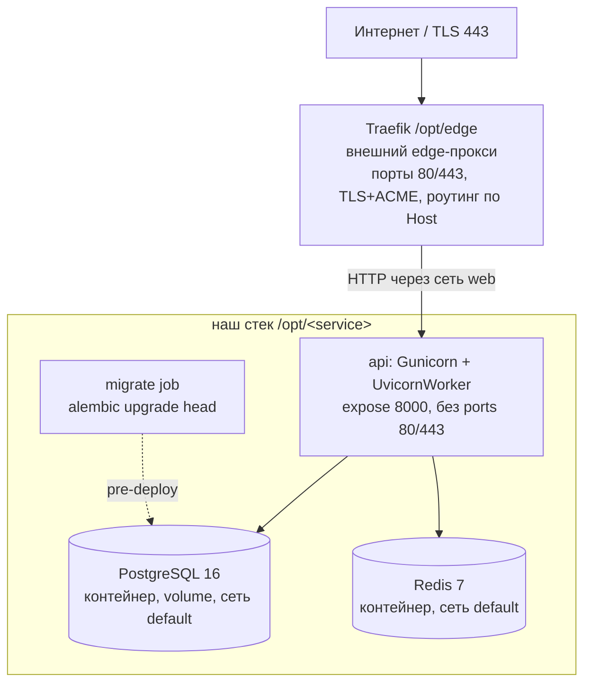

# 07 — Deployment

## Артефакт
Один Docker-образ (multi-stage, base `python:3.12-slim`), запускается через Gunicorn + UvicornWorker. Stateless — состояние в PostgreSQL/Redis. Образ **собирается на сервере** из исходников в `/opt/<service>` (`docker compose up -d --build`), не пушится из registry ([ADR-017](adr/ADR-017-shared-server-traefik-deploy.md)).

## Топология MVP — общий сервер за внешним Traefik
Deploy-target зафиксирован ([ADR-017](adr/ADR-017-shared-server-traefik-deploy.md), решение владельца инфраструктуры 2026-06-02, ревизует [TD-005](100-known-tech-debt.md)): сервис размещается на **общем Linux-сервере** (Ubuntu 22.04, `87.239.135.154`, root), где уже работают другие сервисы (`music-backend`) и **общий edge-прокси Traefik** в `/opt/edge`. Наш сервис — каталог `/opt/<service>` (например `/opt/claude-ios`), встраивается в Traefik через docker-labels и внешнюю сеть `web`.



Состав нашего `docker compose`-стека в `/opt/<service>` (Traefik — **вне** нашего стека):
- **Traefik** — НЕ наш контейнер. Общий edge-прокси владельца сервера (`/opt/edge`): держит порты 80/443, терминирует TLS, авто-выпускает Let's Encrypt-сертификаты, роутит по доменам. Наш стек **не содержит** reverse-proxy и **не управляет** TLS/ACME.
- **api** — Docker-образ приложения (Gunicorn + UvicornWorker). `expose: 8000` (uvicorn/gunicorn), **без** `ports:` для 80/443 (конфликт с Traefik запрещён). Подключён к двум сетям: `web` (`external: true`, общая с Traefik) и `default` (внутренняя для PG/Redis). Снаружи доступен **только** через Traefik по сети `web`.
- **postgres** — PostgreSQL 16 в контейнере с persistent volume. **Только** в сети `default`, **без публикации портов** (бэкап — `pg_dump` по cron на хосте + offsite-копия).
- **redis** — Redis 7 в контейнере (rate limit, idempotency, policy cache). **Только** в сети `default`, **без публикации портов**.
- **migrate** — одноразовый job (`alembic upgrade head`), запускается до старта `api` при каждом релизе.
- Single-region, single-host (общий с другими сервисами). Состояние — в volume PostgreSQL + Redis; образ `api` — stateless.

> **Жёсткие требования к нашему `docker-compose` (от владельца сервера, [ADR-017](adr/ADR-017-shared-server-traefik-deploy.md)):**
> 1. НЕ публиковать порты 80/443 (никаких `ports: 80/443`) — иначе конфликт с Traefik. Только `expose` внутреннего `8000`.
> 2. `api` — в сети `web` (`external: true`, общая с Traefik) + `default` (внутренняя для PG/Redis).
> 3. Маршрут — через docker-labels (Traefik подхватит, см. ниже).
> 4. SSL/nginx/Caddy НЕ настраивать — TLS целиком Traefik. `postgres`/`redis` — только в `default`, без публикации портов.
> 5. Внешняя сеть `web` создаётся на сервере однократно: `docker network create web` (уже создана).
> 6. `DOCKER_MIN_API_VERSION=1.24` уже задан на сервере — не трогать.

> **PostgreSQL/Redis: контейнерные vs managed.** На MVP — контейнерные в том же стеке (минимум инфраструктуры). При росте нагрузки — вынос на managed без изменения контрактов приложения (`DATABASE_URL`/`REDIS_URL`). Бэкап контейнерного PG (`pg_dump` + offsite) **обязателен** до приёма реальных пользователей — см. prod-checklist.

### Маршрутизация через Traefik docker-labels
Traefik обнаруживает наш `api` через labels на сервисе `api` в `docker-compose`. Значения зафиксированы: `SERVICE_DOMAIN=broadnova.shop` ([Q-017-1](99-open-questions.md)), `TRAEFIK_CERTRESOLVER=le` ([Q-017-2](99-open-questions.md)):
```
traefik.enable=true
traefik.docker.network=web
traefik.http.routers.<service>.rule=Host(`${SERVICE_DOMAIN}`)
traefik.http.routers.<service>.entrypoints=websecure
traefik.http.routers.<service>.tls.certresolver=${TRAEFIK_CERTRESOLVER}   # опционален: le — default на websecure
traefik.http.services.<service>.loadbalancer.server.port=8000
```
- `${SERVICE_DOMAIN}` — домен сервиса = `broadnova.shop` ([Q-017-1](99-open-questions.md)); A-запись `broadnova.shop` → `87.239.135.154` **обязана существовать до запуска** (ACME-challenge Traefik).
- `${TRAEFIK_CERTRESOLVER}` — имя ACME-certresolver общего Traefik = `le` (`/opt/edge`, [Q-017-2](99-open-questions.md)). Владелец сервера сделал `le` **дефолтным** на entrypoint `websecure` (`--entrypoints.websecure.http.tls.certresolver=le`), поэтому этот label **опционален** — сертификат выпустится автоматически для любого HTTPS-роутера. Явный label `tls.certresolver=le` **рекомендован для надёжности** (детерминированность при изменении дефолта).
- `loadbalancer.server.port=8000` — Traefik проксирует на внутренний `8000` контейнера `api` по сети `web`.

### Биндинг и доступ
- `api` **не** публикует 80/443; снаружи доступен только через Traefik (сеть `web`). Прямой доступ из интернета к `api`/`postgres`/`redis` закрыт отсутствием публикации портов + изоляцией сетей.
- `TRUSTED_PROXY_IPS` в prod **обязан** содержать адрес/подсеть **Traefik** (docker-сеть `web`). Traefik проставляет `X-Forwarded-For`; без доверия к нему per-IP rate limit видит IP Traefik, а не клиента. См. [05-security.md](05-security.md#доверенный-reverse-proxy-и-определение-client-ip-anti-spoofing) и [§Конфигурация](#конфигурация-env).

## Reverse-proxy / LB — операционные требования к `/v1/preview/*`
Приложение отдаёт пользовательский (Claude-сгенерированный) HTML/JS на `GET /v1/preview/{projectId}/{token}/{path}` со **своими** sandbox-заголовками (ADR-010, [05-security.md](05-security.md#backend-hosted-preview-отдача-пользовательского-htmljs-adr-010)): `Content-Security-Policy: sandbox ...`, `X-Content-Type-Options: nosniff`, `X-Frame-Options: SAMEORIGIN`, `Cache-Control: private, no-store`, без cookies. Этот путь **исключён** из дефолтных security-заголовков middleware, чтобы отдать собственную политику.

Reverse-proxy / LB (в нашей схеме — **внешний Traefik**) **ОБЯЗАН** на `/v1/preview/*`:
- **не перетирать и не дублировать** заголовки ответа (`Content-Security-Policy`, `X-Frame-Options`, `X-Content-Type-Options`, `Cache-Control`) — pass-through as-is. Не навешивать глобальный `X-Frame-Options: DENY` / общий CSP, применяемый к остальным путям.
- **не добавлять `Set-Cookie`** и не инжектить session/affinity-cookies на этот префикс (превью открывается прямой ссылкой, авторизация — в signed URL, не в cookie).
- глобальные политики безопасности прокси для прочих путей (HSTS, `X-Frame-Options: DENY`) применять **в обход** `/v1/preview/*` (отдельный route/middleware без переопределения заголовков приложения).

> **Операционное требование к владельцу Traefik ([ADR-017](adr/ADR-017-shared-server-traefik-deploy.md)).** Reverse-proxy теперь — общий **внешний** Traefik (`/opt/edge`), вне нашего репозитория. Контракт pass-through выше — требование к его конфигурации Host-роутера нашего домена: не навешивать на `/v1/preview/*` глобальные header-/cookie-middleware Traefik, которые перетрут sandbox-заголовки приложения (ADR-010). По умолчанию Traefik **не** модифицирует заголовки ответа без явных middleware — требование сводится к «не добавлять header/cookie-middleware на роутер нашего домена для `/v1/preview/*`».

Прежние Caddy/nginx-артефакты (legacy, DEPRECATED: [`infra/legacy/Caddyfile`](../infra/legacy/Caddyfile), [`infra/legacy/nginx.conf.example`](../infra/legacy/nginx.conf.example)) в этой схеме **не используются** (TLS/reverse-proxy — внешний Traefik) — перенесены в `infra/legacy/` с DEPRECATED-баннером. См. [§Prod-артефакты](#prod-артефакты-источник-истины--реальные-файлы-в-репозитории).

**Изоляция origin (операционно, [Q-010-3](99-open-questions.md), не блокер):** старт — single-origin `/v1/preview/*` + sandbox-заголовки (самодостаточно). Prod-рекомендация — вынести превью на отдельный поддомен `preview.<domain>`, чтобы даже при обходе CSP пользовательский JS не имел same-origin доступа к API. При вводе поддомена то же требование pass-through заголовков и запрет cookies сохраняется.

## Конфигурация (env)
| Переменная | Назначение |
|---|---|
| `DATABASE_URL` | `postgresql+asyncpg://...` |
| `REDIS_URL` | `redis://...` |
| `ANTHROPIC_API_KEY` | сервисный ключ Claude (mode=credits) |
| `ANTHROPIC_MODEL` | дефолтная модель |
| `JWT_JWKS_URL` (или `JWT_PUBLIC_KEY`) / `JWT_ISSUER` / `JWT_AUDIENCE` | проверка JWT (RS256). Auth работает на любом валидном RS256-источнике. **Реальный issuer (свой auth / Apple Sign-In / Firebase) — must-configure-before-launch ([Q-005-1](99-open-questions.md)).** |
| `KMS_LOCAL_MASTER_KEY` | мастер-ключ для envelope encryption BYOK на MVP (`LocalKmsClient`, реальный AES-256-GCM wrap DEK, [ADR-003](adr/ADR-003-byok-envelope-encryption.md)). Высокоэнтропийный (32 байта base64), **только через secret manager/env на сервере** (`.env` в `/opt/<service>`), под redaction. Миграция на облачный KMS — post-MVP ([Q-002-1](99-open-questions.md)). |
| `APPSTORE_*` | App Store Server API credentials (`APPSTORE_ENVIRONMENT`/`APPSTORE_BUNDLE_ID`/`APPSTORE_ROOT_CERT_DIR`) |
| `STOREKIT_TEST_MODE` | env-флаг тестовой верификации StoreKit. Дефолт `false` (**prod fail-closed, реальная JWS-верификация**). `true` — принимает HS256-тестовую транзакцию (только e2e/CI). При `true` — WARNING в лог на старте. См. [09-e2e-testing.md §2](09-e2e-testing.md#2-storekit_test_mode--env-gated-режим-тестовой-верификации), [TD-007](100-known-tech-debt.md). |
| `STOREKIT_TEST_SECRET` | общий секрет (HS256) для тестовых транзакций. Обязателен при `STOREKIT_TEST_MODE=true` (пусто → test-mode не активируется). Секрет, под redaction. **В prod не задаётся.** |
| `SUBSCRIPTION_CREDITS_PER_PERIOD` | кредитов на период подписки (grant), дефолт `1000` (ADR-006) |
| `ADMIN_API_SECRET` | изолированный admin-секрет для `X-Admin-Token` (`/v1/admin/*`). Высокоэнтропийный, secret manager. Под redaction. Не задан → admin-API недоступен (всегда `401`). См. [ADR-009](adr/ADR-009-admin-token-auth.md). |
| `ADMIN_API_SECRET_PREV` | предыдущий admin-секрет на grace-период ротации (опц.). Пусто вне ротации. Под redaction. |
| `ADMIN_RATE_LIMIT_PER_MIN` | rate limit `/v1/admin/*` per source IP, дефолт `10`. |
| `PREVIEW_URL_SECRET` | секрет HMAC для preview signed URL (`/v1/preview/*`). Высокоэнтропийный, secret manager, отдельный от прочих. Под redaction. См. [ADR-010](adr/ADR-010-backend-hosted-preview.md). |
| `PREVIEW_URL_TTL_SECONDS` | TTL preview signed URL, дефолт `900` (15 мин). |
| `PREVIEW_MAX_FILE_BYTES` | лимит размера одного файла сайта, дефолт `1048576` (1 MB). |
| `PREVIEW_MAX_PROJECT_BYTES` | лимит суммарного размера проекта, дефолт `10485760` (10 MB). |
| `PREVIEW_MAX_FILES` | лимит числа файлов в проекте, дефолт `200`. |
| `MAX_SERVER_TOOL_ROUNDS` | guard числа последовательных server-side (`site.*`) tool-раундов на message-шаг, дефолт `16` ([ADR-011](adr/ADR-011-server-side-tools.md)). |
| `TOKEN_PRODUCTS` | маппинг consumable-продуктов `productId→credits` (JSON), напр. `{"tokens_1500":1500,"tokens_600":600,"tokens_250":250,"tokens_100":100}`. Источник числа кредитов на покупку токенов (server-side, [ADR-015](adr/ADR-015-consumable-token-iap.md)). |
| `BYOK_DEFAULT_MODEL` | активная модель, возвращаемая в BYOK-ответе при `keyStatus=valid` (`activeModel`), напр. `claude-sonnet-4-6` ([ADR-016](adr/ADR-016-extended-byok-statuses.md)). |
| `ATTACHMENT_MAX_IMAGE_BYTES` | лимит размера image-вложения, дефолт `5242880` (5 MB) ([ADR-014](adr/ADR-014-multimodal-attachments.md)). |
| `ATTACHMENT_MAX_DOCUMENT_BYTES` | лимит размера document-вложения, дефолт `10485760` (10 MB). |
| `ATTACHMENT_MAX_PER_MESSAGE` | макс. число вложений на сообщение, дефолт `10`. |
| `ATTACHMENT_EXTRACT_MAX_CHARS` | лимит символов извлечённого текста document-вложения, дефолт `200000`. |
| `ATTACHMENT_ORPHAN_TTL` | TTL неиспользованных (orphan) вложений до очистки, дефолт `86400` (24h). Очистка — [TD-010](100-known-tech-debt.md) (без джоба на старте). |
| `WORKSPACE_CONTEXT_MAX_CHARS` | лимит суммарного контекста workspace-файлов, инжектируемого в prompt, дефолт `200000` ([ADR-013](adr/ADR-013-workspace-projects-vs-website-builder.md), [Q-013-1](99-open-questions.md)). |
| `CHAT_TITLE_MAX_CHARS` | макс. длина автогенерируемого заголовка чата, дефолт `60` (модуль chats). |
| `APNS_*` | credentials APNs для отправки push (`APNS_KEY_ID`/`APNS_TEAM_ID`/`APNS_AUTH_KEY`/`APNS_TOPIC`). **Не задаются в этом проходе** — отправка push отложена ([TD-011](100-known-tech-debt.md)). |
| `RATE_LIMIT_*` | значения rate limits |
| `SIZE_LIMIT_*` | size-лимиты payload |
| `TRUSTED_PROXY_IPS` | comma-separated список IP/CIDR доверенных reverse-proxy/LB. Дефолт `""` → XFF/X-Real-IP не доверяются, используется socket peer IP. **В prod ОБЯЗАН** содержать адрес/подсеть **внешнего Traefik** — подсеть docker-сети `web` (через неё Traefik проксирует на `api`). Иначе `client_ip` берётся как IP Traefik, и per-IP rate limit неработоспособен ([ADR-017](adr/ADR-017-shared-server-traefik-deploy.md), [05-security.md](05-security.md#доверенный-reverse-proxy-и-определение-client-ip-anti-spoofing)). Подсеть `web` — `docker network inspect web` (поле `IPAM.Config.Subnet`) на сервере; для bridge-сети по умолчанию вида `172.x.0.0/16`. |
| `TRUSTED_PROXY_HOP_COUNT` | число доверенных proxy-хопов перед приложением (chained LB/CDN). Дефолт `1`. Client IP берётся `(hop_count + 1)`-м справа из `X-Forwarded-For`. |
| `DB_POOL_SIZE` | размер пула соединений БД на процесс. Дефолт `10`. |
| `DB_MAX_OVERFLOW` | доп. соединения сверх `DB_POOL_SIZE` под пик. Дефолт `5`. |
| `DB_POOL_TIMEOUT` | таймаут ожидания соединения из пула, сек. Дефолт `30`. |
| `DB_POOL_RECYCLE` | принудительный recycle соединения, сек (борьба с idle-timeout на стороне PG/proxy). Дефолт `1800`. |
| `METRICS_SCRAPE_TOKEN` | если задан — `GET /metrics` требует заголовок `X-Scrape-Token` с этим значением (иначе 403). Пусто → endpoint открыт, защищать сетевой политикой. |
| `SERVICE_DOMAIN` | домен сервиса для Traefik Host-роутера (label `Host(`broadnova.shop`)`) и ACME-сертификата. **Значение: `broadnova.shop`** ([Q-017-1](99-open-questions.md)); A-запись `broadnova.shop` → `87.239.135.154` до запуска. TLS/ACME выпускает внешний Traefik, не приложение ([ADR-017](adr/ADR-017-shared-server-traefik-deploy.md)). |
| `TRAEFIK_CERTRESOLVER` | имя ACME-certresolver общего Traefik для label `tls.certresolver`. **Значение: `le`** (`/opt/edge`, [Q-017-2](99-open-questions.md)). `le` — **default на entrypoint `websecure`**, поэтому label опционален (сертификат выпускается автоматически), но явное указание рекомендовано для надёжности. TLS/ACME выпускает внешний Traefik, не приложение ([ADR-017](adr/ADR-017-shared-server-traefik-deploy.md)). |
| `OTEL_EXPORTER_OTLP_ENDPOINT` | трейсы |
| `LOG_LEVEL` | уровень логирования |
| `DOCS_ENABLED` | вкл/выкл OpenAPI-документацию (`/docs`, `/redoc`, `/openapi.json`). Дефолт `true` (dev/CI/staging). В prod рекомендуется `false` — не раскрывать схему API публично; при `false` эти пути отдают `404`. См. [08-api-documentation.md](08-api-documentation.md#r7-доступность-docs-в-prod-env-флаг). |

Все секреты — из secret manager, не из plaintext `.env` в prod.

### Sizing пула соединений БД
Эффективное число коннектов к PostgreSQL: `(DB_POOL_SIZE + DB_MAX_OVERFLOW) * workers * replicas`.
Это значение **обязано** оставаться ниже `max_connections` PostgreSQL (с запасом на служебные/админ-сессии).

Пример для MVP (один контейнер `api`, Gunicorn `-w 4`, 1 реплика, дефолты пула):
`(10 + 5) * 4 * 1 = 60` коннектов. Контейнерный PostgreSQL по умолчанию `max_connections = 100` — запас достаточный. При увеличении воркеров/реплик пересчитать:
- Формула: `(DB_POOL_SIZE + DB_MAX_OVERFLOW) * workers * replicas < Postgres max_connections` (с запасом на админ-/служебные сессии).
- Либо снизить `DB_POOL_SIZE`/`workers`, либо поднять `max_connections` PostgreSQL, либо вынести пуллинг на PgBouncer (transaction mode).
- `DB_MAX_OVERFLOW` — буфер под кратковременные пики, не постоянная ёмкость; держать малым.
Калибровать под фактический `max_connections` инстанса до prod-выката (см. prod-checklist).

## Локальный подъём и e2e-override
Локальный/single-host стек — `docker-compose.yml` (postgres + redis + migrate + api). Базовый compose публикует `postgres`/`redis` на `127.0.0.1:5432`/`6379`.

Для e2e/локального прогона на хостах, где порты 5432/6379 уже заняты нативными сервисами, есть отдельный override `docker-compose.e2e.yml`:

```
docker compose -f docker-compose.yml -f docker-compose.e2e.yml up -d
```

- `docker-compose.e2e.yml` снимает публикацию хост-портов `postgres`/`redis` (`ports: !reset []`); `api`/`migrate` ходят к ним по имени сервиса во внутренней сети — хост-порты им не нужны. `api` сохраняет `127.0.0.1:8000`.
- Override — отдельный e2e-артефакт, **семантику base `docker-compose.yml` не меняет**.
- **Минимальная версия Docker Compose: v2.24+** (синтаксис `!reset []`). Процедура e2e-прогона — [09-e2e-testing.md §3.3](09-e2e-testing.md#33-процедура-подъёма-bring-up).

## Prod-артефакты (источник истины — реальные файлы в репозитории)
Devops заводит/обновляет артефакты под топологию shared-server + Traefik ([ADR-017](adr/ADR-017-shared-server-traefik-deploy.md)). Документация ниже **обязана** совпадать с этими файлами — при расхождении правится та сторона, что отстала.

| Файл | Назначение |
|---|---|
| [`docker-compose.prod.yml`](../docker-compose.prod.yml) | Prod-стек под Traefik: `api` (Gunicorn+Uvicorn, **`expose: 8000`, без `ports:` 80/443**, в сетях `web` external + `default`, Traefik-labels) + `postgres` 16 (volume, **только** `default`, без портов) + `redis` 7 (**только** `default`, без портов) + одноразовый `migrate`-job. Образ `api`/`migrate` собирается **на сервере** (`build:`), не из registry. Секреты — из `.env`. **Нет** reverse-proxy/Caddy-сервиса (TLS — внешний Traefik). |
| [`.env.prod.example`](../.env.prod.example) | Шаблон prod-конфигурации/секретов (копируется в `.env` в `/opt/<service>` на сервере, заполняется из secret manager). Должен включать `SERVICE_DOMAIN=broadnova.shop` ([Q-017-1](99-open-questions.md)), `TRAEFIK_CERTRESOLVER=le` ([Q-017-2](99-open-questions.md)) и `TRUSTED_PROXY_IPS` = подсеть docker-сети `web`. Перечень переменных — [§Конфигурация (env)](#конфигурация-env), [prod-checklist](#prod-readiness-checklist-must-configure-before-launch). В образ не попадает. |
| [`.github/workflows/deploy.yml`](../.github/workflows/deploy.yml) | GitHub Actions workflow: SSH на сервер (`SSH_HOST`/`SSH_USER`/`SSH_PRIVATE_KEY` из GitHub Secrets) → `cd /opt/<service> && git pull && docker compose up -d --build`. См. [§Процедура деплоя](#процедура-деплоя-github-actions--ssh). |
| [`docker-compose.prod.observability.yml`](../docker-compose.prod.observability.yml) | Опциональный overlay наблюдаемости (Prometheus scrape `/metrics` и т.п.) поверх prod-стека. Подключается через `-f docker-compose.prod.yml -f docker-compose.prod.observability.yml`. Конфиги — [`infra/observability/`](../infra/observability/). См. [§Наблюдаемость в проде](#наблюдаемость-в-проде). |

> **Legacy-артефакты (DEPRECATED, НЕ используются в схеме shared-server + Traefik, [ADR-017](adr/ADR-017-shared-server-traefik-deploy.md)).** Reverse-proxy и TLS — ответственность внешнего Traefik, не наша. Следующие файлы — наследие прежней VPS+Caddy-схемы ([TD-005](100-known-tech-debt.md)); перенесены в `infra/legacy/` с DEPRECATED-баннером и в текущей топологии **не подключаются** (не актуальная схема):
> - [`infra/legacy/Caddyfile`](../infra/legacy/Caddyfile) — наш Caddy не используется (TLS/ACME у Traefik). DEPRECATED.
> - [`infra/legacy/nginx.conf.example`](../infra/legacy/nginx.conf.example) — наш nginx не используется. DEPRECATED.
> - [`infra/legacy/deploy-vps.sh`](../infra/legacy/deploy-vps.sh) — VPS/SSH-специализация под registry+immutable-tag; заменена GitHub Actions SSH workflow (`git pull && compose up -d --build`). DEPRECATED.

## Процедура деплоя (GitHub Actions → SSH)
Деплой на общий сервер ([ADR-017](adr/ADR-017-shared-server-traefik-deploy.md)). Образ **собирается на сервере** из исходников (нет registry/immutable-tag). Выкатка — GitHub Actions workflow по SSH:

```
# GitHub Actions step (по SSH на сервер):
ssh $SSH_USER@$SSH_HOST '
  cd /opt/<service> &&
  git pull &&
  docker compose run --rm migrate &&
  docker compose up -d --build
'
```

GitHub Secrets (обязательны для workflow): `SSH_HOST=87.239.135.154`, `SSH_USER=root`, `SSH_PRIVATE_KEY` (приватный ключ для SSH; публичный — в `~/.ssh/authorized_keys` на сервере).

Что делает workflow по шагам:

1. **SSH на сервер**, `cd /opt/<service>` (каталог стека: `docker-compose.prod.yml` + `.env` со ссылками на secret manager; сеть `web` уже создана).
2. **`git pull`** — подтянуть актуальный код в `/opt/<service>`.
3. **Миграции:** `docker compose run --rm migrate` (= `alembic upgrade head`, цепочка `0001`→`0004`) — до старта нового `api`. Миграции expand/contract (backward-compatible), старый `api` продолжает работать на время накатки.
4. **Сборка/перезапуск:** `docker compose up -d --build` — пересобирает образ `api`/`migrate` на сервере и поднимает новый `api`. Traefik (внешний) подхватывает обновлённый контейнер по labels/сети `web` без даунтайма edge-прокси.
5. **Smoke-/health-gate:** `GET /healthz` (алиас `/health`, liveness) и `GET /ready` (db+redis). Через публичный домен (`https://broadnova.shop/healthz`) или через сеть `web`/loopback контейнера → ожидается `200`; для `/ready` — `db=ok`,`redis=ok`.
6. **Rollback при провале:** `git checkout <prev-commit>` в `/opt/<service>` + `docker compose up -d --build` (откат на предыдущий рабочий коммит и пересборка). Схема не откатывается (expand/contract позволяет старому коду работать с новой схемой). См. [§Откат](#откат).

## Миграции
- Alembic. `uv run alembic upgrade head` в `migrate`-job (`docker compose run --rm migrate`) до старта `api`.
- `migrations/env.py` берёт `sqlalchemy.url` из переданного Alembic `context.config` с fallback на `get_settings().database_url` ([TD-008](100-known-tech-debt.md), закрыт).
- Деплой: backward-compatible миграции (expand/contract), безопасны при последовательной замене контейнера `api`.
- На MVP применить цепочку **`0001`→`0002`→`0003`→`0004`** (см. prod-checklist).

## CI/CD (gate)
Pipeline (см. [06-testing-strategy.md](06-testing-strategy.md)):
1. `uv sync`
2. `uv run ruff format --check .`
3. `uv run ruff check .`
4. `uv run mypy src`
5. `uv run pytest --cov=src --cov-fail-under=80`
6. deploy: GitHub Actions SSH на сервер ([ADR-017](adr/ADR-017-shared-server-traefik-deploy.md)) — `cd /opt/<service> && git pull && docker compose run --rm migrate && docker compose up -d --build` (образ собирается **на сервере**; см. [§Процедура деплоя](#процедура-деплоя-github-actions--ssh))
7. smoke-test `/healthz` (+ `/ready`) через публичный домен

GitHub Secrets для деплоя: `SSH_HOST`, `SSH_USER`, `SSH_PRIVATE_KEY`. Любой fail на шагах 2–5 блокирует merge/deploy.

## Health / readiness
- `GET /health` — liveness (процесс жив).
- `GET /healthz` — **алиас `/health`**, `200`, публичный, без auth. Для healthcheck Traefik и smoke-проверки ([ADR-017](adr/ADR-017-shared-server-traefik-deploy.md)). Контракт — [API-REFERENCE.md](API-REFERENCE.md#служебные-эндпоинты) и [api-gateway/02-api-contracts.md](modules/api-gateway/02-api-contracts.md).
- `GET /ready` — readiness (БД и Redis доступны).
- `GET /metrics` — Prometheus exposition (защищён сетевой политикой / scrape-токеном).

## Откат
- Образ собирается на сервере из исходников (нет immutable registry-tag, [ADR-017](adr/ADR-017-shared-server-traefik-deploy.md)). Rollback = `git checkout <prev-commit>` в `/opt/<service>` + `docker compose up -d --build` (откат на предыдущий рабочий коммит и пересборка).
- Миграции expand/contract позволяют откатить код без отката схемы.

## Prod-readiness checklist (must-configure-before-launch)
Чек-лист, который **обязан** быть выполнен перед приёмом реальных пользователей (публичный запуск). Часть пунктов не блокирует подготовку инфры/staging, но блокирует публичный релиз.

**Конфигурация / режимы:**
- [ ] `DOCS_ENABLED=false` — скрыть Swagger/OpenAPI в prod ([08-api-documentation.md](08-api-documentation.md#r7-доступность-docs-в-prod-env-флаг)).
- [ ] **`JWT issuer/JWKS реальный`** — настроен реальный RS256-источник (свой auth / Apple Sign-In / Firebase) через `JWT_JWKS_URL` (или `JWT_PUBLIC_KEY`) + `JWT_ISSUER`/`JWT_AUDIENCE`. **Блокер публичного запуска ([Q-005-1](99-open-questions.md)).** Auth работает на staging на любом валидном RS256-источнике, но реальный issuer обязателен до приёма реальных пользователей.
- [ ] **`STOREKIT_TEST_MODE=false`** + Apple root CA, реальный `APPSTORE_BUNDLE_ID`, заведённые IAP-продукты (подписка + consumable token-продукты). **Блокер публичного запуска ([Q-007-1](99-open-questions.md), [TD-007](100-known-tech-debt.md)).** На MVP/staging — sandbox/test-mode.
- [ ] `TRUSTED_PROXY_IPS` = подсеть **внешнего Traefik** (docker-сеть `web`, `docker network inspect web` → `IPAM.Config.Subnet`). Иначе `client_ip` = IP Traefik, per-IP rate limit неработоспособен ([ADR-017](adr/ADR-017-shared-server-traefik-deploy.md), [05-security.md](05-security.md#доверенный-reverse-proxy-и-определение-client-ip-anti-spoofing)).
- [ ] DB pool sizing проверен: `(DB_POOL_SIZE + DB_MAX_OVERFLOW) * workers * replicas < Postgres max_connections` (см. [§Sizing пула](#sizing-пула-соединений-бд)).

**Топология / Traefik ([ADR-017](adr/ADR-017-shared-server-traefik-deploy.md)):**
- [ ] **A-запись `broadnova.shop` → `87.239.135.154`** существует **до** запуска (нужна для ACME-challenge Traefik; [Q-017-1](99-open-questions.md)). `SERVICE_DOMAIN=broadnova.shop` в `.env` заполнен.
- [ ] **`TRAEFIK_CERTRESOLVER=le`** заполнен в `.env` ([Q-017-2](99-open-questions.md)). `le` — default на entrypoint `websecure` общего Traefik, поэтому label `tls.certresolver` опционален (рекомендован явно для надёжности).
- [ ] `.env` в `/opt/<service>` заполнен (`SERVICE_DOMAIN=broadnova.shop`, `TRAEFIK_CERTRESOLVER=le`, секреты, `TRUSTED_PROXY_IPS`).
- [ ] Traefik-labels на `api` (`traefik.enable=true`, `Host(${SERVICE_DOMAIN})` = `broadnova.shop`, `entrypoints=websecure`, `tls.certresolver=${TRAEFIK_CERTRESOLVER}` = `le` (опционален — default на `websecure`), `loadbalancer.server.port=8000`) + сеть `web` (`external: true`) подключена; внешняя сеть `web` создана на сервере (`docker network create web`).
- [ ] **НЕ публикуются порты 80/443** в нашем `docker-compose` (конфликт с Traefik); `api` — только `expose: 8000`; `postgres`/`redis` — без публикации портов, только сеть `default`.
- [ ] `GET /healthz` → `200` через публичный домен (`https://broadnova.shop/healthz`) — Traefik роутит, TLS выпущен.
- [ ] GitHub Secrets заведены: `SSH_HOST=87.239.135.154`, `SSH_USER=root`, `SSH_PRIVATE_KEY`.

**Секреты (только через secret manager / `.env` в `/opt/<service>` на сервере, не в образе):**
- [ ] `ANTHROPIC_API_KEY` — реальный, **с положительным балансом** (готов).
- [ ] `KMS_LOCAL_MASTER_KEY` — высокоэнтропийный master key (`LocalKmsClient`, [ADR-003](adr/ADR-003-byok-envelope-encryption.md)). Облачный KMS — post-MVP ([Q-002-1](99-open-questions.md)).
- [ ] `ADMIN_API_SECRET` — высокоэнтропийный ([ADR-009](adr/ADR-009-admin-token-auth.md)).
- [ ] `PREVIEW_URL_SECRET` — высокоэнтропийный, отдельный ([ADR-010](adr/ADR-010-backend-hosted-preview.md)).
- [ ] `METRICS_SCRAPE_TOKEN` — задан (иначе `/metrics` защищать только сетевой политикой).
- [ ] DB/Redis credentials (`DATABASE_URL`/`REDIS_URL`) — через secret manager.
- [ ] `TOKEN_PRODUCTS` — маппинг consumable-продуктов `productId→credits` соответствует заведённым в App Store Connect IAP ([ADR-015](adr/ADR-015-consumable-token-iap.md)).

**Данные / инфра:**
- [ ] Миграции **`0001`→`0002`→`0003`→`0004`** применены (`docker compose run --rm migrate`).
- [ ] Бэкап контейнерного PostgreSQL настроен (`pg_dump` по cron + offsite-копия).
- [ ] Внешний Traefik выпустил валидный TLS-сертификат для `broadnova.shop`; `api` не доступен из интернета напрямую (нет публикации портов, доступ только через Traefik по сети `web`).
- [ ] Smoke: `/healthz`, `/ready` (db=ok, redis=ok) зелёные через публичный домен.

> Пункты с пометкой **«блокер публичного запуска»** ([Q-005-1](99-open-questions.md) JWT issuer, [Q-007-1](99-open-questions.md) StoreKit prod) — отложенные решения пользователя. Они **не** блокируют подготовку инфры и staging-прогон (auth и StoreKit работают в test-режиме), но **обязаны** быть закрыты до приёма реальных пользователей.

## Наблюдаемость в проде
- Метрики из [01-architecture.md](01-architecture.md#наблюдаемость) → Prometheus + дашборды.
- Логи → централизованный лог-стор (JSON), correlation id.
- Алерты (стартовый набор): `http_responses_total{status="429"}` всплеск (транспортный rate-limit, gateway-concern — rate_limited не учитывается в `blocked_requests_total`, BLK-7b); `wallet_debit_total{result=fail}` > 0 устойчиво; `chat_run_latency_seconds` p95 деградация; недоступность Anthropic/Apple/KMS.
