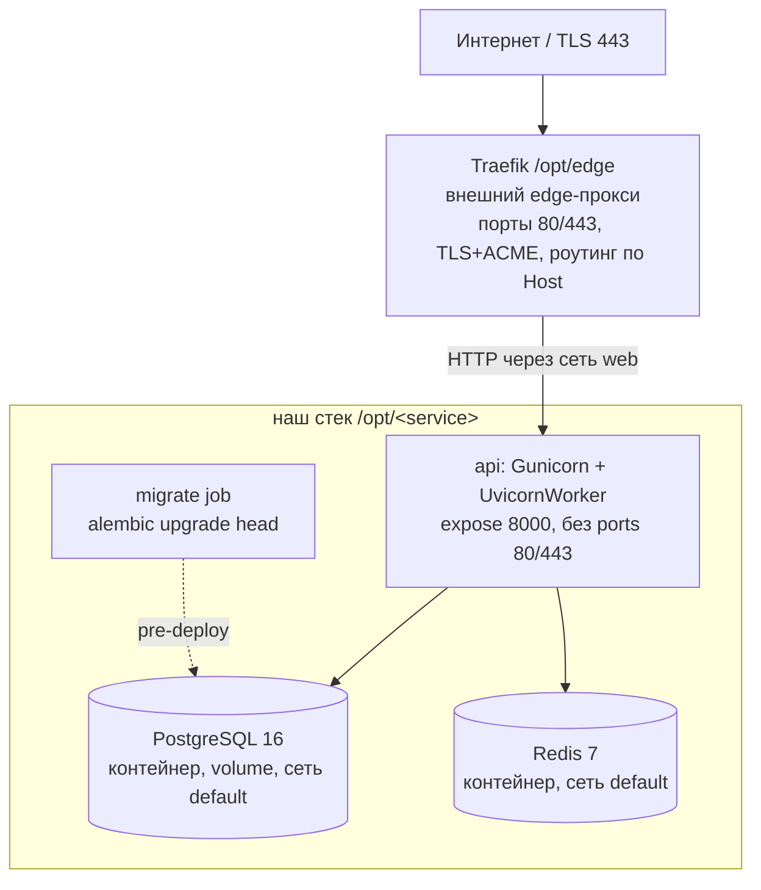

# 07 — Deployment

## Артефакт
Один Docker-образ (multi-stage, base `python:3.12-slim`), запускается через Gunicorn + UvicornWorker. Stateless — состояние в PostgreSQL/Redis. Образ **собирается на сервере** из исходников в `/opt/<service>` (явный `docker compose build api migrate`, затем `up -d --no-build` — см. [§Процедура деплоя](#процедура-деплоя-github-actions--ssh)), не пушится из registry ([ADR-017](adr/ADR-017-shared-server-traefik-deploy.md)).

## Топология MVP — общий сервер за внешним Traefik
Deploy-target зафиксирован ([ADR-017](adr/ADR-017-shared-server-traefik-deploy.md), решение владельца инфраструктуры 2026-06-02, ревизует [TD-005](100-known-tech-debt.md)): сервис размещается на **общем Linux-сервере** (Ubuntu 22.04, `87.239.135.154`, root), где уже работают другие сервисы (`music-backend`) и **общий edge-прокси Traefik** в `/opt/edge`. Наш сервис — каталог `/opt/<service>` (например `/opt/claude-ios`), встраивается в Traefik через docker-labels и внешнюю сеть `web`.


```mermaid
graph TD
    Internet[Интернет / TLS 443] --> Traefik[Traefik /opt/edge<br/>внешний edge-прокси<br/>порты 80/443, TLS+ACME, роутинг по Host]
    Traefik -->|HTTP через сеть web| API[api: Gunicorn + UvicornWorker<br/>expose 8000, без ports 80/443]
    API --> PG[(PostgreSQL 16<br/>контейнер, volume, сеть default)]
    API --> Redis[(Redis 7<br/>контейнер, сеть default)]
    Migrate[migrate job<br/>alembic upgrade head] -.pre-deploy.-> PG
    subgraph stack["наш стек /opt/&lt;service&gt;"]
        API
        PG
        Redis
        Migrate
    end
```

Состав нашего `docker compose`-стека в `/opt/<service>` (Traefik — **вне** нашего стека):
- **Traefik** — НЕ наш контейнер. Общий edge-прокси владельца сервера (`/opt/edge`): держит порты 80/443, терминирует TLS, авто-выпускает Let's Encrypt-сертификаты, роутит по доменам. Наш стек **не содержит** reverse-proxy и **не управляет** TLS/ACME.
- **api** — Docker-образ приложения (Gunicorn + UvicornWorker). `expose: 8000` (uvicorn/gunicorn), **без** `ports:` для 80/443 (конфликт с Traefik запрещён). Подключён к двум сетям: `web` (`external: true`, общая с Traefik) и `default` (внутренняя для PG/Redis). Снаружи доступен **только** через Traefik по сети `web`.
- **postgres** — PostgreSQL 16 в контейнере с persistent volume. **Только** в сети `default`, **без публикации портов** (бэкап — `pg_dump` по cron на хосте + offsite-копия).
- **redis** — Redis 7 в контейнере (rate limit, idempotency, policy cache). **Только** в сети `default`, **без публикации портов**.
- **migrate** — одноразовый job (`alembic upgrade head`), запускается до старта `api` при каждом релизе.
- Single-region, single-host (общий с другими сервисами). Состояние — в volume PostgreSQL + Redis; образ `api` — stateless.

> **Жёсткие требования к нашему `docker-compose` (от владельца сервера, [ADR-017](adr/ADR-017-shared-server-traefik-deploy.md)):**
> 1. НЕ публиковать порты 80/443 (никаких `ports: 80/443`) — иначе конфликт с Traefik. Только `expose` внутреннего `8000`.
> 2. `api` — в сети `web` (`external: true`, общая с Traefik) + `default` (внутренняя для PG/Redis).
> 3. Маршрут — через docker-labels (Traefik подхватит, см. ниже).
> 4. SSL/nginx/Caddy НЕ настраивать — TLS целиком Traefik. `postgres`/`redis` — только в `default`, без публикации портов.
> 5. Внешняя сеть `web` создаётся на сервере однократно: `docker network create web` (уже создана).
> 6. `DOCKER_MIN_API_VERSION=1.24` уже задан на сервере — не трогать.

> **PostgreSQL/Redis: контейнерные vs managed.** На MVP — контейнерные в том же стеке (минимум инфраструктуры). При росте нагрузки — вынос на managed без изменения контрактов приложения (`DATABASE_URL`/`REDIS_URL`). Бэкап контейнерного PG (`pg_dump` + offsite) **обязателен** до приёма реальных пользователей — см. prod-checklist.

### Маршрутизация через Traefik docker-labels
Traefik обнаруживает наш `api` через labels на сервисе `api` в `docker-compose`. `SERVICE_DOMAIN` — **per-instance** (колонка `SERVICE_DOMAIN` реестра [§CI/CD INSTANCES-loop](#cicd-контракт-instances-loop-мульти-инстанс); для первого инстанса значение закрыто [Q-017-1](99-open-questions.md)); `TRAEFIK_CERTRESOLVER=le` — общий для всех инстансов ([Q-017-2](99-open-questions.md)):
```
traefik.enable=true
traefik.docker.network=web
traefik.http.routers.<service>.rule=Host(`${SERVICE_DOMAIN}`)
traefik.http.routers.<service>.entrypoints=websecure
traefik.http.routers.<service>.tls.certresolver=${TRAEFIK_CERTRESOLVER}   # опционален: le — default на websecure
traefik.http.services.<service>.loadbalancer.server.port=8000
```
- `${SERVICE_DOMAIN}` — домен **этого** инстанса из реестра [§CI/CD INSTANCES-loop](#cicd-контракт-instances-loop-мульти-инстанс); его A-запись → `87.239.135.154` **обязана существовать до запуска** (ACME-challenge Traefik).
- `${TRAEFIK_CERTRESOLVER}` — имя ACME-certresolver общего Traefik = `le` (`/opt/edge`, [Q-017-2](99-open-questions.md)). Владелец сервера сделал `le` **дефолтным** на entrypoint `websecure` (`--entrypoints.websecure.http.tls.certresolver=le`), поэтому этот label **опционален** — сертификат выпустится автоматически для любого HTTPS-роутера. Явный label `tls.certresolver=le` **рекомендован для надёжности** (детерминированность при изменении дефолта).
- `loadbalancer.server.port=8000` — Traefik проксирует на внутренний `8000` контейнера `api` по сети `web`.

### Биндинг и доступ
- `api` **не** публикует 80/443; снаружи доступен только через Traefik (сеть `web`). Прямой доступ из интернета к `api`/`postgres`/`redis` закрыт отсутствием публикации портов + изоляцией сетей.
- `TRUSTED_PROXY_IPS` в prod **обязан** содержать адрес/подсеть **Traefik** (docker-сеть `web`). Traefik проставляет `X-Forwarded-For`; без доверия к нему per-IP rate limit видит IP Traefik, а не клиента. См. [05-security.md](05-security.md#доверенный-reverse-proxy-и-определение-client-ip-anti-spoofing) и [§Конфигурация](#конфигурация-env).

## Reverse-proxy / LB — операционные требования к `/v1/preview/*`
Приложение отдаёт пользовательский (Claude-сгенерированный) HTML/JS на `GET /v1/preview/{projectId}/{token}/{path}` со **своими** sandbox-заголовками (ADR-010, [05-security.md](05-security.md#backend-hosted-preview-отдача-пользовательского-htmljs-adr-010)): `Content-Security-Policy: sandbox ...`, `X-Content-Type-Options: nosniff`, `X-Frame-Options: SAMEORIGIN`, `Cache-Control: private, no-store`, без cookies. Этот путь **исключён** из дефолтных security-заголовков middleware, чтобы отдать собственную политику.

Reverse-proxy / LB (в нашей схеме — **внешний Traefik**) **ОБЯЗАН** на `/v1/preview/*`:
- **не перетирать и не дублировать** заголовки ответа (`Content-Security-Policy`, `X-Frame-Options`, `X-Content-Type-Options`, `Cache-Control`) — pass-through as-is. Не навешивать глобальный `X-Frame-Options: DENY` / общий CSP, применяемый к остальным путям.
- **не добавлять `Set-Cookie`** и не инжектить session/affinity-cookies на этот префикс (превью открывается прямой ссылкой, авторизация — в signed URL, не в cookie).
- глобальные политики безопасности прокси для прочих путей (HSTS, `X-Frame-Options: DENY`) применять **в обход** `/v1/preview/*` (отдельный route/middleware без переопределения заголовков приложения).

> **Операционное требование к владельцу Traefik ([ADR-017](adr/ADR-017-shared-server-traefik-deploy.md)).** Reverse-proxy теперь — общий **внешний** Traefik (`/opt/edge`), вне нашего репозитория. Контракт pass-through выше — требование к его конфигурации Host-роутера нашего домена: не навешивать на `/v1/preview/*` глобальные header-/cookie-middleware Traefik, которые перетрут sandbox-заголовки приложения (ADR-010). По умолчанию Traefik **не** модифицирует заголовки ответа без явных middleware — требование сводится к «не добавлять header/cookie-middleware на роутер нашего домена для `/v1/preview/*`».

Прежние Caddy/nginx-артефакты (legacy, DEPRECATED: [`infra/legacy/Caddyfile`](../infra/legacy/Caddyfile), [`infra/legacy/nginx.conf.example`](../infra/legacy/nginx.conf.example)) в этой схеме **не используются** (TLS/reverse-proxy — внешний Traefik) — перенесены в `infra/legacy/` с DEPRECATED-баннером. См. [§Prod-артефакты](#prod-артефакты-источник-истины--реальные-файлы-в-репозитории).

**Изоляция origin (операционно, [Q-010-3](99-open-questions.md), не блокер):** старт — single-origin `/v1/preview/*` + sandbox-заголовки (самодостаточно). Prod-рекомендация — вынести превью на отдельный поддомен `preview.<domain>`, чтобы даже при обходе CSP пользовательский JS не имел same-origin доступа к API. При вводе поддомена то же требование pass-through заголовков и запрет cookies сохраняется.

## Конфигурация (env)
| Переменная | Назначение |
|---|---|
| `DATABASE_URL` | `postgresql+asyncpg://<POSTGRES_USER>:<POSTGRES_PASSWORD>@postgres:5432/<POSTGRES_DB>` — **собирается из `POSTGRES_USER`/`POSTGRES_PASSWORD`/`POSTGRES_DB` целиком**; все три должны совпадать со значением URL. На клоне — свои значения (см. [clone `.env`-контракт](#clone-env-контракт-ключи-claude-ios)). |
| `POSTGRES_USER` / `POSTGRES_DB` / `POSTGRES_PASSWORD` | креды контейнерного PostgreSQL. `POSTGRES_PASSWORD` — **секрет** (secret manager). Входят в `DATABASE_URL` целиком. На клоне — свои. |
| `KMS_KEY_ID` | идентификатор облачного KMS-ключа. **На MVP пуст** — используется `LocalKmsClient` (in-process AES-256-GCM под `KMS_LOCAL_MASTER_KEY`, облачного KMS нет, [Q-002-1](99-open-questions.md), [ADR-003](adr/ADR-003-byok-envelope-encryption.md)). Заполняется только при миграции на облачный KMS (post-MVP). |
| `REDIS_URL` | `redis://...` |
| `LLM_PROVIDER` | **(провайдер-абстракция, [ADR-033](adr/ADR-033-llm-provider-abstraction.md))** выбор **сервисного** (credits-режим) LLM-провайдера: `anthropic` \| `openai`. **Дефолт `anthropic`** = поведение anthropic-инстанса (переменная не задаётся → no-op); на OpenAI-инстансе — `openai`. **Какие инстансы на каком провайдере — только колонка «провайдер» нормативной таблицы [§CI/CD INSTANCES-loop](#cicd-контракт-instances-loop-мульти-инстанс); здесь состав не дублируется.** Public, не секрет. Per-instance. **BYOK ([ADR-044](adr/ADR-044-multi-provider-byok.md)) НЕ зависит от этой переменной** — провайдер byok-ключа определяется по самому ключу; на OpenAI-инстансе клиент может принести Anthropic-ключ и наоборот. **При смене значения** на работающем инстансе (например `anthropic`→`openai`): задать сервисный ключ нового провайдера (`OPENAI_API_KEY`); существующие чаты со старой моделью продолжатся на новом дефолте (stale-model фолбэк, [ADR-044 §Связанное](adr/ADR-044-multi-provider-byok.md)) — не падают. Dual-credits ([ADR-073](adr/ADR-073-dual-credits-llm-providers.md)) **не** включается этой переменной — см. `LLM_PROVIDERS`. |
| `LLM_PROVIDERS` | **(dual-credits, [ADR-073](adr/ADR-073-dual-credits-llm-providers.md))** CSV extra credits-провайдеров кроме `LLM_PROVIDER`, напр. `openai,anthropic`. **Пусто/не задан → только `LLM_PROVIDER`** (живые инстансы неизменны). Extra-провайдер отдаётся в `GET /v1/models` и принимается в `chat.model` только при непустом API key. **Не** включает dual сам по себе факт двух ключей в `.env`. Public, не секрет. Per-instance. Смена провайдера внутри чата не поддерживается. |
| `ANTHROPIC_API_KEY` | сервисный ключ Claude (mode=credits, **anthropic-инстансы**) |
| `ANTHROPIC_API_KEY_BACKUP` | **(failover, [ADR-074](adr/ADR-074-provider-key-failover.md))** запасной ключ Anthropic. Алиас `ANTHROPIC_FALLBACK_API_KEY`. **СЕКРЕТ**, под redaction. **Пусто → ротации Anthropic-ключа нет.** Та же sharing-политика, что у `ANTHROPIC_API_KEY` (общий аккаунт флота). Per-instance значение = то же, что у соседа, либо отдельный аккаунт. |
| `ANTHROPIC_MODEL` | дефолтная модель Claude (= модель по умолчанию для выбора, помечается `default:true` в `GET /v1/models`) |
| `ANTHROPIC_MODELS` | **(выбор модели, [ADR-034](adr/ADR-034-user-model-selection.md) / [ADR-076](adr/ADR-076-builtin-chat-product-catalog.md))** extras + override имён Claude поверх **встроенного** каталога (`claude-opus-5`, `claude-fable-5`, `claude-opus-4-7`, `claude-sonnet-4-6`, `claude-opus-4-6`, `claude-haiku-4-5-20251001`, `claude-sonnet-4-5`). JSON `{id:displayName}`. Читается при `LLM_PROVIDER=anthropic` **или** extra в `LLM_PROVIDERS`. **Пусто не сужает** каталог до одной модели. Public. Per-instance. |
| `OPENAI_API_KEY` | **(OpenAI, [ADR-033](adr/ADR-033-llm-provider-abstraction.md))** сервисный ключ OpenAI (mode=credits). **СЕКРЕТ**, secret manager, под redaction (покрыт денилистом `key`). Обязателен при `LLM_PROVIDER=openai`. **ОБЩИЙ для всех OpenAI-инстансов** — осознанный размен владельца (2026-08-07), не нарушение: одно и то же значение лежит в `.env` каждого OpenAI-инстанса. Цена размена и что остаётся per-instance — [clone `.env`-контракт](#clone-env-контракт-ключи-claude-ios), строка `OPENAI_API_KEY`. |
| `OPENAI_API_KEY_BACKUP` | **(failover, [ADR-074](adr/ADR-074-provider-key-failover.md))** запасной ключ OpenAI. Алиас `OPEN_AI_BACK_UP_API_KEY`. **СЕКРЕТ**, под redaction. **Пусто → ротации OpenAI-ключа нет.** Если primary забанен/без денег — пробуется этот. Та же sharing-политика, что у `OPENAI_API_KEY`. |
| `OPENAI_CHAT_FALLBACK_ANTHROPIC_MODEL` | **(failover, [ADR-074](adr/ADR-074-provider-key-failover.md))** id Claude-модели, которой обслуживается GPT-запрос, когда **оба** ключа OpenAI отказали по деньгам/доступу. Public. **Пусто → кросс-обхода OpenAI→Anthropic нет** (нужен ещё непустой `ANTHROPIC_API_KEY`). Не включает dual-credits и не меняет `GET /v1/models`. Пример: `claude-sonnet-4-5`. |
| `ANTHROPIC_CHAT_FALLBACK_OPENAI_MODEL` | **(failover, [ADR-074](adr/ADR-074-provider-key-failover.md))** зеркало: id GPT-модели при сбое Anthropic. Public. **Пусто → кросс-обхода Anthropic→OpenAI нет.** Пример: `gpt-4.1` (третий носитель дефолта OpenAI-модели: при кросс-обходе пользователь попадает на неё не выбирая, поэтому там не должно быть `gpt-4o` с его guardrail — [ADR-087 §1](adr/ADR-087-default-chat-model-gpt-4-1.md)). |
| `OPENAI_MODEL` | **(OpenAI)** дефолтная модель оркестрации, дефолт **`gpt-4.1`** ([ADR-087](adr/ADR-087-default-chat-model-gpt-4-1.md); прежний `gpt-4o` отказывался описывать изображения с людьми — его встроенный guardrail, BUG-003). Chat Completions API, non-streaming. (= модель по умолчанию для выбора, `default:true` в `GET /v1/models` на openai-инстансе). **Значение задано ЯВНО в `.env` каждого действующего OpenAI-инстанса**, поэтому смена дефолта в коде сама по себе на живой инстанс НЕ подействует — требуется правка `.env` (или удаление ключа) на каждом. `gpt-4o` остаётся в каталоге и выбирается явно; уже начатые сессии продолжаются на своей зафиксированной модели ([ADR-034](adr/ADR-034-user-model-selection.md), session-fixed). |
| `OPENAI_MODELS` | **(выбор модели, [ADR-034](adr/ADR-034-user-model-selection.md) / [ADR-076](adr/ADR-076-builtin-chat-product-catalog.md))** extras + override имён GPT поверх **встроенного** каталога (`gpt-5.1`, `gpt-5`, `gpt-5-mini`, `gpt-4.1`, `gpt-4o`). JSON `{id:displayName}`. Читается при `LLM_PROVIDER=openai` **или** extra в `LLM_PROVIDERS`. **Пусто не сужает** каталог. Public. Per-instance. |
| `OPENAI_MAX_TOKENS` | **(OpenAI)** output-бюджет на вызов, дефолт `16000` (паритет с `ANTHROPIC_MAX_TOKENS`). |
| `OPENAI_TIMEOUT_SECONDS` | **(OpenAI)** таймаут upstream-вызова, дефолт `120`. |
| `OPENAI_MAX_RETRIES` | **(OpenAI)** число ретраев SDK, дефолт `2`. |
| `OPENAI_BYOK_DEFAULT_MODEL` | **(OpenAI)** активная модель в BYOK-ответе (`activeModel`) и модель byok-генерации для **OpenAI BYOK-ключа** при `keyStatus=valid`, дефолт **`gpt-4.1`** ([ADR-016](adr/ADR-016-extended-byok-statuses.md)/[ADR-033](adr/ADR-033-llm-provider-abstraction.md)/[ADR-044](adr/ADR-044-multi-provider-byok.md)/[ADR-087](adr/ADR-087-default-chat-model-gpt-4-1.md) — второй носитель того же дефолта: guardrail `gpt-4o` бьёт и по BYOK-чатам). Отдельно от anthropic `BYOK_DEFAULT_MODEL`. **Применяется к OpenAI-ключу на ЛЮБОМ инстансе** (мульти-провайдерный BYOK), поэтому имеет смысл задавать и на anthropic-инстансах, где клиенты могут приносить OpenAI-ключи. |
| `ANTHROPIC_MAX_TOKENS` | output-бюджет на вызов, дефолт **`16000`** ([ADR-025](adr/ADR-025-parallel-tool-calls-and-max-tokens-truncation.md)); прежний `4096` обрезал генерацию кода/файлов. Non-streaming. **Per-instance** — задать на каждом инстансе. |
| `ANTHROPIC_TIMEOUT_SECONDS` | таймаут upstream-вызова, дефолт **`120`** ([ADR-025](adr/ADR-025-parallel-tool-calls-and-max-tokens-truncation.md), поднят с 60 под длинную генерацию при `max_tokens=16000`). |
| `CHAT_CREDIT_COST_GENERAL` / `CHAT_CREDIT_COST_RESEARCH` / `CHAT_CREDIT_COST_REASONING` / `CHAT_CREDIT_COST_STUDY_LEARN` | **(режимы генерации chat v2)** цена одного завершённого хода в кредитах для режимов `general`/`research`/`reasoning`/`study_learn`. Дефолты `1`/`3`/`3`/**`2`** (`study_learn` — [ADR-064](adr/ADR-064-study-learn-quiz-generation-mode.md)). **Инвариант положительности: все четыре переменные проходят один общий валидатор, клампящий `≤ 0` к `1`** — задать `0`/отрицательное значение и «сделать режим бесплатным» через env **нельзя** (и не следует пытаться: молчаливо бесплатной генерации в контракте нет, отключение режима env не проектировалось). Значение — единый источник и для проверки баланса до генерации, и для списания, и для `creditCost` в `GET /v1/chat/v2/capabilities`. Public, не секрет. Per-instance (по умолчанию не задаются). **Legacy `/v1/chat/run` эти цены не использует** — там всегда 1 кредит, **кроме** инстанса с `CHAT_LEGACY_WEB_SEARCH_ENABLED=true` ([ADR-082](adr/ADR-082-legacy-web-search.md)): тогда списывается `CHAT_CREDIT_COST_RESEARCH`. Прочие knobs режимов (`CHAT_REASONING_LEVEL`, `ANTHROPIC_THINKING_*`, `ANTHROPIC_WEB_SEARCH_TOOL_TYPE`) — [modules/chat-orchestrator/10-generation-modes-implementation.md §Config](modules/chat-orchestrator/10-generation-modes-implementation.md#config). |
| `CHAT_ADVERTISED_GENERATION_MODES` | **(гейт ОБЪЯВЛЕНИЯ режимов генерации, [ADR-065 §1](adr/ADR-065-study-learn-advertisement-gate-and-history-spoiler-strip.md))** CSV-allowlist режимов, которые инстанс показывает в `GET /v1/chat/v2/capabilities` (образец — allowlist моделей `ANTHROPIC_MODELS`/`OPENAI_MODELS`: env управляет **каталогом**, а не возможностями backend). Режим вне allowlist **отсутствует** в `generationModes[]`. **Дефолт (не задан/пуст/невалиден) — `general,research,reasoning`: `study_learn` НЕ объявляется.** Задавать `study_learn` **только** на инстансе, чьё iOS-приложение умеет рисовать квиз — иначе пользователь выберет режим и получит пустой экран при списанных кредитах. `general` добавляется всегда; неизвестные значения игнорируются + WARNING (не startup-crash); порядок ответа канонический, независимо от порядка в env. Public, не секрет. **Per-instance.** **Не является выключателем режима:** `POST /v1/chat/v2/run` принимает `study_learn` на любом инстансе (гейт объявления ≠ гейт поведения); «выключить ценой» невозможно — `CHAT_CREDIT_COST_*` клампится к ≥1. |
| `JWT_ISSUER` / `JWT_AUDIENCE` | issuer/audience выпускаемых и проверяемых JWT ([ADR-018](adr/ADR-018-embedded-auth-issuer.md)). `JWT_ISSUER` — **per-instance**, всегда `https://<SERVICE_DOMAIN этого инстанса>` (домен — колонка реестра [§CI/CD INSTANCES-loop](#cicd-контракт-instances-loop-мульти-инстанс)). `JWT_AUDIENCE` — дефолт `claude-ios`, общий; меняется только если у инстанса своё iOS-приложение/bundle. |
| `JWT_PRIVATE_KEY` / `JWT_PRIVATE_KEY_PATH` | **СЕКРЕТ** — приватный RS256-ключ подписи (встроенный issuer). PEM-строка с `\n`-экранированием **или** путь к файлу (приоритет у `*_PATH`). Только secret manager / mounted-файл, под redaction. **Должен быть сконфигурирован до публичного запуска** (без него `/v1/auth/*` → `503`). [Q-005-1](99-open-questions.md) Closed ([ADR-018](adr/ADR-018-embedded-auth-issuer.md)). |
| `JWT_PUBLIC_KEY` / `JWT_PUBLIC_KEY_PATH` | публичный RS256-ключ (verify + `/v1/auth/jwks`). PEM-строка (`\n`-экранирование) или файл-путь. Не секрет. |
| `JWT_KID` | идентификатор ключа (`kid` в заголовке JWT / JWKS); задел под ротацию. |
| `JWT_JWKS_URL` | **опционально** — verify-only режим внешнего issuer (Firebase и т.п.). Для встроенного issuer не используется (verify по `JWT_PUBLIC_KEY`). Sign in with Apple реализован **не** через этот режим — см. `APPLE_*` ниже ([ADR-043](adr/ADR-043-sign-in-with-apple.md)). |
| `AUTH_ACCESS_TTL_SECONDS` / `AUTH_REFRESH_TTL_SECONDS` | TTL access-token (дефолт `3600`) / refresh-token (дефолт `2592000`). [ADR-018](adr/ADR-018-embedded-auth-issuer.md). |
| `AUTH_RATE_LIMIT_PER_IP` / `AUTH_JWKS_ENABLED` | rate-limit `/v1/auth/*` per IP (дефолт `10`/min) / видимость `GET /v1/auth/jwks` (дефолт `true`). |
| `KMS_LOCAL_MASTER_KEY` | мастер-ключ для envelope encryption BYOK на MVP (`LocalKmsClient`, реальный AES-256-GCM wrap DEK, [ADR-003](adr/ADR-003-byok-envelope-encryption.md)). Высокоэнтропийный (32 байта base64), **только через secret manager/env на сервере** (`.env` в `/opt/<service>`), под redaction. Миграция на облачный KMS — post-MVP ([Q-002-1](99-open-questions.md)). |
| `APPSTORE_*` | App Store Server API credentials (`APPSTORE_ENVIRONMENT`/`APPSTORE_BUNDLE_ID`/`APPSTORE_ROOT_CERT_DIR`) |
| `APPLE_OIDC_ISSUER` | **(Sign in with Apple, [ADR-043](adr/ADR-043-sign-in-with-apple.md))** ожидаемый `iss` Apple identity token. Дефолт `https://appleid.apple.com`. Не секрет. |
| `APPLE_JWKS_URL` | **(Apple)** JWKS Apple для верификации RS256-подписи. Дефолт `https://appleid.apple.com/auth/keys`. Кэш — общий `JWT_JWKS_CACHE_TTL` (300с). Не секрет. |
| `APPLE_AUDIENCE` | **(Apple)** ожидаемый `aud` = **bundle id** приложения (нативный Sign in with Apple). **Per-instance** = реальный bundle; примеры фактических значений (перечень **не** полон, состав инстансов — [§CI/CD INSTANCES-loop](#cicd-контракт-instances-loop-мульти-инстанс)): broadnova `com.lor.5075claude`, avelyra `com.nad.5112claude`, orvianix `com.ari.5108codex`. Пусто → фолбэк на `APPSTORE_BUNDLE_ID`. Оба пусты → `POST /v1/auth/apple` → `503` (not configured). Не секрет. |
| `APPLE_TEST_MODE` | **(Apple)** env-флаг HS256 test-mode для герметичных тестов (образец `STOREKIT_TEST_MODE`). Дефолт `false` (**prod fail-closed**: HS256-токен вне test-mode → `401`). **В prod не включать.** |
| `APPLE_TEST_SECRET` | **(Apple)** общий секрет (HS256) для тестового Apple-токена. Обязателен при `APPLE_TEST_MODE=true` (пусто → test-mode не активируется). Секрет, под redaction. **В prod не задаётся.** |
| `STOREKIT_TEST_MODE` | env-флаг тестовой верификации StoreKit. Дефолт `false` (**prod fail-closed, реальная JWS-верификация**). `true` — принимает HS256-тестовую транзакцию (только e2e/CI). При `true` — WARNING в лог на старте. См. [09-e2e-testing.md §2](09-e2e-testing.md#2-storekit_test_mode--env-gated-режим-тестовой-верификации), [TD-007](100-known-tech-debt.md). |
| `STOREKIT_TEST_SECRET` | общий секрет (HS256) для тестовых транзакций. Обязателен при `STOREKIT_TEST_MODE=true` (пусто → test-mode не активируется). Секрет, под redaction. **В prod не задаётся.** |
| `SUBSCRIPTION_CREDITS_PER_PERIOD` | кредитов на период подписки (grant), дефолт `1000` (ADR-006) |
| `PRESETS_DEFAULT_LOCALE` | **(локализация пресетов, [ADR-049](adr/ADR-049-presets-localization.md))** язык каталога `GET /v1/presets` по умолчанию для инстанса. Набор — поддерживаемые локали (`en`, `ru`, `zh-Hans`). Дефолт `en` = текущее поведение. **Per-instance:** `avelyra=ru` (русскоязычный инстанс), остальные действующие инстансы не задают (= `en`); состав действующих здесь не перечисляется — [§CI/CD INSTANCES-loop](#cicd-контракт-instances-loop-мульти-инстанс). Public, не секрет. Значение вне набора → graceful fallback `en` + WARNING в лог (не роняет старт). Клиент может переопределить per-request через `?locale=`/`Accept-Language` ([02-api-contracts](modules/chat-orchestrator/02-api-contracts.md#get-v1presets--пресеты-промтов-adr-035)). Пусто/не задан → `en` (обратная совместимость). |
| `ADMIN_API_SECRET` | изолированный admin-секрет для `X-Admin-Token` (`/v1/admin/*`). Высокоэнтропийный, secret manager. Под redaction. Не задан → admin-API недоступен (всегда `401`). См. [ADR-009](adr/ADR-009-admin-token-auth.md). |
| `ADMIN_API_SECRET_PREV` | предыдущий admin-секрет на grace-период ротации (опц.). Пусто вне ротации. Под redaction. |
| `ADMIN_RATE_LIMIT_PER_MIN` | rate limit `/v1/admin/*` per source IP, дефолт `10`. |
| `PREVIEW_URL_SECRET` | секрет HMAC для preview signed URL (`/v1/preview/*`). Высокоэнтропийный, secret manager, отдельный от прочих. Под redaction. См. [ADR-010](adr/ADR-010-backend-hosted-preview.md). |
| `PREVIEW_URL_TTL_SECONDS` | TTL preview signed URL, дефолт `900` (15 мин). |
| `PREVIEW_MAX_FILE_BYTES` | лимит размера одного файла сайта, дефолт `1048576` (1 MB). |
| `PREVIEW_MAX_PROJECT_BYTES` | лимит суммарного размера проекта, дефолт `10485760` (10 MB). |
| `PREVIEW_MAX_FILES` | лимит числа файлов в проекте, дефолт `200`. |
| `MAX_SERVER_TOOL_ROUNDS` | guard числа последовательных server-side (`site.*`) tool-раундов на message-шаг, дефолт `16` ([ADR-011](adr/ADR-011-server-side-tools.md)). |
| `TOKEN_PRODUCTS` | маппинг consumable-продуктов `productId→credits` (JSON), напр. `{"tokens_1500":1500,"tokens_600":600,"tokens_250":250,"tokens_100":100}`. Источник числа кредитов на покупку токенов (server-side, [ADR-015](adr/ADR-015-consumable-token-iap.md)). |
| `ADAPTY_WEBHOOK_SECRET` | **(Adapty, [ADR-029](adr/ADR-029-adapty-subscription-webhook.md))** статический bearer-секрет для `POST /v1/billing/adapty/webhook` (`Authorization: Bearer <...>`). Высокоэнтропийный (≥ 32 байта), secret manager, **per-instance** (свой на каждый инстанс), отдельный от прочих. Под redaction. **Не задан → эндпоинт `500`** (мис-конфигурация). Задаётся также оператором в **Adapty UI** при настройке вебхука (то же значение). |
| `ADAPTY_PRODUCT_TOKENS` | **(Adapty)** маппинг `vendor_product_id→tokens` (JSON), напр. `{"sub_monthly":1000,"sub_yearly":1000}`. Источник числа кредитов на грант по событию подписки ([ADR-029](adr/ADR-029-adapty-subscription-webhook.md)). Дефолт `{}` (всё идёт через fallback). |
| `ADAPTY_SUBSCRIPTION_TOKENS_GRANT` | **(Adapty)** fallback-число кредитов на грант, если `vendor_product_id` отсутствует в `ADAPTY_PRODUCT_TOKENS`. Целое > 0, дефолт `1000` ([ADR-029](adr/ADR-029-adapty-subscription-webhook.md)). Отдельно от `SUBSCRIPTION_CREDITS_PER_PERIOD` (StoreKit-путь) для независимой калибровки. |
| `CLOUDPAYMENTS_WEBHOOK_TOKEN` | **(broadapps RU-путь, [ADR-050](adr/ADR-050-cloudpayments-webhook.md) → ЛЕГАСИ [ADR-054](adr/ADR-054-cloudpayments-webhook-payment-verification.md))** статический bearer-секрет вебхука. **[ADR-054](adr/ADR-054-cloudpayments-webhook-payment-verification.md): больше НЕ гейтит и НЕ требуется** (broadapps шлёт колбэк без авторизации; гейт активации переехал на `CLOUDPAYMENTS_API_TOKEN`). Опционален; если задан — используется лишь для поля `matched` наблюдательного лога. Под redaction. Можно не задавать. |
| `CLOUDPAYMENTS_API_TOKEN` (RU webhook+checkout) | **([ADR-054](adr/ADR-054-cloudpayments-webhook-payment-verification.md))** ТЕПЕРЬ гейтит **и вебхук** (верификация `GET /users/{deviceId}/payments`): пуст → вебхук `500` misconfigured ⇒ начисляет **только на avelyra**. Bearer НАШИХ исходящих вызовов К broadapps (см. также [ADR-051](adr/ADR-051-cloudpayments-checkout-payment-link.md), секреты-таблица ниже). |
| `CLOUDPAYMENTS_PAID_STATUSES` | **(broadapps верификация, [ADR-054](adr/ADR-054-cloudpayments-webhook-payment-verification.md))** набор `status`, трактуемых как «оплачено», CSV/JSON, сравнение lower-case. **Дефолт `succeeded`** (подтверждено реальным ответом broadapps). Расширять при необходимости (`succeeded,paid,completed,confirmed`); фактический `status` логируется ([Q-054-1](99-open-questions.md)). |
| `CLOUDPAYMENTS_PAYMENT_FRESHNESS_HOURS` | **(broadapps верификация, [ADR-054](adr/ADR-054-cloudpayments-webhook-payment-verification.md))** окно свежести: реконсиляция начисляет только платежи с `paid_at ≥ now-N ч`. Целое > 0, **дефолт `72`**. Отсекает начисление старой истории на первом колбэке; слишком узкое → пропуск при долгой недоступности broadapps ([Q-054-2](99-open-questions.md)). |
| `CLOUDPAYMENTS_WEBHOOK_RATE_LIMIT_PER_IP` | **(broadapps публичный вебхук, [ADR-054](adr/ADR-054-cloudpayments-webhook-payment-verification.md))** per-source-IP лимит `/v1/billing/cloudpayments/webhook` (эндпоинт публичный). Целое > 0, **дефолт `120`**/мин (щедро — легитимные колбэки не задевает; анти-амплификация исходящих `GET`). Превышение → `429`. |
| `CLOUDPAYMENTS_PRODUCT_TOKENS` | **(broadapps)** маппинг **`product.code`**→tokens тиров подписки (JSON), напр. `{"yearly_49.99_nottrial":12000,"week_6.99_nottrial":1000}`. Источник числа кредитов на грант подписки RU-пути ([ADR-050](adr/ADR-050-cloudpayments-webhook.md); ключ = `product.code` из verify, [ADR-054](adr/ADR-054-cloudpayments-webhook-payment-verification.md)). Дефолт `{}` (всё через fallback). Token-пакеты берут число из `TOKEN_PRODUCTS`, не отсюда. |
| `CLOUDPAYMENTS_SUBSCRIPTION_TOKENS_GRANT` | **(broadapps)** fallback-число кредитов на грант подписки, если `product.code` отсутствует в `CLOUDPAYMENTS_PRODUCT_TOKENS`. Целое > 0, дефолт `1000` ([ADR-050](adr/ADR-050-cloudpayments-webhook.md)). Независимая калибровка RU-пути. |
| `FAL_API_KEY` | **(генерация фото/видео, [ADR-060](adr/ADR-060-media-generation-fal.md))** секрет: ключ fal.ai, уходит наверх в **своей** схеме `Authorization: Key <...>` (не `Bearer`). Под redaction, per-instance. **Не задан → вся поверхность `/v1/media/*` отдаёт `503 media_generation_not_configured`** ⇒ фича opt-in по инстансу. Отклонён провайдером (`401`/`403`) → тот же `503` (проблема оператора, отличима от аварии fal → `502`). Chat-tools media при этом отдельно гейтятся `CHAT_MEDIA_TOOLS_ENABLED` ([ADR-072](adr/ADR-072-chat-media-tools-instance-gate.md)). |
| `CHAT_MEDIA_TOOLS_ENABLED` | **(chat media tools, [ADR-072](adr/ADR-072-chat-media-tools-instance-gate.md))** bool, дефолт `true`. `false` → модели не предлагаются `media.ask_params` / `media.generate_*`, `mediaSelection` → `422`, media-инструкция убирается из system prompt; `/v1/media/*` при заданном `FAL_API_KEY` **продолжает работать**. Per-instance. Сейчас `false` на `ravelumi`, `novirell`, `claude-ios` (broadnova), `corvionet`, `lunexoro`. |
| `CHAT_DISABLED_TOOL_FAMILIES` | **(chat tools, [ADR-081](adr/ADR-081-disabled-tool-families.md))** CSV семейств, которые этот инстанс **не** отдаёт в `GET /v1/tools` и не предлагает модели: `files`, `calendar`, `reminders`, `site`. Дефолт пусто = полный набор (все текущие инстансы без изменений). Неизвестные токены игнорируются + WARNING. Per-instance (пример: `novirell` = `files,calendar,reminders,site`). `media` этим флагом не выключается — [ADR-072](adr/ADR-072-chat-media-tools-instance-gate.md). |
| `CHAT_LEGACY_WEB_SEARCH_ENABLED` | **(legacy web search, [ADR-082](adr/ADR-082-legacy-web-search.md))** bool, дефолт `false`. `true` → `POST /v1/chat/run` (и `/tool-result`) ведёт себя как `research`: модели даётся hosted web search провайдера, ход стоит `CHAT_CREDIT_COST_RESEARCH`. Контракт запроса без `generationMode`. `/v1/chat/v2/*` не меняется. Per-instance (orvianix, ravionet). На остальных инстансах не задавать. |
| `FAL_QUEUE_BASE` | **(генерация)** PUBLIC-хост **queue** API fal, дефолт `https://queue.fal.run` — задавать только при смене хоста. Синхронный `fal.run` не годится: Kling/Veo считают минутами. Значение фиксировано на сервере (не из тела запроса) и служит **allowlist'ом** для URL опроса, которые возвращает fal (SSRF-guard). |
| `FAL_TIMEOUT_SECONDS` | **(генерация)** connect+read таймаут **одного** HTTP-вызова к fal, дефолт `30`. Ограничивает submit/status/result, **не** саму генерацию (она идёт в очереди fal и забирается опросом) — поднимать не нужно. |
| `MEDIA_MODEL_CREDITS` | **(генерация)** операторский override цены в кредитах (JSON `{modelId: credits}`), напр. `{"veo-3.1":400,"nano-banana-2":3}`. Модели вне карты держат дефолт реестра (`nano-banana-2`=4, `nano-banana-pro`=8, `kling-video`=120, `kling-video-v3`=200, `veo-3.1`=300). Неположительное/не-int значение **отбрасывается** (опечатка не делает генерацию бесплатной); цена никогда не берётся из тела запроса (anti-tamper). Клиент читает цену из `GET /v1/media/models` ⇒ смена цены **без релиза iOS**. Калибровка под реальный счёт fal — [Q-060-3](99-open-questions.md). |
| `MEDIA_JOBS_PAGE_LIMIT` | **(генерация)** предел числа задач в одной странице `GET /v1/media/jobs`, дефолт `50`. |
| `FAL_ASSET_RETENTION_SECONDS` | **(генерация, [ADR-061 §5](adr/ADR-061-fal-price-calibration-and-priced-defaults.md))** сколько секунд fal хранит сгенерированный файл. Пусто (дефолт) → предпочтение не отправляется, действует политика fal «не менее 7 дней», после чего ссылка в `assets[].url` умирает. `0` → без истечения. Положительное число → столько секунд. Некорректное значение тихо деградирует до «пусто». Не секрет, per-instance. |
| `FAL_REST_BASE` | **(генерация, [ADR-062](adr/ADR-062-media-upload-via-fal-storage.md))** хост REST-API fal, у которого запрашивается слот загрузки для `POST /v1/media/uploads`. Дефолт `https://rest.fal.ai` — менять только при смене хоста провайдера. Не секрет. |
| `FAL_UPLOAD_HOST_SUFFIXES` | **(генерация, [ADR-062 §4](adr/ADR-062-media-upload-via-fal-storage.md))** allowlist суффиксов хоста, на который разрешено загружать файл пользователя и который разрешено отдавать как ссылку. Слот загрузки выдаётся на CDN/бакет — **не** на `FAL_REST_BASE`, поэтому проверка префикса тут не работает. Через запятую; дефолт `.fal.ai,.fal.media,.fal.run,.storage.googleapis.com`. Пустое значение = не доверять ничему (fail-closed). |
| `MEDIA_UPLOAD_MAX_BYTES` | **(генерация, [ADR-062 §3](adr/ADR-062-media-upload-via-fal-storage.md))** предел размера файла в `POST /v1/media/uploads` после декодирования base64, дефолт `10485760` (10 МБ). Превышение → `413`. |
| `MEDIA_UPLOAD_REQUEST_BODY_LIMIT` | **(генерация, [ADR-062 §3](adr/ADR-062-media-upload-via-fal-storage.md))** транспортный лимит тела **только** для `POST /v1/media/uploads`, дефолт `16777216` (16 МБ). Инвариант: `>= ceil(MEDIA_UPLOAD_MAX_BYTES * 4/3) + запас на JSON-обвязку` — base64 раздувает файл в ⁴⁄₃ раза. Общий `SIZE_LIMIT_BODY` при этом не поднимается. |
| `BYOK_DEFAULT_MODEL` | активная модель (`activeModel`) и модель byok-генерации для **Anthropic BYOK-ключа** при `keyStatus=valid`, напр. `claude-sonnet-4-6` ([ADR-016](adr/ADR-016-extended-byok-statuses.md)/[ADR-044](adr/ADR-044-multi-provider-byok.md)). **Применяется к Anthropic-ключу на ЛЮБОМ инстансе** (мульти-провайдерный BYOK), поэтому имеет смысл задавать и на OpenAI-инстансах, где клиенты приносят Anthropic-ключи. |
| `ATTACHMENT_MAX_BYTES_IMAGE` | лимит размера одного image-вложения inline base64, дефолт `5242880` (5 MB) ([ADR-020](adr/ADR-020-inline-base64-attachments-mvp.md)). |
| `ATTACHMENT_MAX_BYTES_DOCUMENT` | лимит размера одного document-вложения inline base64, дефолт `8388608` (8 MB) ([ADR-020](adr/ADR-020-inline-base64-attachments-mvp.md)). |
| `ATTACHMENT_TOTAL_BYTES` | суммарный лимит размера вложений в одном запросе, дефолт `10485760` (10 MB) ([ADR-020](adr/ADR-020-inline-base64-attachments-mvp.md)). |
| `ATTACHMENT_MAX_COUNT` | макс. число вложений на сообщение, дефолт `10` ([ADR-020](adr/ADR-020-inline-base64-attachments-mvp.md)). |
| `ATTACHMENT_PDF_MAX_PAGES` | guard числа страниц PDF (анти-decompression-bomb, `pypdf`), дефолт `100` ([ADR-020](adr/ADR-020-inline-base64-attachments-mvp.md)). |
| `ATTACHMENT_REQUEST_BODY_LIMIT` | повышенный transport-лимит тела для роутов `/v1/chat/run` **и `/v1/chat/v2/run`** под inline base64, дефолт `12582912` (12 MB) ([ADR-020](adr/ADR-020-inline-base64-attachments-mvp.md), [05-security.md](05-security.md#повышенный-transport-лимит-для-upload-роутов-inline-base64)). |
| `ATTACHMENT_EXTRACT_MAX_CHARS`, `ATTACHMENT_ORPHAN_TTL` | **не задаются на MVP** — относятся к отложенной двухшаговой upload-модели attachments ([TD-015](100-known-tech-debt.md), транспорт [ADR-014](adr/ADR-014-multimodal-attachments.md) Superseded). Orphan-очистка — [TD-010](100-known-tech-debt.md). |
| `WORKSPACE_CONTEXT_MAX_CHARS` | лимит суммарного контекста workspace-файлов, инжектируемого в prompt, дефолт `200000` ([ADR-013](adr/ADR-013-workspace-projects-vs-website-builder.md), [Q-013-1](99-open-questions.md)). |
| `CHAT_TITLE_MAX_CHARS` | макс. длина автогенерируемого заголовка чата, дефолт `60` (модуль chats). |
| `APNS_*` | credentials APNs для media-ready push ([ADR-067](adr/ADR-067-media-ready-push-and-reconciler.md)): `APNS_KEY_ID`/`APNS_TEAM_ID`/`APNS_AUTH_KEY`|`APNS_AUTH_KEY_PATH`/`APNS_TOPIC`/`APNS_ENVIRONMENT`. Пусто ⇒ CRUD токена работает, send — no-op. Per-instance (bundle id = topic). Также `MEDIA_RECONCILE_INTERVAL_SECONDS` / `MEDIA_RECONCILE_BATCH_SIZE`. |
| `MODERATION_ENABLED` | **(модерация UGC, [ADR-086](adr/ADR-086-ugc-moderation.md))** bool, дефолт **`true`**. `false` → вызовов модерации нет, вердикт задач `unchecked`, `503 moderation_*` не возникает. Per-instance. Выключение = осознанный отказ от требования сторов 1.1.4/1.2 на этом инстансе. |
| `MODERATION_API_KEY` | **(модерация)** **СЕКРЕТ**, под redaction (покрыт денилистом `key`). Ключ OpenAI для `omni-moderation-latest`. **Пусто → фолбэк на `OPENAI_API_KEY`.** На инстансах `LLM_PROVIDER=anthropic` (где `OPENAI_API_KEY` по clone-контракту пуст) **обязателен явно**, иначе модерируемые поверхности отдают `503 moderation_not_configured`. Модерация **не зависит** от `LLM_PROVIDER`: провайдер модерации один на весь флот. |
| `MODERATION_MODEL` | **(модерация)** модель модерации, дефолт **`omni-moderation-latest`** (принимает и текст, и изображения одним вызовом). Public. |
| `MODERATION_BASE_URL` | **(модерация)** фиксированный хост исходящего вызова, дефолт `https://api.openai.com/v1`. Значение берётся только из конфига, никогда из тела запроса (SSRF-guard, образец `FAL_QUEUE_BASE`). Public. |
| `MODERATION_TIMEOUT_SECONDS` | **(модерация)** connect+read одного вызова, дефолт `10`. |
| `MODERATION_MAX_RETRIES` | **(модерация)** ретраи SDK, дефолт `1`. |
| `MODERATION_BLOCK_CATEGORIES` | **(модерация)** CSV категорий, дающих **блокировку** (остальные сработавшие → `flagged`). Дефолт `sexual,sexual/minors,violence/graphic,self-harm,self-harm/intent,self-harm/instructions`. **`sexual/minors` входит в набор всегда**, даже если оператор удалил её из значения — это не настраиваемая политика. Public. |
| `MODERATION_TEXT_MAX_CHARS` | **(модерация)** срез текста, уходящего в модерацию, дефолт `4000`. Отдельного лимита «сколько изображений проверяем» нет намеренно — проверяются **все** картинки запроса ([ADR-086 §3](adr/ADR-086-ugc-moderation.md)). |
| `MODERATION_FAIL_OPEN` | **(модерация)** bool, дефолт **`false`** (fail-closed: недоступность провайдера → `503 moderation_unavailable`, операция отклонена). `true` — **аварийный операторский режим** на время длительной аварии провайдера: операция проходит, вердикт `unchecked`, WARNING + `moderation_errors_total{reason="fail_open"}`. Это осознанное снижение соответствия требованиям сторов, не штатный режим. |
| `SIZE_LIMIT_DRAIN_BYTES` | **([ADR-089 §2](adr/ADR-089-attachment-limits-and-error-taxonomy.md))** сколько байт тела вычитывается и отбрасывается **после** отправки `413`, чтобы клиент успел дописать запрос и прочитать ответ (без этого он видит broken pipe и показывает «нет связи»). Дефолт `1048576` (1 MiB). Больше бюджета — соединение закрывается: безлимитный drain отменял бы смысл транспортного лимита. |
| `RATE_LIMIT_*` | значения rate limits |
| `SIZE_LIMIT_*` | size-лимиты payload |
| `TRUSTED_PROXY_IPS` | comma-separated список IP/CIDR доверенных reverse-proxy/LB. Дефолт `""` → XFF/X-Real-IP не доверяются, используется socket peer IP. **В prod ОБЯЗАН** содержать адрес/подсеть **внешнего Traefik** — подсеть docker-сети `web` (через неё Traefik проксирует на `api`). Иначе `client_ip` берётся как IP Traefik, и per-IP rate limit неработоспособен ([ADR-017](adr/ADR-017-shared-server-traefik-deploy.md), [05-security.md](05-security.md#доверенный-reverse-proxy-и-определение-client-ip-anti-spoofing)). Подсеть `web` — `docker network inspect web` (поле `IPAM.Config.Subnet`) на сервере; для bridge-сети по умолчанию вида `172.x.0.0/16`. |
| `TRUSTED_PROXY_HOP_COUNT` | число доверенных proxy-хопов перед приложением (chained LB/CDN). Дефолт `1`. Client IP берётся `(hop_count + 1)`-м справа из `X-Forwarded-For`. |
| `DB_POOL_SIZE` | размер пула соединений БД на процесс. Дефолт `10`. |
| `DB_MAX_OVERFLOW` | доп. соединения сверх `DB_POOL_SIZE` под пик. Дефолт `5`. |
| `DB_POOL_TIMEOUT` | таймаут ожидания соединения из пула, сек. Дефолт `30`. |
| `DB_POOL_RECYCLE` | принудительный recycle соединения, сек (борьба с idle-timeout на стороне PG/proxy). Дефолт `1800`. |
| `METRICS_SCRAPE_TOKEN` | если задан — `GET /metrics` требует заголовок `X-Scrape-Token` с этим значением (иначе 403). Пусто → endpoint открыт, защищать сетевой политикой. |
| `COMPOSE_PROJECT_NAME` | **(мульти-инстанс, [ADR-017](adr/ADR-017-shared-server-traefik-deploy.md) §Мульти-инстанс)** имя docker-compose project = инстанс-префикс. Подставляется как `${COMPOSE_PROJECT_NAME:-claude-ios}` в image-теги (`<proj>-backend:prod`) и Traefik router/service-имена (`routers.<proj>`/`services.<proj>`). **Дефолт `claude-ios`** = текущее захардкоженное значение (инвариант обратной совместимости). На первом инстансе (`claude-ios`) **не задаётся** (= no-op). На всяком другом — значение колонки `project` его строки в реестре [§CI/CD INSTANCES-loop](#cicd-контракт-instances-loop-мульти-инстанс), и деплой выполняется с `-p <proj>`. Public, не секрет. См. [§Мульти-инстанс](#мульти-инстанс--клонирование-сервиса). |
| `SERVICE_DOMAIN` | домен сервиса. **Две роли:** (1) Traefik Host-роутер (label `Host(${SERVICE_DOMAIN})`) + ACME-сертификат ([ADR-017](adr/ADR-017-shared-server-traefik-deploy.md)); (2) **с [ADR-031](adr/ADR-031-absolute-preview-url.md) читается и самим приложением** (`config.py` `service_domain`) для построения **абсолютного** preview-URL в `site.preview` (`https://<SERVICE_DOMAIN>/v1/preview/...`). Значение нормализуется приложением (срез протокола/хвостового слеша). **Значение — per-instance:** домен этого инстанса из колонки `SERVICE_DOMAIN` реестра [§CI/CD INSTANCES-loop](#cicd-контракт-instances-loop-мульти-инстанс) (для первого инстанса вопрос закрыт [Q-017-1](99-open-questions.md)); его A-запись → `87.239.135.154` обязана существовать до запуска. **Уже задан в `.env` каждого действующего инстанса** (для Traefik; состав — таблица в [§CI/CD INSTANCES-loop](#cicd-контракт-instances-loop-мульти-инстанс)) — фикс ADR-031 подхватится после деплоя без изменения prod-env. Пусто (локальная разработка) → `site.preview` отдаёт относительный путь (fallback). TLS/ACME по-прежнему выпускает внешний Traefik, не приложение. PUBLIC, не секрет. |
| `TRAEFIK_CERTRESOLVER` | имя ACME-certresolver общего Traefik для label `tls.certresolver`. **Значение: `le`** (`/opt/edge`, [Q-017-2](99-open-questions.md)). `le` — **default на entrypoint `websecure`**, поэтому label опционален (сертификат выпускается автоматически), но явное указание рекомендовано для надёжности. TLS/ACME выпускает внешний Traefik, не приложение ([ADR-017](adr/ADR-017-shared-server-traefik-deploy.md)). |
| `OTEL_EXPORTER_OTLP_ENDPOINT` | трейсы |
| `LOG_LEVEL` | уровень логирования |
| `DOCS_ENABLED` | вкл/выкл OpenAPI-документацию (`/docs`, `/redoc`, `/openapi.json`). Дефолт `true` (dev/CI/staging). В prod рекомендуется `false` — не раскрывать схему API публично; при `false` эти пути отдают `404`. См. [08-api-documentation.md](08-api-documentation.md#r7-доступность-docs-в-prod-env-флаг). |

Все секреты — из secret manager, не из plaintext `.env` в prod.

### Sizing пула соединений БД
Эффективное число коннектов к PostgreSQL: `(DB_POOL_SIZE + DB_MAX_OVERFLOW) * workers * replicas`.
Это значение **обязано** оставаться ниже `max_connections` PostgreSQL (с запасом на служебные/админ-сессии).

Пример для MVP (один контейнер `api`, Gunicorn `-w 4`, 1 реплика, дефолты пула):
`(10 + 5) * 4 * 1 = 60` коннектов. Контейнерный PostgreSQL по умолчанию `max_connections = 100` — запас достаточный. При увеличении воркеров/реплик пересчитать:
- Формула: `(DB_POOL_SIZE + DB_MAX_OVERFLOW) * workers * replicas < Postgres max_connections` (с запасом на админ-/служебные сессии).
- Либо снизить `DB_POOL_SIZE`/`workers`, либо поднять `max_connections` PostgreSQL, либо вынести пуллинг на PgBouncer (transaction mode).
- `DB_MAX_OVERFLOW` — буфер под кратковременные пики, не постоянная ёмкость; держать малым.
Калибровать под фактический `max_connections` инстанса до prod-выката (см. prod-checklist).

## Локальный подъём и e2e-override
Локальный/single-host стек — `docker-compose.yml` (postgres + redis + migrate + api). Базовый compose публикует `postgres`/`redis` на `127.0.0.1:5432`/`6379`.

Для e2e/локального прогона на хостах, где порты 5432/6379 уже заняты нативными сервисами, есть отдельный override `docker-compose.e2e.yml`:

```
docker compose -f docker-compose.yml -f docker-compose.e2e.yml up -d
```

- `docker-compose.e2e.yml` снимает публикацию хост-портов `postgres`/`redis` (`ports: !reset []`); `api`/`migrate` ходят к ним по имени сервиса во внутренней сети — хост-порты им не нужны. `api` сохраняет `127.0.0.1:8000`.
- Override — отдельный e2e-артефакт, **семантику base `docker-compose.yml` не меняет**.
- **Минимальная версия Docker Compose: v2.24+** (синтаксис `!reset []`). Процедура e2e-прогона — [09-e2e-testing.md §3.3](09-e2e-testing.md#33-процедура-подъёма-bring-up).

## Prod-артефакты (источник истины — реальные файлы в репозитории)
Devops заводит/обновляет артефакты под топологию shared-server + Traefik ([ADR-017](adr/ADR-017-shared-server-traefik-deploy.md)). Документация ниже **обязана** совпадать с этими файлами — при расхождении правится та сторона, что отстала.

| Файл | Назначение |
|---|---|
| [`docker-compose.prod.yml`](../docker-compose.prod.yml) | Prod-стек под Traefik: `api` (Gunicorn+Uvicorn, **`expose: 8000`, без `ports:` 80/443**, в сетях `web` external + `default`, Traefik-labels) + `postgres` 16 (volume, **только** `default`, без портов) + `redis` 7 (**только** `default`, без портов) + одноразовый `migrate`-job. Образ `api`/`migrate` собирается **на сервере** (`build:`), не из registry. Секреты — из `.env`. **Нет** reverse-proxy/Caddy-сервиса (TLS — внешний Traefik). **Мульти-инстанс ([ADR-017](adr/ADR-017-shared-server-traefik-deploy.md) §Мульти-инстанс): devops параметризует image-теги и Traefik router/service-имена через `${COMPOSE_PROJECT_NAME:-claude-ios}`** (дефолт = текущее `claude-ios`, инвариант обратной совместимости — `compose config` идентичен для существующего `.env`). См. [§Мульти-инстанс](#мульти-инстанс--клонирование-сервиса). |
| [`.env.prod.example`](../.env.prod.example) | Шаблон prod-конфигурации/секретов (копируется в `.env` в `/opt/<service>` на сервере, заполняется из secret manager). Должен включать `SERVICE_DOMAIN` (per-instance — домен из реестра [§CI/CD INSTANCES-loop](#cicd-контракт-instances-loop-мульти-инстанс); плейсхолдер в образце = домен первого инстанса, [Q-017-1](99-open-questions.md)), `TRAEFIK_CERTRESOLVER=le` ([Q-017-2](99-open-questions.md)) и `TRUSTED_PROXY_IPS` = подсеть docker-сети `web`. **Мульти-инстанс ([ADR-017](adr/ADR-017-shared-server-traefik-deploy.md) §Мульти-инстанс): devops добавляет закомментированный `COMPOSE_PROJECT_NAME` (дефолт `claude-ios`)** — на первом инстансе (`claude-ios`) остаётся незаданным (no-op), на всяком другом раскомментируется со своим значением. Перечень переменных — [§Конфигурация (env)](#конфигурация-env), [prod-checklist](#prod-readiness-checklist-must-configure-before-launch). В образ не попадает. |
| [`.github/workflows/ci.yml`](../.github/workflows/ci.yml) | Основной CI-pipeline + **gated deploy-job**. Jobs `quality` (ruff format/check + mypy), `test` (pytest c coverage-gate), `build-image` (сборка Docker-образа), затем `deploy` с `needs: [quality, test, build-image]` и `if: github.ref == 'refs/heads/main' && success()`. Deploy запускается **только** после зелёного прохождения всех CI-jobs на ветке `main`; при красном CI deploy не стартует. **Мульти-инстанс ([ADR-017](adr/ADR-017-shared-server-traefik-deploy.md) §Мульти-инстанс): devops добавляет `INSTANCES`-loop** (`dir:project`, `claude-ios:claude-ios` первым → backward-compat no-op) — deploy-job итерирует по инстансам. Спека — [§CI/CD INSTANCES-loop](#cicd-контракт-instances-loop-мульти-инстанс). См. [§CI/CD (gate)](#cicd-gate), [§Процедура деплоя](#процедура-деплоя-github-actions--ssh). |
| [`.github/workflows/deploy.yml`](../.github/workflows/deploy.yml) | **Ручной** deploy-workflow (`workflow_dispatch` only, **без** push-триггера) — резервный запуск выкатки вручную (напр. повторный деплой без нового коммита). Шаги **идентичны** deploy-job в `ci.yml` (`appleboy/ssh-action`, `script_stop: false`; remote-скрипт под `set -uo pipefail` без `-e`): SSH на сервер (`SSH_HOST`/`SSH_USER`/`SSH_PRIVATE_KEY` из GitHub Secrets) → per-instance loop по `$INSTANCES` `build api migrate` → `run --rm migrate` → `up -d --no-build` → readiness-gate (health `${proj}-api-1`) → NON-FATAL smoke `/healthz`; реальные сбои копятся в `$FAILED`, финальный `exit 1` краснит job. См. [§Процедура деплоя](#процедура-деплоя-github-actions--ssh), [§CI/CD INSTANCES-loop](#cicd-контракт-instances-loop-мульти-инстанс). |
| [`docker-compose.prod.observability.yml`](../docker-compose.prod.observability.yml) | Опциональный overlay наблюдаемости (Prometheus scrape `/metrics` и т.п.) поверх prod-стека. Подключается через `-f docker-compose.prod.yml -f docker-compose.prod.observability.yml`. Конфиги — [`infra/observability/`](../infra/observability/). См. [§Наблюдаемость в проде](#наблюдаемость-в-проде). |

> **Legacy-артефакты (DEPRECATED, НЕ используются в схеме shared-server + Traefik, [ADR-017](adr/ADR-017-shared-server-traefik-deploy.md)).** Reverse-proxy и TLS — ответственность внешнего Traefik, не наша. Следующие файлы — наследие прежней VPS+Caddy-схемы ([TD-005](100-known-tech-debt.md)); перенесены в `infra/legacy/` с DEPRECATED-баннером и в текущей топологии **не подключаются** (не актуальная схема):
> - [`infra/legacy/Caddyfile`](../infra/legacy/Caddyfile) — наш Caddy не используется (TLS/ACME у Traefik). DEPRECATED.
> - [`infra/legacy/nginx.conf.example`](../infra/legacy/nginx.conf.example) — наш nginx не используется. DEPRECATED.
> - [`infra/legacy/deploy-vps.sh`](../infra/legacy/deploy-vps.sh) — VPS/SSH-специализация под registry+immutable-tag; заменена GitHub Actions SSH workflow (per-instance loop: `git pull --ff-only` → explicit `build` → `migrate` → `up -d --no-build` → readiness-gate, см. [§Процедура деплоя](#процедура-деплоя-github-actions--ssh)). DEPRECATED.

## Процедура деплоя (GitHub Actions → SSH)
Деплой на общий сервер ([ADR-017](adr/ADR-017-shared-server-traefik-deploy.md)). Образ **собирается на сервере** из исходников (нет registry/immutable-tag).

**Триггер деплоя — gated job в `ci.yml`, не отдельный параллельный workflow.** `deploy`-job в [`.github/workflows/ci.yml`](../.github/workflows/ci.yml) объявлен с `needs: [quality, test, build-image]` и `if: github.ref == 'refs/heads/main' && success()`: deploy выполняется **только после** успешного прохождения всех CI-jobs (lint/format/type-check + test + build-image) на ветке `main`. При красном CI (любой fail в `quality`/`test`/`build-image`) deploy **не стартует** — нет выкатки непрошедшего проверки кода. Ручной запуск без нового коммита — через `deploy.yml` (`workflow_dispatch`, см. [§Prod-артефакты](#prod-артефакты-источник-истины--реальные-файлы-в-репозитории)).

Сами шаги выкатки (SSH по серверу) **идентичны** в gated deploy-job (`ci.yml`) и ручном `deploy.yml` — это per-instance loop по `$INSTANCES` (полная спека — [§CI/CD INSTANCES-loop](#cicd-контракт-instances-loop-мульти-инстанс)). Деплой-скрипт выполняется под `set -uo pipefail` **намеренно без `-e`** (см. ниже), а `appleboy/ssh-action` вызывается с `script_stop: false` (иначе action инжектит `set -e` поверх нашего и оборвёт loop на первой же ненулевой команде).

**Блок ниже — ПСЕВДОКОД (структура шагов), а не копируемый сниппет:** строка `INSTANCES=` намеренно содержит плейсхолдер, потому что состав инстансов в этом документе приводит только [§CI/CD INSTANCES-loop](#cicd-контракт-instances-loop-мульти-инстанс) (правило (г) ниже). Исполнимый источник — `.github/workflows/ci.yml` / `deploy.yml`.

```
# GitHub Actions step (appleboy/ssh-action, script_stop: false) — ПСЕВДОКОД:
set -uo pipefail   # NO `-e` — loop ОБЯЗАН пройти ВСЕ инстансы; per-instance ошибки копятся в $FAILED
INSTANCES="<нормативное значение — единственная копия в §CI/CD INSTANCES-loop>"   # состав и порядок — только там; выведенные инстансы в loop не возвращаются (ADR-056)
FAILED=""
for entry in $INSTANCES; do
  dir="${entry%%:*}"; proj="${entry##*:}"
  cd "/opt/$dir"                                  || { FAILED="$FAILED $proj"; continue; }
  git pull --ff-only                              || { FAILED="$FAILED $proj"; continue; }
  # (1) explicit build (реальная ошибка сборки => fail инстанса)
  docker compose -p "$proj" -f docker-compose.prod.yml --env-file .env build api migrate \
                                                  || { FAILED="$FAILED $proj"; continue; }
  # (2) explicit migrate ПЕРЕД api (реальная ошибка миграции => fail инстанса)
  docker compose -p "$proj" -f docker-compose.prod.yml --env-file .env run --rm migrate \
                                                  || { FAILED="$FAILED $proj"; continue; }
  # (3) start only — rc НЕ доверяется (фиксируется в up_rc, решает readiness-gate)
  up_rc=0
  docker compose -p "$proj" -f docker-compose.prod.yml --env-file .env up -d --no-build || up_rc=$?
  # (4) readiness-gate: poll health контейнера ${proj}-api-1 = healthy (30×2s ≈ 60s)
  ready=0
  for i in $(seq 1 30); do
    h="$(docker inspect "${proj}-api-1" --format '{{.State.Health.Status}}' 2>/dev/null || echo none)"
    [ "$h" = "healthy" ] && { ready=1; break; }
    sleep 2
  done
  [ "$ready" -eq 1 ] || { docker logs "${proj}-api-1" --tail 40 || true; FAILED="$FAILED $proj"; continue; }
  # (5) per-instance smoke по SERVICE_DOMAIN из /opt/$dir/.env — NON-FATAL (warning, не fail)
  # ... curl -fsS https://$SERVICE_DOMAIN/healthz (12×5s); неуспех => ::warning, не FAILED
done
docker image prune -f || true
# Job RED iff хотя бы один инстанс РЕАЛЬНО упал (cd/pull/build/migrate/api-not-healthy):
[ -n "$FAILED" ] && { echo "::error::instance(s) failed:$FAILED"; exit 1; }
```

GitHub Secrets (обязательны для workflow): `SSH_HOST=87.239.135.154`, `SSH_USER=root`, `SSH_PRIVATE_KEY` (приватный ключ для SSH; публичный — в `~/.ssh/authorized_keys` на сервере).

**Почему `set -uo pipefail` БЕЗ `-e` + `script_stop: false` (намеренно, не баг).** `-e` оборвал бы loop на первой ненулевой команде первого инстанса — и второй инстанс (avelyra) никогда бы не задеплоился. Вместо обрыва deploy-скрипт:
- пропускает `-e` и ловит **реальные** ошибки явными rc-проверками (`cd`/`git pull --ff-only`/`build`/`migrate`) — на ошибке инстанс заносится в `$FAILED` и loop делает `continue` к следующему (один сбойный инстанс **не** обрывает остальные);
- аккумулирует упавшие инстансы в `$FAILED` и в конце, **вне** loop и **вне** любого guard, делает `exit 1` если `$FAILED` непуст — реальный сбой любого инстанса краснит job;
- `script_stop: false` обязателен: при `true` action инжектит `set -e` в remote-скрипт поверх нашего `set -uo pipefail`, что вернуло бы поведение обрыва на первой ошибке.

Что делает workflow по шагам **на каждый инстанс** (`dir:project` из `$INSTANCES`, claude-ios первым):

1. **SSH на сервер** (`appleboy/ssh-action`, `script_stop: false`), затем loop по `$INSTANCES`; для инстанса `cd /opt/<dir>` (каталог стека: `docker-compose.prod.yml` + `.env`; сеть `web` уже создана). Неуспех `cd` → `$FAILED` + `continue`.
2. **`git pull --ff-only`** — подтянуть актуальный код в `/opt/<dir>`. Неуспех → `$FAILED` + `continue`.
3. **Build (явный):** `docker compose -p <proj> -f docker-compose.prod.yml --env-file .env build api migrate` — собирает образ `api`/`migrate` **на сервере**. Реальная ошибка сборки → `$FAILED` + `continue`.
4. **Миграции (явные, ПЕРЕД api):** `docker compose -p <proj> ... run --rm migrate` (= `alembic upgrade head`; цепочка линейная, single head, состав — [`migrations/versions/`](../migrations/versions/), в docs не дублируется, см. [§Миграции](#миграции)) — до старта нового `api`. Миграции expand/contract (backward-compatible), старый `api` продолжает работать на время накатки. Реальная ошибка миграции → `$FAILED` + `continue`.
5. **Старт (только up, без build):** `docker compose -p <proj> ... up -d --no-build` — поднимает новый `api` (образ уже собран в шаге 3). **rc этой команды НЕ доверяется** (фиксируется в `up_rc` через `|| up_rc=$?`): one-shot `migrate`-зависимость и BuildKit-сессия могут вернуть транзиентный non-zero при здоровом `api`. Источник истины готовности — readiness-gate (шаг 6), а не rc `up`.
6. **Readiness-gate (источник истины):** poll `docker inspect ${proj}-api-1 --format '{{.State.Health.Status}}'` = `healthy`, 30 попыток × 2s (≈60s; compose healthcheck = `GET /ready`: db+redis). Не стал healthy → `::error` + `docker logs ... --tail 40` + `$FAILED` + `continue` (РЕАЛЬНЫЙ сбой инстанса).
7. **Per-instance smoke (NON-FATAL):** `curl -fsS https://$SERVICE_DOMAIN/healthz` по домену из `/opt/<dir>/.env` (12×5s). Неуспех → `::warning` (на первом деплое DNS/ACME-сертификат могут ещё «устаканиваться»), **не** заносит в `$FAILED`. Нет `SERVICE_DOMAIN` в `.env` → smoke для этого инстанса пропускается.
8. **Финал (вне loop):** `docker image prune -f` (best-effort); если `$FAILED` непуст → `::error` + `exit 1` (job RED). Иначе job зелёный.

> **Источник истины готовности — readiness-gate, не rc `up`.** Переход с прежнего совмещённого `docker compose up -d --build` на явные шаги build → migrate → `up -d --no-build` → readiness-gate устранил инцидент: совмещённая команда фьюзила в один exit code три разные операции (BuildKit-сборку, one-shot `migrate`-зависимость с `restart:"no"`, старт `api`) и отдавала транзиентный non-zero сразу после `api Started`, что под прежним `set -e`/`script_stop:true` обрывало loop **до** второго инстанса и ложно краснило job, хотя `api` поднимался healthy. Теперь build/migrate — явные шаги с rc-проверкой (ловят **реальные** ошибки), а готовность `api` верифицируется readiness-gate'ом (а не ненадёжным rc `up`).

## Мульти-инстанс / клонирование сервиса

> Расширение [ADR-017](adr/ADR-017-shared-server-traefik-deploy.md) (раздел «Мульти-инстанс», 2026-06-10). Паттерн портирован из соседнего сервиса lovable-ai и **упрощён** под архитектуру claude-ios (`api`+`postgres`+`redis`+`migrate`+per-instance `.secrets/` JWT keypair — без build-фермы, egress-proxy, worker/beat, S3, host-dir провижининга). Статус выката второго инстанса — [Q-017-3](99-open-questions.md).

### Назначение
Один и тот же код claude-ios запускается **несколькими изолированными инстансами** на том же общем сервере (`87.239.135.154`) за тем же общим edge-Traefik (`/opt/edge`), каждый под **своим доменом** и в своём каталоге `/opt/<dir>`.

**Состав, число и провайдер действующих инстансов здесь НЕ перечисляются.** Единственный первоисточник — нормативная таблица в [§CI/CD INSTANCES-loop](#cicd-контракт-instances-loop-мульти-инстанс) (колонки `dir` / `project` / `SERVICE_DOMAIN` / провайдер / порядок), совпадающая посимвольно со значением `INSTANCES` в обоих workflow. Второй перечень протухает в тот же момент, когда добавляется инстанс, — поэтому добавление или вывод инстанса правит **одно** место — ту таблицу.

Первый инстанс — `claude-ios`: он идёт в `INSTANCES` первым, и именно на нём держится инвариант обратной совместимости (`-p claude-ios` = basename каталога → no-op), см. ниже. Его `dir`/домен/провайдер — строка 1 реестра [§CI/CD INSTANCES-loop](#cicd-контракт-instances-loop-мульти-инстанс), здесь не дублируются.

> **Выведен из эксплуатации: `veltrio` / `veltriohub.shop` (2026-07-18, [ADR-056](adr/ADR-056-instance-decommission-veltrio.md)).** Контейнеры остановлены и удалены, Traefik-роутер снят (`https://veltriohub.shop/healthz` → `404`), домен передан **другому сервису на том же сервере**. Тома `veltrio_pgdata`/`veltrio_redisdata` и каталог `/opt/veltrio` **сохранены**, бэкап снят (`/root/veltrio-decommission-20260718140433`: дамп БД, `.env`, `.secrets`) — отключение технически обратимо. Сохранённые артефакты = живой остаточный риск перехвата домена, заведён в реестр как [TD-030](100-known-tech-debt.md) (решение об удалении каталога/томов/бэкапа и его срок — за оператором).
>
> **Операционный инвариант (КРИТИЧНО).** `veltrio` **НЕ возвращается** в `INSTANCES` (см. [§CI/CD INSTANCES-loop](#cicd-контракт-instances-loop-мульти-инстанс)). Деплой инстанса поднимает его `api` с Traefik-labels по `SERVICE_DOMAIN` из его `/opt/<dir>/.env` — то есть **пересоздаёт Host-роутер `veltriohub.shop` и отбирает домен у нового владельца**. Возврат инстанса или домена — только после согласования с владельцем сервера и смены `SERVICE_DOMAIN` в `/opt/veltrio/.env` ([ADR-056](adr/ADR-056-instance-decommission-veltrio.md)).

> **Требование к `.env.prod.example` (образец конфигурации): ни один выведенный инстанс не назван в нём действующим или целью провижининга, и каждый действующий инстанс РАЗРЕШИМ ДО ИМЕНИ.** Образец читается как инструкция по провижинингу — инстанс, названный в нём действующим или указанный целью провижининга, будет провизионирован и выкачен. Выведенный из эксплуатации инстанс перестаёт быть целью провижининга **тем же изменением**, что и удаление его записи из `INSTANCES` (перечень действующих — таблица в [§CI/CD INSTANCES-loop](#cicd-контракт-instances-loop-мульти-инстанс)).
>
> **Наблюдатель — по свойству, а не по имени инстанса** (поиск по литералу `veltrio` не видит носителя, который инстанс подразумевает, но не называет):
> - (а) **разрешимость до имени.** Каждый действующий инстанс обязан быть находим в файле поиском по своему имени. Допустимы ровно две формы, которыми **секция** говорит о составе: **(1)** поимённый перечень прямо в секции; **(2)** **якорная отсылка** — ссылка на единственный поимённый реестр этого же файла (или на нормативную таблицу [§CI/CD INSTANCES-loop](#cicd-контракт-instances-loop-мульти-инстанс)), **называющая реестр по его заголовку**, так что читатель секции доходит до имён за один переход; конкретная формулировка отсылки не нормируется. Запрещена **неразрешимая элизия** — сокращение без якоря (`…` / `и др.` / `прочие` / «оба» / «все три» / «each of the two»), после которого секция не даёт ни имён, ни адреса, где имена лежат.
>   **Границы «секции» `.env.prod.example` заданы механически, а не на глаз.** Файл размечен баннерами-комментариями двух видов: `# --- <название> ---` (блок переменных) и `# ===…===` (operator runbook). **Секция = блок от баннера ЛЮБОГО вида до следующего баннера ЛЮБОГО вида (или до конца файла);** шапка файла до первого баннера — тоже секция. Runbook, начатый своим `# ===`-баннером, — **отдельная** секция, а не хвост предыдущей. Список границ получается командой `grep -nE '^# (---|===)' .env.prod.example` — предикат ниже перебирает ровно эти блоки.
>   **Проверяемый предикат двухуровневый; обе части обязательны:**
>   1. **посекционно:** для КАЖДОЙ секции файла, говорящей о наборе инстансов, выполняется (1) **или** (2) — в самой секции либо перечислены имена, либо стоит якорная отсылка, называющая реестр. Секция, не выполняющая ни того, ни другого, **нарушает (а), даже если** имена встречаются в другом месте файла;
>   2. **по файлу:** возьми любое имя из таблицы действующих → `grep <имя> .env.prod.example` даёт ≥1 хит.
>
>   Часть 2 в одиночку правило **не** обеспечивает: секция с неякорной элизией проходит её за счёт реестра в другой секции, оставаясь нечитаемой на месте. Часть 1 в одиночку не ловит инстанс, отсутствующий в файле целиком;
> - (б) **множество инстансов, названных действующими или целью провижининга, совпадает** с таблицей действующих инстансов в [§CI/CD INSTANCES-loop](#cicd-контракт-instances-loop-мульти-инстанс);
> - (в) **блок-предупреждение о выведенном инстансе (DECOMMISSIONED) явно РАЗРЕШЁН** и наблюдатель не нарушает: он называет инстанс (включая его домен и каталог), чтобы **запретить** его провижининг, — то есть является носителем защиты, а не перечислением действующих. Удаление такого блока ослабляет защиту в той самой точке, где оператор действует;
> - (г) **реестр в файле — ЕДИНСТВЕННЫЙ.** Второй поимённый перечень действующих инстансов в том же файле **запрещён**: при добавлении инстанса правится один перечень, а второй молча остаётся неполным и продолжает читаться как инструкция. Секция, которой нужен состав, ссылается на реестр (форма (2) выше), а не повторяет его.
>   **То же правило действует и в ЭТОМ документе, в следующей точной формулировке.** Состав действующих инстансов приводит **только** секция [§CI/CD INSTANCES-loop](#cicd-контракт-instances-loop-мульти-инстанс); прочие секции этого документа ссылаются на неё. **Запрещённый носитель определяется тем же механическим признаком, что и в `.env.prod.example` (см. абзац «Что НЕ является вторым реестром» выше), а не запретом произносить имя:** нарушает только тот фрагмент, который отвечает на вопрос «какие инстансы существуют / сколько их / каковы их `dir`/`project`/домен/провайдер», то есть дублирует колонки реестра целиком или их подмножество по всем строкам. **Упоминание ОТДЕЛЬНОГО инстанса как примера, якоря инварианта или адресата операционного предупреждения реестром не является и разрешено** — например `claude-ios` как носитель инварианта обратной совместимости, `avelyra` как единственный инстанс с заполненным `CLOUDPAYMENTS_*`, `orvianix` как исторически первый OpenAI-клон, `veltrio` в блоке-предупреждении о выведенном инстансе. Такое упоминание не отвечает на вопрос о составе и не протухает при добавлении инстанса. Внутри самой секции-реестра состав живёт в **двух** взаимно сверяемых носителях, и это единственное разрешённое дублирование в документе: **(1)** нормативный литерал `INSTANCES=…` — он существует ради посимвольного сравнения с `.github/workflows/ci.yml` и `deploy.yml` (сравнивать таблицу с shell-строкой посимвольно нельзя), **(2)** таблица `dir`/`project`/`SERVICE_DOMAIN`/провайдер/порядок. Литерал обязан быть конкатенацией `dir:project` строк таблицы в порядке колонки «Порядок» — расхождение литерала и таблицы = дефект документа. Добавление инстанса правит **одну секцию** этого документа (в ней — два носителя, сверяемых друг с другом на месте).
>   **Что НЕ является вторым реестром** (иначе правило запретило бы нужное): перечень **значений per-instance переменной, у которой нет колонки в таблице** (`APPLE_AUDIENCE` bundle id, `PRESETS_DEFAULT_LOCALE`), приведённый как **неисчерпывающий пример** и снабжённый якорем на реестр; блок-предупреждение о выведенном инстансе (форма (в)); таблица «Выведен из эксплуатации» — она перечисляет НЕдействующие. Признак запрещённого носителя механический: перечень отвечает на вопрос «какие инстансы существуют / сколько их / каковы их `dir`/`project`/домен/провайдер» — то есть дублирует колонки реестра;
> - (д) **осознанный размен: форма (2) — намеренное ОСЛАБЛЕНИЕ, а не ужесточение** (редакция правила 2026-08-07; первоисточник правила именования — [ADR-056 §Решение п.7 «Скоуп», подпункт (б)](adr/ADR-056-instance-decommission-veltrio.md), там же датированная врезка об этой редакции). **Что ослаблено:** прежняя редакция требовала поимённый перечень в КАЖДОЙ секции, говорящей о составе, и считала отсылку к реестру нарушением; теперь отсылка — соответствие. **Почему:** перечень в каждой секции = N копий состава, каждая протухает в момент добавления инстанса. **Проверяемое следствие прежней редакции** (воспроизводится командой `git show 98cd550:.env.prod.example` — состояние образца на коммите `98cd550`, до правки 2026-08-07): при числе действующих инстансов, вчетверо превышавшем три, поимённые **трёх**-инстансные перечни жили в **девяти** секциях образца — `Multi-instance identity` (стр. 21–23), `LIVE INSTANCES` (стр. 33), `Traefik routing` (стр. 50–57), `LLM provider selection` (стр. 84–87), `Anthropic` (стр. 93–94, 99–100), `OpenAI` (стр. 108–113), `JWT` (стр. 132–133), runbook `ADAPTY_WEBHOOK_SECRET provisioning` (стр. 296–298), runbook `App Store certs` (стр. 318–324, 350). Самый показательный носитель — стр. 296–298: «repeat for broadnova …, avelyra … and orvianix …. **These named instances are the ONLY live ones**» — прямое ложное утверждение о составе внутри операторского runbook'а, то есть ровно там, где по нему провижинируют. Состав на любую дату берётся из реестра, а не из секции. **Что утрачено:** секция больше не гарантирует имена локально — читатель обязан сделать один переход к реестру; при битом якоре состав из секции нечитаем. **Чем компенсировано:** (г) — реестр в файле ровно один, поэтому переход однозначен; часть 1 предиката (а) — якорь обязателен и проверяется посекционно; (б) — множество названных действующими сверяется с нормативной таблицей.
>
> Нарушение = выведенный инстанс назван **целью провижининга или действующим** (а не просто упомянут); либо секция говорит о составе без имён и без якорной отсылки (часть 1 предиката (а)); либо имя действующего инстанса не встречается в файле нигде (часть 2 предиката (а)); либо перечней действующих в файле больше одного (нарушение (г)). Свойства инвариантны к имени: они ловят и элизию, и второй протухающий перечень, и любой будущий выведенный инстанс без правки самой проверки.

Инстансы изолированы по данным (БД/Redis/тома), JWT keypair и **всем секретам, кроме сервисного ключа LLM-провайдера**: `OPENAI_API_KEY` — **общий** для всех OpenAI-инстансов, `ANTHROPIC_API_KEY` — общий для anthropic-инстансов; оба размена осознанные, цена названа в [clone `.env`-контракте](#clone-env-контракт-ключи-claude-ios) (строки `ANTHROPIC_API_KEY`/`OPENAI_API_KEY`). Прочее разделяется **только** внешней сетью `web` + самим Traefik (общие для всех сервисов сервера). StoreKit/preview/website-builder работают **в каждом инстансе как есть** на своих per-instance секретах (`PREVIEW_URL_SECRET`, `STOREKIT_TEST_SECRET` и т.д.) — поведение модулей не меняется, меняется только конфигурация на инстанс.

> **OpenAI-инстанс (`LLM_PROVIDER=openai`; впервые введён 3-м инстансом `orvianix`; провайдер-абстракция, [ADR-033](adr/ADR-033-llm-provider-abstraction.md)). Какие инстансы сегодня OpenAI — колонка «провайдер» таблицы в [§CI/CD INSTANCES-loop](#cicd-контракт-instances-loop-мульти-инстанс), здесь состав не дублируется.** Тот же код, провайдер выбирается env: на OpenAI-клоне задаётся `LLM_PROVIDER=openai` + per-instance `OPENAI_API_KEY` (секрет) и при необходимости `OPENAI_MODEL`/`OPENAI_MAX_TOKENS`/`OPENAI_TIMEOUT_SECONDS`/`OPENAI_MAX_RETRIES`/`OPENAI_BYOK_DEFAULT_MODEL` ([§Конфигурация (env)](#конфигурация-env), [clone `.env`-контракт](#clone-env-контракт-ключи-claude-ios)). Процедура провижининга идентична — добавляется только `LLM_PROVIDER=openai`/`OPENAI_*` в `.env` клона, прочее (JWT keypair, изоляция БД/секретов, `-p <proj>`) без отличий. `INSTANCES`-loop расширяется на одну запись на каждый инстанс (см. [§CI/CD INSTANCES-loop](#cicd-контракт-instances-loop-мульти-инстанс)). Анти-инвариант: на anthropic-инстансах `LLM_PROVIDER` **либо не задаётся** (дефолт `anthropic`), **либо задаётся явным `anthropic`** — формы эквивалентны по поведению, обе встречаются на живых инстансах; `compose config`/поведение не меняются.

### Инвариант обратной совместимости (КРИТИЧНО — не сломать первый инстанс `claude-ios`)
Любая параметризация `docker-compose.prod.yml` **обязана** иметь дефолт = текущему захардкоженному значению (`claude-ios`). Формальный критерий приёмки для devops:
```
# Для СУЩЕСТВУЮЩЕГО /opt/claude-ios/.env (без ключа COMPOSE_PROJECT_NAME):
docker compose -f docker-compose.prod.yml --env-file .env config
```
даёт **идентичный** результат до и после параметризации — те же project-name (`claude-ios`), image (`claude-ios-backend:prod`), router/service-имена (`claude-ios`), сети, тома. Любое расхождение = регрессия живого прода.
Эквивалентность команд для живого инстанса (обе дают project-name `claude-ios`):
- текущая: `docker compose -f docker-compose.prod.yml --env-file .env up -d` (БЕЗ `-p`; project = basename `/opt/claude-ios`);
- новая: `docker compose -p claude-ios -f docker-compose.prod.yml --env-file .env up -d` — **no-op** относительно текущей.

### Что параметризуется в `docker-compose.prod.yml` (спека для devops)
Единственный новый ключ — `COMPOSE_PROJECT_NAME` (дефолт `claude-ios`). Подставляется как `${COMPOSE_PROJECT_NAME:-claude-ios}` в трёх местах:

| Текущее (хардкод) | После параметризации | Где |
|---|---|---|
| `image: claude-ios-backend:prod` | `image: ${COMPOSE_PROJECT_NAME:-claude-ios}-backend:prod` | сервисы `migrate` **и** `api` |
| `traefik.http.routers.claude-ios.rule` (и `.entrypoints`/`.tls`/`.tls.certresolver`) | `traefik.http.routers.${COMPOSE_PROJECT_NAME:-claude-ios}.rule` (и остальные router-labels) | labels сервиса `api` |
| `traefik.http.services.claude-ios.loadbalancer.server.port` | `traefik.http.services.${COMPOSE_PROJECT_NAME:-claude-ios}.loadbalancer.server.port` | labels сервиса `api` |

**Уже параметризовано (не трогать):** `Host(\`${SERVICE_DOMAIN}\`)`, `tls.certresolver=${TRAEFIK_CERTRESOLVER}` (значения — из `.env` каждого инстанса).
**Изолируется автоматически по project-name (без правок compose):** контейнеры, `default`-сеть, тома `pgdata`/`redisdata` (становятся `<project>_pgdata`/`<project>_redisdata`). Внешняя сеть `web` остаётся общей (`external: true`).
**Передача `-p`:** project-name задаётся флагом `-p <proj>` (колонка `project`, **не** `dir`) в команде деплоя (приоритет: CLI `-p` > `COMPOSE_PROJECT_NAME` env > top-level `name:` > basename каталога). Top-level `name:` в файл **не добавляется** — иначе он переопределит basename для живого инстанса при деплое без `-p`.

### Clone `.env`-контракт (ключи claude-ios)
Клон копирует `.env.prod.example` → `/opt/<dir>/.env` и переопределяет помеченные ключи **свежими** значениями (НЕ копиями соседа) — **кроме единственного исключения, сервисного ключа LLM-провайдера** (строки `ANTHROPIC_API_KEY`/`OPENAI_API_KEY` ниже, осознанный размен владельца). **Плейсхолдеры — три РАЗНЫЕ колонки, не синонимы:** `<dir>` — колонка `dir` (каталог `/opt/<dir>`), `<proj>` — колонка `project` (значение `-p` и `COMPOSE_PROJECT_NAME`), `<домен>` — колонка `SERVICE_DOMAIN`; все три берутся из строки этого инстанса в реестре [§CI/CD INSTANCES-loop](#cicd-контракт-instances-loop-мульти-инстанс). У всех сегодняшних строк `dir` и `project` совпадают, но подставлять их надо раздельно — см. предупреждение о коллизии в [§Критичные правила](#критичные-правила-чек-лист-безопасности-клонирования). Полный перечень переменных и дефолтов — [§Конфигурация (env)](#конфигурация-env); ниже — что обязательно меняется на инстанс:

| Ключ | На клоне | Тип | Примечание |
|---|---|---|---|
| `COMPOSE_PROJECT_NAME` | `<proj>` — колонка `project` строки этого инстанса в реестре | новый, public | Дефолт `claude-ios`. На первом инстансе (`claude-ios`) не задаётся (= no-op). |
| `SERVICE_DOMAIN` | `<домен>` — колонка `SERVICE_DOMAIN` строки этого инстанса в реестре | public | Host-роутер Traefik + ACME. DNS A-запись → `87.239.135.154` до старта. |
| `JWT_ISSUER` | `https://<домен>` | public | Всегда совпадает с `SERVICE_DOMAIN` этого инстанса ([ADR-018](adr/ADR-018-embedded-auth-issuer.md)). |
| `JWT_AUDIENCE` | по умолчанию `claude-ios` (можно оставить) | public | Аудиенс токена; меняется только если у клона своё iOS-приложение/bundle. |
| `TRUSTED_PROXY_IPS` | подсеть docker-сети `web` | public | `docker network inspect web` → `IPAM.Config.Subnet`. Та же `web`, что у соседа → значение совпадает. |
| `TRAEFIK_CERTRESOLVER` | `le` (тот же общий резолвер) | public | Общий для всех инстансов. |
| `POSTGRES_USER` / `POSTGRES_DB` / `POSTGRES_PASSWORD` | **свои** (свежий пароль `openssl rand -base64 32`) | `POSTGRES_PASSWORD` — **секрет** | Своя изолированная БД — свои `POSTGRES_USER`/`POSTGRES_DB`/`POSTGRES_PASSWORD`. **`DATABASE_URL` собирается из этих трёх целиком** (`postgresql+asyncpg://<POSTGRES_USER>:<POSTGRES_PASSWORD>@postgres:5432/<POSTGRES_DB>`) — все три значения должны совпадать с `DATABASE_URL` клона. См. CLONE NOTE в `.env.prod.example`. |
| `KMS_KEY_ID` | **пуст** (на MVP) | public | На MVP `KMS_KEY_ID` пуст: используется `LocalKmsClient` (in-process AES-256-GCM wrap под `KMS_LOCAL_MASTER_KEY`, облачного KMS пока нет, [Q-002-1](99-open-questions.md), [ADR-003](adr/ADR-003-byok-envelope-encryption.md)). Шифрование at-rest — на свежем per-instance `KMS_LOCAL_MASTER_KEY` (см. ниже); BYOK-шифр между инстансами не переносим. |
| `LLM_PROVIDER` | `anthropic` (дефолт) ИЛИ `openai` (на OpenAI-клоне) | public | **(провайдер-абстракция, [ADR-033](adr/ADR-033-llm-provider-abstraction.md))** На anthropic-клонах допустимы **обе** формы: ключ не задан (= no-op, дефолт `anthropic`) либо задан явно `anthropic` — поведение идентично. На OpenAI-инстансе — `openai`. Значение берётся из колонки «провайдер» реестра, а она сверяется с `/opt/<dir>/.env` (см. врезку под таблицей). Dual-credits — отдельный opt-in `LLM_PROVIDERS` ([ADR-073](adr/ADR-073-dual-credits-llm-providers.md)), по умолчанию не задаётся. |
| `LLM_PROVIDERS` | **не задавать** (пусто = только `LLM_PROVIDER`) | public | **(dual-credits, [ADR-073](adr/ADR-073-dual-credits-llm-providers.md))** CSV extra-провайдеров. На обычном клоне **не задаётся**. Чтобы открыть Claude на OpenAI-инстансе: `openai,anthropic` + оба ключа + оба allowlist. |
| `ANTHROPIC_API_KEY` | **ОБЩИЙ** ключ владельца — то же значение, что у прочих anthropic-инстансов (НЕ генерировать свежий) | **секрет** | На однопровайдерном OpenAI-инстансе в credits-рантайме не используется. Нужен, если включён dual-credits ([ADR-073](adr/ADR-073-dual-credits-llm-providers.md)) **или** кросс-failover ([ADR-074](adr/ADR-074-provider-key-failover.md)). **Осознанный размен владельца (2026-06-10, [Q-017-3](99-open-questions.md#q-017-3--выкат-второго-инстанса-avelyrawebshop-мульти-инстанс--closed)):** ключ переиспользован при выкате `avelyra`. Цена и обратный ход — те же, что у `OPENAI_API_KEY` ниже (общие квоты/rate-limit/биллинг; компрометация = инцидент всех anthropic-инстансов; развести = поправить `.env` каждого инстанса). |
| `ANTHROPIC_API_KEY_BACKUP` | **не задавать** на обычном клоне; иначе тот же sharing, что у `ANTHROPIC_API_KEY` | **секрет** | **(failover, [ADR-074](adr/ADR-074-provider-key-failover.md))** запасной Anthropic. Алиас `ANTHROPIC_FALLBACK_API_KEY`. Пусто = нет ротации. |
| `OPENAI_API_KEY` | **ОБЩИЙ** ключ владельца — то же значение, что у прочих OpenAI-инстансов (НЕ генерировать свежий) | **секрет** | **(OpenAI, [ADR-033](adr/ADR-033-llm-provider-abstraction.md))** Обязателен при `LLM_PROVIDER=openai`; на anthropic-инстансах не задаётся. **Осознанный размен владельца (2026-08-07), а не отступление, которое надо «дочинить»** — по образцу такого же размена для `ANTHROPIC_API_KEY` на `avelyra` ([Q-017-3](99-open-questions.md#q-017-3--выкат-второго-инстанса-avelyrawebshop-мульти-инстанс--closed)). **Что утрачено:** квоты, rate-limit и биллинг OpenAI общие на весь флот (шумный инстанс исчерпывает лимит остальным; счёт не расщепляется по инстансам), а компрометация ключа — инцидент сразу всех OpenAI-инстансов, не одного. **Почему принято:** один аккаунт с балансом дешевле в сопровождении, чем N ключей с N балансами. **Что НЕ ослаблено:** размен точечный и покрывает ровно строки `ANTHROPIC_API_KEY`/`OPENAI_API_KEY` этой таблицы — **все остальные секреты clone-контракта (строки с пометкой «свежий»/«свои») и JWT keypair остаются per-instance**; перечень их имён здесь не дублируется, он и есть строки таблицы ниже. Оговорка по `FAL_API_KEY`: он тоже per-instance и не делится, но на инстансе, где генерация не включена, он штатно **пуст** (⇒ `/v1/media/*` → `503`), а не «свеж» — отсутствие значения дефектом провижининга не является. **Обратный ход:** развести по отдельным ключам при росте нагрузки или потребности в раздельном биллинге — правится только `OPENAI_API_KEY` в `.env` каждого инстанса, кода/схемы не касается. |
| `OPENAI_API_KEY_BACKUP` | **не задавать** на обычном клоне; иначе тот же sharing, что у `OPENAI_API_KEY` | **секрет** | **(failover, [ADR-074](adr/ADR-074-provider-key-failover.md))** запасной OpenAI. Алиас `OPEN_AI_BACK_UP_API_KEY`. Пусто = нет ротации. Кросс-обход на Claude — отдельно `OPENAI_CHAT_FALLBACK_ANTHROPIC_MODEL` (public, по умолчанию пуст). |
| `MODERATION_API_KEY` | **на anthropic-инстансе — обязателен** (ключ OpenAI для модерации); на OpenAI-инстансе можно не задавать (фолбэк на `OPENAI_API_KEY`) | **секрет** | **(модерация UGC, [ADR-086](adr/ADR-086-ugc-moderation.md))** Модерация не зависит от `LLM_PROVIDER` — провайдер модерации один на весь флот. Пусто И `OPENAI_API_KEY` пуст ⇒ `/v1/media/*` и чат с вложениями отдают `503 moderation_not_configured`. Sharing-политика — как у `OPENAI_API_KEY` (общий ключ владельца), это не «свежий» секрет. |
| `ADMIN_API_SECRET` | **свежий** | **секрет** | Изолированный admin-доступ ([ADR-009](adr/ADR-009-admin-token-auth.md)). |
| `KMS_LOCAL_MASTER_KEY` | **свежий** base64-32 | **секрет** | BYOK envelope-ключ ([ADR-003](adr/ADR-003-byok-envelope-encryption.md)). Разные → BYOK-шифр не переносим между инстансами (и не должен). |
| `PREVIEW_URL_SECRET` | **свежий** | **секрет** | HMAC preview signed URL ([ADR-010](adr/ADR-010-backend-hosted-preview.md)). |
| `METRICS_SCRAPE_TOKEN` | **свежий** | **секрет** | Защита `/metrics`. |
| `STOREKIT_TEST_SECRET` | **свежий** (если `STOREKIT_TEST_MODE=true`) | **секрет** | Только staging/test-mode; в prod пусто. |
| `ADAPTY_WEBHOOK_SECRET` | **свежий** | **секрет** | Bearer Adapty-вебхука ([ADR-029](adr/ADR-029-adapty-subscription-webhook.md)). То же значение задаётся в Adapty UI инстанса. Не делить между инстансами. |
| `CLOUDPAYMENTS_WEBHOOK_TOKEN` | **ЛЕГАСИ ([ADR-054](adr/ADR-054-cloudpayments-webhook-payment-verification.md))** — опционален, можно не задавать | (легаси-секрет) | Больше **не гейтит** вебхук (broadapps шлёт колбэк без авторизации; гейт переехал на `CLOUDPAYMENTS_API_TOKEN`). Если задан — только `matched` наблюдательного лога. Прежде ([ADR-050](adr/ADR-050-cloudpayments-webhook.md)) — Bearer входящего вебхука. |
| `CLOUDPAYMENTS_API_TOKEN` | app token broadapps (**только avelyra**) | **секрет** | Bearer **исходящих** вызовов К broadapps: `POST /payments/link` (checkout, [ADR-051](adr/ADR-051-cloudpayments-checkout-payment-link.md)) **И** `GET /users/{deviceId}/payments` (верификация вебхука, [ADR-054](adr/ADR-054-cloudpayments-webhook-payment-verification.md)). Роль: мы→broadapps. Пусто → `/checkout` `503` **и** вебхук `500` (⇒ RU-начисление активно только на avelyra). |
| `FAL_API_KEY` | **свой** ключ fal.ai с балансом (на инстансах, где включена генерация) | **секрет** | **(генерация фото/видео, [ADR-060](adr/ADR-060-media-generation-fal.md))** Не делить ключ между инстансами (квоты/биллинг fal). Пусто → `/v1/media/*` → `503` (фича намеренно неактивна). Уходит наверх как `Authorization: Key <...>`; в логи/ответы/БД не попадает. |
| `CLOUDPAYMENTS_APP_ID` | UUID приложения broadapps (**только avelyra** = `481d10b0-c7ee-4eeb-8618-d3a6cd7f7b9d`) | public (серверный) | id приложения для исходящего checkout ([ADR-051](adr/ADR-051-cloudpayments-checkout-payment-link.md)). Пусто → `/checkout` → `503`. Не в клиенте. |
| JWT keypair `.secrets/jwt_private.pem`+`jwt_public.pem` | **свежая** RSA-пара в `/opt/<dir>/.secrets/` | **секрет** | См. процедуру ниже. Никогда не копировать у соседа. |

| `ANTHROPIC_MODELS` / `OPENAI_MODELS` | опц. extras / override имён | public | **(выбор модели, [ADR-076](adr/ADR-076-builtin-chat-product-catalog.md))** JSON `{id:displayName}`. Добавляет id и переименовывает встроенный каталог; **не задан → встроенный набор + дефолт инстанса**. Dual читает оба провайдера. |
| `PRESETS_DEFAULT_LOCALE` | `ru` **на avelyra**; остальные действующие инстансы (состав — [§CI/CD INSTANCES-loop](#cicd-контракт-instances-loop-мульти-инстанс)) не задают (= `en`) | public | **(локализация пресетов, [ADR-049](adr/ADR-049-presets-localization.md))** язык `GET /v1/presets` по умолчанию. Набор `en`/`ru`/`zh-Hans`. Не задан/вне набора → `en` (graceful fallback + WARNING). |

Остальные ключи (`SUBSCRIPTION_CREDITS_PER_PERIOD`, `TOKEN_PRODUCTS`, `ADAPTY_PRODUCT_TOKENS`, `ADAPTY_SUBSCRIPTION_TOKENS_GRANT`, `CLOUDPAYMENTS_PRODUCT_TOKENS`/`CLOUDPAYMENTS_SUBSCRIPTION_TOKENS_GRANT` (RU-путь, [ADR-050](adr/ADR-050-cloudpayments-webhook.md); дефолты `{}`/`1000`), `CLOUDPAYMENTS_API_BASE` (RU checkout, [ADR-051](adr/ADR-051-cloudpayments-checkout-payment-link.md); дефолт `https://pay.broadapps.dev/api/v1` — задавать только при смене хоста), `BYOK_DEFAULT_MODEL`, `ANTHROPIC_MODELS`/`OPENAI_MODELS` (опц., [ADR-076](adr/ADR-076-builtin-chat-product-catalog.md); не задан → встроенный каталог + дефолт инстанса), `ANTHROPIC_MAX_TOKENS` (дефолт `16000`, [ADR-025](adr/ADR-025-parallel-tool-calls-and-max-tokens-truncation.md)), `ANTHROPIC_TIMEOUT_SECONDS` (дефолт `120`), на OpenAI-инстансе — `OPENAI_MODEL` (дефолт **`gpt-4.1`**, [ADR-087](adr/ADR-087-default-chat-model-gpt-4-1.md))/`OPENAI_MAX_TOKENS` (`16000`)/`OPENAI_TIMEOUT_SECONDS` (`120`)/`OPENAI_MAX_RETRIES` (`2`)/`OPENAI_BYOK_DEFAULT_MODEL` (**`gpt-4.1`**) ([ADR-033](adr/ADR-033-llm-provider-abstraction.md)), лимиты `PREVIEW_*`/`ATTACHMENT_*`, `MODERATION_*` (кроме ключа — строка выше), `SIZE_LIMIT_DRAIN_BYTES`, `DB_POOL_*`, `DOCS_ENABLED`, `LOG_LEVEL`) — берутся из дефолтов `.env.prod.example`, переопределяются по необходимости инстанса. **Внимание:** `OPENAI_MODEL`/`OPENAI_BYOK_DEFAULT_MODEL` заданы в `.env` действующих инстансов **явно** (значением `gpt-4o`), поэтому смена дефолта в коде их не затрагивает — правится `.env` каждого OpenAI-инстанса. `ANTHROPIC_MAX_TOKENS` одинаков для всех инстансов (значение из дефолта), но **должен присутствовать в `.env` каждого** (раскатка нового дефолта 16000 на каждый действующий инстанс при выкатке ADR-025).

### Процедура провижининга клона (пошагово, для devops)
Выполняется на сервере `87.239.135.154` (root). Процедура **разрешима для ЛЮБОГО инстанса** — она параметризована, а не изложена на примере одного:

> **Как читать плейсхолдеры — три РАЗНЫЕ колонки, а не синонимы.** `<dir>` = значение колонки `dir` (каталог стека `/opt/<dir>`); `<proj>` = значение колонки `project` (аргумент `-p`, `COMPOSE_PROJECT_NAME`, префикс имён контейнеров/томов); `<домен>` = значение колонки `SERVICE_DOMAIN`. У всех сегодняшних строк реестра `dir` и `project` совпадают — **подставлять их всё равно надо раздельно**, иначе первая же строка, где они разойдутся, даст коллизию контейнеров/томов ([§Критичные правила](#критичные-правила-чек-лист-безопасности-клонирования)). `<сосед>` — любой другой действующий инстанс, удобнее всего первый (`claude-ios`), на нём же проверяется инвариант обратной совместимости.
>
> **Откуда берутся значения `<dir>`/`<proj>`/`<домен>` ДО шага 9.** Провижининг нового инстанса начинается **до** появления его строки в реестре: значения задаёт решение владельца о новом инстансе (свободный домен с A-записью + свободные имена каталога и project). **Отсутствие инстанса в реестре на шагах 1–8 — НОРМА, а не блокер.** Для инстанса, который в реестре уже есть, `<dir>`/`<proj>`/`<домен>` берутся из его строки. Единственный запрет: **инстанс из таблицы «Выведен из эксплуатации» не провижинируется никогда** ([ADR-056](adr/ADR-056-instance-decommission-veltrio.md)) — ни под своим доменом, ни «на посмотреть».
>
> **Единый порядок «провижининг ↔ запись в реестре» (действует во всём документе).** Шаги 1–8 выполняются **без** записи в `INSTANCES` и в таблицу реестра. Запись вносится **шагом 9**, после того как `GET https://<домен>/healthz` ответил `200` (шаг 7). Подготовить правку `INSTANCES`/таблицы в **рабочем дереве** заранее допустимо — до коммита она ни на что не влияет; **запрещён коммит/пуш записи до `healthz 200`**, потому что именно коммит вводит инстанс в deploy-loop, а запись без живого `/opt/<dir>` роняет свою итерацию на `cd` и краснит каждый прогон CI ([§Строка таблицы](#cicd-контракт-instances-loop-мульти-инстанс)).

1. **Предусловие DNS:** A-запись `<домен>` → `87.239.135.154` существует — нужна для ACME-challenge Traefik. Без неё сертификат не выпустится и `healthz` по домену не ответит.
2. **Клонировать код в отдельный каталог:**
   ```
   git clone <repo> /opt/<dir>
   cd /opt/<dir>
   ```
   (тот же репозиторий, что и у соседей; **не** трогать чужие `/opt/*`).
3. **Создать `.env`:** скопировать `.env.prod.example` → `/opt/<dir>/.env`, заполнить по [clone `.env`-контракту](#clone-env-контракт-ключи-claude-ios): `COMPOSE_PROJECT_NAME=<proj>`, `SERVICE_DOMAIN=<домен>`, `JWT_ISSUER=https://<домен>`, `TRUSTED_PROXY_IPS`=подсеть `web`, `LLM_PROVIDER` по решению владельца о провайдере этого инстанса (для существующей строки — колонка «провайдер» реестра), и **свежие** секреты (`openssl rand -base64 32` на каждый) — **кроме** сервисного ключа LLM-провайдера, который берётся общим у соседей (единственное исключение, см. контракт).
4. **Сгенерировать СВЕЖИЙ JWT keypair** (никогда не копировать у соседа):
   ```
   mkdir -p /opt/<dir>/.secrets
   openssl genpkey -algorithm RSA -pkeyopt rsa_keygen_bits:2048 -out /opt/<dir>/.secrets/jwt_private.pem
   openssl rsa -in /opt/<dir>/.secrets/jwt_private.pem -pubout -out /opt/<dir>/.secrets/jwt_public.pem
   chown -R 10001:10001 /opt/<dir>/.secrets
   chmod 750 /opt/<dir>/.secrets
   chmod 640 /opt/<dir>/.secrets/jwt_private.pem /opt/<dir>/.secrets/jwt_public.pem
   ```
   (`10001` — uid/gid контейнерного пользователя; `.secrets/` смонтирован `:ro` в `api`, пути — `JWT_PRIVATE_KEY_PATH=/app/.secrets/jwt_private.pem`/`JWT_PUBLIC_KEY_PATH=/app/.secrets/jwt_public.pem`).
5. **Валидация config (инвариант):** убедиться, что для клона рендер корректен, а для соседа неизменен:
   ```
   docker compose -p <proj> -f docker-compose.prod.yml --env-file .env config   # клон: image <proj>-backend:prod, router/service <proj>, Host(<домен>)
   # и (в /opt/claude-ios) проверка no-op для первого инстанса:
   docker compose -f docker-compose.prod.yml --env-file .env config             # ДОЛЖНО остаться claude-ios-* без изменений
   ```
6. **Деплой клона (`-p` ОБЯЗАТЕЛЕН) — та же последовательность, что и deploy-loop (build → migrate → up --no-build → readiness-gate):**
   ```
   cd /opt/<dir>
   docker compose -p <proj> -f docker-compose.prod.yml --env-file .env build api migrate
   docker compose -p <proj> -f docker-compose.prod.yml --env-file .env run --rm migrate
   docker compose -p <proj> -f docker-compose.prod.yml --env-file .env up -d --no-build
   # readiness-gate: дождаться health контейнера <proj>-api-1 = healthy
   for i in $(seq 1 30); do [ "$(docker inspect <proj>-api-1 --format '{{.State.Health.Status}}' 2>/dev/null)" = healthy ] && break; sleep 2; done
   ```
7. **Верификация клона:** `GET https://<домен>/healthz` → `200` (Traefik роутит, TLS выпущен ACME-резолвером `le`); `GET https://<домен>/ready` → `db=ok`,`redis=ok`; `GET https://<домен>/docs` (если `DOCS_ENABLED=true`); round-trip auth `POST /v1/auth/register` → `200` с `accessToken`, `GET /v1/auth/jwks` → **публичный ключ именно этого клона** (модуль отличается от соседского — иначе keypair скопирован, шаг 4 не выполнен).
8. **Проверка, что соседи не затронуты:** `GET https://<домен соседа>/healthz` → `200`; `docker volume ls` показывает раздельные `<proj>_pgdata` и `<сосед>_pgdata`; `docker ps` — оба набора контейнеров живы, число контейнеров соседей не изменилось.
9. **Ввод в deploy-loop (ТОЛЬКО после шага 7 — `healthz` → `200`):** внести запись `<dir>:<proj>` в `INSTANCES` **обоих** workflow и строку `<dir>` / `<proj>` / `<домен>` / провайдер / порядок в таблицу реестра [§CI/CD INSTANCES-loop](#cicd-контракт-instances-loop-мульти-инстанс), после чего **закоммитить и запушить**. Правку допустимо подготовить в рабочем дереве раньше (она не действует до коммита) — но коммит удерживается до подтверждённого `healthz 200`: именно он вводит инстанс в CI. До шага 9 инстанс живёт вне CI и обновляется вручную (шаг 6).
10. **Прогон prod-checklist по этому инстансу** — [§Prod-readiness checklist](#prod-readiness-checklist-must-configure-before-launch). Он применяется к каждому инстансу отдельно, и именно там перечислены оставшиеся операторские шаги (staging-режимы, `APPSTORE_BUNDLE_ID`, вебхук-секреты в UI провайдеров, `FAL_API_KEY`, Apple root CA). Свежепровизионированный инстанс закрыт по инфраструктуре, но **не** по чек-листу.

### Критичные правила (чек-лист безопасности клонирования)
- **`-p <proj>` обязателен** для каждого клона (кроме `claude-ios`, где он опционален и = basename). Забыть `-p` → project берётся из basename каталога (`<dir>`); пока `dir` совпадает с `project` в реестре, это безобидно, но у первой же строки, где они разойдутся, — коллизия контейнеров/томов. Всегда передавай `-p` явно.
- **Свежие секреты** на каждый инстанс — никогда не копировать `.env`-секреты и JWT keypair у соседа. **Единственное исключение (осознанный размен владельца): сервисный ключ LLM-провайдера** — `OPENAI_API_KEY`/`ANTHROPIC_API_KEY` берутся у соседа как есть (см. [clone `.env`-контракт](#clone-env-контракт-ключи-claude-ios)). Ключ любого другого назначения, скопированный у соседа, — дефект провижининга.
- **Не трогать чужие `/opt/*`** — операции с клоном выполняются только в его каталоге.
- **Общая — только сеть `web`** (`external: true`), сам Traefik и сервисный ключ LLM-провайдера (исключение выше). БД/Redis/тома/прочие секреты — изолированы.
- **Top-level `name:` в compose не добавлять** — он переопределит basename для живого инстанса.

## CI/CD-контракт: INSTANCES-loop (мульти-инстанс)

> Спецификация для devops. Существующий single-instance deploy переходит на итерацию по списку инстансов с **сохранением backward-compat**.

Deploy-job (gated в `ci.yml` и ручной `deploy.yml`) получает нормативную переменную `INSTANCES` — список инстансов в формате `dir:project`, разделённый пробелами, **claude-ios первым** (backward-compat).

> **Эта секция — ЕДИНСТВЕННОЕ место документа, где приводится состав инстансов** (правило (г) в [§Мульти-инстанс](#мульти-инстанс--клонирование-сервиса)). Внутри неё состав живёт в двух взаимно сверяемых носителях: **литерал `INSTANCES`** ниже — ради посимвольного сравнения с workflow, **таблица** — ради колонок `SERVICE_DOMAIN`/провайдер. Литерал обязан быть конкатенацией `dir:project` строк таблицы в порядке колонки «Порядок». Сверка (три значения должны совпасть посимвольно): `grep -n 'INSTANCES=' docs/07-deployment.md .github/workflows/ci.yml .github/workflows/deploy.yml`.

**Нормативное значение (совпадает с фактическим `ci.yml` + `deploy.yml`):**
```
INSTANCES="claude-ios:claude-ios avelyra:avelyra orvianix:orvianix elvarixa:elvarixa corvionet:corvionet modavira:modavira artolixo:artolixo lunexoro:lunexoro ravionet:ravionet vireluma:vireluma taluneri:taluneri webmoria:webmoria velunixa:velunixa ravelumi:ravelumi qorimelo:qorimelo zenquelo:zenquelo novirell:novirell selquro:selquro marqelio:marqelio livonexa:livonexa lumirexa:lumirexa qoravena:qoravena"
```
**Нормативный список инстансов (источник истины, docs ↔ оба workflow совпадают).** Число действующих = число строк таблицы ниже; отдельной цифрой оно нигде не записывается (записанная цифра расходится с таблицей на первом же добавлении).

> **Колонка «провайдер» сверяется с сервером, а не с workflow.** `dir`/`project`/порядок сверяются посимвольно с `INSTANCES` обоих workflow; `SERVICE_DOMAIN` и **провайдер** живут в `/opt/<dir>/.env` на сервере, в репозитории их нет. Значение колонки = фактический `LLM_PROVIDER` из `/opt/<dir>/.env` (пусто/не задан = `anthropic` по дефолту). Провайдер инстанса меняется правкой `.env` без коммита, поэтому колонка **протухает молча** — сверять её командой (значение публичное, не секрет): `for d in /opt/*/; do echo "$(basename $d) $(grep -h '^LLM_PROVIDER=' "$d.env" 2>/dev/null || echo LLM_PROVIDER=unset)"; done`. Последняя сверка с сервером — **2026-08-20**. Dual-credits (`LLM_PROVIDERS=openai,anthropic`) включён на `velunixa`, `zenquelo`, `novirell`, `selquro` и `marqelio`; колонка «провайдер» по-прежнему = `LLM_PROVIDER` (у них `openai`). Расхождение колонки с фактом — дефект документа: по ней шаг 3 [§Процедуры провижининга](#процедура-провижининга-клона-пошагово-для-devops) задаёт `LLM_PROVIDER` нового клона.

| dir (`/opt/<dir>`) | project (`-p`) | домен (`SERVICE_DOMAIN`) | провайдер | Порядок |
|---|---|---|---|---|
| `claude-ios` | `claude-ios` | `broadnova.shop` | OpenAI (`LLM_PROVIDER=openai`) | 1-й (backward-compat no-op) |
| `avelyra` | `avelyra` | `avelyraweb.shop` | OpenAI (`LLM_PROVIDER=openai`) | 2-й |
| `orvianix` | `orvianix` | `orvianix.shop` | OpenAI (`LLM_PROVIDER=openai`) | 3-й |
| `elvarixa` | `elvarixa` | `elvarixa.shop` | OpenAI (`LLM_PROVIDER=openai`) | 4-й |
| `corvionet` | `corvionet` | `corvionet.shop` | OpenAI (`LLM_PROVIDER=openai`) | 5-й |
| `modavira` | `modavira` | `modavira.shop` | Anthropic (`LLM_PROVIDER=anthropic`) | 6-й |
| `artolixo` | `artolixo` | `artolixo.shop` | Anthropic (`LLM_PROVIDER=anthropic`) | 7-й |
| `lunexoro` | `lunexoro` | `lunexoro.shop` | OpenAI (`LLM_PROVIDER=openai`) | 8-й |
| `ravionet` | `ravionet` | `ravionet.shop` | OpenAI (`LLM_PROVIDER=openai`) | 9-й |
| `vireluma` | `vireluma` | `vireluma.shop` | OpenAI (`LLM_PROVIDER=openai`) | 10-й |
| `taluneri` | `taluneri` | `taluneri.shop` | OpenAI (`LLM_PROVIDER=openai`) | 11-й |
| `webmoria` | `webmoria` | `webmoria.shop` | OpenAI (`LLM_PROVIDER=openai`) | 12-й |
| `velunixa` | `velunixa` | `velunixa.shop` | OpenAI (`LLM_PROVIDER=openai`) | 13-й |
| `ravelumi` | `ravelumi` | `ravelumi.shop` | OpenAI (`LLM_PROVIDER=openai`) | 14-й |
| `qorimelo` | `qorimelo` | `qorimelo.shop` | OpenAI (`LLM_PROVIDER=openai`) | 15-й |
| `zenquelo` | `zenquelo` | `zenquelo.shop` | OpenAI (`LLM_PROVIDER=openai`) | 16-й |
| `novirell` | `novirell` | `novirell.shop` | OpenAI (`LLM_PROVIDER=openai`) | 17-й |
| `selquro` | `selquro` | `selquro.shop` | OpenAI (`LLM_PROVIDER=openai`) | 18-й |
| `marqelio` | `marqelio` | `marqelio.shop` | OpenAI (`LLM_PROVIDER=openai`) | 19-й |
| `livonexa` | `livonexa` | `livonexa.shop` | OpenAI (`LLM_PROVIDER=openai`) | 20-й |
| `lumirexa` | `lumirexa` | `lumirexa.shop` | OpenAI (`LLM_PROVIDER=openai`) | 21-й |
| `qoravena` | `qoravena` | `qoravena.shop` | OpenAI (`LLM_PROVIDER=openai`) | 22-й |

> **Три последние строки внесены задним числом (2026-08-24) — синхронизация docs с workflow.** `dir`/`project`/порядок взяты **посимвольно** из `INSTANCES` обоих workflow (коммиты `ff8ff2e`, `2b690f7` от 2026-08-21 правили только workflow, реестр в `docs/` не обновлялся — расхождение docs↔код держалось три дня). `SERVICE_DOMAIN` и провайдер живут только в `/opt/<dir>/.env` на сервере; **сверены там же 2026-08-24** и внесены в реестр ([Q-017-4](99-open-questions.md) закрыт) — все три оказались `<dir>.shop` / `LLM_PROVIDER=openai`. Совпадение с шаблоном `<dir>.shop` — результат проверки, а не догадка: до сверки колонка оставалась пустой намеренно, потому что она управляет Traefik-роутером и неверное значение здесь дороже пустого. **Та же сверка вскрыла ошибку в реестре:** `lunexoro` числился Anthropic, а фактически `LLM_PROVIDER=openai` — исправлено. Значит провайдер в реестре не был проверен и для остальных строк: при следующем расхождении сверяйте колонку по `.env`, а не по памяти.

> **Строка таблицы = провизионированный и работающий инстанс, а не цель.** Запись появляется здесь **шагом 9** [§Процедуры провижининга клона](#процедура-провижининга-клона-пошагово-для-devops) — то есть после того, как её шаги 1–8 выполнены (они идут **без** записи в реестре, и это норма) и `GET https://<домен>/healthz` отвечает `200` с этого инстанса. Подготовить правку в рабочем дереве заранее можно; **коммитить/пушить до `healthz 200` — нельзя**. Обратный порядок запрещён: запись, закоммиченная авансом, роняет свою deploy-итерацию на `cd /opt/<dir>` и попадает в `$FAILED` (остальные инстансы при этом не страдают — loop идёт без `set -e`, [§Процедура деплоя](#процедура-деплоя-github-actions--ssh)), то есть каждый прогон CI краснеет по несуществующему каталогу. **Прохождение [prod-checklist](#prod-readiness-checklist-must-configure-before-launch) строкой таблицы НЕ подразумевается** — чек-лист применяется к каждому инстансу отдельно и закрывается независимо от факта работы.

**Выведен из эксплуатации (в `INSTANCES` отсутствует и не возвращается).** Таблица ниже — **реестр, по которому перебираются наблюдатели инварианта И-1** ([ADR-056 §Решение п.6](adr/ADR-056-instance-decommission-veltrio.md), редакция предиката 2026-08-07). Наблюдателей два, оба перебирают строки этой таблицы:

- **Наблюдатель срабатывания защиты (в репозитории, без сервера).** Значение `INSTANCES` в `ci.yml` и `deploy.yml` посимвольно равно нормативному значению выше ⇒ ни одна строка этой таблицы в loop не входит. Покрывает любой будущий выведенный инстанс без правки самой проверки.
- **Наблюдатель отказа инварианта — по ВЛАДЕЛЬЦУ Traefik-роутера, на сервере.** Для каждой строки: найти, чей контейнер объявляет Host-роутер на её домен, и убедиться, что это **не наш** стек:
  ```
  docker ps -q | xargs -r docker inspect \
    --format '{{index .Config.Labels "com.docker.compose.project"}}|{{index .Config.Labels "com.docker.compose.project.working_dir"}}|{{.Name}}|{{json .Config.Labels}}' \
    | grep -F '<домен>'
  ```
  **Нарушение ⟺** хотя бы одна строка вывода, у которой `com.docker.compose.project.working_dir` равен `/opt/<dir>` какого-либо инстанса из **любой** таблицы этой секции (действующие + выведенные). **Соответствие ⟺** вывод пуст либо все его строки указывают на чужой `working_dir`. Предикат инвариантен к переименованию project (`-p veltrio-restore` из `/opt/veltrio` ловится по `working_dir`) и к ручному `docker compose up` в обход CI.

> **Почему HTTP-проба наблюдателем НЕ является (прежняя редакция была неработоспособна).** Прежний предикат — «`curl -sI https://<домен>/healthz` не должен отвечать нашим сервисом» — исходил из того, что наш `200` отличим от ответа нового владельца. Проверено 2026-08-07: `https://veltriohub.shop/healthz` отвечает `200` телом `{"status":"ok"}`, при этом роутер принадлежит контейнеру `232-api-1` (compose-проект `232`) — **чужой сервис построен на том же ядре и отдаёт байт-в-байт наш health-ответ**. Такой наблюдатель ложно срабатывает всегда и потому обесценивает канал: приученный к его срабатыванию оператор не отреагирует и на настоящий перехват. Проба по HTTP допустима только как справочная, доказательной силы в обе стороны не имеет.

Новая строка здесь = новая цель обхода обоих наблюдателей.

| dir (`/opt/<dir>`) | project | домен | статус |
|---|---|---|---|
| `veltrio` | `veltrio` | `veltriohub.shop` | Decommissioned 2026-07-18 ([ADR-056](adr/ADR-056-instance-decommission-veltrio.md)); домен передан другому сервису на том же сервере. Тома/каталог/бэкап сохранены ([TD-030](100-known-tech-debt.md) — остаточный риск, решение об удалении за оператором). **Возврат записи в `INSTANCES` запрещён** — деплой пересоздаст Traefik Host-роутер `veltriohub.shop` и отберёт домен у нового владельца. |

> **Первый OpenAI-инстанс ([ADR-033](adr/ADR-033-llm-provider-abstraction.md)) — в loop (историческая заметка; действующий состав OpenAI-инстансов — колонка «провайдер» таблицы выше).** OpenAI-клон `orvianix` (`/opt/orvianix`, `orvianix.shop`) был добавлен в `INSTANCES` третьей записью, claude-ios по-прежнему первым (backward-compat). Единственное отличие его `.env` от anthropic-клонов — `LLM_PROVIDER=openai` + `OPENAI_*` (см. [clone `.env`-контракт](#clone-env-контракт-ключи-claude-ios)); процедура provision/deploy/readiness-gate идентична. Провижининг `/opt/orvianix` (`.env` + `.secrets/`) выполняется отдельно (ON THE SERVER).

- `dir` — имя каталога в `/opt/<dir>` на сервере; `project` — значение для `-p <project>`.
- Deploy-job по SSH (`appleboy/ssh-action`, `script_stop: false`; remote-скрипт под `set -uo pipefail` **без `-e`**) **итерирует** по списку, выполняя per-instance последовательность **build → migrate → up --no-build → readiness-gate → smoke** с аккумуляцией реальных сбоев в `$FAILED`:
  ```
  set -uo pipefail   # NO `-e` — loop обязан пройти ВСЕ инстансы
  FAILED=""
  for entry in $INSTANCES; do
    dir="${entry%%:*}"; proj="${entry##*:}"
    cd "/opt/$dir"                                                                          || { FAILED="$FAILED $proj"; continue; }
    git pull --ff-only                                                                      || { FAILED="$FAILED $proj"; continue; }
    docker compose -p "$proj" -f docker-compose.prod.yml --env-file .env build api migrate  || { FAILED="$FAILED $proj"; continue; }   # (1) explicit build
    docker compose -p "$proj" -f docker-compose.prod.yml --env-file .env run --rm migrate   || { FAILED="$FAILED $proj"; continue; }   # (2) explicit migrate перед api
    up_rc=0
    docker compose -p "$proj" -f docker-compose.prod.yml --env-file .env up -d --no-build   || up_rc=$?                                # (3) start only; rc НЕ доверяется
    ready=0; for i in $(seq 1 30); do                                                                                                  # (4) readiness-gate = источник истины
      [ "$(docker inspect "${proj}-api-1" --format '{{.State.Health.Status}}' 2>/dev/null)" = healthy ] && { ready=1; break; }; sleep 2
    done
    [ "$ready" -eq 1 ] || { FAILED="$FAILED $proj"; continue; }
    # (5) per-instance smoke https://$SERVICE_DOMAIN/healthz из /opt/$dir/.env — NON-FATAL (::warning)
  done
  [ -n "$FAILED" ] && { echo "::error::instance(s) failed:$FAILED"; exit 1; }                                                          # job RED при реальном сбое
  ```
- **Backward-compat:** `claude-ios:claude-ios` первым → `-p claude-ios` = тот же project-name, что и сейчас при деплое без `-p` (basename `/opt/claude-ios`) → **no-op** для живого инстанса. Переход single→loop не меняет поведение существующего деплоя.
- **Устойчивость loop (намеренно):** `set -uo pipefail` **без `-e`** + `script_stop: false` — один сбойный инстанс заносится в `$FAILED` и `continue`'ит к следующему (не обрывает остальные); финальный `exit 1` вне loop краснит job при любом реальном сбое. `up -d --build` **заменён** на explicit `build` → explicit `migrate` → `up -d --no-build` + readiness-gate, т.к. совмещённый `up --build` отдавал транзиентный non-zero (fused build + one-shot migrate + start), который под прежним `set -e`/`script_stop:true` обрывал loop до второго инстанса. Готовность `api` определяется **readiness-gate** (health контейнера), а не rc `up`.
- Smoke-gate выполняется **на каждый инстанс** по его `SERVICE_DOMAIN` (`https://<домен>/healthz` → `200`).
- Добавление инстанса = добавить `dir:project` в `INSTANCES` **обоих** workflow и строку в таблицу выше — это **шаг 9** процедуры провижининга, выполняемый **только после** того, как её шаги 1–8 прошли (`/opt/<dir>` + `.env` + `.secrets/` провизионированы) и `healthz` по домену инстанса ответил `200`. Правка может лежать в рабочем дереве раньше; **коммит удерживается до `healthz 200`**.
- **Вывод инстанса из эксплуатации** ([ADR-056](adr/ADR-056-instance-decommission-veltrio.md)) = убрать `dir:project` из `INSTANCES` в **обоих** workflow (`ci.yml` + `deploy.yml`) + `docker compose -p <proj> -f docker-compose.prod.yml down` на сервере (снимает Traefik-роутер). Каталог `/opt/<dir>` и тома по умолчанию **сохраняются** (`down` без `-v`) — данные не теряются. **Инвариант:** если домен выведенного инстанса передан другому владельцу, запись **не возвращается** в `INSTANCES` ни при каких обстоятельствах — деплой поднимет `api` с labels `Host(<его SERVICE_DOMAIN>)` и **перехватит домен**. Возврат — только после смены `SERVICE_DOMAIN` в `/opt/<dir>/.env` и согласования с владельцем сервера.

> **Текущий статус: ВНЕДРЕНО.** `INSTANCES`-loop и compose-параметризация (`${COMPOSE_PROJECT_NAME:-claude-ios}`) внесены в **оба** workflow (`ci.yml` gated deploy-job + ручной `deploy.yml`) и `docker-compose.prod.yml`. Состав, число и фактическое значение `INSTANCES` **здесь не воспроизводятся** (правило (г)) — они приведены выше в этой же секции: литерал + таблица, посимвольно совпадающие с обоими workflow. Каждый не-первый инстанс провижинируется отдельно в `/opt/<dir>` (`.env` + `.secrets/`) по [§процедуре провижининга клона](#процедура-провижининга-клона-пошагово-для-devops). Инвариант обратной совместимости (`-p claude-ios` = basename → no-op) сохранён — первый инстанс не затронут. Зафиксированная здесь спека — нормативный контракт; docs ↔ оба workflow совпадают.

## Миграции
- Alembic. `uv run alembic upgrade head` в `migrate`-job (`docker compose run --rm migrate`) до старта `api`.
- `migrations/env.py` берёт `sqlalchemy.url` из переданного Alembic `context.config` с fallback на `get_settings().database_url` ([TD-008](100-known-tech-debt.md), закрыт).
- Деплой: backward-compatible миграции (expand/contract), безопасны при последовательной замене контейнера `api`.
- **Цепочка ревизий и её head в `docs/` НЕ перечисляются** — перечень протухает при каждой новой миграции и уже успел это сделать дважды. **Запрещённый носитель определяется механически, а не по слову «цепочка»:** нарушает фрагмент, который (1) перечисляет ревизии **от корня** (`0001`→…→`00NN`) или иным способом претендует на полный список, либо (2) называет **head** («последняя миграция — `00NN`», «head = `00NN`»). Оба вида утверждений становятся ложными при добавлении следующей миграции. **Разрешено и не подлежит правке:** назначение конкретной ревизии («`0005` — `auth_devices`/`auth_refresh_tokens`») и указание её собственного `down_revision` («`0019`, down_revision `0018`, single head») — это неизменные свойства самой ревизии, они не протухают. Правило действует во **всех** документах `docs/` вне тел `docs/adr/ADR-*` (тело ADR — историческая запись на дату решения и правке не подлежит). Единственный первоисточник состава — каталог [`migrations/versions/`](../migrations/versions/); фактический head проверяется командой `uv run alembic heads` (в проде — `docker compose -p <proj> -f docker-compose.prod.yml --env-file .env run --rm migrate` доводит инстанс до head). Инвариант: цепочка линейная, **single head**; применяется целиком до старта `api`. Ниже — назначения отдельных ревизий, на которые ссылаются ADR (перечень пояснительный, не исчерпывающий): `0005` — auth-issuer (`auth_devices`, `auth_refresh_tokens`); `0006` — `chat_steps.seq` (монотонный порядок реконструкции, backfill по `(created_at,id)` + `NOT NULL`, индекс `ix_steps_session_seq`; [ADR-021](adr/ADR-021-deterministic-step-order-and-block-normalization.md) BUG-5); `0007` — `chat_sessions.project_id DROP NOT NULL` (опциональный projectId, [ADR-022](adr/ADR-022-optional-project-and-tool-gating.md); без бэкфилла); `0008` — `adapty_webhook_events` (Adapty webhook idempotency-журнал, [ADR-029](adr/ADR-029-adapty-subscription-webhook.md)); `0009` — `user_preferences.notifications_enabled` `server_default` → `false` (privacy-by-default, без backfill существующих строк, [ADR-032](adr/ADR-032-notifications-enabled-default-false.md)); `0010` — `chat_sessions.model` (`Text` nullable, выбор модели; down_revision=`0009`, без backfill, [ADR-034](adr/ADR-034-user-model-selection.md)).

## CI/CD (gate)
Pipeline — единый workflow [`.github/workflows/ci.yml`](../.github/workflows/ci.yml) (см. [06-testing-strategy.md](06-testing-strategy.md)). CI-jobs выполняют проверки, после чего **gated** `deploy`-job выкатывает код — **только** при их успехе на `main`.

**CI-jobs (gate, блокируют merge/deploy):**
1. `uv sync` (подготовка окружения, общий шаг jobs)
2. job `quality`: `uv run ruff format --check .` + `uv run ruff check .` + `uv run mypy src`
3. job `test`: `uv run pytest --cov=src --cov-fail-under=80`
4. job `build-image`: сборка Docker-образа `api`/`migrate`

**Gated deploy-job (в том же `ci.yml`, не отдельный параллельный workflow):**
5. job `deploy` — `needs: [quality, test, build-image]`, `if: github.ref == 'refs/heads/main' && success()`. Выполняется **только после** зелёного прохождения jobs 2–4 на ветке `main`; при любом fail CI-job (или не-`main` ref) deploy **не стартует**. Шаги: GitHub Actions SSH на сервер (`appleboy/ssh-action`, `script_stop: false`; remote-скрипт под `set -uo pipefail` без `-e`, [ADR-017](adr/ADR-017-shared-server-traefik-deploy.md)) — per-instance loop по `$INSTANCES`: explicit `build api migrate` → `run --rm migrate` → `up -d --no-build` (rc не доверяется) → readiness-gate (health `${proj}-api-1` = healthy) → NON-FATAL per-instance smoke `/healthz`; реальные сбои инстансов копятся в `$FAILED`, финальный `exit 1` вне loop краснит job (образ собирается **на сервере**; см. [§Процедура деплоя](#процедура-деплоя-github-actions--ssh), [§CI/CD INSTANCES-loop](#cicd-контракт-instances-loop-мульти-инстанс)).

Ручной запуск выкатки без нового коммита — отдельный workflow [`.github/workflows/deploy.yml`](../.github/workflows/deploy.yml) с триггером `workflow_dispatch` (**без** push-триггера; те же SSH-шаги).

GitHub Secrets для деплоя: `SSH_HOST`, `SSH_USER`, `SSH_PRIVATE_KEY`. Любой fail в CI-jobs `quality`/`test`/`build-image` блокирует merge и не допускает `deploy`-job.

## Health / readiness
- `GET /health` — liveness (процесс жив).
- `GET /healthz` — **алиас `/health`**, `200`, публичный, без auth. Для healthcheck Traefik и smoke-проверки ([ADR-017](adr/ADR-017-shared-server-traefik-deploy.md)). Контракт — [API-REFERENCE.md §11 Health / Docs](API-REFERENCE.md#11-health--docs) и [api-gateway/02-api-contracts.md](modules/api-gateway/02-api-contracts.md).
- `GET /ready` — readiness (БД и Redis доступны).
- `GET /metrics` — Prometheus exposition (защищён сетевой политикой / scrape-токеном).

## Откат
- Образ собирается на сервере из исходников (нет immutable registry-tag, [ADR-017](adr/ADR-017-shared-server-traefik-deploy.md)). Rollback = `git checkout <prev-commit>` в `/opt/<service>` + пересборка/перезапуск. Ручной rollback использует ту же последовательность, что и deploy-loop — **build → (при необходимости) migrate → up --no-build**:
  ```
  cd /opt/<service>
  git log --oneline -n 5 ; git checkout <prev-commit>
  docker compose -f docker-compose.prod.yml --env-file .env build api migrate
  docker compose -f docker-compose.prod.yml --env-file .env run --rm migrate   # обычно НЕ нужен при откате (expand/contract); запускать только если схема требует
  docker compose -f docker-compose.prod.yml --env-file .env up -d --no-build
  ```
- Миграции expand/contract позволяют откатить код без отката схемы (схема не реверсится — старый код совместим с новой схемой).

## Prod-readiness checklist (must-configure-before-launch)
Чек-лист, который **обязан** быть выполнен перед приёмом реальных пользователей (публичный запуск). Часть пунктов не блокирует подготовку инфры/staging, но блокирует публичный релиз.

> **Применимость при мульти-инстансе ([§Мульти-инстанс](#мульти-инстанс--клонирование-сервиса), [Q-017-3](99-open-questions.md)).** Этот чек-лист применяется к **КАЖДОМУ действующему инстансу отдельно** — на своих per-instance секретах, домене, JWT keypair и режимах. **Состав действующих инстансов здесь не перечисляется и не пересчитывается** — его задаёт единственный первоисточник, таблица в [§CI/CD INSTANCES-loop](#cicd-контракт-instances-loop-мульти-инстанс): применимость = ровно строки этой таблицы, включая любой добавленный позже инстанс. Инстанс из таблицы **«Выведен из эксплуатации»** (`veltrio`, 2026-07-18, [ADR-056](adr/ADR-056-instance-decommission-veltrio.md)) под чек-лист не подпадает. Закрытие пункта на одном инстансе **не** закрывает его на другом. Перед публичным запуском любого инстанса его staging-режимы (`DOCS_ENABLED=true`, `STOREKIT_TEST_MODE=true`) должны быть выключены и сконфигурирован собственный JWT signing key.

> **Статус закрытия пунктов по конкретному инстансу в `docs/` НЕ фиксируется — и это решение, а не пробел.** Такой статус живёт в `/opt/<dir>/.env` и в состоянии сервера, меняется без коммита в репозиторий и потому в документе протухает молча (прежний снимок «развёрнут / staging-режимы включены», сделанный по двум инстансам, пережил все последующие добавления, ни разу не обновившись). **Как узнать статус инстанса:** прогнать по нему чек-лист ниже против его `/opt/<dir>/.env` и его домена — ответ по построению актуален. Свежепровизионированный инстанс закрыт по инфраструктуре и **открыт по всему чек-листу** (типовое остаточное: `DOCS_ENABLED=true`/`STOREKIT_TEST_MODE=true` staging-паритета, пустой `APPSTORE_BUNDLE_ID` ⇒ `POST /v1/auth/apple` → `503`, секрет вебхука не внесён в UI провайдера, пустой `FAL_API_KEY` ⇒ `/v1/media/*` → `503`, пустой `certs/appstore` ⇒ реальная StoreKit-верификация невозможна). Про выведенные инстансы — таблица «Выведен из эксплуатации» в [§CI/CD INSTANCES-loop](#cicd-контракт-instances-loop-мульти-инстанс) и [ADR-056](adr/ADR-056-instance-decommission-veltrio.md); под чек-лист они не подпадают.
>
> **JWT issuer — встроенный в backend, реализован** (модуль [auth](modules/auth/README.md), миграция `0005`; [Q-005-1](99-open-questions.md) Closed реализацией, [ADR-018](adr/ADR-018-embedded-auth-issuer.md)); **предзапусковый шаг (на каждом инстансе) — сгенерировать RSA-пару подписи и задать `JWT_PRIVATE_KEY(_PATH)`/`JWT_PUBLIC_KEY` + `JWT_ISSUER`/`JWT_AUDIENCE` в `.env`** (без приватного ключа `/v1/auth/*` → `503`). Пункты ниже с пометкой «блокер публичного запуска» (`DOCS_ENABLED=false`, JWT signing key сконфигурирован, `STOREKIT_TEST_MODE=false` + Apple prod-certs) **остаются открытыми** до приёма реальных пользователей — **по каждому инстансу отдельно**.

> **Плейсхолдеры пунктов ниже (те же три колонки, что в [§Процедуре провижининга](#процедура-провижининга-клона-пошагово-для-devops)).** `<proj>` = колонка `project` (аргумент `-p`), `<dir>` = колонка `dir` (каталог `/opt/<dir>`), `<домен>` = колонка `SERVICE_DOMAIN` — **строки проверяемого инстанса** в реестре [§CI/CD INSTANCES-loop](#cicd-контракт-instances-loop-мульти-инстанс). Ни один пункт не привязан к конкретному инстансу; пункт, который читается только для одного из них, — дефект чек-листа.

**Конфигурация / режимы:**
- [ ] `DOCS_ENABLED=false` — скрыть Swagger/OpenAPI в prod ([08-api-documentation.md](08-api-documentation.md#r7-доступность-docs-в-prod-env-флаг)).
- [ ] **`JWT signing key — сгенерировать RSA-пару и сконфигурировать`** — встроенный issuer **реализован** ([ADR-018](adr/ADR-018-embedded-auth-issuer.md), [Q-005-1](99-open-questions.md) Closed реализацией, модуль [auth](modules/auth/README.md)). Предзапусковый шаг на сервере:
  1. Сгенерировать RSA-пару (≥2048 бит), например `openssl genrsa -out jwt_private.pem 2048 && openssl rsa -in jwt_private.pem -pubout -out jwt_public.pem`.
  2. Задать в `.env` (`/opt/<dir>`): приватный ключ `JWT_PRIVATE_KEY_PATH` (prod-рекомендация — mounted-файл) или `JWT_PRIVATE_KEY` (`\n`-экранированная PEM-строка), публичный `JWT_PUBLIC_KEY_PATH`/`JWT_PUBLIC_KEY`, `JWT_ISSUER=https://<домен>`, `JWT_AUDIENCE` (дефолт `claude-ios`, меняется только если у инстанса своё iOS-приложение/bundle), `JWT_KID`.
  3. Проверить round-trip sign→verify (`POST /v1/auth/register` → `200` с `accessToken`; `GET /v1/auth/jwks` → публичный ключ **этого** инстанса — модуль отличается от соседского).
  **Блокер публичного запуска** — без приватного ключа `/v1/auth/*` отвечают `503`. Приватный ключ — секрет (только secret manager/mounted-файл, под redaction).
- [ ] **`STOREKIT_TEST_MODE=false`** + Apple root CA, реальный `APPSTORE_BUNDLE_ID`, заведённые IAP-продукты (подписка + consumable token-продукты). **Блокер публичного запуска ([Q-007-1](99-open-questions.md), [TD-007](100-known-tech-debt.md)).** На MVP/staging — sandbox/test-mode.
- [ ] `APPLE_AUDIENCE` = реальный per-instance bundle id (или подтверждён фолбэк на `APPSTORE_BUNDLE_ID`) — иначе `POST /v1/auth/apple` → `503` ([ADR-043](adr/ADR-043-sign-in-with-apple.md)). Per-instance, как STOREKIT.
- [ ] `TRUSTED_PROXY_IPS` = подсеть **внешнего Traefik** (docker-сеть `web`, `docker network inspect web` → `IPAM.Config.Subnet`). Иначе `client_ip` = IP Traefik, per-IP rate limit неработоспособен ([ADR-017](adr/ADR-017-shared-server-traefik-deploy.md), [05-security.md](05-security.md#доверенный-reverse-proxy-и-определение-client-ip-anti-spoofing)).
- [ ] DB pool sizing проверен: `(DB_POOL_SIZE + DB_MAX_OVERFLOW) * workers * replicas < Postgres max_connections` (см. [§Sizing пула](#sizing-пула-соединений-бд)).

**Топология / Traefik ([ADR-017](adr/ADR-017-shared-server-traefik-deploy.md)):**
- [ ] **A-запись `<домен>` → `87.239.135.154`** существует **до** запуска (нужна для ACME-challenge Traefik; для первого инстанса вопрос закрыт [Q-017-1](99-open-questions.md)). `SERVICE_DOMAIN=<домен>` в `.env` заполнен.
- [ ] **`TRAEFIK_CERTRESOLVER=le`** заполнен в `.env` ([Q-017-2](99-open-questions.md)). `le` — default на entrypoint `websecure` общего Traefik, поэтому label `tls.certresolver` опционален (рекомендован явно для надёжности).
- [ ] `.env` в `/opt/<dir>` заполнен (`SERVICE_DOMAIN=<домен>`, `TRAEFIK_CERTRESOLVER=le`, секреты, `TRUSTED_PROXY_IPS`).
- [ ] Traefik-labels на `api` (`traefik.enable=true`, `Host(${SERVICE_DOMAIN})` = `<домен>`, `entrypoints=websecure`, `tls.certresolver=${TRAEFIK_CERTRESOLVER}` = `le` (опционален — default на `websecure`), `loadbalancer.server.port=8000`) + сеть `web` (`external: true`) подключена; внешняя сеть `web` создана на сервере (`docker network create web`).
- [ ] **НЕ публикуются порты 80/443** в нашем `docker-compose` (конфликт с Traefik); `api` — только `expose: 8000`; `postgres`/`redis` — без публикации портов, только сеть `default`.
- [ ] `GET /healthz` → `200` через публичный домен (`https://<домен>/healthz`) — Traefik роутит, TLS выпущен.
- [ ] GitHub Secrets заведены: `SSH_HOST=87.239.135.154`, `SSH_USER=root`, `SSH_PRIVATE_KEY`.

**Секреты (только через secret manager / `.env` в `/opt/<dir>` на сервере, не в образе):**
- [ ] **Сервисный ключ LLM-провайдера этого инстанса** — реальный, **с положительным балансом**: `ANTHROPIC_API_KEY` при `LLM_PROVIDER=anthropic`, `OPENAI_API_KEY` при `openai` (колонка «провайдер» реестра). Единственный секрет, который **общий** с соседями того же провайдера, а не свежий, — осознанный размен, см. [clone `.env`-контракт](#clone-env-контракт-ключи-claude-ios).
- [ ] `KMS_LOCAL_MASTER_KEY` — высокоэнтропийный master key (`LocalKmsClient`, [ADR-003](adr/ADR-003-byok-envelope-encryption.md)). Облачный KMS — post-MVP ([Q-002-1](99-open-questions.md)).
- [ ] `JWT_PRIVATE_KEY` / `JWT_PRIVATE_KEY_PATH` — приватный RS256-ключ подписи (встроенный issuer, [ADR-018](adr/ADR-018-embedded-auth-issuer.md)). Отдельный секрет, не пересекается с прочими. PEM через файл-путь (prod-рекомендация) или `\n`-экранированную строку.
- [ ] `ADMIN_API_SECRET` — высокоэнтропийный ([ADR-009](adr/ADR-009-admin-token-auth.md)).
- [ ] `PREVIEW_URL_SECRET` — высокоэнтропийный, отдельный ([ADR-010](adr/ADR-010-backend-hosted-preview.md)).
- [ ] `METRICS_SCRAPE_TOKEN` — задан (иначе `/metrics` защищать только сетевой политикой).
- [ ] DB/Redis credentials (`DATABASE_URL`/`REDIS_URL`) — через secret manager.
- [ ] `TOKEN_PRODUCTS` — маппинг consumable-продуктов `productId→credits` соответствует заведённым в App Store Connect IAP ([ADR-015](adr/ADR-015-consumable-token-iap.md)).
- [ ] `ADAPTY_WEBHOOK_SECRET` — высокоэнтропийный, **per-instance**, задан и в `.env`, и в Adapty UI (то же значение) ([ADR-029](adr/ADR-029-adapty-subscription-webhook.md)). Без него `POST /v1/billing/adapty/webhook` отдаёт `500`.
- [ ] `ADAPTY_PRODUCT_TOKENS` (`vendor_product_id→tokens`) и `ADAPTY_SUBSCRIPTION_TOKENS_GRANT` (fallback, дефолт `1000`) — соответствуют тирам подписок Adapty ([ADR-029](adr/ADR-029-adapty-subscription-webhook.md)).
- [ ] **(RU-путь, только avelyra)** `CLOUDPAYMENTS_WEBHOOK_TOKEN` — задан = app API key broadapps; `CLOUDPAYMENTS_PRODUCT_TOKENS` (`product_id→tokens` тиров подписки) и `CLOUDPAYMENTS_SUBSCRIPTION_TOKENS_GRANT` (fallback) — соответствуют продуктам broadapps ([ADR-050](adr/ADR-050-cloudpayments-webhook.md)). Без токена `POST /v1/billing/cloudpayments/webhook` → `500` (намеренно неактивен на прочих инстансах).
- [ ] **(RU-путь, операторский шаг)** в панели broadapps Callback URL = `…/v1/billing/cloudpayments/webhook`; на avelyra задан `CLOUDPAYMENTS_API_TOKEN` (гейт верификации, [ADR-054](adr/ADR-054-cloudpayments-webhook-payment-verification.md)); тестовый платёж → лог `"cloudpayments_webhook_outcome"` показывает `verify=ok`, `applied` с `creditedCount≥1`; сверить фактический `paymentStatuses` (ожидается `succeeded`, [Q-054-1](99-open-questions.md)), поведение broadapps `404` (ожидается `no_creditable_payment`, не 500-retry, [Q-054-2](99-open-questions.md)) и при необходимости откалибровать `CLOUDPAYMENTS_PAID_STATUSES`/`CLOUDPAYMENTS_PAYMENT_FRESHNESS_HOURS`. `CLOUDPAYMENTS_WEBHOOK_TOKEN` можно не задавать (легаси).
- [ ] **(RU-путь, разовое восстановление застрявших платежей, [ADR-054](adr/ADR-054-cloudpayments-webhook-payment-verification.md))** платежи за инцидентный период (когда вебхук отбивал `401`) вне 72-часового окна: **временно** поднять `CLOUDPAYMENTS_PAYMENT_FRESHNESS_HOURS` (напр. `2160`=90д), прогнать ретраи/тестовые колбэки по оплатившим deviceId, дождаться начисления (идемпотентность по `payment_id` исключает дубли), затем **вернуть `72`**.

- [ ] **(модерация UGC — ОБЯЗАТЕЛЬНО, [ADR-086](adr/ADR-086-ugc-moderation.md); блокер требований App Store 1.1.4/1.2)** ключ модерации резолвится: либо задан `MODERATION_API_KEY`, либо непуст `OPENAI_API_KEY`. **На инстансах `LLM_PROVIDER=anthropic` `OPENAI_API_KEY` по clone-контракту пуст ⇒ `MODERATION_API_KEY` там обязателен явно.** Проверка: `POST /v1/media/images` с заведомо безобидным промптом не отдаёт `503 moderation_not_configured`, а с заведомо запрещённым — `422 content_policy_violation` **без** списания кредитов.
  **Порядок обязателен: env раньше кода.** Деплой на прод автоматический (CI push→deploy), а модерация включена дефолтом (`MODERATION_ENABLED=true`), поэтому ключ обязан появиться в `.env` **всех** инстансов **до** мержа кода — иначе инстансы без ключа мгновенно отдадут `503` на генерации и на чате с вложениями. Тот же порядок применялся при раскатке `ANTHROPIC_MAX_TOKENS=16000` ([ADR-025](adr/ADR-025-parallel-tool-calls-and-max-tokens-truncation.md)).
- [ ] **(модель чата OpenAI-инстансов, [ADR-087](adr/ADR-087-default-chat-model-gpt-4-1.md))** `OPENAI_MODEL=gpt-4.1` и `OPENAI_BYOK_DEFAULT_MODEL=gpt-4.1` в `.env` **каждого** инстанса `LLM_PROVIDER=openai` (значения заданы явно, поэтому дефолт кода их не перекрывает). Проверка: `GET /v1/models` отдаёт `gpt-4.1` первым с `default: true`; новый чат с фото человека получает описание, а не отказ «не могу описывать изображения, содержащие людей».
- [ ] **(генерация фото/видео, опционально по инстансу, [ADR-060](adr/ADR-060-media-generation-fal.md))** `FAL_API_KEY` задан = ключ fal.ai с балансом ⇒ `/v1/media/*` активны; не задан ⇒ `503 media_generation_not_configured` (намеренно). После включения прогнать по одному запуску на каждую из пяти моделей (`GET /v1/media/models` → `POST /v1/media/images`\|`/videos` → опрос `GET /v1/media/jobs/{jobId}` до `completed`), сверить `creditsCharged` с `GET /v1/wallet` и проверить возврат кредитов на заведомо отклоняемом промте (`failed` + `creditsRefunded: true`). Затем откалибровать `MEDIA_MODEL_CREDITS` под фактический счёт fal ([Q-060-3](99-open-questions.md)).

**Данные / инфра:**
- [ ] Миграции применены **до head** (`docker compose -p <proj> ... run --rm migrate`); head — из [`migrations/versions/`](../migrations/versions/), в чек-листе не перечисляется (см. [§Миграции](#миграции)). Проверка: повторный прогон `migrate` не применяет ничего.
- [ ] Бэкап контейнерного PostgreSQL настроен (`pg_dump` по cron + offsite-копия).
- [ ] Внешний Traefik выпустил валидный TLS-сертификат для `<домен>`; `api` не доступен из интернета напрямую (нет публикации портов, доступ только через Traefik по сети `web`).
- [ ] Smoke: `https://<домен>/healthz`, `https://<домен>/ready` (db=ok, redis=ok) зелёные через публичный домен.

> Пункты с пометкой **«блокер публичного запуска»**: JWT signing key ([Q-005-1](99-open-questions.md) Closed реализацией — код auth-issuer готов, осталось сгенерировать и задать RSA-пару) и StoreKit prod ([Q-007-1](99-open-questions.md)). Они **не** блокируют подготовку инфры и staging-прогон, но **обязаны** быть закрыты до приёма реальных пользователей. До конфигурации ключа `/v1/auth/*` отвечают `503`; StoreKit работает в test-режиме.

## Наблюдаемость в проде
- Метрики из [01-architecture.md](01-architecture.md#наблюдаемость) → Prometheus + дашборды.
- Логи → централизованный лог-стор (JSON), correlation id.
- Алерты (стартовый набор): `http_responses_total{status="429"}` всплеск (транспортный rate-limit, gateway-concern — rate_limited не учитывается в `blocked_requests_total`, BLK-7b); `wallet_debit_total{result=fail}` > 0 устойчиво; `chat_run_latency_seconds` p95 деградация; недоступность Anthropic/Apple/KMS.
