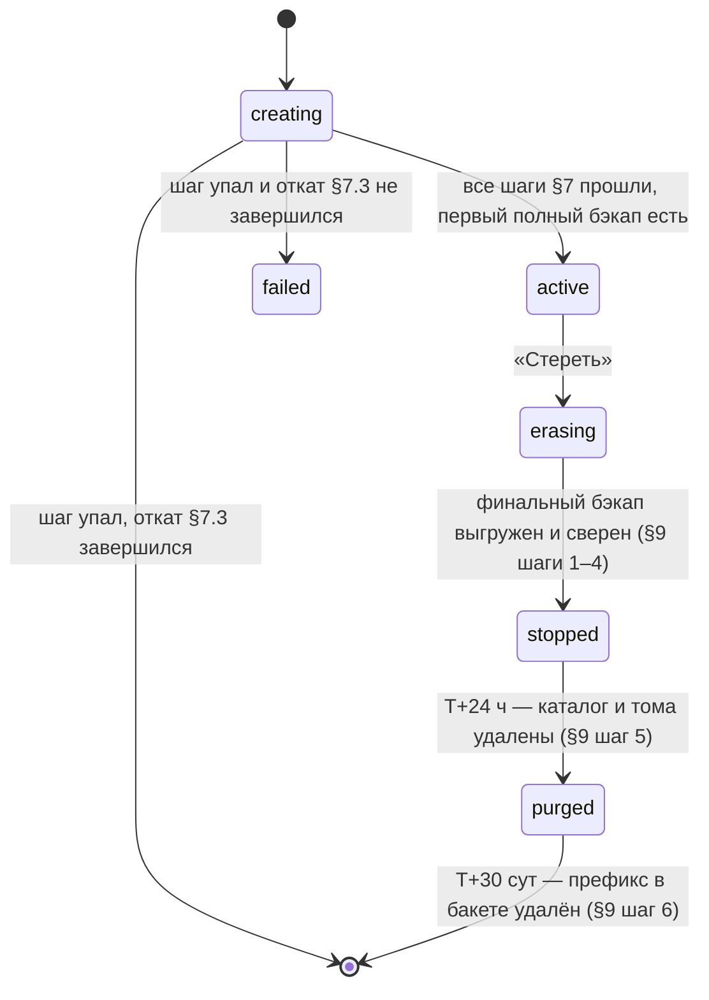

# ADR-115 — Жизненный цикл инстансов и серверов из CRM: одиночное размещение, бэкапы в Hetzner Object Storage, inventory для CI

- **Статус:** Accepted. **Состояние реализации, поэлементно, снято 2026-09-26 на `f38c9e6`:** (1) **код и инфраструктура по этому решению** — не написаны: `git grep -il 'wal-g' f38c9e6 -- ':!docs' | wc -l` = 0; `INSTANCES=` по-прежнему захардкожен в `.github/workflows/ci.yml` и `.github/workflows/deploy.yml`; образ по-прежнему собирается на сервере (джоб `build-image` в `ci.yml` — «validation only», без push); репликация (`infra/fleet/replication.sh`, `promote.sh`, `role-guard.sh`) — действующая схема; (2) **слито в `main` / выкачено** — нечего сливать; (3) **ревью** — не измеряется этим проходом, переносится без изменений. До выполнения фронта работ (§15) действующими остаются [07-deployment.md](../07-deployment.md) и [MIGRATION-3-SERVERS.md](../MIGRATION-3-SERVERS.md) в их нынешних разделах; места, которые это решение меняет, помечены там ссылкой сюда.
- **Дата:** 2026-09-26
- **Тип:** инфраструктурно-операционный ADR + контракт для внешней системы (CRM `broad-crm`, CI).
- **Парный ADR:** [ADR-116](ADR-116-credentials-and-infra-settings-in-db-overlay.md) — креденшлы и инфраструктурно-продуктовые настройки в БД-оверлее (решение владельца Р7). Разделены, потому что ADR-116 — супессия нормы [ADR-099 §8.2](ADR-099-crm-admin-economics-and-instance-settings.md), а это решение ничего в теле ADR-099 не меняет.
- **Сторона CRM** проектируется отдельным ADR в `broad-crm` ПОСЛЕ этого (нумерация репозиториев независима; ссылки — «broad-crm ADR-NNN»). Здесь названы только **обязанности** CRM по контракту этого решения (§14).
- **Меняет (не переписывая тела):** [ADR-017](ADR-017-shared-server-traefik-deploy.md) — «образ собирается на сервере» и «состав инстансов — `INSTANCES` в workflow» (§10); [ADR-056](ADR-056-instance-decommission-veltrio.md) — процедура вывода инстанса дополняется стиранием (§9); [ADR-109](ADR-109-media-asset-local-storage-30d.md) §«Известное ограничение: переключение на резерв» — резерва больше нет (§4.3); [MIGRATION-3-SERVERS.md](../MIGRATION-3-SERVERS.md) §Топология/§Репликация/§Переключение — снимаются (§11).

## Контекст

### Решения владельца (2026-09-26), дословно; пересмотру не подлежат

- **(Р1)** Размещение: инстанс живёт на одном выбранном сервере, без standby. Уточнено: «Новые серверы и старые будут работать без запасной копии.» — репликация снимается и на действующих A/B.
- **(Р2)** «Бэкапы и копии будут скидываться в один hetzner object storage» — Hetzner Object Storage (S3-совместимый), локация Helsinki (`hel1`), один бакет. Ночные полные бэкапы + финальный дамп при стирании; хранение 30 дней.
- **(Р3)** «У нас идет непрерывая выгрузка WAL в то же хранилище» — непрерывное архивирование WAL в тот же бакет; восстановление на момент времени в пределах срока хранения.
- **(Р4)** «В СРМ не появляется операция "восстановить инстансы из бэкапа на другом сервере"» — восстановление инстанса после падения сервера выполняется ВНЕ CRM, кнопки в CRM нет.
- **(Р5)** «CI берёт список из CRM» — CI после зелёных тестов собирает образ один раз (GHCR), запрашивает у CRM список серверов/инстансов по токену и раскатывает по нему; хардкод `INSTANCES` из workflow уходит; при недоступности CRM деплой падает явно, а не пропускает инстансы молча. «очень важно чтобы изменения в репозитории применялось для всех инстансов».
- **(Р8)** «Нужно придумать формулу по которой будет считать количество инстансов на сервере».
- **(Р9)** Приняты: еженедельная автоматическая проверка восстановления бэкапа в одноразовую БД; раскатка единого образа из GHCR (серверы не собирают образ сами); бэкап конфигурации роутера R в хранилище; лимит инстансов на сервер — от формулы, с ручной правкой.
- **Сценарий владельца (стирание), дословно:** «инстанс останавливается, делается backup базы данных. Через 24 часа запускается cron задача по удалению директории. Спустя 30 дней запускается cron по стиранию всех backup данных».
- **Сценарий владельца (создание):** сервер типа «Chat Bot» готов принимать инстансы; «+ Создать инстанс» → сначала домен и проверка, что A-запись указывает на роутер; затем форма со всем, что сейчас делается вручную; после создания в карточке CRM — Admin API Key, в примечаниях ADAPTY WEBHOOK SECRET и ADAPTY URL.

(Р6) и (Р7) — предмет [ADR-116](ADR-116-credentials-and-infra-settings-in-db-overlay.md).

### Как сделано сегодня (по дереву, прочитано в этом ходу)

- **Два прикладных сервера A/B + маршрутизатор R**, каждый инстанс основной на одном и резервный на другом, потоковая репликация Postgres со слотом `standby_slot` и ролью `replicator` (`infra/fleet/replication.sh`, режим `prepare`), таблица ролей `roles.tsv` на R, раздаваемая по туннелю (`infra/fleet/router/roles-docker-compose.yml`), страж ролей на A/B (`infra/fleet/role-guard.sh`, таймер 5 мин), повышение резерва (`infra/fleet/promote.sh`), тип сервиса Traefik `failover` (`infra/fleet/gen-router-config.py`).
- **Бэкапов нет.** Единственная копия данных — реплика. `pg_dump` в `infra/` встречается только в разовом переносе (`infra/fleet/import-from-old.sh`); пункт prod-checklist «бэкап `pg_dump` по cron + offsite» ([07-deployment.md](../07-deployment.md)) не закрыт.
- **Состав флота захардкожен** в `INSTANCES=` двух workflow (сверку двух списков делает шаг «Списки инстансов в ci.yml и deploy.yml совпадают» в `ci.yml`), в `infra/fleet/instances.tsv` (домены и основной сервер) и `infra/fleet/ports.txt` (порты). Добавление инстанса — ручная правка трёх файлов и `.env` на двух машинах (`infra/fleet/provision.sh`).
- **Образ собирается на сервере** из checkout `$DEPLOY_SHA` один раз на прогон и проставляется тегом `<проект>-backend:prod` каждому инстансу (`ci.yml`, блок «Единая сборка образа»).
- **Маршрут на R** — один сгенерированный файл на весь флот. ⚠️ **Расхождение имён файла, названное здесь явно:** `gen-router-config.py` пишет `infra/fleet/dynamic.yml`; `promote.sh` копирует его в `/opt/router/dynamic/dynamic.yml` и в комментарии фиксирует, что прежнее копирование в `fleet.yml` давало **два набора одноимённых роутеров** в одном каталоге провайдера; при этом `infra/fleet/enable-tls.sh` (`cp dynamic.yml /opt/router/dynamic/fleet.yml`) и `infra/fleet/bootstrap-server.sh` шаг 7 (`cp … /opt/router/dynamic/fleet.yml`) **до сих пор** пишут `fleet.yml`, а [MIGRATION-3-SERVERS.md §Сертификат нового домена](../MIGRATION-3-SERVERS.md) оперирует `dynamic.yml`. Каталог, в котором лежат оба файла, — тот же дефект, который `promote.sh` уже однажды чинил. Это решение снимает класс целиком (§6): один файл на инстанс, имя вычисляется из идентификатора, общего файла нет.

## Решение

### §1. Модель: кто источник истины

- **CRM — единственный источник истины о составе флота:** какие серверы существуют, какие инстансы на каком сервере, их домены, порты, состояния. Репозиторий `claude-ios` состав больше **не хранит** (`INSTANCES`, `instances.tsv`, `ports.txt` уходят, §10, §15).
- **`claude-ios` владеет:** образом приложения и образом Postgres с `wal-g` (GHCR), инструментами флота (`infra/fleet/*`), которые CRM и CI вызывают по SSH (§13), контрактом `.env` (§5) и admin API инстанса ([ADR-099](ADR-099-crm-admin-economics-and-instance-settings.md), [ADR-116](ADR-116-credentials-and-infra-settings-in-db-overlay.md)).
- **Состояния инстанса** (хранит CRM; инструменты `claude-ios` их не хранят, а исполняют переходы):



  Деплой CI касается **только** `active` (§10). `failed` — ручной разбор; инструменты печатают, что осталось на сервере (§7.3).
- **Состояния сервера:** `provisioning` → `active` (принимает инстансы) → `draining` (новых не принимает; деплой продолжается) → `retired` (только при нуле инстансов не в `purged`).

### §2. Сервер типа «Chat Bot»: требования и подготовка

Эквивалент нынешнего `infra/fleet/bootstrap-server.sh` **без** частей о репликации и о паре A/B. Скрипт переписывается (§15) с параметрами вместо захардкоженных A/B и адресов.

| Требование | Значение | Откуда |
|---|---|---|
| ОС | Ubuntu 22.04+ / Debian либо RHEL-подобная (обе ветки уже есть в `bootstrap-server.sh` шаг 1) | `bootstrap-server.sh` |
| Docker Engine + compose-плагин | как в шаге 1 | там же |
| Туннель WireGuard | адрес `10.10.0.N/24` (N выдаёт CRM, уникален во флоте, `N ∉ {3}` — `10.10.0.3` занят R), **один** пир — маршрутизатор R; пир «второй прикладной сервер» **не заводится** (он был нужен только для репликации) | `bootstrap-server.sh` шаг 2; подсеть `10.10.0.0/24` уже в `TRUSTED_PROXY_IPS` (`docker-compose.fleet.yml`) |
| Swap | 8 ГБ, `vm.swappiness=10` | шаг 3 |
| Сеть `web` | `docker network create web` (объявлена `external` в `docker-compose.prod.yml`) | шаг 4 |
| Входящие порты из интернета | только `22/tcp` и `51820/udp`; порты `api` публикуются **только** на адрес туннеля (`docker-compose.fleet.yml`) | — |
| Инструменты флота и бандл деплоя | версии в `/opt/fleet.d/<sha>/` (инструменты §13, `compose/`, `VERSION`), действующая — по symlink `/opt/fleet` (§10.4). На новый сервер CRM доставляет версию копией с R (§2.1 шаг 1), дальше версии кладёт CI при каждом деплое | новое |
| Доступ к репозиторию | **не нужен и не выдаётся.** Сегодня сервер клонирует репозиторий deploy-ключом (`infra/fleet/bootstrap-server.sh:82-87`: `/root/.ssh/github_deploy`, `git clone`), а CI делает `git checkout --detach` в каталоге инстанса (`.github/workflows/ci.yml:433`). Образ приходит из GHCR, а файлы compose — бандлом `/opt/fleet/compose/` (§4.1), поэтому исходники серверу не нужны, и deploy-ключ на новые серверы не ставится | снимается |
| Креды хранилища | **два каталога с разными читателями** (§8.7): `/etc/fleet/walg/walg.json` — для `wal-g` в контейнере `postgres` (каталог `root:<gid postgres> 0750`, файл `root:<gid postgres> 0640`, монтируется только на чтение); `/etc/fleet/objstore/objstore.env` — для заданий хоста (`root:root 0700` / `0600`, в контейнеры не монтируется). Замена — только инструментом `fleet-server objstore-set` | новое |
| Доступ к GHCR | `docker login ghcr.io` токеном только на чтение пакетов (§10.3); замена — `fleet-server ghcr-login` | новое |
| SSH | **первый доступ — ключ CRM, который владелец указывает при заказе сервера у хостинга**; host-ключ CRM закрепляет при первом подключении и отдаёт в inventory (§10.1); ключ CI CRM кладёт в `authorized_keys` шагом `bootstrap`; замена — в две фазы: `fleet-server authorized-keys-add` → вход новым ключом → `fleet-server authorized-keys-remove` (§8.7) | новое |
| Таймеры systemd | `fleet-backup.timer` (ночной), `fleet-backup-heartbeat.timer` (5 мин), `fleet-restore-check.timer` (еженедельный) — §8 | новое |
| **НЕ устанавливается** | страж ролей (`fleet-role-guard.*`, `/etc/fleet.conf`), запасной вход Traefik (шаг 7) — см. §6.4 | снимается |

#### §2.1. Подготовка нового сервера — последовательность (исполняет CRM, состояние сервера `provisioning`)

0. **Первый доступ.** Владелец заказывает сервер с публичным ключом CRM (панель хостинга). CRM подключается, закрепляет host-ключ (доверие при первом подключении — единственная точка, где отпечаток не с чем сверить; CRM показывает его владельцу).
1. **Доставка инструментов.** Inventory не содержит серверов в `provisioning`, поэтому CI туда ничего не синхронизирует (§10.4). CRM копирует действующую версию инструментов **с R** потоком: на R — `fleet-route tools-export` (архив каталога, на который указывает `/opt/fleet` в момент вызова, в stdout; `FLEET-RESULT` в stderr), на новом сервере — распаковка в `/opt/fleet.d/<sha>/` и атомарное создание symlink `/opt/fleet` (§10.4). Распаковка — **единственная команда, которую CRM исполняет на сервере не подкомандой §13**: до неё инструментов на сервере физически нет. Сразу после неё идёт `fleet-server version`, и её `evidence` (`VERSION`) сверяется с `last_deployed_sha` (§10.1): R синхронизируется каждым деплоем (§10.4), и его копия — та же версия, что у всего флота. Не совпало (R пропустил синхронизацию) — стоп, сервер остаётся в `provisioning`.
2. **`fleet-server bootstrap`** (stdin: `wg_ip`, публичный ключ и адрес R, токен GHCR на чтение, креды хранилища, публичный ключ CI). Ставит Docker, swap, сеть `web`, каталоги `/etc/fleet/walg/` (группа — gid пользователя `postgres`, снятый из образа, §8.2) и `/etc/fleet/objstore/`, `docker login ghcr.io`, ключ CI, таймеры §8. **Пару ключей WireGuard генерирует сам**, закрытый ключ сервер не покидает. Признаки успеха в `FLEET-RESULT` (§13): публичный ключ WireGuard, версия Docker, успешный `docker pull` образа `last_deployed_sha`, успешные запись, чтение и удаление тестового объекта в бакете новыми кредами.
3. **`fleet-route wg-peer-add`** на R (stdin: публичный ключ, `wg_ip`, адрес сервера). Пир добавляется без разрыва существующих туннелей (`wg set`) и сохраняется в `/etc/wireguard/wg0.conf`. Признак успеха: пир есть в `wg show wg0` **и** в файле.
4. **`fleet-server tunnel-check`** на новом сервере и **`fleet-route tunnel-check <wg_ip>`** на R. Признак живого туннеля — ОБА условия с ОБЕИХ сторон: `latest-handshake` пира не старше 120 с (`wg show wg0 latest-handshakes`) и `ping -c 3 -W 2` до адреса другой стороны без потерь; в `FLEET-RESULT` — возраст рукопожатия и `rtt`. Повторный `bootstrap` признаком туннеля **не является**: он проверяет установку, а не связь.
5. **`fleet-server facts`** → формула §3.
6. Сервер `active`; со следующего деплоя его синхронизирует CI.

**Добавление сервера на R** — шаг 3 выше. Регион сервера — рекомендация `hel1` (задержка B↔R 1.3 мс — [MIGRATION-3-SERVERS.md §Состояние на 2026-08-27](../MIGRATION-3-SERVERS.md); туда же идут бэкапы), но не требование.

### §3. Формула ёмкости сервера (Р8)

```
N_ram  = floor( (RAM_ГБ − R_ram) / m )
N_cpu  = floor( cores × c )
N_disk = floor( (Disk_ГБ − R_disk) / d )          — вычисляется только когда d измерен (Q-115-1)
N_max  = min(N_ram, N_cpu, N_disk)                 — по определённым членам
limit  = override ?? N_max                          — ручная правка владельца в CRM (Р9)
```

**Что считается.** Для памяти и CPU — инстансы в `creating`+`active`+`erasing`+`failed` (`count_run`): у `failed` откат не завершился, и его контейнеры могут работать (§7.3). Для диска — они же плюс `stopped` (`count_disk`: у `stopped` контейнеры остановлены, но каталог и тома ещё на диске). Инстанс `failed` держит свои `slug` и `API_HOST_PORT` до завершения отката: CRM не выдаёт их повторно. CRM отказывает в создании **до** шага 1 §7, если `count_run ≥ override ?? min(N_ram, N_cpu)` либо (когда `N_disk` определён) `count_disk ≥ N_disk`. Ручная правка `override` заменяет только первое условие: диск нельзя «переопределить» решением.

| Коэффициент | Значение | Происхождение |
|---|---|---|
| `m` — память на инстанс (`api` ×2 воркера + `postgres` + `redis`) | **0.36 ГБ** | **Измерение:** флот из 27 инстансов занимал «~9.6 ГБ при двух» воркерах ([MIGRATION-3-SERVERS.md §Состояние на 2026-08-27](../MIGRATION-3-SERVERS.md), «Память A…»); 9.6/27 = 0.356. Сверка вторым замером того же документа: B нёс 27 основных, «9 ГБ памяти из 15» (§Временное отступление от схемы) → 0.33. Действует при `GUNICORN_WORKERS=2` (`infra/fleet/provision.sh`: «api с четырьмя воркерами занимал 458 МБ» — при 4 воркерах `m` иное и формула не применима). |
| `R_ram` — резерв ОС, Docker, заданий бэкапа и проверки восстановления, пика деплоя | **max(2 ГБ, 20 % RAM)** | **Политика**, не измерение. Свап (8 ГБ) в формулу не входит — он страховка, а не ёмкость. |
| `c` — инстансов на ядро | **5** | **Измерение + политика:** B при 27 основных инстансах — «load 2.7 при восьми ядрах» ([MIGRATION-3-SERVERS.md](../MIGRATION-3-SERVERS.md) §Временное отступление) → 0.1 load на инстанс в покое. **Политика:** load в покое ≤ 50 % ядер — запас под пики перезапуска и деплоя, которыми машина уже падала (инциденты 2026-08-24/25, [07-deployment.md §Порционная выкатка](../07-deployment.md#порционная-выкатка-инцидент-2026-08-25)); 0.5 / 0.1 = 5. ⚠️ Опорный замер — **один** снимок `uptime` (Q-115-2). |
| `d` — диск на инстанс | **не измерен** | Известно только слагаемое данных БД: «Объём данных всего флота — около 2.5 ГБ» на 27 ([MIGRATION-3-SERVERS.md §Что переносим](../MIGRATION-3-SERVERS.md)). Не измерены: копии медиа за 30 дней ([ADR-109](ADR-109-media-asset-local-storage-30d.md)), локальный спул WAL при недоступном хранилище (§8.6), рост БД. → **Q-115-1**; команда замера там же. До ответа `N_disk` не вычисляется, CRM показывает «лимит по диску: не определён». |
| `R_disk` — образы, слои, логи, временная БД проверки восстановления | **max(20 ГБ, 15 % диска)** | **Политика.** |

**Пример (B: 8 ядер, 15.2 ГБ):** `N_ram = floor((15.2 − 3.04)/0.36) = 33`, `N_cpu = 40` ⇒ `N_max = 33`. Факты сервера (`nproc`, `free -b`, `df -B1 /opt`) CRM снимает сама при регистрации сервера инструментом `fleet-server facts` (§13); коэффициенты хранятся в CRM как настройки формулы, чтобы уточнение по Q-115-1/Q-115-2 не требовало релиза.

### §4. Раскладка одиночного инстанса на сервере

#### §4.1. Каталог, проект, порты

- **Каталог** `/opt/<slug>`; `slug` — `^[a-z][a-z0-9-]{1,30}$`, уникален во флоте и **не переиспользуется**, пока префикс бэкапов прежнего носителя не удалён (§9 шаг 6). `COMPOSE_PROJECT_NAME = slug`. **Зарезервированные имена** (снимок; имя служебного каталога `/opt`, здесь не названное, подпадает под то же правило): `fleet`, `router`, `edge`, `backup`, `backups`, `tmp`, `containerd`. Проверка двойная: CRM отвергает зарезервированное имя на форме, а `fleet-instance create` **отказывается**, если `/opt/<slug>` уже существует и его `.env` не несёт `INSTANCE_UID` создаваемого инстанса. Так чужой или служебный каталог не будет занят, даже если его имени нет в списке. (`claude-ios` — не служебное имя, а действующий инстанс № 1: `/opt/claude-ios` — его каталог.)
- **Содержимое каталога:** файлы compose — копия из бандла `/opt/fleet/compose/` версии `/opt/fleet/VERSION` (`docker-compose.prod.yml`, `docker-compose.fleet.yml`, `docker-compose.walg.yml`, шаблон `.env.prod.example`). Git-checkout и исходники в каталоге **не нужны**: образ приходит из GHCR, и `docker compose` запускается с `--no-build`. Если `compose` без контекста сборки не проходит проверку, в бандл кладётся вариант файлов без секции `build` — это проверяет `devops`, §15. Прежние каталоги сохраняют свой `.git` безвредно. `.env` (§5), `.secrets/` (пара JWT-ключей, как в `provision.sh new`), `certs/appstore/` (корневой сертификат Apple, §5), `media-assets/` (как `ensure_media_assets` в `provision.sh`).
- **Порт `api`** публикуется на адрес туннеля сервера: `WG_BIND_IP:API_HOST_PORT` (`docker-compose.fleet.yml`). `API_HOST_PORT` выдаёт CRM: уникален **в пределах сервера**, диапазон `18001–18999` (нынешние значения `ports.txt` лежат в нём и сохраняются при импорте, §11).
- **Порт `postgres` больше не публикуется.** Он открыт только ради репликации (`docker-compose.fleet.yml`, комментарий у `postgres.ports`); после §11 блок `postgres.ports` и переменная `PG_HOST_PORT` снимаются.

#### §4.2. Что остаётся от оверлея флота и `.role`

- `docker-compose.fleet.yml` остаётся (публикация `api` на туннель, `TRUSTED_PROXY_IPS`), без блока `postgres.ports`.
- **`.role` снимается — но только после того, как новый CI (§10), который `.role` не читает, заменил прежний** (§11, фаза 3). Роль у инстанса одна — основной. Сегодняшний CI без `.role` считает экземпляр основным (`ROLE="$(cat .role 2>/dev/null || echo primary)"` — `ci.yml:424`, `deploy.yml:203`), поэтому удаление `.role` при старом CI подняло бы `api` на бывших резервах.
- Сервис `postgres` получает образ с `wal-g` и настройки архива **отдельным оверлеем** `docker-compose.walg.yml`, а не правкой общего `docker-compose.prod.yml` (§8.2). Оверлей подключается поинстансно — только там, где его включил инструмент, и только на сервере, где инстанс основной.

#### §4.3. Чего больше нет — и что из этого следует

Резервного экземпляра нет. **Отказ сервера = простой всех его инстансов до ручного восстановления на другом сервере** (§12) с потерей данных не больше RPO (§8.5). Это прямое следствие (Р1)+(Р4), принятое владельцем; RTO ограничен скоростью оператора и объёмом данных. Копии медиа [ADR-109](ADR-109-media-asset-local-storage-30d.md) в бэкап **не входят** (§8.1) — при отказе сервера они теряются (решение владельца 2026-09-26, [Q-115-3](../99-open-questions.md) закрыт: «Нет»; [TD-062](../100-known-tech-debt.md)).

### §5. Контракт `.env` инстанса

Имена — строго `src/app/config.py` (поля `Settings`) и таблица [07-deployment.md §Конфигурация (env)](../07-deployment.md#конфигурация-env). Классы определяются **назначением**, перечни — снимок на 2026-09-26: переменная, отвечающая признаку класса, но здесь не названная, — тот же класс.

| Класс | Признак | Где живёт | Кто задаёт |
|---|---|---|---|
| **(E1) Инфраструктура и адресация** | значение следует из размещения инстанса | только `.env` / compose | CRM рендерит при создании |
| **(E2) Материал подписи и шифрования** | ключ, которым сервис **сам** подписывает или шифрует и который инстанс не покидает; утечка = подделка токенов, ссылок или колбэков либо расшифровка данных этой же БД. Общие bearer-секреты, которые владелец вписывает во внешнюю консоль (`ADAPTY_WEBHOOK_SECRET`), сюда не входят — это (E3), [ADR-116 §1](ADR-116-credentials-and-infra-settings-in-db-overlay.md) | только `.env` / `.secrets/`; **в БД никогда** ([ADR-116 §2](ADR-116-credentials-and-infra-settings-in-db-overlay.md)) | генерируется при создании |
| **(E3) Креденшлы и настройки, переезжающие в БД-оверлей** | владелец меняет их вручную и хочет менять из CRM без рестарта (Р7) | БД-оверлей, `.env` — только необязательный запасной источник | CRM через admin API — [ADR-116](ADR-116-credentials-and-infra-settings-in-db-overlay.md) |
| **(E4) Продукты и цены** | у величины есть владелец-продукт или цена ([ADR-099 §8.2 (г)](ADR-099-crm-admin-economics-and-instance-settings.md)) | оверлеи `/products`, `/pricing` (уже есть) | CRM «Продукты и тарифы» |
| **(E5) Прочее** | лимиты, таймауты, модели вспомогательных путей и т.п. ([ADR-099 §8.2 (б)(в)(е)](ADR-099-crm-admin-economics-and-instance-settings.md)) | `.env`, значения шаблона `.env.prod.example` | шаблон |

**(E1), снимок:** `COMPOSE_PROJECT_NAME`, `SERVICE_DOMAIN`, `JWT_ISSUER` (= `https://<домен>`, как в `provision.sh new`), `POSTGRES_USER`/`POSTGRES_PASSWORD`/`POSTGRES_DB`, `DATABASE_URL` (собирается из трёх предыдущих целиком), `REDIS_URL`, `WG_BIND_IP`, `API_HOST_PORT`, `GUNICORN_WORKERS` (= 2; от него зависит `m` в §3), `TRAEFIK_CERTRESOLVER`, `DOCS_ENABLED`, `LOG_LEVEL`, `MEDIA_ASSET_STORAGE_DIR`, **новая `INSTANCE_UID`** (читается только инструментами флота, не приложением; ключ префикса в бакете, §8.4). **Снимаются после §11:** `PG_HOST_PORT`, `PG_REPL_PASSWORD`.

**(E2), генерируется при создании, снимок:** `POSTGRES_PASSWORD`, `KMS_LOCAL_MASTER_KEY` (32 случайных байта base64 — **обязательно**, пустышка шаблона роняет `/v1/chat/run`: инцидент 2026-09-22 в `provision.sh`), `ADMIN_API_SECRET`, `PREVIEW_URL_SECRET`, `METRICS_SCRAPE_TOKEN`, `PROXY_WEBHOOK_SECRET`, пара `.secrets/jwt_private.pem`/`jwt_public.pem`. Пусты по умолчанию: `KMS_KEY_ID`, `APNS_KEY_ID`/`APNS_TEAM_ID`/`APNS_TOPIC`. `ADAPTY_WEBHOOK_SECRET` тоже генерирует CRM при создании, но он относится к (E3) и пишется в оверлей, а не в `.env` ([ADR-116 §3](ADR-116-credentials-and-infra-settings-in-db-overlay.md)). **Генерирует CRM** (кроме пары JWT — её генерирует инструмент на сервере) и передаёт инструменту через stdin (§13); значения CRM хранит зашифрованными — они нужны для восстановления (§12) и для показа Admin API Key в карточке.

**(E3)** — состав, хранение, приоритет и применение без рестарта: [ADR-116](ADR-116-credentials-and-infra-settings-in-db-overlay.md). Здесь только следствие для `.env`: при создании эти переменные в `.env` **не пишутся** (остаются пустыми/значениями шаблона), значения приходят в оверлей шагом 6 §7.1. Существующие инстансы сохраняют свои значения в `.env` как запасной источник до их явной записи в оверлей.

**StoreKit-сертификат.** Режим `production` ([ADR-116 §4](ADR-116-credentials-and-infra-settings-in-db-overlay.md)) требует корневой сертификат Apple в `certs/appstore/` (монтируется в `/etc/appstore-certs`, `docker-compose.prod.yml`). Инструмент создания кладёт его **всегда**, независимо от режима, — чтобы переключение режима из CRM не требовало доступа к серверу.

### §6. Маршрут на роутере R

#### §6.1. Один файл на инстанс

- Файл `/opt/router/dynamic/inst-<slug>.yml`; роутер и сервис Traefik называются `inst-<slug>`. Префикс `inst-` отличает новые имена от нынешних (`<slug>` в `dynamic.yml`) и позволяет двум наборам сосуществовать во время перехода (§11 фаза 6).
- Содержимое: `rule: Host(\`<домен>\`)`, `entryPoints: [websecure]`, `tls.certResolver: le`, сервис `loadBalancer` с **одним** сервером `http://<wg_ip сервера>:<API_HOST_PORT>` и healthcheck `/ready` (как нынешние `-primary` в `gen-router-config.py`). Типа `failover` нет.
- **Запись атомарная:** файл пишется во временный в ТОМ ЖЕ каталоге и переименовывается (`mv`). Каталог смонтирован в контейнер целиком (`infra/fleet/router/docker-compose.yml`: `./dynamic:/etc/traefik/dynamic:ro`), поэтому новый inode виден; монтировать отдельный файл запрещено (дефект, описанный в `roles-docker-compose.yml`).
- **Снятие маршрута** — удаление файла.
- **Общего файла нет.** После §11 фазы 6 в каталоге не должно быть ни `dynamic.yml`, ни `fleet.yml`; инструмент маршрута (§13) при каждом вызове проверяет это и **отказывается работать**, если найдёт посторонний файл с роутером на тот же домен (вывод: имя файла и домен).

#### §6.2. Порядок относительно DNS (действует без изменений)

Маршрут добавляется **только после** проверки, что A-запись домена указывает на R: иначе Traefik проваливает выпуск сертификата и не повторяет его сам ([MIGRATION-3-SERVERS.md §Сертификат нового домена](../MIGRATION-3-SERVERS.md)). Проверку A-записи CRM делает **до** формы создания (сценарий владельца) и повторяет инструментом на R непосредственно перед записью файла. Проверка сертификата после добавления — **по издателю**, а не по коду ответа (`TRAEFIK DEFAULT CERT` = провал; тот же довод, что в `verify.sh` раздел СЕРТИФИКАТЫ).

#### §6.3. Бэкап конфигурации R (Р9)

Ночной таймер на R архивирует `/opt/router/` (`traefik.yml`, `docker-compose.yml`, `dynamic/`, `letsencrypt/acme.json` — содержит закрытые ключи сертификатов) и `/etc/wireguard/` (закрытый ключ туннеля R) и выгружает **зашифрованным** (§8.7) в `router/<host-id>/<UTC-дата>.tar` бакета. `host-id` — идентификатор машины (`/etc/machine-id`): при восстановлении R на новой машине прежний R, если вернётся, пишет в **свой** префикс и не перетирает конфигурацию действующего входа. Срок хранения — 30 дней (§8.4).

#### §6.4. Запасные входы на A/B снимаются

Конфигурация «запасного входа» на A и B ([MIGRATION-3-SERVERS.md §Отказ самого маршрутизатора](../MIGRATION-3-SERVERS.md), `bootstrap-server.sh` шаг 7) генерировалась из того же `instances.tsv`, которого больше нет, и не может поддерживаться в синхроне с файлами §6.1 без второго писателя. **Взамен:** R восстанавливается из бэкапа §6.3 на любой машине + переключение A-записей (TTL 60 с остаётся нормой). Мера слабее прежней по времени простоя — названо в §Последствия.

### §7. Создание инстанса

#### §7.1. Шаги (исполняет CRM, инструменты — §13)

0. **Предусловия (в CRM, до формы):** сервер в `active`; с учётом создаваемого инстанса не нарушено ни одно из двух условий ёмкости §3 (по `count_run` и, если `N_disk` определён, по `count_disk`); `slug` не зарезервирован (§4.1); домен уникален во флоте и не числится среди доменов выведенных инстансов, переданных другому владельцу ([ADR-056](ADR-056-instance-decommission-veltrio.md) И-1); A-запись домена = адрес R.
1. **Резерв ресурсов:** CRM выдаёт `slug`, `INSTANCE_UID` (UUID), `INSTANCE_GENERATION=1` (§8.4), `API_HOST_PORT` (§4.1), генерирует (E2)-секреты (§5) и пишет `instances/<INSTANCE_UID>/meta.json` (§8.4); состояние `creating`.
2. **`fleet-instance create`** на сервере: создаёт `/opt/<slug>` из бандла `/opt/fleet/compose/` (его `VERSION` обязан равняться `last_deployed_sha`, §10.1, иначе отказ), рендерит `.env` из шаблона + (E1)/(E2) со stdin, генерирует JWT-пару, кладёт сертификат Apple, готовит `media-assets`, тянет образы из GHCR, `migrate`, `up -d`, ждёт `healthy`. Архив WAL включён с первого старта Postgres (оверлей `docker-compose.walg.yml` подключается сразу, §8.2).
3. **Первый полный бэкап:** `fleet-backup full <slug>`; успех — наличие в бакете базовой копии этого `INSTANCE_UID` (§8.6). **Без него инстанс не переходит в `active`:** иначе первые сутки восстанавливать было бы не из чего.
4. **Маршрут:** `fleet-route add <slug>` на R (§6).
5. **Проверка снаружи:** `GET https://<домен>/ready` = 200 и издатель сертификата — Let's Encrypt (повторы до 5 минут — выпуск асинхронный).
6. **Конфигурация продукта:** CRM пишет через admin API по домену ([ADR-099](ADR-099-crm-admin-economics-and-instance-settings.md), [ADR-116](ADR-116-credentials-and-infra-settings-in-db-overlay.md)): креденшлы, настройки (провайдер/dual, StoreKit-режим и bundle, инструменты, CloudPayments), продукты. Это **тот же** путь, которым CRM правит инстанс потом, — отдельного «режима создания» нет.
7. **`active`** — только если образ запущенного `api` совпадает с образом **текущего** `last_deployed_sha` (сверка инструментом `fleet-instance image <slug>` в момент перехода). Если не совпадает (деплой прошёл, пока инстанс создавался), CRM сначала перевыкатывает инстанс на текущий SHA тем же инструментом и повторяет сверку. Обратный порядок (деплой начался раньше перехода, а закончился позже) закрыт §10.2 пп. 6 и 9; переход в `active` сериализуется с записью `last_deployed_sha` (§10.2 п. 9, условие стыка). Карточка CRM показывает: Admin API Key (`ADMIN_API_SECRET`), в примечаниях — ADAPTY URL `https://<домен>/v1/billing/adapty/webhook` (роут `POST /v1/billing/adapty/webhook`, `src/app/api_gateway/routers/billing_adapty.py`) и ADAPTY WEBHOOK SECRET ([ADR-116 §3](ADR-116-credentials-and-infra-settings-in-db-overlay.md)).

Между шагами 4 и 6 инстанс публичен без ключей провайдеров: ход чата отвечает ошибкой провайдера. Окно — секунды–минуты, домен ещё не отдан приложению; окно названо, а не устранено.

#### §7.2. Идемпотентность

Каждый шаг повторяем: `create` на существующий каталог с тем же `INSTANCE_UID` продолжает с недостающего подшага; с **другим** `INSTANCE_UID` — отказ (чужой каталог). CRM хранит номер последнего успешного шага и при повторе начинает с него.

#### §7.3. Откат при ошибке на любом шаге

Откат идёт в обратном порядке пройденных шагов и **разрешён только для инстанса, ни разу не бывшего `active`** — у такого нет пользовательских данных. Инвариант проверяется инструментом, а не памятью CRM: `fleet-instance rollback` отказывается, если в БД инстанса есть хоть одна строка `users` (для только что созданного — пусто).

| Пройден шаг | Откат |
|---|---|
| 4 | `fleet-route remove <slug>` |
| 3 | удалить префикс `instances/<INSTANCE_UID>/` в бакете (§8.4); перед удалением сверить `meta.json.instance_uid` с удаляемым UID |
| 2 | `docker compose -p <slug> … down -v`, `rm -rf /opt/<slug>` (с проверкой пути, §9 шаг 5) |
| 1 | CRM освобождает `slug`, порт, `INSTANCE_UID` |

Откат не удался → `failed`; инструмент печатает перечень оставшегося (контейнеры, каталог, тома, файл маршрута, префикс бакета), CRM показывает его. Повторный откат — идемпотентен.

### §8. Бэкапы и непрерывный архив WAL (Р2, Р3, Р9)

#### §8.1. Что бэкапится

| Объект | Как | Когда |
|---|---|---|
| Postgres инстанса | физическая базовая копия `wal-g backup-push` + непрерывный архив WAL `wal-g wal-push` | копия — ночью; WAL — непрерывно |
| Postgres инстанса при стирании | **логический** дамп `pg_dump -Fc` (переносим между версиями Postgres) | один раз, §9 шаг 3 |
| Конфигурация инстанса (`.env`, `.secrets/`) | архив, зашифрован | ночью, вместе с копией |
| Конфигурация R | архив, зашифрован | ночью (§6.3) |
| Redis | **не бэкапится** — только счётчики лимитов, обнуление без последствий ([MIGRATION-3-SERVERS.md §Что переносим](../MIGRATION-3-SERVERS.md)) | — |
| `media-assets` ([ADR-109](ADR-109-media-asset-local-storage-30d.md)) | **не бэкапится** (решение владельца 2026-09-26, [Q-115-3](../99-open-questions.md) закрыт) | — |

#### §8.2. Инструмент — `wal-g`; образ Postgres

**Выбран `wal-g`.** Причины: один статический бинарник, ставится внутрь контейнера Postgres без агента на хосте; нативно пишет в S3-совместимое хранилище; одна утилита закрывает все четыре операции решения — базовую копию, архив WAL, восстановление на момент времени (`backup-fetch` + `restore_command`) и удаление по сроку (`delete`); встроенное клиентское шифрование (`WALG_LIBSODIUM_KEY`) и выгрузка произвольных файлов тем же шифрованием (`wal-g st put`). Отвергнутые — в §Альтернативы.

- **Образ `postgres`** — производный от нынешнего `pgvector/pgvector:pg16` (`docker-compose.prod.yml`) с добавленным `wal-g` фиксированной версии (проверка контрольной суммы бинарника при сборке). Собирается в CI и публикуется в GHCR рядом с образом приложения (§10.3). Смена образа Postgres — **инфраструктурная выкатка** и идёт порциями отдельным прогоном, а не штатным деплоем (правило корневого `CLAUDE.md` «изменения инфраструктурного слоя выкатываются порциями», §10.2 п. 5).
- **Механизм — оверлей `docker-compose.walg.yml`** с `image`, `command` и `env_file` сервиса `postgres`. Общий `docker-compose.prod.yml` **не меняется** до конца демонтажа. Правка базового файла на ближайшем деплое прежнего CI пересоздала бы Postgres на всех серверах разом, включая резервы: сегодня основной выполняет `up -d --no-build` без имени сервиса (`ci.yml:470`, `deploy.yml:243`), а резерв — `up -d --no-build postgres redis` (`ci.yml:474`, `deploy.yml:247`). **Признак подключения оверлея — непустой `INSTANCE_UID` в `.env`.** По этому признаку набор файлов compose собирают ВСЕ вызывающие (новый CI, инструменты §13), поэтому вызов без оверлея на включённом инстансе возможен только вручную. Включает оверлей инструмент `fleet-instance enable-archive <slug>` — поинстансно, порциями и только на сервере, где инстанс числится в inventory (на основном). На резервах `INSTANCE_UID` не пишется до конца их жизни.
- **Настройки Postgres** (командой `postgres -c …` в compose): `archive_mode=on`, `archive_command='fleet-wal-push %p'` (обёртка над `wal-g wal-push`, см. ниже), `archive_timeout=60`, `wal_level=replica` (дефолт). Смена `archive_mode` требует **перезапуска** Postgres — отсюда порционность в §11.
- **Креды** хранилища и ключ шифрования попадают **только** в контейнер `postgres`, не в `api`: каталог `/etc/fleet/walg/` монтируется в контейнер **целиком** и только на чтение. `archive_command` выполняет процесс Postgres от непривилегированного пользователя `postgres` контейнера, поэтому каталог и файл читаются по **группе** этого пользователя: `root:<gid> 0750` и `0640`. `<gid>` не пишется в документ и не задаётся по памяти: `fleet-server bootstrap` снимает его из образа Postgres, который реально запускается (`docker run --rm <образ> id -g postgres`), и сохраняет в `/etc/fleet/walg/.gid`. `objstore.env` (для хостовых заданий) лежит в отдельном `/etc/fleet/objstore/` (`root:root 0700`/`0600`) и в контейнер **не** монтируется. `wal-g` читает `/etc/fleet/walg/walg.json` при **каждом** вызове (`--config`), поэтому замена кредов не требует перезапуска Postgres. Монтируется каталог, а не файл: `mv` создаёт новый inode, и смонтированный файл продолжал бы отдавать старое содержимое — тот же дефект описан в `infra/fleet/router/roles-docker-compose.yml`. Префикс инстанса задаётся в оверлее из `.env` **с обязательными подстановками**: `WALG_S3_PREFIX=s3://<бакет>/instances/${INSTANCE_UID:?}/g${INSTANCE_GENERATION:?}/wal-g`. Пустое значение роняет `compose`, а не сливает префиксы разных инстансов в один (при пустом `INSTANCE_UID` ночной `wal-g delete` удалил бы чужие копии). Общий файл кредов на сервер не несёт ничего поинстансного.
- **Защита префикса — три слоя, ни один не заменяет другой:** (1) `${…:?}` в compose; (2) перед любой операцией с бакетом каждый инструмент §13 проверяет формат `INSTANCE_UID` (UUID) и `INSTANCE_GENERATION` (целое ≥ 1) и при несоответствии отказывается; (3) перед любой записью и удалением инструмент читает `meta.json` своего префикса и требует, чтобы `instance_uid` и `current_generation` совпадали с `.env` (§8.4, ограждение). `archive_command` — не голый `wal-g wal-push`, а обёртка `fleet-wal-push %p` с той же проверкой; прочитанный `meta.json` кэшируется не дольше 5 минут.

#### §8.3. Расписание

- **Ночная копия:** `fleet-backup.timer` на каждом сервере обходит инстансы сервера **последовательно** под `nice`/`ionice`, по одному (тот же довод, что порционная выкатка: одновременный старт 45 тяжёлых операций — CPU-голодание). Для каждого: `wal-g backup-push` (полная, не дельта) → выгрузка архива конфигурации → удаление по сроку (§8.4). Окно старта — ночь UTC; сдвиг сервера внутри окна задаёт CRM (чтобы серверы не стартовали одновременно).
- **WAL:** непрерывно, через `archive_command`.
- **Heartbeat:** каждые 5 минут (§8.6).
- **Проверка восстановления:** еженедельно (§8.8).

#### §8.4. Раскладка ключей объектов в бакете и срок хранения

Один бакет в `hel1` (Р2). Ключ префикса инстанса — `INSTANCE_UID`, **не** `slug`: slug после стирания и истечения 30 дней может получить новый инстанс, и префикс по имени смешал бы бэкапы двух разных носителей.

```
instances/<INSTANCE_UID>/meta.json                       ← пишут ТОЛЬКО CRM и оператор (§12): instance_uid, slug, домен,
                                                            current_generation, server_id, поколения с датами окончания;
                                                            незашифровано, без секретов — префикс опознаётся без CRM
instances/<INSTANCE_UID>/g<N>/wal-g/…                    ← WALG_S3_PREFIX поколения N: basebackups_005/, wal_005/
instances/<INSTANCE_UID>/g<N>/config/<UTC-дата>.tar      ← .env + .secrets, зашифровано
instances/<INSTANCE_UID>/g<N>/status/heartbeat.json      ← §8.6
instances/<INSTANCE_UID>/g<N>/status/restore-check.json  ← §8.8
instances/<INSTANCE_UID>/final/<UTC-время>.dump          ← pg_dump при стирании, зашифровано
router/<host-id>/<UTC-дата>.tar                          ← §6.3, зашифровано
```

**Поколение (`INSTANCE_GENERATION`) и ограждение.** Поколение — номер жизни данных инстанса: `1` при создании, `+1` при каждом восстановлении на другом сервере (§12). Каждое поколение пишет **только в свой** префикс `g<N>`, а действующее поколение называет `meta.json.current_generation`. Инструменты и `fleet-wal-push` пишут и удаляют, только если поколение в `.env` совпадает с `meta.json`. Иначе — отказ **и самоограждение**: инструмент останавливает все контейнеры инстанса на своём сервере (`compose stop`) и пишет событие для CRM. У Postgres `restart: unless-stopped` (`docker-compose.prod.yml:39`), поэтому вернувшийся после аварии сервер поднимет старый кластер сам. Благодаря ограждению его устаревшая линия не попадёт ни в префикс восстановленного инстанса, ни в собственный прежний: первый же `archive_command` или таймер упрётся в поколение и погасит инстанс.

**Срок хранения — 30 дней, обеспечивается нашей командой, а не политикой бакета.** После ночной копии, **в префиксе своего поколения**: `wal-g delete before FIND_FULL <сейчас − 30 суток> --confirm` — удаляет копии и WAL старше, **но** сохраняет полную копию, нужную для восстановления на самую раннюю точку окна; поэтому окно восстановления на момент времени — **гарантированные 30 суток**, а хранится чуть больше (до суток сверх). `config/` и `router/` — удаление объектов старше 30 суток тем же ночным заданием. `final/` удаляется вместе со всем префиксом по §9 шаг 6. **Закончившееся поколение** (после восстановления на другом сервере) CRM удаляет целиком через 30 суток после даты его окончания в `meta.json`: до тех пор оно нужно для восстановления на момент до аварии. Политика жизненного цикла бакета как страховка — Q-115-4.

#### §8.5. RPO

При активности инстанса WAL-сегмент закрывается не реже `archive_timeout` (60 с) ⇒ **потеря при отказе сервера — не больше ~1–2 минут записей** (60 с + выгрузка). Простаивающий инстанс WAL не пишет и не теряет ничего.

#### §8.6. Как CRM узнаёт об успехе и пропуске

Источник — **сам бакет**, а не отчёт исполнителя: отчёт может не дойти, объект в хранилище — факт.

- **Полная копия:** CRM читает список базовых копий префикса (объекты-«стоп-метки» `wal-g` в `basebackups_005/`, либо `wal-g backup-list --json` через инструмент §13) и берёт время последней. **Пропуск:** последней копии больше 26 часов.
- **Архив WAL:** `fleet-backup-heartbeat.timer` раз в 5 минут кладёт `g<N>/status/heartbeat.json` (N — действующее поколение из `meta.json`) = `{ts, last_archived_wal, last_archived_time, failed_count, last_failed_time, pg_wal_bytes}` из `pg_stat_archiver` и размера `pg_wal`. **Отказ архива:** `last_failed_time > last_archived_time` либо рост `failed_count`; **пропуск heartbeat:** объект старше 15 минут (сервер или таймер мёртв). Проверять «свежесть последнего WAL-объекта» нельзя — простаивающий инстанс честно не пишет WAL, и сигнал был бы ложным.
- **Проверка восстановления:** `g<N>/status/restore-check.json` (§8.8); старше 8 суток или `ok=false` — тревога.
- **Почему тревоги обязательны:** при отказе архива `pg_wal` растёт на диске сервера (`archive_command` не удаляет неархивированные сегменты) — это путь к заполнению диска и остановке **всех** инстансов сервера. Отсюда `pg_wal_bytes` в heartbeat.

#### §8.7. Сеть, креды, шифрование

- **Канал до хранилища — публичный интернет по HTTPS**, а не туннель. WireGuard соединяет только наши узлы (`bootstrap-server.sh` шаг 2: пиры — R и второй прикладной сервер), хранилище в нём не состоит и состоять не может. Сервер A у другого провайдера ([MIGRATION-3-SERVERS.md §Состояние на 2026-08-27](../MIGRATION-3-SERVERS.md)) — его трафик до `hel1` идёт через интернет целиком; B и R — Hetzner, но тоже по публичному эндпоинту. Эндпоинт локации — вида `https://hel1.your-objectstorage.com` (сверить в консоли Hetzner при создании бакета).
- **Клиентское шифрование обязательно** (`WALG_LIBSODIUM_KEY`, 32 байта): бакет содержит всю переписку, PII, платежи и, после [ADR-116](ADR-116-credentials-and-infra-settings-in-db-overlay.md), креденшлы (сами по себе зашифрованные мастер-ключом инстанса). Компрометация ключей доступа к хранилищу без ключа шифрования не даёт данных. `wal-g st put` шифрует тем же ключом (`--no-encrypt` не используется); исполнитель ОБЯЗАН проверить мутационной парой, что объект, скачанный сырым, не читается как дамп/tar.
- **Где креды:**
  - **на серверах и R** — `/etc/fleet/walg/walg.json` (`root:<gid postgres> 0640`, для `wal-g` в контейнерах `postgres`) и `/etc/fleet/objstore/objstore.env` (`root:root 0600`, для заданий таймеров на хосте): ключ доступа, секрет, эндпоинт, бакет, `WALG_LIBSODIUM_KEY`. На R контейнеров Postgres нет, там нужен только `objstore.env`;
  - **ротация кредов доступа** — инструмент `fleet-server objstore-set` (stdin), запускаемый CRM на каждом сервере и на R. Он пишет новые файлы во временные в тех же каталогах с итоговыми владельцем и правами, **до замены** проверяет новыми кредами запись, чтение и удаление тестового объекта, затем атомарно подменяет файлы (`mv`). После замены на каждом инстансе сервера `wal-g` запускается **изнутри контейнера от пользователя `postgres`** (`docker exec -u postgres … wal-g --config /etc/fleet/walg/walg.json st ls`): так проверяется ровно тот путь, которым идёт `archive_command`. Порядок ротации: новый ключ заводится у Hetzner → `objstore-set` на всех хостах, каждый с успешной проверкой → CRM обновляет свою копию → только после этого старый ключ отзывается. Хост, не прошедший `objstore-set`, продолжает работать на старом ключе, пока тот не отозван, — поэтому отзыв идёт последним;
  - **ротация SSH-ключей (CRM и CI) — две фазы, потому что закрытого ключа на сервере нет и проверить вход новым ключом изнутри подкоманды нельзя:** (1) `fleet-server authorized-keys-add` (stdin: новый публичный ключ) добавляет ключ, прежний остаётся; (2) держатель закрытого ключа входит новым ключом — CRM сама для своего ключа, для ключа CI это первый прогон CI после замены секрета в GitHub; (3) `fleet-server authorized-keys-remove` (stdin: отпечатки нового и удаляемого ключа) удаляет прежний **только** если журнал `sshd` на сервере содержит успешный вход (`Accepted publickey`) ключом с отпечатком нового **после** момента `add`. Нет такой записи — отказ, прежний ключ остаётся. Потеря доступа исключена по построению: удаление требует доказанного входа новым ключом;
  - **ключ шифрования `WALG_LIBSODIUM_KEY` этим инструментом НЕ меняется**: `wal-g` держит один ключ, и копии за 30 суток, зашифрованные прежним, стали бы нечитаемыми. Порядок его смены — [Q-115-7](../99-open-questions.md);
  - **в CRM** — зашифрованными (для удаления префиксов §9 шаг 6, чтения статусов §8.6, раздачи на новый сервер §2);
  - **у владельца локально** — `.secrets/` на его машине (вне дерева `docs/` и вне git). **Ключ шифрования обязан существовать минимум в двух местах вне бакета** (CRM и `.secrets/` владельца): потеря ключа = все бэкапы нечитаемы.
  - Значения в `docs/` не пишутся никогда.
- **Радиус поражения:** одни креды хранилища на флот ⇒ компрометация контейнера `postgres` любого инстанса открывает чтение (зашифрованных) бэкапов всех и **удаление** их. Контейнер `postgres` не публикуется наружу после §11. Раздельные креды на инстанс — Q-115-5.

#### §8.8. Еженедельная проверка восстановления (Р9)

`fleet-restore-check.timer` раз в неделю на каждом сервере, по одному инстансу за раз, под `nice`/`ionice`:

1. `wal-g backup-fetch <временный каталог> LATEST` + `restore_command` до конца архива — в **одноразовом** контейнере того же образа Postgres, без публикации портов, в изолированной сети; каталог и контейнер имеют имя с `slug` и отметкой времени и удаляются по завершении (в том числе при ошибке — `trap`).
2. Проверка: база вышла из восстановления; `SELECT count(*) FROM users` и `SELECT max(created_at) FROM ledger_transactions` выполняются; число пользователей не меньше, чем в живой базе минус прирост за время с копии (`restored ≤ live` и `restored > 0` для инстанса, у которого `live > 0`).
3. Результат — `g<N>/status/restore-check.json` = `{ts, ok, backup_name, restored_to, users_restored, users_live, duration_s, error?}`.

Одновременно на сервере — не больше одной проверки; `R_disk` в §3 включает место под одну временную базу.

### §9. Стирание инстанса

Сценарий владельца дословно — в §Контекст. Шаги (CRM, инструменты §13):

1. **`erasing`; инстанс исключается из деплоя** — CRM убирает его из `active` в inventory **до** остановки, чтобы параллельный прогон CI его не поднял; вдобавок инструменты стирания и деплой берут один и тот же файловый лок инстанса (§13).
2. **Маршрут снимается** (`fleet-route remove <slug>` на R) и **`api` останавливается** (`fleet-instance stop-for-erase <slug>` — `compose stop api`). Postgres работает.
3. **Финальный бэкап** (`fleet-backup final <slug>`): `pg_dump -Fc` → `final/<время>.dump` (зашифровано) + `pg_switch_wal()` и финальная `wal-g backup-push`. **Сверка выгрузки:** объект существует, размер > 0, контрольная сумма скачанного объекта равна локальной. Без сверки шаги 4–6 не выполняются, инстанс остаётся в `erasing`, CRM показывает причину.
4. **Остановка без удаления данных** — `fleet-instance halt <slug>`: `compose down` **без** `-v`; каталог и тома целы. Инструмент отказывается, если для этого `INSTANCE_UID` в бакете нет сверенного `final/` (шаг 3), — так порядок шагов 3 → 4 держит сам инструмент, а не память CRM. После успеха — **`stopped`**; отметка времени T0 = момент сверки шага 3.
5. **T0 + 24 ч — удаление каталога** (задание CRM, `fleet-instance purge <slug>`): `compose down -v` и `rm -rf /opt/<slug>`. **Защита пути:** удаляется только каталог, где `slug` проходит регулярное выражение §4.1, путь канонизирован и равен `/opt/<slug>`, а `.env` внутри содержит `COMPOSE_PROJECT_NAME=<slug>` **и** `INSTANCE_UID=<тот же UID>`. Несовпадение — отказ без удаления. Порт освобождается; **`purged`**.
6. **T0 + 30 сут — удаление бэкапов** (задание CRM): удаляется весь префикс `instances/<INSTANCE_UID>/` (все поколения и `final/`); перед удалением CRM сверяет `meta.json.instance_uid` с UID стёртого инстанса. CRM удаляет через S3 API по своим кредам, без SSH. После — инстанс вне CRM, `slug` снова доступен.

Домен стёртого инстанса подчиняется [ADR-056](ADR-056-instance-decommission-veltrio.md) И-1: если передан другому владельцу, наш маршрут на него не возвращается; новое использование — только новым созданием (§7). **Отмена стирания** возможна до шага 5: из `stopped` инстанс возвращается `fleet-instance redeploy` на текущий `last_deployed_sha` (не голым `compose up`: пока инстанс стоял, деплой мог уйти вперёд) + маршрут, и становится `active` по правилу §7.1 шаг 7; после шага 5 — только восстановлением из бэкапа по §12 (ручная операция, Р4).

### §10. Inventory для CI и изменения деплоя (Р5)

#### §10.1. Контракт ответа CRM

```
GET <FLEET_INVENTORY_URL>
Authorization: Bearer <FLEET_INVENTORY_TOKEN>

200 application/json
{
  "schema": 1,
  "generated_at": "<RFC 3339>",
  "router":   { "ssh_host": "<host>", "ssh_port": 22, "ssh_host_key": "<ssh-ed25519 …>" },
  "servers":  [ { "server_id": "<id>", "name": "<имя>", "ssh_host": "<host>", "ssh_port": 22,
                  "ssh_host_key": "<ssh-ed25519 …>", "wg_ip": "10.10.0.N", "state": "active|draining" } ],
  "instances":[ { "instance_uid": "<uuid>", "slug": "<slug>", "server_id": "<id>",
                  "domain": "<домен>", "api_port": 18001, "state": "creating|active|erasing|stopped" } ],
  "last_deployed_sha": "<40 hex>|null"
}
```

- **Токенов два, с разными правами:** `FLEET_INVENTORY_TOKEN` — только чтение этого ответа; `FLEET_DEPLOY_REPORT_TOKEN` — только запись `last_deployed_sha` (§10.2 п. 8). Оба — в GitHub Secrets; URL — `FLEET_INVENTORY_URL`. Секрет `SSH_HOST` уходит; `SSH_USER`/`SSH_PRIVATE_KEY` остаются.
- `ssh_host_key` — отпечаток, по которому CI **закрепляет** host-ключ (`known_hosts`), вместо принятия любого ключа.
- Серверы `retired` и инстансы `purged` в ответ не входят. **Инстансы `failed` входят** (`state: "failed"`): их каталог может лежать на сервере, и CI обязан знать, что это не сирота (§10.2 п. 4). Поле `state` в схеме: `creating|active|erasing|stopped|failed`.
- `last_deployed_sha` (вместе с `inventory_generated_at`, §10.2 п. 8) пишет CI после успешного деплоя токеном `FLEET_DEPLOY_REPORT_TOKEN`; им пользуются шаги 2 и 7 §7.1. Форма вызова записи — в broad-crm ADR.

#### §10.2. Поведение CI

1. **Сборка и публикация образа ОДИН раз:** джоб сборки перестаёт быть «validation only» и публикует `ghcr.io/<владелец>/claude-ios:<sha>` (и образ Postgres, §8.2, — по своему тегу версии) с `permissions: packages: write`. Серверы образ **не собирают**.
2. **Получение inventory — до любых изменений.** Запрос с таймаутом и повторами (3 попытки). **Красный прогон, ни один сервер не тронут**, если: код ≠ 200; тело не JSON; `schema` ≠ 1; ноль инстансов в `active`; инстанс ссылается на несуществующий сервер; дубли `slug`, `instance_uid`, домена или пары (`server_id`, `api_port`). Пустой список — **ошибка**, а не «нечего делать» (Р5: деплой не пропускает молча).
3. **Раскатка по серверам:** для каждого сервера из inventory — SSH с закреплённым ключом; синхронизация инструментов флота в `/opt/fleet/` (§10.4); `docker pull` образа **один раз на сервер**; для каждого `active` инстанса этого сервера — порциями (как сегодня, `BATCH_SIZE`/`nproc`): лок инстанса (§13) → копия файлов compose из `/opt/fleet/compose/` (версии `$DEPLOY_SHA`) в `/opt/<slug>` → `docker tag` образа в `<slug>-backend:prod` (механизм тега тот же, что сегодня) → `migrate` → `up -d --no-build --no-deps api` → гейт готовности. Инстансы `creating`/`erasing`/`stopped`/`failed` пропускаются с явным `::notice` (их ведёт CRM). Набор файлов compose собирается по признаку §8.2 (оверлей `docker-compose.walg.yml` — при непустом `INSTANCE_UID`); `.role` не читается.
4. **Сверка множества:** каталоги `/opt/*/.env` на сервере сравниваются со ВСЕМИ инстансами inventory этого сервера (`creating`, `active`, `erasing`, `stopped`, `failed`). Инстанс inventory без каталога — **красный**; каталог вне inventory — `::warning` (сирота, разбирается вручную, CI его не трогает). До фазы 10 §11 такими «сиротами» штатно будут каталоги резервов на втором сервере — предупреждение ожидаемо.
5. **CI не пересоздаёт `postgres` и `redis`** (`--no-deps api`). Сегодняшний `up -d --no-build` пересоздаёт любой сервис с изменившейся конфигурацией, в том числе Postgres; после §8.2 смена образа или настроек Postgres — инфраструктурная выкатка отдельным ручным прогоном порциями (`workflow_dispatch` с перечнем серверов).
6. **Итоговая проверка по повторному inventory:** после раскатки CI **заново** запрашивает inventory (правила п. 2). Инстансы, ставшие `active` за время прогона и не пройденные циклом, CI догоняет тем же шагом п. 3. Затем для **каждого** `active` инстанса повторного ответа образ запущенного контейнера `api` (`docker inspect … .Config.Image` / digest) сравнивается с образом `$DEPLOY_SHA`. Хоть один не совпал — **красный**, перечень в итоге. Это и есть «изменения применились для всех инстансов» (Р5), проверенное, а не предположенное.
7. **Порядок серверов** — последовательный; `command_timeout` рассчитывается на сервер, а не на флот.
8. **Отчёт в CRM:** только при зелёном п. 6 CI записывает `last_deployed_sha = $DEPLOY_SHA` **вместе с `inventory_generated_at`** — полем `generated_at` повторного ответа п. 6.
9. **Досверка в CRM после отчёта (выбран вариант «а» ревью).** Получив запись п. 8, CRM проверяет каждый `active` инстанс, чей момент перехода в `active` **позже** `inventory_generated_at`: образ `api` (`fleet-instance image`) обязан совпасть с новым `last_deployed_sha`. Расходящийся CRM перевыкатывает (`fleet-instance redeploy`) и повторяет сверку; неудача — тревога в CRM, инстанс остаётся `active`, но помечается «не на текущем SHA». **Покрытие трёх интервалов момента активации `t`:** `t` раньше `inventory_generated_at` — инстанс попал в повторный inventory и сверен п. 6; `t` между `inventory_generated_at` и записью п. 8 — сверяется здесь; `t` после записи — сверяется §7.1 шаг 7 уже с новым SHA. **Условие стыка:** переход в `active` (§7.1 шаг 7) и запись п. 8 сериализуются в CRM — переход читает `last_deployed_sha` и фиксирует момент активации в одной транзакции, под той же блокировкой строки, которую берёт запись п. 8. Без этого инстанс мог бы сверить старый SHA и зафиксировать момент уже после записи, и ни одна из трёх веток его бы не поймала.

**Почему не другие варианты.** «Аренда деплоя» (б) — CRM откладывает переход `creating → active` на время прогона — останавливает создание инстансов на весь прогон (25–50 минут, [07-deployment.md](../07-deployment.md)), а упавший посреди прогона CI оставляет аренду висеть до истечения срока — отказ CI превращается в отказ создания. Третий запрос inventory (в) не закрывает окно, а сдвигает его: между третьим запросом и записью остаётся такой же зазор. Досверка (а) ничего не блокирует, срабатывает только на реальное пересечение и замыкает все три интервала.

#### §10.3. Доступ серверов к GHCR

Образ содержит код приложения, пакет приватный. Каждый сервер хранит токен только на чтение пакетов (`docker login ghcr.io`, `/root/.docker/config.json`), выдаётся при подготовке сервера (§2); значение хранит CRM зашифрованным. Отзыв токена = деплой на сервер падает на `docker pull` явно.

#### §10.4. Инструменты флота синхронизирует CI

Каждый деплой кладёт на каждый сервер из inventory и на R **новую версию**, а не перезаписывает старую: `/opt/fleet.d/$DEPLOY_SHA/` с `infra/fleet/*` (инструменты §13), бандлом `compose/` (§4.1) и файлом `VERSION` = `$DEPLOY_SHA`. `VERSION` пишется **последним** — частичная копия не выдаёт себя за полную. Затем symlink `/opt/fleet` атомарно переключается на новую версию (`ln -s` во временное имя + `mv -T`). **Почему не запись на месте.** Bash читает скрипт по мере исполнения, и перезапись файла под работающей подкомандой исполнила бы её хвост из новой версии. Для `purge` и `objstore-set` это необратимо; `create` мог бы скопировать `compose/` наполовину. **Правила:** (1) каждая подкоманда при старте **один раз** разрешает `/opt/fleet` в абсолютный путь версии (обёртка `/usr/local/bin/fleet` делает `readlink -f` и `exec` из этой версии) и до конца работает только из неё; (2) на время работы подкоманда держит разделяемый `flock` на `/opt/fleet.d/<sha>/.inuse`; (3) CI удаляет версии, кроме действующей и предыдущей, только если взял исключающий `flock -n` на их `.inuse`; не взял — версия остаётся до следующего деплоя. `/opt/fleet/...` в тексте этого ADR означает «действующая версия через symlink». Серверы в `provisioning` в inventory не входят — их первую копию доставляет CRM с R (§2.1 шаг 1). Иначе CRM вызывала бы инструмент версии, которой нет в `main`, — тот же класс расхождения, что копия `role-guard.sh` в `/usr/local/bin` сегодня.

### §11. Демонтаж репликации на действующих A/B (Р1)

**Инвариант порядка (И-115-1, КРИТИЧНО):** резерв инстанса не останавливается, пока у этого инстанса **(а)** есть полная копия в бакете, **(б)** heartbeat показывает работающий архив WAL без ошибок, **(в)** есть успешная проверка восстановления (§8.8), снятая **после** (а). Реплика сегодня — единственная вторая копия данных; снять её раньше значит оставить инстанс вообще без копии.

**Инвариант слота (И-115-2, КРИТИЧНО):** слот `standby_slot` на основном удаляется **тем же шагом**, что останавливается резерв. Слот удерживает WAL для отсутствующего потребителя бессрочно — `pg_wal` растёт до заполнения диска, и падают все инстансы сервера.

| Фаза | Действие | Условие перехода к следующей |
|---|---|---|
| 1 | Бакет в `hel1`; `/etc/fleet/walg/` (A, B) и `/etc/fleet/objstore/` (A, B, R) через `fleet-server objstore-set`; образ Postgres с `wal-g` в GHCR | объекты читаются и пишутся с каждого сервера (проверка `wal-g st put`/`st get` тестового объекта) |
| 2 | CRM импортирует состав инструментами `fleet-route roles-dump` (на R) и `fleet-server inventory-scan` (на A и B; только несекретные поля: каталог, `COMPOSE_PROJECT_NAME`, `SERVICE_DOMAIN`, `API_HOST_PORT`, `.role`, наличие `INSTANCE_UID`): **основной сервер — из живой `/opt/router/roles/roles.tsv` на R**, сверенной с `.role` на A и B (не из `infra/fleet/instances.tsv` — репозиторная копия уже расходилась с живой: [MIGRATION-3-SERVERS.md §Временное отступление от схемы](../MIGRATION-3-SERVERS.md)); порты — из `.env` (`API_HOST_PORT`); домены — из `.env` (`SERVICE_DOMAIN`); все импортированные инстансы — `active`. `INSTANCE_UID` генерирует CRM и пишет `meta.json` (поколение 1) в бакет фазы 1, но **в `.env` пока не пишет** — это признак оверлея (§8.2) | импорт без расхождений `roles.tsv` ↔ `.role`; inventory отдаёт все действующие инстансы (правила §10.2 п. 2 проходят) |
| 3 | **Новый CI заменяет прежний — ДО любых изменений Postgres и `.role`.** В `main` сливается и зелёным прогоном выкатывается CI §10 (inventory, GHCR, `--no-deps api`, `.role` не читает, оверлей по признаку §8.2). С этого момента прежняя логика деплоя в `main` не существует; ⛔ `workflow_dispatch` для `deploy.yml` на ref'е старше этого слияния **запрещён** — он вернул бы `up -d` всех сервисов и чтение `.role`. Inventory наполнен фазой 2 — без неё прогон упал бы по §10.2 п. 2 («ноль инстансов в `active`»). Состав inventory до фазы 8 — сервер, где инстанс основной по живой `roles.tsv`; `promote.sh` до фазы 8 — только аварийно и с немедленной правкой `server_id` в CRM | прогон нового CI зелёный, п. 6 §10.2 сошёлся на всех `active` |
| 4 | На **основных**, по одному инстансу, порциями с замером ёмкости до начала (правило корневого `CLAUDE.md`): `fleet-instance enable-archive <slug>` — записать в `.env` `INSTANCE_UID` и `INSTANCE_GENERATION=1`, подключить оверлей `docker-compose.walg.yml`, перезапустить Postgres. Резервы не трогаются: им `INSTANCE_UID` не пишется, и новый CI на их сервер этот инстанс не выкатывает | heartbeat всех инстансов без ошибок |
| 5 | Первая полная копия + проверка восстановления каждого инстанса (§8.8 вручную, не дожидаясь недели) | И-115-1 выполнен для **каждого** инстанса |
| 6 | Маршруты: файлы `inst-<slug>.yml` (§6.1) на основной сервер **из `roles.tsv`**; проверка каждого домена (200 + издатель); затем удаление `/opt/router/dynamic/dynamic.yml` и `/opt/router/dynamic/fleet.yml` (если есть — §Контекст) | все домены отвечают по новым маршрутам; в каталоге только `inst-*.yml` |
| 7 | Отключить `fleet-role-guard.timer` на A и B; остановить `roles` на R | таймеры неактивны |
| 8 | По каждому инстансу: на **резерве** проверить `pg_is_in_recovery() = true` (иначе стоп — это не резерв); `compose down` резерва (без `-v`); **тем же шагом** на основном — `pg_drop_replication_slot('standby_slot')`, `DROP ROLE replicator`, строка `host replication replicator …` из `pg_hba.conf` + `pg_reload_conf()` | `pg_replication_slots` пуст на всех основных |
| 9 | Снять `postgres.ports` из `docker-compose.fleet.yml` (штатным деплоем — новый CI пересоздаёт только `api`, поэтому снятие публикации применяется `fleet-instance` поинстансно, порциями); удалить `PG_HOST_PORT`, `PG_REPL_PASSWORD`, `.role` (безопасно: новый CI `.role` не читает с фазы 3); перенести содержимое оверлея `docker-compose.walg.yml` в `docker-compose.prod.yml` | деплой зелёный |
| 10 | Через 7 суток без инцидентов — удалить тома и каталоги **бывших резервов** (`down -v`, `rm -rf` с защитой пути §9 шаг 5 и дополнительной проверкой, что CRM числит инстанс на **другом** сервере) | — |

Фаза 10 — единственная необратимая; до неё любой резерв поднимается обратно `replication.sh init`. **Нумерация фаз изменена 2026-09-26** (прежние −1…7 → 1…10: прежняя фаза 0 разделена на 1 «хранилище» и 2 «импорт состава в CRM» и поставлена ДО нового CI, остальные сдвинуты). Порядок фаз 1 → 2 → 3 → 4 → 9 обязателен: импорт состава (2) — до нового CI (3), иначе inventory пуст и прогон падает; новый CI (3) — до изменений Postgres (4) и до снятия `.role` (9): он и гарантирует, что ни один деплой не пересоздаёт Postgres разом по флоту и не поднимает `api` на резерве.

### §12. Runbook: восстановление инстанса(ов) на другом сервере (ручной, Р4)

Выполняет оператор вне CRM; CRM видит результат через обновление записи инстанса (смена `server_id`, порта), которое оператор вносит в CRM вручную.

0. **Сначала — ограждение прежнего поколения.** CRM (или оператор) записывает в `meta.json` `current_generation = N+1`, `server_id` целевого сервера и дату окончания поколения N. С этого момента любой инструмент или `fleet-wal-push` на отказавшем сервере, если тот вернётся, упрётся в поколение и остановит инстанс (§8.4). Шаги ниже работают с поколением N+1.
1. **Решение о точке:** последнее состояние (по умолчанию) или момент времени `T` в пределах 30 суток (`recovery_target_time`).
2. **Целевой сервер:** `active`; с учётом переносимых инстансов не нарушено ни одно из двух условий ёмкости §3. При переносе всего флота отказавшего сервера — порциями по `N_cpu`, не всем списком.
3. **Конфигурация:** `.env` и `.secrets/` — из последнего `g<N>/config/<дата>.tar` бакета (`wal-g st get`, расшифровка ключом из CRM или `.secrets/` владельца); `WG_BIND_IP` и `API_HOST_PORT` заменить на значения целевого сервера, `INSTANCE_GENERATION` — на `N+1`. ⚠️ `KMS_LOCAL_MASTER_KEY` обязан быть **тем же**: иначе BYOK-ключи пользователей и креденшлы оверлея [ADR-116](ADR-116-credentials-and-infra-settings-in-db-overlay.md) нерасшифровываемы.
4. **Данные:** на целевом сервере создать каталог (бандл `/opt/fleet/compose/` версии `last_deployed_sha`), пустой том `pgdata`; `wal-g backup-fetch` **из префикса поколения N** в том + `restore_command` (тоже из `g<N>`) + `recovery_target_*` (если выбран `T`) + `recovery.signal`; поднять только `postgres`; дождаться выхода из восстановления.
5. **Новая линия архива.** После восстановления кластер пишет WAL на новой timeline **в префикс `g<N+1>`**. Первый шаг после выхода из восстановления — **полная копия** `wal-g backup-push`: восстановленный инстанс не считается защищённым до неё.
6. **Приложение:** `migrate` (обычно no-op), `up -d`, гейт готовности; затем `fleet-instance image <slug>` — образ `api` обязан совпасть с образом `last_deployed_sha` (то же правило, что при переходе в `active`, §7.1 шаг 7), иначе `fleet-instance redeploy`.
7. **Маршрут:** `fleet-route add` с адресом целевого сервера (файл перезаписывается атомарно, §6.1). DNS не меняется — домены смотрят на R.
8. **Медиа:** `media-assets` пусты (не бэкапились). Маркер `.media-assets-root` пересоздаётся; строка `pg_system_identifier` ([ADR-109 §6.3](ADR-109-media-asset-local-storage-30d.md)): при физическом восстановлении (`wal-g`) идентификатор системы **сохраняется** — строку записать прежнюю; при восстановлении из `final/*.dump` (логический дамп) идентификатор **новый** — записать новый (`media-assets-rollout.sh`).
9. **CRM:** оператор обновляет `server_id`/`api_port` инстанса; следующий деплой CI идёт уже на новый сервер. Смена сервера считается для §10.2 п. 9 **новой активацией**: момент активации = момент обновления, фиксируется в той же сериализованной транзакции, что и переход `creating → active`. Поэтому инстанс, перенесённый во время прогона CI, попадает либо в повторный inventory (п. 6), либо в досверку после отчёта (п. 9).
10. **Отказавший сервер, если вернулся:** его инстансы **не поднимать** — данные на нём старше восстановленных. Немедленно остановить **все** контейнеры перенесённых инстансов (`fleet-instance halt <slug>`, т. е. `compose down` без `-v` — `api`, `postgres`, `redis`; проверка `final/` для этого вызова снимается флагом оператора `--no-final-check`, потому что это не стирание; у Postgres `restart: unless-stopped`, `docker-compose.prod.yml:39`) и отключить таймеры `fleet-backup*.timer`, `fleet-restore-check.timer` на этом сервере; затем вывести сервер в `retired` и очистить. Автоматическая страховка на случай, если оператор не успел, — ограждение по поколению (§8.4; шаг 0 этого runbook): вернувшийся кластер не сможет ни архивировать WAL, ни положить копию, ни удалить что-либо в бакете и сам остановит инстанс.

⚠️ Пункт 10 — прямое наследие причины, по которой существовал страж ролей: вернувшийся сервер с `restart: unless-stopped` поднимет контейнеры сам. Стража ролей больше нет (§6.4, §11 фаза 7). Бакет от вернувшегося сервера защищает ограждение по поколению; живой трафик на него не идёт, потому что маршрут указывает на новый сервер. Остаётся риск ручного `compose up` на вернувшемся сервере в обход инструментов — Q-115-6.

### §13. Инструменты флота — интерфейс для CRM и CI

- Расположение: `infra/fleet/` в репозитории → `/opt/fleet.d/<sha>/` на серверах и R; вызов — через `/opt/fleet` (symlink на действующую версию), путь разрешается один раз при старте подкоманды (§10.4).
- Группы: `fleet-server` (`version`, `facts`, `bootstrap`, `tunnel-check`, `objstore-set`, `ghcr-login`, `authorized-keys-add`, `authorized-keys-remove`, `inventory-scan`), `fleet-instance` (`create`, `rollback`, `enable-archive`, `image` — сверка образа `api` с SHA, `redeploy`, `stop-for-erase`, `halt`, `purge`, `restore` — последняя только для оператора, §12), `fleet-backup` (`full`, `heartbeat`, `restore-check`, `final`), `fleet-route` (на R: `add`, `remove`, `wg-peer-add`, `tunnel-check`, `tools-export`, `roles-dump`).
- **Правило полноты: каждый шаг жизненного цикла, который CRM исполняет на сервере или на R, — подкоманда этого перечня.** Единственное исключение — распаковка инструментов на новом сервере (§2.1 шаг 1). Шаги, которые CRM делает вне серверов (запись и удаление в бакете через S3 API, HTTPS-запросы к инстансу, смена состояния в своей БД), подкоманд не требуют. Соответствие «шаг → подкоманда»:

  | Шаг | Подкоманда |
  |---|---|
  | §2.1 ш.0 первый доступ | подключение по SSH, команд не исполняется |
  | §2.1 ш.1 доставка инструментов | `fleet-route tools-export` (R) + распаковка (исключение) + `fleet-server version` |
  | §2.1 ш.2 | `fleet-server bootstrap` |
  | §2.1 ш.3 | `fleet-route wg-peer-add` |
  | §2.1 ш.4 | `fleet-server tunnel-check` + `fleet-route tunnel-check` |
  | §2.1 ш.5 | `fleet-server facts` |
  | §7.1 ш.2 | `fleet-instance create` |
  | §7.1 ш.3 | `fleet-backup full` |
  | §7.1 ш.4 | `fleet-route add` |
  | §7.1 ш.7 | `fleet-instance image`, при расхождении `fleet-instance redeploy` |
  | §7.3 откат | `fleet-route remove`, `fleet-instance rollback` (бакет — S3 API CRM) |
  | §8.7 ротация | `fleet-server objstore-set`, `ghcr-login`, `authorized-keys-add` → вход новым ключом → `authorized-keys-remove` |
  | §9 ш.2 | `fleet-route remove` + `fleet-instance stop-for-erase` |
  | §9 ш.3 | `fleet-backup final` |
  | §9 ш.4 | `fleet-instance halt` |
  | §9 ш.5 | `fleet-instance purge` |
  | §9 отмена стирания | `fleet-instance redeploy` + `fleet-route add` |
  | §10.2 п.9 досверка | `fleet-instance image` / `redeploy` |
  | §11 фаза 1 | `fleet-server objstore-set` (A, B, R) |
  | §11 фаза 2 | `fleet-route roles-dump` + `fleet-server inventory-scan` |

- **Секреты — только через stdin** (одна JSON-строка), **никогда** в аргументах: argv виден в `ps` и в журналах SSH. (Тот же принцип уже действует в `proxy-rollout.sh`.)
- **Вывод:** последняя строка `FLEET-RESULT <json>` (`{"ok":true|false,"step":"…","reason":"…","leftovers":[…],"evidence":{…},"tools_version":"<VERSION>"}`); код возврата 0 — успех (в т.ч. идемпотентный повтор), ≠0 — отказ. **`ok:true` допустим только вместе с `evidence` — наблюдаемым постусловием подкоманды, а не фактом того, что команды отработали.** Минимальный состав `evidence`:

  | Подкоманда | `evidence` |
  |---|---|
  | `fleet-server bootstrap` | публичный ключ WireGuard; gid пользователя `postgres` из образа, записанный в `/etc/fleet/walg/.gid`; версия Docker; `docker pull` образа `last_deployed_sha` прошёл; тестовый объект в бакете записан, прочитан и удалён |
  | `fleet-server tunnel-check`, `fleet-route tunnel-check` | возраст `latest-handshake` ≤ 120 с; `ping` без потерь; `rtt_ms` |
  | `fleet-server objstore-set` | тестовый объект новыми кредами записан, прочитан и удалён; файлы подменены; владелец и права — как в §2; на каждом инстансе сервера `wal-g … st ls` от пользователя `postgres` изнутри контейнера успешен |
  | `fleet-server ghcr-login` | `docker pull` образа `last_deployed_sha` прошёл |
  | `fleet-server authorized-keys-add` | отпечаток нового ключа присутствует в `authorized_keys`; момент добавления |
  | `fleet-server authorized-keys-remove` | в журнале `sshd` есть успешный вход ключом с новым отпечатком после момента `add`; прежнего отпечатка в `authorized_keys` нет |
  | `fleet-server facts` | `nproc`, `mem_bytes`, `disk_bytes` |
  | `fleet-route wg-peer-add` | пир есть в `wg show wg0` и в `wg0.conf` |
  | `fleet-route add` / `remove` | файл `inst-<slug>.yml` есть / отсутствует; для `add` — издатель сертификата домена (§6.2) |
  | `fleet-instance create`, `redeploy` | `api` в состоянии `healthy`; образ `api` = образ `last_deployed_sha` |
  | `fleet-instance image` | образ `api` и совпадение с запрошенным SHA |
  | `fleet-instance enable-archive` | `walg.json` читается от пользователя `postgres` изнутри контейнера; `pg_stat_archiver.last_archived_time` новее момента включения (после `pg_switch_wal()`); `failed_count` не вырос |
  | `fleet-backup full` / `final` | объект в бакете есть, размер > 0; для `final` — контрольная сумма совпала |
  | `fleet-instance stop-for-erase` | контейнер `api` проекта не запущен; `postgres` работает |
  | `fleet-instance halt` | ни одного запущенного контейнера проекта (`docker compose ps`); тома проекта существуют; для стирания — найден сверенный `final/` |
  | `fleet-instance purge`, `rollback` | перечень оставшегося (`leftovers`) пуст или назван поимённо |
  | `fleet-server version` | содержимое `/opt/fleet/VERSION` |
  | `fleet-route tools-export` | `VERSION` экспортированной копии и размер архива |
  | `fleet-server inventory-scan`, `fleet-route roles-dump` | перечень строк (без значений секретов) и их число |

- **Версия инструментов.** Каждая подкоманда отдаёт `tools_version` (содержимое `/opt/fleet/VERSION`). Подкоманда, которой нет в этой версии, возвращает `ok:false`, `reason:"unknown_subcommand"`, код 2 — CRM узнаёт отсутствие возможности из ответа, а не из падения. Значения секретов в вывод не попадают ни в каком виде, включая частичный.
- **Проверки перед операцией с бакетом** — формат `INSTANCE_UID`/`INSTANCE_GENERATION` и совпадение с `meta.json` (§8.2); несовпадение — отказ и самоограждение (§8.4).
- **Лок инстанса:** `flock /run/fleet/<slug>.lock` берут и инструменты, и шаг деплоя CI для этого инстанса — CRM-операция и деплой по одному инстансу не пересекаются.

### §14. Обязанности CRM по этому контракту (для broad-crm ADR)

Модель серверов и инстансов с состояниями §1 (включая `failed`, который отдаётся в inventory, учитывается в ёмкости §3 и держит `slug` и порт); соответствие шагов подкомандам §13 (исполнять на сервере только подкомандами; единственное исключение — распаковка в §2.1 шаг 1); подготовка сервера по §2.1 (первый доступ, копия `/opt/fleet/` с R со сверкой `VERSION`, `bootstrap`, `wg-peer-add`, двусторонний `tunnel-check`); ротация кредов хранилища, токена GHCR и SSH-ключей инструментами §13 в названном там порядке (ключи — в две фазы с входом новым ключом между ними, §8.7); распаковка инструментов на новом сервере в `/opt/fleet.d/<sha>/` + symlink `/opt/fleet` (§2.1 ш.1, §10.4); проверка `evidence` и `tools_version` в каждом `FLEET-RESULT`; определение поддержки `/v1/admin/credentials` по `features` ([ADR-116 §2.6](ADR-116-credentials-and-infra-settings-in-db-overlay.md)); `meta.json` и поколение инстанса (§8.4) — запись при создании, смена при восстановлении (§12 шаг 0), удаление закончившихся поколений через 30 суток; сверка образа при переходе в `active` (§7.1 шаг 7) в одной транзакции с чтением `last_deployed_sha` и фиксацией момента активации; приём отчёта деплоя (`last_deployed_sha` + `inventory_generated_at`) и досверка с перевыкаткой инстансов, ставших `active` после `inventory_generated_at` (§10.2 п. 9); зарезервированные имена `slug` (§4.1); два токена inventory — на чтение и на запись `last_deployed_sha` (§10.1); формула §3 с настраиваемыми коэффициентами и ручной правкой лимита; проверка A-записи → R до формы; генерация и зашифрованное хранение (E2)-секретов, кредов хранилища, ключа шифрования бэкапов, токена GHCR; выделение `slug`/`INSTANCE_UID`/порта/`wg_ip`; вызов инструментов §13 по SSH с закреплёнными host-ключами; хранение прогресса шагов §7 и откат §7.3; задания §9 шаги 5–6 (T+24 ч, T+30 сут); чтение статусов бэкапа из бакета и тревоги §8.6; endpoint inventory §10.1 и токен; показ Admin API Key, ADAPTY URL и ADAPTY WEBHOOK SECRET в карточке; запись креденшлов/настроек/продуктов через admin API ([ADR-116](ADR-116-credentials-and-infra-settings-in-db-overlay.md)). **Кнопки восстановления из бэкапа нет** (Р4).

## Альтернативы

- **Сохранить репликацию и добавить бэкапы.** Отвергнуто решением владельца (Р1).
- **pgBackRest вместо `wal-g`.** Зрелее в части проверок и параллелизма, но требует конфигурации «stanza» на инстанс и, как правило, отдельного хоста-репозитория или агента; на 45 маленьких баз в контейнерах это лишняя подвижная часть. `wal-g` покрывает всё требуемое одной утилитой в том же контейнере.
- **Barman.** Модель «сервер бэкапов тянет WAL» — отдельная машина и ещё одна точка отказа; отвергнуто по той же причине.
- **Только ночной `pg_dump`.** Не выполняет (Р3): между дампами теряется до суток покупок и списаний.
- **Архивировать WAL на хосте (спул-каталог + агент).** Убирает креды из контейнера `postgres`, но добавляет процесс-посредник, чей отказ неотличим от отказа архива; риск кредов в контейнере назван (§8.7, Q-115-5).
- **Один общий файл маршрутов, генерируемый из inventory.** Сохранил бы класс «два файла с одноимёнными роутерами» и требовал бы перегенерации всего флота на каждое создание; файл на инстанс делает операцию локальной.
- **Сборка образа на серверах (как сегодня).** Отвергнуто решением владельца (Р5, Р9) и инцидентами CPU-голодания при сборке.

## Последствия

- (+) Бэкапы с восстановлением на момент времени впервые существуют; сегодня вторая копия — только реплика, не защищающая от логической порчи (реплика повторяет `DELETE`).
- (+) Добавление инстанса — операция CRM без правки репозитория и без ручных шагов на двух машинах; деплой гарантированно доходит до каждого `active` и это проверяется (§10.2 п. 6).
- (+) Память и CPU серверов освобождаются от резервов (сегодня каждая машина держит `postgres` второй половины флота).
- (−) **Отказ сервера = простой его инстансов до ручного восстановления** (минуты–часы) и потеря до ~1–2 минут записей; сегодня это секунды переключения без потерь. Принято владельцем (Р1, Р4).
- (−) **Отказ R** закрывается восстановлением из бэкапа на новой машине + сменой A-записей, а не готовым запасным входом (§6.4).
- (−) Копии медиа за 30 дней теряются при отказе сервера — принято владельцем (Q-115-3 закрыт 2026-09-26: «Нет»).
- (+) Серверам больше не нужен доступ к репозиторию: deploy-ключ GitHub не выдаётся (§2).
- (−) Новые секреты: креды хранилища, ключ шифрования бэкапов, два токена inventory (`FLEET_INVENTORY_TOKEN` — чтение, `FLEET_DEPLOY_REPORT_TOKEN` — запись отчёта деплоя), токен GHCR на серверах. Потеря ключа шифрования = потеря всех бэкапов.
- (−) Вернувшийся после аварии сервер защищается процедурой, а не автоматом (§12 п. 10).

## Открытые вопросы

- **Q-115-1** — `d`, диск на инстанс: не измерен (медиа 30 дней, спул WAL, рост БД).
- **Q-115-2** — `c`, инстансов на ядро: опорный замер — один снимок load.
- **Q-115-4** — политика жизненного цикла бакета как страховка срока хранения.
- **Q-115-5** — раздельные креды хранилища на инстанс.
- **Q-115-6** — нужен ли автомат, не дающий вернувшемуся серверу поднять инстансы, перенесённые на другой сервер.
- **Q-115-7** — порядок смены ключа шифрования бэкапов `WALG_LIBSODIUM_KEY`.

Закрыт решением владельца 2026-09-26: Q-115-3 (`media-assets` в бэкап не входят). Формулировки и дефолты — [99-open-questions.md](../99-open-questions.md#открытые-вопросы-жизненного-цикла-инстансов-и-серверов-2026-09-26-adr-115-adr-116).

## §15. Фронт работ (порядок; исполнители — по зоне)

1. **`devops`:** образ Postgres с `wal-g` и публикация обоих образов в GHCR (§8.2, §10.2 п. 1); бандл `compose/` и `VERSION` в `/opt/fleet/` (§4.1, §10.4) с проверкой, что `docker compose` с `--no-build` работает без контекста сборки; монтирование каталога `/etc/fleet/walg/` с правами по группе `postgres` и `wal-g --config` (§8.2); версии `/opt/fleet.d/<sha>/` + symlink + `flock` (§10.4); двухфазная ротация ключей (§8.7); подкоманды §2.1 и §13 с `evidence`; инструменты §13 и таймеры §8; `bootstrap-server.sh` без репликации (§2); замена `INSTANCES`-цикла inventory-циклом в `ci.yml` и `deploy.yml` (§10.2), снятие шага сверки двух списков и проверки `SSH_HOST`; оверлей `docker-compose.walg.yml` с образом и настройками Postgres (§8.2; `docker-compose.prod.yml` не меняется до §11 фазы 9); обёртка `fleet-wal-push` и ограждение по поколению (§8.4); выкатка нового CI — §11 фаза 3, после импорта состава в CRM (фаза 2) и до любых изменений Postgres; `docker-compose.fleet.yml` — снятие `postgres.ports` (§11 фаза 9); удаление `replication.sh`, `repair-replication.sh`, `promote.sh`, `role-guard.sh`, `migrate-all.sh`, `freeze-old.sh`, `router/roles-docker-compose.yml`, `instances.tsv`, `ports.txt`, `dynamic.yml`, `gen-router-config.py` — **после** §11 фазы 8, не раньше; `verify.sh` — источник состава из inventory вместо `instances.tsv`.
2. **Владелец/оператор:** бакет в `hel1`, креды, ключ шифрования (два места вне бакета), токены.
3. **`broad-crm`:** §14.
4. **Оператор + `devops`:** §11 фазы 1…10.
5. **`architect`:** после каждой фазы — синхронизация [07-deployment.md](../07-deployment.md) и [MIGRATION-3-SERVERS.md](../MIGRATION-3-SERVERS.md) с фактом.
