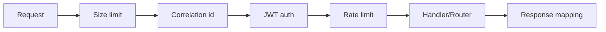

# API Gateway — Architecture

## Middleware-цепочка (порядок)
1. **Size limit** — отсекает тело > лимита до парсинга (`413`).
2. **Correlation id** — `requestId` из `X-Request-Id` или генерация; кладётся в context-var, попадает во все логи/трейсы. Это исключительно correlation id одного HTTP-запроса; биллинг-идемпотентность к нему не привязана (она использует `messageStepId`, [ADR-005](../../adr/ADR-005-idempotency-ledger.md)).
3. **Auth (JWT) + lazy provisioning** — проверка подписи (JWKS, RS256), `exp/iss/aud`; извлечение `sub`, `device_id` (`401`). Затем, **в `get_current_user` после успешной верификации и до downstream**, идемпотентный upsert строки `users` для `sub`: `INSERT INTO users (id) VALUES (:sub) ON CONFLICT (id) DO NOTHING` — гарантирует существование родителя для всех FK-зависимых вставок (race-free). Источник истины идентичности — JWT issuer, `users.id ≡ sub`. См. [ADR-007](../../adr/ADR-007-lazy-user-provisioning.md), [05-security.md](../../05-security.md#модель-идентичности-и-провижининг-пользователей).
4. **Rate limit** — Redis sliding window per user/device/IP (`429`).
5. **Routing → handler** — Pydantic-валидация тела (`extra=forbid`, `422`); сверка `userId==sub` (`403`).
6. **Response mapping** — бизнес-200 vs тех. ошибки; redaction секретов в логах.
7. **Metrics/trace** — фиксация латентности, span.

## Rate limiting
- Алгоритм: sliding window log / token bucket в Redis (ключи `rl:user:<id>`, `rl:dev:<id>`, `rl:ip:<addr>`).
- Лимиты из config/env (дефолты — [05-security.md](../../05-security.md), значения — [Q-003-1](../../99-open-questions.md)).

## Size-лимиты
- Глобальный body-лимит на ASGI-уровне.
- Поле-специфичные лимиты (`message`, `context`, `result`) проверяются в Pydantic-валидаторах соответствующих схем.

## Зависимости реализации
- FastAPI dependencies: `get_current_user`, `get_db`, `get_redis`, `require_owner`.
- Без бизнес-логики: handler делегирует в use-case модуля.
