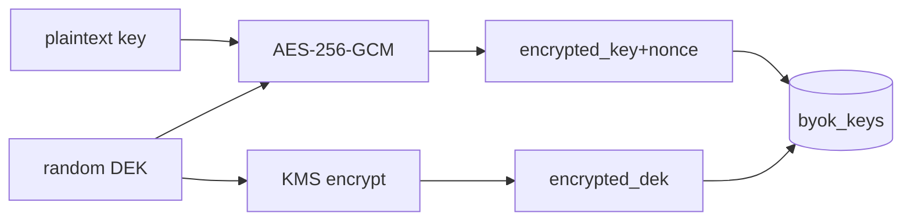

# BYOK — Architecture

## Envelope encryption (ADR-003)
### set
```
dek = random(32)                      # CSPRNG
nonce = random(12)
ciphertext, tag = AES_256_GCM(dek, nonce, plaintext_key)
encrypted_key = ciphertext || tag
encrypted_dek = KMS.encrypt(dek)      # под master key
store(byok_keys: encrypted_key, encrypted_dek, nonce, key_status, enabled)
zeroize(dek, plaintext_key)
```
### get_plaintext_key (internal, для Orchestrator)
```
row = load(byok_keys, userId)
dek = KMS.decrypt(row.encrypted_dek)
plaintext_key = AES_256_GCM_decrypt(dek, row.nonce, row.encrypted_key)
return plaintext_key   # in-memory, не логируется; caller обнуляет после вызова
```



## KMS абстракция ([Q-002-1])
```
class KmsClient:
    def encrypt_dek(plaintext_dek: bytes) -> bytes
    def decrypt_dek(encrypted_dek: bytes) -> bytes
```
Дефолт-реализация под облачный KMS; интерфейс стабилен независимо от провайдера.

## Валидация ключа
- При set: лёгкий запрос к Anthropic под ключом (минимальный) → valid/invalid.
- При обнаружении invalid в рантайме (Anthropic вернул 401) — Orchestrator сообщает BYOK, статус → invalid; следующий policy-evaluate даст `byok_invalid`.

## Безопасность
- Никаких plaintext ключей/DEK в логах, audit, трейсах, ответах.
- Redaction middleware вырезает поля `apiKey`/`*key*`.
