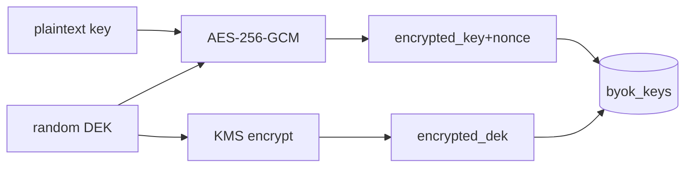

# BYOK — Architecture

## Envelope encryption (ADR-003)
### set
```
dek = random(32)                      # CSPRNG
nonce = random(12)
ciphertext, tag = AES_256_GCM(dek, nonce, plaintext_key)
encrypted_key = ciphertext || tag
encrypted_dek = KMS.encrypt(dek)      # под master key
store(byok_keys: encrypted_key, encrypted_dek, nonce, key_status, enabled)
zeroize(dek, plaintext_key)
```
### get_plaintext_key (internal, для Orchestrator)
```
row = load(byok_keys, userId)
dek = KMS.decrypt(row.encrypted_dek)
plaintext_key = AES_256_GCM_decrypt(dek, row.nonce, row.encrypted_key)
return plaintext_key   # in-memory, не логируется; caller обнуляет после вызова
```



## KMS абстракция ([Q-002-1])
```
class KmsClient:
    def encrypt_dek(plaintext_dek: bytes) -> bytes
    def decrypt_dek(encrypted_dek: bytes) -> bytes
```
Дефолт-реализация под облачный KMS; интерфейс стабилен независимо от провайдера.

## Мульти-провайдерный BYOK ([ADR-044](../../adr/ADR-044-multi-provider-byok.md))

Провайдер BYOK-ключа определяется **по самому ключу**, а не по `LLM_PROVIDER` инстанса. Сервисный (credits) провайдер инстанса остаётся один ([ADR-033](../../adr/ADR-033-llm-provider-abstraction.md)); мульти-провайдерность — **только для byok**.

### Детектор провайдера (`src/app/byok/provider_detect.py`)
`detect_byok_provider(api_key) -> "anthropic" | "openai" | None`. Порядок проверки **строго** (после `strip`):
1. `sk-ant-` → `anthropic` (**раньше** `sk-`, иначе Anthropic-ключ ложно классифицируется как OpenAI);
2. `sk-proj-` → `openai`;
3. `sk-` → `openai`;
4. иначе → `None` (формат не распознан).

Чистая функция: ключ не логируется, не raise, тело не трансформируется. Допустимые провайдеры — `{anthropic, openai}` (то же множество, что `LLM_PROVIDER`).

### Фабрика клиента по провайдеру (`src/app/chat/llm_client.py`)
`llm_client_for(provider) -> LLMClient` — синглтон клиента запрошенного провайдера, **независимо** от `LLM_PROVIDER`:
- `anthropic` → тот же синглтон, что `get_anthropic_client()` (conftest-патч `_anthropic_singleton` продолжает перекрывать);
- `openai` → тот же `_openai_singleton`, что использует `get_llm_client()`;
- иной → `ValueError` (детектор гарантирует только `{anthropic, openai}`).

`get_llm_client()` (активный клиент по env) **сигнатуру не меняет** — делегирует в `llm_client_for(active_provider)`. Оба клиента конструируются на любом инстансе (обе SDK всегда в стеке; конструкторы читают только конфиг). Сервисные ключи провайдеров для byok НЕ используются — ключ пользователя передаётся per-call.

## Валидация ключа ([ADR-044](../../adr/ADR-044-multi-provider-byok.md), ревизует [ADR-016](../../adr/ADR-016-extended-byok-statuses.md))
- При `set`: `provider = detect_byok_provider(apiKey)`.
  - `provider is None` → `key_status = invalid` **без** сетевого вызова (неизвестный формат — нечего валидировать); сохранить зашифрованно, `enabled=False`, `provider=NULL`, `activeModel=null`.
  - иначе → `llm_client_for(provider).validate_key(apiKey)` → `valid|invalid|offline` (маппинг как сейчас, [ADR-016](../../adr/ADR-016-extended-byok-statuses.md)). Anthropic: лёгкий `messages.create(max_tokens=1)`; OpenAI: `models.list`. 401→`invalid`, network/non-401→`offline`, ok→`valid`.
- Сохранить **определённого детектором** провайдера в колонку `byok_keys.provider` (для `valid`/`invalid`/`offline`).
- `activeModel` = BYOK-дефолт **определённого** провайдера (`_active_model_for(key_status, provider)`): `anthropic→BYOK_DEFAULT_MODEL`, `openai→OPENAI_BYOK_DEFAULT_MODEL`; только при `key_status=valid`.
- При обнаружении 401 в рантайме (на использовании, ранее `valid` ключ) — Orchestrator переводит статус → `expired` (`mark_expired`, [ADR-016](../../adr/ADR-016-extended-byok-statuses.md)); следующий policy-evaluate даст `byok_invalid`. Сетевая ошибка статус не меняет.

## Генерация byok ([ADR-044 §5](../../adr/ADR-044-multi-provider-byok.md))
- `_resolve_api_key` (mode=byok): `get_plaintext_key` (in-memory) + провайдер из строки `byok_keys.provider` (без расшифровки ради провайдера); `provider IS NULL` (легаси) → fallback `detect_byok_provider(plaintext)`.
- Клиент генерации = `llm_client_for(byok_provider)` (НЕ активный `self._deps.llm`); ключ per-call через `with_options(api_key=...)`.
- Модель: `sess.model`, **только если** она в allowlist провайдера ключа (`allowed_models_for(byok_provider)`); иначе orchestrator **ЯВНО** подставляет `byok_default_model_for(byok_provider)` в `create_message(model=…)`. `model=None` клиенту НЕ передаётся (иначе клиент взял бы сервисный дефолт `settings.<provider>_model`, а не BYOK-дефолт). Сессионная модель чужого провайдера клиенту другого провайдера НЕ передаётся.
- Биллинг byok — бесплатно ([ADR-006](../../adr/ADR-006-credit-billing-and-subscription-grant.md)), без изменений.

## Безопасность
- Никаких plaintext ключей/DEK в логах, audit, трейсах, ответах. Детектор провайдера ключ не логирует.
- Детект только по известным префиксам; неизвестный формат → `invalid` без зондирования сторонних провайдеров.
- Plaintext-ключ расшифровывается только на генерации; колонка `provider` исключает расшифровку ради `activeModel` на чтениях.
- Redaction middleware вырезает поля `apiKey`/`*key*`.
