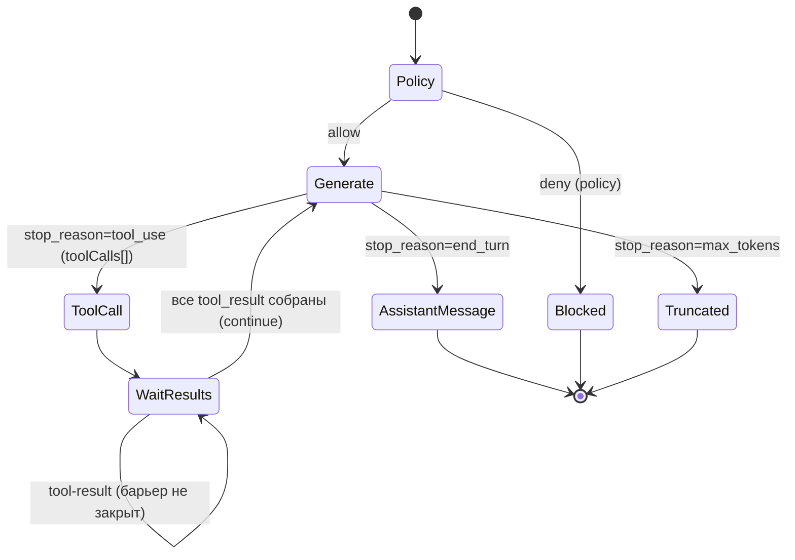

# Chat Orchestrator — Architecture

## Поток /v1/chat/run
0. Сгенерировать `messageStepId` (UUID) для нового пользовательского message-шага. Он будет записан в `chat_steps.message_step_id` и `tool_calls.message_step_id` всех записей этого шага и переиспользован при re-entry из `/chat/tool-result` вплоть до финального assistant_message. Это billing idempotency key (НЕ gateway `requestId`).
1. Загрузить/создать `chat_session` (`mode`, `assistant_mode`, `model` и `project_id` фиксируются на сессию при создании; при resume берутся из сессии — поля запроса игнорируются, [ADR-022 §4](../../adr/ADR-022-optional-project-and-tool-gating.md), [ADR-034](../../adr/ADR-034-user-model-selection.md)). `project_id` может быть `NULL` («чистый чат» без проекта, website-builder отключён для сессии). `model` может быть `NULL` (дефолтная модель инстанса). Валидация выбранной `model` по allowlist активного провайдера — при создании сессии (неизвестная → `422 unsupported_model`, [ADR-034 §3](../../adr/ADR-034-user-model-selection.md)).
2. Вызвать **Policy Engine** `evaluate(state, mode)`.
   - `blocked` → записать audit policy_decision, вернуть `200 {status:blocked, blockReason}`. Списания нет.
3. Разрешить источник ключа:
   - `mode=credits` → сервисный `ANTHROPIC_API_KEY`.
   - `mode=byok` → запросить plaintext ключ у **BYOK Service** (in-memory).
4. Реконструировать контекст: системный промт (с `cache_control`) + история из `chat_steps` (`list_steps`, **сортировка по `seq` ASC** — монотонный порядок вставки, НЕ `(created_at, id)`; [ADR-021](../../adr/ADR-021-deterministic-step-order-and-block-normalization.md)) + новое сообщение. **При наличии `attachments[]` ([ADR-020](../../adr/ADR-020-inline-base64-attachments-mvp.md)):** валидировать (allowlist `mediaType`, magic bytes, лимиты до декодирования, base64-валидность, PDF page-guard); собрать Anthropic content-блоки нового user-turn (image/document/text — полные, in-memory); в `chat_steps.payload` записать **лёгкий текстовый плейсхолдер вложения**, НЕ base64 (см. [§ Мультимодальные вложения](#мультимодальные-вложения-inline-base64-adr-020)).
5. Вызвать **Anthropic** `messages.create` с определением tools и prompt caching. Tool definitions строятся `anthropic_tool_definitions()` с **anthropic-именами** (`files_read`, `calendar_create_events`, …) — см. [02-api-contracts.md §Имена tools](02-api-contracts.md#имена-tools-доменный-ios-vs-anthropic-формат). Anthropic API требует `^[a-zA-Z0-9_-]{1,128}$`; dotted-имя → `400` (BUG-3). **Набор tools фильтруется по наличию `chat_sessions.project_id` ([ADR-022](../../adr/ADR-022-optional-project-and-tool-gating.md)):** `project_id IS NULL` → `site.*` (`SERVER_SIDE_TOOLS`) исключаются; `project_id IS NOT NULL` → полный набор. См. [§Гейтинг site.* tools](#гейтинг-site-tools-по-наличию-проекта-adr-022).
6. Обработать ответ (диспетчеризация по `stop_reason`, [ADR-025](../../adr/ADR-025-parallel-tool-calls-and-max-tokens-truncation.md)):
   - `stop_reason="tool_use"` → ветка tool_use (ниже). **Условие — именно `stop_reason="tool_use"`** (не «есть tool_use-блоки в content»): при `stop_reason="max_tokens"` блоки `tool_use` могут присутствовать в content, но они **неполны** и в эту ветку не идут.
   - `stop_reason="max_tokens"` (**обрезка**, [ADR-025](../../adr/ADR-025-parallel-tool-calls-and-max-tokens-truncation.md)) → **НЕ** трактовать как финальный `assistant_message` и **НЕ** выдавать неполные `tool_use`. Персистировать обрезанный assistant-шаг (для истории/диагностики); вернуть `status=blocked`, `blockReason=max_tokens`, с `usage` обрезанного хода, `messageStepId` = ход, `stepId` = id обрезанного шага (НЕ null), `assistantMessage` = частичный текст (если был). **Кредит НЕ списывается** (см. §8). Обрезанные `tool_use`-блоки исключаются из continuation-реплея (re-entry по такому ходу не предусмотрен).
   - иначе (`end_turn`/`stop_sequence`, текст) → `status=assistant_message`.
   - **ветка `tool_use`** → применить **обратный маппинг** `anthropic-name → domain-name` (`files_read`→`files.read`); для **каждого** `tool_use`-блока хода создать `tool_calls(status=pending)` с доменным `tool_name`, сгенерированным доменным `id` (UUID) и `provider_tool_use_id = <raw tool_use.id блока>` (`toolu_...`); вернуть `status=tool_call` с **`toolCalls[]`** — все client-side tool-вызовы хода (типизированный payload), где каждый `id` — **доменный UUID**, `name` — **доменный формат с точкой**; `toolCall` (одиночный, deprecated) = `toolCalls[0]`. Server-side `site.*` исполняются на бэке немедленно и в `toolCalls[]` НЕ попадают ([ADR-011](../../adr/ADR-011-server-side-tools.md)). Raw anthropic `tool_use.id` наружу не отдаётся. См. [§Параллельные client-side tool-вызовы](#параллельные-client-side-tool-вызовы-и-барьер-хода-adr-025).
7. Записать `chat_steps` (assistant, usage с `cacheReadTokens`/`cacheWriteTokens`). `payload` хранит content blocks **нормализованными** ([ADR-021](../../adr/ADR-021-deterministic-step-order-and-block-normalization.md)): raw `tool_use.id` (`toolu_...`) сохраняется дословно — для реплея при continuation (см. [§ Согласованность tool_use.id](#согласованность-tool_useid-в-истории-anthropic-bug-4)), но служебные поля SDK (`caller` из `block.model_dump()`) вырезаются и не попадают в реплей (см. [§ Детерминированный порядок шагов и нормализация payload](#детерминированный-порядок-шагов-и-нормализация-payload-adr-021)). Порядок шага в сессии определяется `chat_steps.seq` (монотонный identity), НЕ `created_at`.
8. **Списание кредитов** (`mode=credits`, [ADR-006](../../adr/ADR-006-credit-billing-and-subscription-grant.md)):
   - Debit происходит **только** при `status=assistant_message` (успешная финальная генерация),
     **после** записи `chat_steps`.
   - При `status=tool_call` (промежуточный tool-раунд) списание **НЕ выполняется** —
     ждём `tool-result` и продолжения.
   - При `status=blocked` с `blockReason=max_tokens` (обрезка, [ADR-025](../../adr/ADR-025-parallel-tool-calls-and-max-tokens-truncation.md)) списание **НЕ выполняется** (обрыв — не успешный финальный assistant_message; trial-flip также не выполняется). Пользователь не платит за оборванную генерацию.
   - Вызов: **Wallet** `consume(idempotency_key=messageStepId, amount=1)` — `messageStepId` передаётся
     в публичное поле `requestId` контракта `/wallet/consume`. `meta` хранит usage(inputTokens/outputTokens/model)
     для аудита (на `amount` не влияет). Затем audit `billing_debit`.
9. Audit шага.

## Поток /v1/chat/tool-result
Принимает **батч** `results[]` (или одиночную deprecated-форму, [ADR-025](../../adr/ADR-025-parallel-tool-calls-and-max-tokens-truncation.md)).
1. Нормализовать вход: одиночная форма → `results = [{toolCallId, result|error}]`. Для **каждого** элемента найти `tool_calls` по `toolCallId` (доменный UUID); проверить `session_id == sessionId` (иначе 404/403) и принадлежность одному ходу (один `message_step_id`); дубль `toolCallId` в батче → `422`. Восстановить `messageStepId` из `tool_calls.message_step_id` (тот же на весь message-шаг; debit на финальном шаге использует его как idempotency key) и `provider_tool_use_id` (raw `toolu_...`) каждого.
2. Идемпотентность поэлементно: если `tool_call.status` уже `completed/errored` → результат не перезаписывать; если барьер хода уже закрыт и continuation-шаг сохранён → вернуть его, не вызывая Anthropic ([ADR-005](../../adr/ADR-005-idempotency-ledger.md)).
3. Атомарно для каждого элемента `pending → completed/errored`; сохранить `result`.
4. Audit мутирующего tool-действия (для mutate-tools), поэлементно.
5. **Барьер хода ([ADR-025](../../adr/ADR-025-parallel-tool-calls-and-max-tokens-truncation.md)):** собрать множество client-side `tool_calls` этого `message_step_id`. Если **не все** completed/errored → вернуть `status=tool_call` с `toolCalls[]` = оставшиеся (без вызова Anthropic, без биллинга). Если **все** собраны → продолжить (шаг 6).
6. Re-evaluate Policy (доступ мог измениться); продолжить с шага 3 потока run (повторный вызов Anthropic). При сборке messages **все** `tool_result`-блоки хода (client-side из этого/прошлых батчей + server-side, исполненные на бэке) формируются с `tool_use_id = tool_calls.provider_tool_use_id` (НЕ доменный UUID, НЕ свежий uuid4) — см. [§ Согласованность tool_use.id](#согласованность-tool_useid-в-истории-anthropic-bug-4). Continuation-виток выполняется **один раз** на закрытие барьера.


> `Truncated` = `status=blocked`, `blockReason=max_tokens` ([ADR-025](../../adr/ADR-025-parallel-tool-calls-and-max-tokens-truncation.md)): неполные `tool_use` не отдаются, кредит не списывается, `usage`/`stepId` присутствуют. `toolCalls[]` — все client-side вызовы хода; continuation — только при закрытом барьере (все `tool_result` собраны).

## Маппинг имён tools (BUG-3)
Anthropic Messages API не принимает точку в имени tool (`^[a-zA-Z0-9_-]{1,128}$`). Чтобы не менять публичный iOS-контракт (доменные имена с точкой, ТЗ §5), вводится двунаправленный статический маппинг `domain ↔ anthropic` (замена `.`↔`_`, таблица — [02-api-contracts.md](02-api-contracts.md#имена-tools-доменный-ios-vs-anthropic-формат)).

Две и только две точки применения маппинга, обе в слое Anthropic-клиента:
1. **At request build** — `anthropic_tool_definitions()` отдаёт `tools[].name` в **anthropic-формате** (forward: `files.read`→`files_read`). Применяется и в `/chat/run` (шаг 5), и при продолжении из `/chat/tool-result` (повторный `messages.create` с tool_result-блоком).
2. **At tool_use parse** — при разборе `content` block `type=tool_use` из ответа Claude применяется **reverse** (`files_read`→`files.read`) до создания `tool_calls` и до формирования `toolCall.name`.

Инварианты:
- За пределами этих двух точек (БД `tool_calls.tool_name`, audit, ответы API, типизация args/result) — **только доменные имена с точкой**.
- Неизвестное anthropic-имя в ответе Claude → ошибка обработки (upstream-аномалия), не транслируется в iOS как валидный tool.
- Маппинг — статическая таблица из 8 пар; backend не «угадывает» преобразование строкой, а валидирует по таблице.

## Провайдер-абстракция LLM (Anthropic | OpenAI) (ADR-033)

Сервис разворачивается мульти-инстансно на разных LLM-провайдерах **одним кодом** (не форк, [ADR-033](../../adr/ADR-033-llm-provider-abstraction.md)). Провайдер выбирается env **`LLM_PROVIDER ∈ {anthropic, openai}`, дефолт `anthropic`** — существующие инстансы `claude-ios`/`avelyra` поведение не меняют. **Один провайдер на инстанс**: `chat_steps.payload` хранит wire-формат активного провайдера; кросс-провайдерный реплей в одной БД не поддерживается (инвариант, не дефект).

### Интерфейс `LLMClient` и нейтральный результат

Нейтральный Protocol/ABC `LLMClient` (`src/app/chat/llm_client.py`). `AnthropicClient` (`anthropic_client.py`, как есть) и новый `OpenAIClient` (`openai_client.py`) — реализации. Factory `get_llm_client()` по `LLM_PROVIDER`. Orchestrator/BYOK инжектят **`LLMClient`** (не `AnthropicClient`).

| Нейтральный тип | Поля | Замена |
|---|---|---|
| `LLMResult` | `stop_reason: NeutralStopReason`, `content_blocks: list[dict]` (wire активного провайдера, для персиста), `usage: LLMUsage`, `text: str`, `tool_uses: list[{id(provider raw), name(domain dotted), input(dict)}]` | `AnthropicResult` |
| `LLMUsage` | `input_tokens`, `output_tokens`, `model`, `cache_read_tokens`, `cache_write_tokens` | `AnthropicUsage` |
| `KeyValidation` | `valid` \| `invalid` \| `offline` | без изменений ([ADR-016](../../adr/ADR-016-extended-byok-statuses.md)) |

### Нормализованный `stop_reason` (канонический словарь)

Orchestrator диспетчеризует **только** по каноническим значениям `{tool_use, max_tokens, end_turn}` ([ADR-025](../../adr/ADR-025-parallel-tool-calls-and-max-tokens-truncation.md) — диспетчеризация по `stop_reason`, не по наличию tool_use-блоков). Каждый клиент мапит свой wire stop_reason:

| Канонический | Anthropic `stop_reason` | OpenAI `finish_reason` |
|---|---|---|
| `tool_use` | `tool_use` | `tool_calls` |
| `max_tokens` | `max_tokens` | `length` |
| `end_turn` | `end_turn` / `stop_sequence` / прочее | `stop` / `content_filter` / прочее |

**Backend-задача:** заменить в orchestrator строковые литералы Anthropic (`result.stop_reason == "max_tokens"`/`== "tool_use"`) на сравнение с каноническими значениями `NeutralStopReason`.

### Граница orchestrator ↔ client (ЦЕНТРАЛЬНОЕ — провайдер-агностичность персиста)

Вся провайдер-специфичная (де)сериализация wire-формата — **ВНУТРИ клиента**. Orchestrator и персист провайдер-агностичны.

**Что orchestrator ПЕРЕДАЁТ клиенту (`create_message`):**
1. `system_prompt: str` — как сейчас.
2. `messages` — **нейтральная история** из `chat_steps` (`_build_messages`): список `{role: user|assistant|tool, content_blocks: [...]}`, где `content_blocks` для user/assistant — wire-блоки активного провайдера из `payload`, для tool-шага — доменная запись `{toolCallId, providerToolUseId, toolName, result|error}`. **Клиент** строит из неё провайдер-messages (Anthropic — как сейчас `_build_messages`-логика уезжает в клиент или клиент принимает уже собранное; OpenAI — Chat Completions messages: assistant с `tool_calls`, role=`tool` с `tool_call_id`).
3. `tools` — **нейтральные определения** `{name(domain dotted), description, input_schema}`. Per-provider сериализацию делает клиент (см. ниже).
4. `attachments: PreparedAttachments | None` — нейтральные вложения первого turn. **Клиент строит провайдер content-блоки** (orchestrator больше не собирает Anthropic image/document-блоки сам, см. [§Мультимодальные вложения](#мультимодальные-вложения-inline-base64-adr-020)).
5. `api_key: str | None` — BYOK override, как сейчас.
6. `model: str | None` — выбранная модель сессии ([ADR-034](../../adr/ADR-034-user-model-selection.md)). Orchestrator передаёт `sess.model or None`; `None` (дефолт) → **клиент берёт свою дефолтную модель** (`settings.<provider>_model`) — текущее поведение. Orchestrator сам дефолт не подставляет (единая точка дефолта в клиенте, провайдер-агностично). Аддитивный kwarg, не ломает существующие вызовы.

**Что клиент ВОЗВРАЩАЕТ (`LLMResult`):**
- `content_blocks` — **wire-формат активного провайдера** для `chat_steps.payload` (Anthropic — как сейчас; OpenAI — нормализованный assistant-message, достаточный для реплея), **уже нормализованный** клиентом на границе персиста (per-provider allowlist, [ADR-021](../../adr/ADR-021-deterministic-step-order-and-block-normalization.md)).
- `tool_uses` — **доменные** `{id(provider raw), name(domain dotted), input(dict)}`. Клиент уже применил reverse-map имени и (OpenAI) распарсил `arguments` из JSON-строки в dict. Orchestrator получает однородный результат независимо от провайдера.

**Что orchestrator ХРАНИТ:** `content_blocks` дословно. Реплей читает payload как нейтральную историю и отдаёт клиенту.

**Инвариант минимизации изменений orchestrator:** биллинг, барьер хода, server-side tool-loop, idempotency, `seq`-порядок — **не меняются**; меняется только тип инъекции (`LLMClient`), нейтрализация `stop_reason` и перенос сборки provider-messages/attachment-блоков в клиент.

### `provider_tool_use_id` обобщается (ADR-008 → ADR-033)

`tool_calls.provider_tool_use_id` ([ADR-008](../../adr/ADR-008-provider-tool-use-id.md)) хранит raw provider id: Anthropic — `toolu_...`; **OpenAI — `call_...`** (`tool_calls[].id`). Семантика та же — непрозрачная строка провайдера для согласования tool_use↔tool_result в реплее. Имя колонки/поля не меняется (provider-нейтральная семантика). [§Согласованность tool_use.id](#согласованность-tool_useid-в-истории-anthropic-bug-4) и [§Доменная нормализация payload](#доменная-нормализация-payload-истории-при-отдаче-adr-024) работают поверх той же карты `provider_tool_use_id → domain id` независимо от провайдера.

### Tools per-provider (переиспользование underscore-map)

Нейтральное определение (single source — `tools.py`): `{name(domain dotted), description, input_schema}`. Per-provider сериализация внутри клиента:
- **Anthropic:** `{name(underscore), description, input_schema}` (`anthropic_tool_definitions()`).
- **OpenAI:** `{type:"function", function:{name(underscore), description, parameters(=input_schema)}}`.

**Underscore-map ([§Маппинг имён tools (BUG-3)](#маппинг-имён-tools-bug-3)) переиспользуется без изменений:** OpenAI function name тоже `^[a-zA-Z0-9_-]{1,64}$` — **точки запрещены у обоих** провайдеров. Та же таблица `_DOMAIN_TO_ANTHROPIC`/`to_anthropic_tool_name`/`to_domain_tool_name` применяется к OpenAI (имя/тип переименовываются в нейтральные, но значения и dot↔underscore-семантика идентичны). **Reverse-map при парсинге OpenAI tool_calls:** `function.name` (underscore) → domain через `to_domain_tool_name`; `function.arguments` — **JSON-строка**, клиент парсит в dict (невалидный JSON / неизвестное имя → `ValidationFailedError`, как upstream-аномалия). Anthropic отдаёт `input` уже dict — результат одинаков.

### Attachments per-provider

`prepare_attachments` даёт нейтральный `PreparedAttachments`; построение провайдер content-блоков параметризуется провайдером:
- **Anthropic:** image/document(PDF)/text — как сейчас.
- **OpenAI:** image → `{type:"image_url", image_url:{url:"data:<mediaType>;base64,<data>"}}`; text → текстовый блок; **PDF (class `document`) → `ValidationFailedError` (422 `unsupported_media_type`)** — Chat Completions vision не принимает PDF ([TD-023](../../100-known-tech-debt.md), [05-security.md](../../05-security.md)). Валидация (allowlist/magic-bytes/лимиты/page-guard) — общая, до провайдер-ветвления; PDF-reject для OpenAI — отдельная провайдер-aware проверка.

### Нормализация payload per-provider

[ADR-021](../../adr/ADR-021-deterministic-step-order-and-block-normalization.md) (стрип не-wire SDK-полей) — per-provider: Anthropic `_BLOCK_WIRE_FIELDS` (как сейчас); OpenAI — собственный allowlist полей assistant-message/tool_calls. Выполняется **внутри клиента** на границе персиста. `seq`-порядок и барьер хода — провайдер-агностичны.

### Observability per-provider

Вводится обобщённая метрика **`llm_upstream_errors_total`** с label `provider ∈ {anthropic, openai}` (+ `status_code`/`error_type`). **Факт реализации (`metrics.py`):** legacy `anthropic_upstream_errors_total` **сохранена ПАРАЛЛЕЛЬНО** с `llm_upstream_errors_total{provider}` — обе инкрементируются на anthropic-пути (`anthropic_client.py`), OpenAI-путь (`openai_client.py`) пишет только `llm_upstream_errors_total{provider="openai"}`. Legacy-имя оставлено осознанно для обратной совместимости дашбордов/тестов ([ADR-033 §10](../../adr/ADR-033-llm-provider-abstraction.md)). Контракт логирования upstream-ошибок ([§Логирование upstream-ошибок](#логирование-upstream-ошибок-anthropic-td-014)) применяется к обоим клиентам (OpenAI: `openai.AuthenticationError`/`APITimeoutError`/`APIConnectionError`/`APIStatusError` → те же доменные `AuthError`/`UpstreamError`; событие лога `llm_upstream_error`). OpenAI-ключ — под redaction (покрыт денилистом `key`/`secret`).

## Параллельные client-side tool-вызовы и барьер хода (ADR-025)

Claude в одном assistant-ходе может вернуть **несколько** `tool_use`-блоков (parallel tool use). Хранение это уже поддерживает поблочно ([ADR-008](../../adr/ADR-008-provider-tool-use-id.md): каждый блок → свой `tool_calls` с domain id + `provider_tool_use_id`). [ADR-025](../../adr/ADR-025-parallel-tool-calls-and-max-tokens-truncation.md) распространяет это на публичный ответ и continuation.

**Нормативный контракт:**
1. **Surface всех client-side tool_use.** `_handle_tool_use` собирает **список** всех client-side `ToolCallOut` хода → `ChatResponse.toolCalls[]` (порядок = порядок блоков ответа Claude). `toolCall` (одиночный, deprecated) = `toolCalls[0]`. Server-side `site.*` исполняются на бэке немедленно и в `toolCalls[]` не попадают ([ADR-011](../../adr/ADR-011-server-side-tools.md)). **Прежний дефект:** `first_client_out` (только первый) — остальные client-side вызовы терялись для клиента → orphan `tool_use` на continuation → Anthropic `400` → `502`.
2. **Один assistant-шаг.** Все `tool_use`-блоки одного хода → **один** assistant-шаг (`chat_steps`, payload с несколькими блоками). `ChatResponse.stepId` ([ADR-023](../../adr/ADR-023-sync-ids-in-chat-response.md)) указывает на этот шаг; все `toolCalls[]` принадлежат ему; `messageStepId` — один ход. `assistantMessage` ([ADR-024](../../adr/ADR-024-history-payload-domain-normalization.md)) — сопутствующий `text` того же шага.
3. **Барьер хода.** Continuation-виток к Anthropic разрешён **только** когда все client-side `tool_use` хода имеют `tool_result` (completed/errored) — иначе orphan `tool_use`. До закрытия барьера `/chat/tool-result` отвечает `status=tool_call` с оставшимися `toolCalls[]`, без вызова Anthropic и без биллинга.
4. **Смешанный ход (server-side + client-side).** Server-side `site.*` исполнить немедленно (как [ADR-011](../../adr/ADR-011-server-side-tools.md)), записать их `tool_result` на бэке; client-side вернуть в `toolCalls[]` и ждать их результатов. Continuation-виток собирает `messages` со **всеми** `tool_result` хода (server-side + client-side) перед следующим `messages.create`; порядок шагов — по `seq` ([ADR-021](../../adr/ADR-021-deterministic-step-order-and-block-normalization.md)).
5. **Биллинг неизменен** ([ADR-006](../../adr/ADR-006-credit-billing-and-subscription-grant.md)): 1 кредит = 1 message-step; списание один раз на финальном `assistant_message` хода — **не** на каждый tool и **не** на каждый `/chat/tool-result`.

**Инвариант синка ([ADR-024](../../adr/ADR-024-history-payload-domain-normalization.md)):** для каждого `i` `toolCalls[i].name`/`.id` дословно совпадают с соответствующим `tool_use`-блоком шага `stepId` в `GET /v1/chats/{id}` → `steps[].payload.content[]` и с `name` в `/v1/tools`. Provider `toolu_...` наружу не утекает ни в одном из путей.

## Обработка обрезки по max_tokens (ADR-025)

`anthropic_client.create_message` — non-streaming, `max_tokens = ANTHROPIC_MAX_TOKENS`. При недостаточном лимите Claude обрывает ход с `stop_reason="max_tokens"`; в `content` могут быть **неполные** `tool_use`-блоки (например `files.write` без `content`).

**Нормативный контракт ([ADR-025](../../adr/ADR-025-parallel-tool-calls-and-max-tokens-truncation.md)):**
1. **Диспетчеризация по `stop_reason`, не по наличию tool_use-блоков.** Ветка tool_use берётся **только** при `stop_reason="tool_use"`. **Прежний дефект:** условие `if stop_reason == "tool_use"` без обработки `max_tokens` → обрезанный ход с tool_use-блоками уходил в else → `status=assistant_message`, `toolCall=null`, неполные `tool_use` молча терялись (но персистились в `chat_steps.payload` как неполные блоки).
2. **`stop_reason="max_tokens"` → `status=blocked`, `blockReason=max_tokens`** (HTTP 200, [ADR-004](../../adr/ADR-004-blocked-http-200.md)). Неполные `tool_use` наружу **НЕ** отдаются (`toolCall`/`toolCalls` отсутствуют) — `input` неполон, исполнять нельзя.
3. **Семантика id/usage (отличие от policy-blocked):** `messageStepId` = ход, `stepId` = id обрезанного assistant-шага (**НЕ** null — ход/шаг создаются, Claude сгенерировал контент); `usage` присутствует (реальный usage хода, `outputTokens ≈ max_tokens`); `assistantMessage` = частичный `text` (если был). policy-blocked (deny **до** генерации) остаётся `messageStepId=null`/`stepId=null`/без `usage`.
4. **Биллинг:** кредит **не** списывается (обрыв — не успешный финальный `assistant_message`); trial-flip не выполняется (см. [§Биллинг кредитов](#биллинг-кредитов-правило-списания) / поток run §8).
5. **Continuation:** re-entry по `max_tokens`-обрезанному ходу не предусмотрен (исполнять/реплеить неполные `tool_use` нельзя); обрезанный шаг персистится для истории, но его неполные `tool_use`-блоки исключаются из continuation-реплея. Клиентский UX — повторить/сократить запрос.
6. **Дефолт `ANTHROPIC_MAX_TOKENS=16000`** ([02-tech-stack.md](../../02-tech-stack.md), config + `.env*`, per-instance) делает обрезку редкой; п.2–5 — safety-net, не штатный путь. non-streaming сохраняется на MVP; streaming + partial-tool_use accumulation — [TD-018](../../100-known-tech-debt.md). `ANTHROPIC_TIMEOUT_SECONDS` поднят до 120 под более длинные ходы.

## Гейтинг site.* tools по наличию проекта (ADR-022)

Сервис — прежде всего **чат-агрегатор**; website-builder (`site.*`) — **опциональная** фича. Набор tools, предлагаемый Claude, **зависит от наличия `chat_sessions.project_id`** сессии ([ADR-022](../../adr/ADR-022-optional-project-and-tool-gating.md)).

**Нормативный контракт гейтинга:**
1. `project_id IS NULL` («чистый чат», создан без `projectId`) → tools для `messages.create` = все client-side (`files.*`/`calendar.*`/`reminders.*`) **минус** `SERVER_SIDE_TOOLS` (`site.*`). Claude `site.*` не видит и вызвать не может.
2. `project_id IS NOT NULL` → полный набор tools (включая `site.*`), как до ADR-022.
3. Гейт по `project_id` — **НЕ единственный целевой** фильтр `site.*`. **Целевой контракт (Q-012-1 Open):** доступность `site.*` определяется **И-композицией двух ортогональных осей** одного реестра: ось A — наличие проекта (`project_id IS NOT NULL`, ADR-022); ось B — тип ассистента (`assistant_mode` допускает `site.*`, [Q-012-1](../../99-open-questions.md)/[ADR-012 §25](../../adr/ADR-012-assistant-mode-vs-billing-mode.md): дефолт `code` — допускает, `chat` — реестр без `site.*`/`files.*`). Целевой итог: `offer(site.*) ⟺ (project_id IS NOT NULL) AND (assistant_mode допускает site.*)`. **Сейчас реализована ось A (`project_id`)**: `anthropic_tool_definitions(include_server_side=...)` фильтрует `SERVER_SIDE_TOOLS` по наличию проекта; orchestrator передаёт `include_server_side` в `_generate_loop` на основе `project_id` сессии. **Ось B (`assistant_mode`) — [Q-012-1](../../99-open-questions.md) Open, сознательно НЕ реализована** (согласовано с docstring `anthropic_tool_definitions` в `tools.py`). При закрытии Q-012-1 ось B складывается по И тем же параметром `include_server_side` (фильтрация реестра по `assistant_mode`), без слома оси A.
4. **Defensive-guard:** `_external_project_id()` (резолв проекта для исполнения `site.*`) вызывается **только** на ветке с непустым `project_id`. Если при `project_id IS NULL` Claude всё же вернёт `tool_use` с именем из `SERVER_SIDE_TOOLS` (не должно случиться — tool не предлагался), backend `site.*` **не исполняет**: трактует как upstream-аномалию обработки tool_use (как неизвестное имя tool, ADR-008), наружу как валидный tool не транслирует.

**Инвариант:** в «чистом чате» (`project_id IS NULL`) ни один `site.*` не предлагается и не исполняется → нет резолва проекта → IDOR по проекту невозможен по построению (усиление IDOR-guard [ADR-011](../../adr/ADR-011-server-side-tools.md)). Биллинг/policy от наличия `project_id` не зависят (1 кредит = 1 сообщение).

> **`time.now` под этот гейт НЕ подпадает.** `time.now` — **global** server-side tool ([ADR-026](../../adr/ADR-026-global-server-side-tools-and-time-now.md), `GLOBAL_SERVER_SIDE_TOOLS`), а не project-scoped `SERVER_SIDE_TOOLS`. Флаг `include_server_side` (= «есть проект») гейтит **только** `site.*`; `time.now` предлагается Claude **всегда** (включая `project_id IS NULL`). См. [§Global server-side tools и `time.now`](#global-server-side-tools-и-timenow-adr-026).

## Global server-side tools и `time.now` (ADR-026)

Сервис — чат-агрегатор; основной flow — «чистый чат» **без проекта** ([ADR-022](../../adr/ADR-022-optional-project-and-tool-gating.md)). Модели нужен инструмент текущей даты/времени, доступный **всегда** (репорт iOS: «модель отвечает 2024 год», т.к. системный промт статичен и не несёт даты). Существующий server-side класс `site.*` ([ADR-011](../../adr/ADR-011-server-side-tools.md)) для этого непригоден: он project-scoped (`assert external_project_id is not None`, предлагается только при `project_id IS NOT NULL`). Вводится **новый класс — server-side global** ([ADR-026](../../adr/ADR-026-global-server-side-tools-and-time-now.md)).

**Три класса инструментов:**

| Класс | Реестр | Исполнитель | Проект | Предлагается |
|---|---|---|---|---|
| client-side | `files.*`/`calendar.*`/`reminders.*` | iOS (round-trip) | — | по `assistant_mode` ([Q-012-1](../../99-open-questions.md)) |
| server-side, project-scoped | `SERVER_SIDE_TOOLS` (`site.*`) | backend в loop | **да** | только при `project_id IS NOT NULL` |
| **server-side, global** | `GLOBAL_SERVER_SIDE_TOOLS` (`time.now`) | backend в loop | **нет** | **ВСЕГДА** |

**Нормативный контракт маршрутизации (`_handle_tool_use`):**
1. Реестры `SERVER_SIDE_TOOLS` и `GLOBAL_SERVER_SIDE_TOOLS` **не пересекаются** (инвариант). Совокупность server-side = их объединение; остальное — client-side.
2. Для каждого `tool_use`-блока ветка global проверяется **ДО** project-scoped:
   - `tool_name ∈ GLOBAL_SERVER_SIDE_TOOLS` → исполнить немедленно через global-handler **без** `external_project_id` и **без** опоры на `has_project`; персистировать tool-шаг (`role="tool"`, `providerToolUseId`), записать `tool_call_completed` audit; продолжить loop к Anthropic. В `toolCalls[]` наружу **НЕ** отдавать.
   - иначе `tool_name ∈ SERVER_SIDE_TOOLS` → как [ADR-011](../../adr/ADR-011-server-side-tools.md)/[ADR-022](../../adr/ADR-022-optional-project-and-tool-gating.md): `assert external_project_id is not None`, исполнить через `SiteToolHandlers` (project-scoped).
   - иначе client-side → собрать в `toolCalls[]`, hand-off к iOS.
3. `assert external_project_id is not None` ([ADR-022](../../adr/ADR-022-optional-project-and-tool-gating.md) §guard) применяется **только** к project-scoped `SERVER_SIDE_TOOLS`. Global server-side tools проходят мимо guard'а — для них «нет проекта» не аномалия, а штатный режим.
4. `anthropic_tool_definitions(include_server_side=...)`: флаг гейтит **только** `SERVER_SIDE_TOOLS`; `GLOBAL_SERVER_SIDE_TOOLS` под фильтр не попадают (предлагаются всегда). Ось B (`assistant_mode`, [Q-012-1](../../99-open-questions.md)) на `time.now` **не** действует — utility-tool полезен в обоих режимах.
5. Барьер хода ([ADR-025](../../adr/ADR-025-parallel-tool-calls-and-max-tokens-truncation.md)) учитывает **только client-side** вызовы. Global server-side (как `site.*`) исполнены немедленно — в барьер не входят.

**Executor (рекомендация [ADR-026 §5](../../adr/ADR-026-global-server-side-tools-and-time-now.md)).** Отдельный `GlobalToolHandlers` (`src/app/chat/global_tools.py`), **не зависящий** от `WebsiteService`/`SiteToolHandlers`/проекта; возвращает `ToolExecution` (тот же контракт, что `SiteToolHandlers`); время берёт через инъектируемый `Clock` (детерминизм qa). Регистрируется в `_Deps` рядом с `site_tools`.

**`time.now` — контракт результата/ошибок:** [02-api-contracts.md §`time.now`](02-api-contracts.md#timenow--server-side-global-tool-adr-026) (UTC всегда `utc`/`unix`/`weekday`; при валидном `tz` — `local`/`timezone`; невалидный `tz` → tool-result error `invalid_timezone`, ход не падает). Не мутирующий → нет `tool_mutation` audit. Биллинг неизменен ([ADR-006](../../adr/ADR-006-credit-billing-and-subscription-grant.md)).

**Системный промт (оба режима, статичен).** В `_SYSTEM_PROMPT_CHAT` и `_SYSTEM_PROMPT_CODE` добавляется одинаковая **статичная** EN-инструкция (дата НЕ вписывается): *«You do not have built-in knowledge of the current date or time. If the user's request depends on the current date, time, or day of the week, call the `time.now` tool to get it; do not guess.»* Поскольку строка статична (без даты), системный промт остаётся стабильным → **prompt cache (`cache_control: ephemeral`) не инвалидируется** ([ADR-026 §7](../../adr/ADR-026-global-server-side-tools-and-time-now.md), [§Prompt caching](#prompt-caching)). Дата приходит только в tool-result, вне кэшируемого префикса.

## Согласованность tool_use.id в истории Anthropic (BUG-4)

**Проблема.** Anthropic Messages API требует, чтобы при continuation `tool_result.tool_use_id` **точно** совпадал с `tool_use.id` соответствующего блока предыдущего assistant-хода в `messages`. Реальный Anthropic `tool_use.id` имеет формат `toolu_01...` (произвольная строка, **не** UUID). Ранее backend генерировал доменный `toolCallId` из id ответа: `uuid.UUID(id) if _is_uuid(id) else uuid.uuid4()`. Для реального Claude id не-UUID → подставлялся свежий `uuid4`. При этом `chat_steps.payload` реплеился дословно (raw `toolu_...`), а `tool_result.tool_use_id` строился из доменного `uuid4` → **рассогласование** → Anthropic `400` → backend `502`. Continuation ломался в production; unit-тесты не ловили, т.к. fake-клиент отдавал UUID-образный id.

**Решение ([ADR-008](../../adr/ADR-008-provider-tool-use-id.md)): хранить raw provider id отдельно.** Доменный `toolCallId` (UUID) генерируется **независимо** (`uuid4`, без попытки распарсить anthropic id), а raw `tool_use.id` сохраняется в `tool_calls.provider_tool_use_id`.

**Нормативный контракт согласованности id:**

1. **При генерации шага (`/chat/run`, разбор `tool_use`):**
   - Доменный `tool_calls.id` = свежий `uuid4`. **Запрещено** выводить доменный id из anthropic `tool_use.id` (исходный баг). `_is_uuid`-ветка удаляется.
   - `tool_calls.provider_tool_use_id` = raw `tool_use.id` блока ответа (`toolu_...`), сохраняется как есть.
   - `chat_steps.payload` сохраняет assistant content blocks **дословно** (с raw `tool_use.id`).
   - Наружу (`toolCall.id`) — только доменный UUID.

2. **При continuation (`/chat/run` re-entry и `/chat/tool-result`, сборка `messages` для `messages.create`):**
   - Прошлые assistant-ходы реплеятся из `chat_steps.payload` **дословно** — raw `tool_use.id` не переписывается.
   - tool_result-блок текущего раунда формируется с `tool_use_id = tool_calls.provider_tool_use_id` найденного по доменному `toolCallId` tool_call. **Никогда** не доменный UUID и **никогда** не свежий uuid4.
   - При `error` в tool-result — тот же `provider_tool_use_id`, плюс `is_error=true`.

**Инварианты:**
- Для любого `tool_use` блока в реплеемой истории существует ровно один `tool_calls` с `provider_tool_use_id == <этот tool_use.id>`; tool_result этого раунда ссылается на тот же `provider_tool_use_id`. Пара id в истории Anthropic согласована по построению.
- Domain `toolCallId` (UUID) — **публичный** (iOS-контракт, ответы API, request `/chat/tool-result`). Provider `tool_use.id` (`toolu_...`) — **внутренний** (только Anthropic message history: `tool_use.id` в реплее + `tool_result.tool_use_id`). Эти пространства id **не пересекаются** и не подменяют друг друга.
- Формат provider id **не** валидируется как UUID и **не** парсится — трактуется как непрозрачная строка провайдера.
- Parallel tool use (несколько `tool_use` блоков в одном assistant-ходе) поддержан: каждый блок → свой `tool_calls` с собственными доменным id и `provider_tool_use_id`; согласованность пар сохраняется поблочно.

## Доменная нормализация payload истории при отдаче (ADR-024)

`chat_steps.payload` хранится в **сыром Anthropic wire-виде** (обязательно для реплея `_build_messages`: `tool_use.name` — underscore, `tool_use.id`/`tool_result.tool_use_id` — provider `toolu_...`; нормализация перед персистом [ADR-021](../../adr/ADR-021-deterministic-step-order-and-block-normalization.md) убирает только не-wire SDK-поля). Публичная история `GET /v1/chats/{id}` обязана отдавать **доменный** вид, согласованный с `/chat/run` `toolCall.*` и `/v1/tools`. Решение ([ADR-024](../../adr/ADR-024-history-payload-domain-normalization.md)): нормализация **только на границе сериализации ответа истории**, хранение и реплей не меняются.

**Нормативный контракт нормализации (на отдаче `GET /v1/chats/{id}`, на копии payload):**
1. Построить карту сессии `provider_tool_use_id → domain tool_call_id` **одним** запросом (`SELECT id, provider_tool_use_id FROM tool_calls WHERE session_id=:s`) — без N+1.
2. Для каждого блока `payload.content[]`:
   - `type=tool_use`: `name` → `to_domain_tool_name(name)` (underscore→dot, та же функция, что и при парсинге ответа Claude в `toolCall.name`); `id` (`toolu_...`) → domain `tool_calls.id` по карте.
   - `type=tool_result`: `tool_use_id` (`toolu_...`) → domain `tool_calls.id` по карте.
   - `type=text` и `tool_use.input` — **не меняются**.
3. Запись без соответствия в карте/маппинге (неизвестное имя или provider id без `tool_calls`-строки) — отдаётся как есть + warning-лог (история read-only, не 500 на чтении).

**Двойная форма хранения tool-результата (факт реализации).** `tool_use.id`/`tool_result.tool_use_id` в wire-виде существуют только для **assistant**-блоков `content[]`. Сам **результат** tool-шага (`role="tool"`) хранится в **кастомной** доменной форме `{toolCallId, providerToolUseId, toolName, result|error}` (`orchestrator.py`), а **НЕ** как wire `tool_result`-блок в `content[]` — см. [04-data-model.md](04-data-model.md). Нормализация ADR-024 покрывает **оба** пути: для `role="tool"` стрипает `providerToolUseId`; для wire `tool_result`-блока (`_normalize_tool_result_block`, forward-compat — оркестратор сейчас не пишет) подменяет `tool_use_id` `toolu_...`→domain. На обоих путях provider id наружу не утекает.

**Инварианты:**
- Provider `tool_use.id`/`tool_result.tool_use_id`/`providerToolUseId` (`toolu_...`) **никогда** не появляется в ответе `GET /v1/chats/{id}` (усиление [ADR-008](../../adr/ADR-008-provider-tool-use-id.md): provider id — внутренний).
- `tool_use.name`/`tool_use.id`/`tool_result.tool_use_id` истории == `/chat/run` `toolCall.name`/`toolCall.id` того же вызова == `/v1/tools` `name`.
- Хранение `chat_steps.payload` **не мутируется** нормализацией (underscore + provider id остаются для реплея); пары id в Anthropic history согласованы по построению ([ADR-008](../../adr/ADR-008-provider-tool-use-id.md)).
- Шаг с `[text, tool_use]` отдаётся **полностью** (оба блока) — история каноничнее дискриминированного `ChatResponse` (нестыковка 3, [ADR-024](../../adr/ADR-024-history-payload-domain-normalization.md)).

## Детерминированный порядок шагов и нормализация payload (ADR-021)

### Порядок реконструкции — по `seq`, не по `created_at` (BUG-5)

**Проблема.** Реконструкция истории (`_build_messages`) читает `chat_steps` через `list_steps`, который ранее сортировал по `(created_at, id)`. На **server-side** ветке tool-loop (`_execute_server_side_tool`, `site.*`, [ADR-011](../../adr/ADR-011-server-side-tools.md)) assistant-шаг (`tool_use`) и tool-шаг (`tool_result`) пишутся в `chat_steps` в **одной транзакции** → равный transaction-time `created_at`. Tie-break по `id` (UUID v4, не монотонный) с вероятностью ~50% ставил `tool_result` **раньше** породившего `tool_use` → `_build_messages` собирал `messages` с tool_result **перед** assistant-tool_use → orphan `tool_result` → Anthropic `400 invalid_request_error` → `502`. Client-side loop не затронут (шаги пишутся в разных транзакциях/запросах → разный `created_at`). `repository.py` уже отмечал ненадёжность `created_at` при transaction-time `now()` (комментарий у `next_step_after`).

**Решение ([ADR-021](../../adr/ADR-021-deterministic-step-order-and-block-normalization.md)).** Колонка `chat_steps.seq BIGINT GENERATED ALWAYS AS IDENTITY` (глобальный монотонный identity) присваивается БД при INSERT в порядке вставки. `tool_use` (вставлен первым) → меньший `seq`, `tool_result` → больший.

**Нормативный контракт порядка:**
1. `list_steps` сортирует `WHERE session_id=:s ORDER BY seq ASC` (НЕ `(created_at, id)`).
2. `next_step_after` определяет следующий шаг по `seq` (НЕ `created_at`).
3. `created_at` — информационный timestamp (отдаётся в `steps[].createdAt`), **не** порядковый ключ.
4. Глобальный identity (не per-session): гэпы в `seq` от других сессий/откатов безвредны — `ORDER BY seq` в пределах `session_id` корректен при любых гэпах; конкурентные вставки безопасны без блокировки сессии.

**Инвариант:** для любой сессии порядок шагов = возрастание `seq`; в server-side tool-loop пара `tool_use`/`tool_result` одной транзакции всегда реконструируется в порядке вставки (`tool_use` → `tool_result`) независимо от значений `id`/`created_at`.

### Нормализация content-блоков перед персистом

**Проблема.** Сохранённый assistant `tool_use`-блок содержит служебное SDK-поле `"caller":{"type":"direct"}` (из `block.model_dump()`, `anthropic_client.py`) — не wire-валидное поле Anthropic; попадает в `chat_steps.payload` и реплеится на wire (мусор; не причина 400, но нарушение инварианта чистоты payload).

**Решение ([ADR-021](../../adr/ADR-021-deterministic-step-order-and-block-normalization.md)).** При сборке payload из ответа Anthropic (граница персиста) блоки нормализуются: остаются **только wire-валидные поля** Anthropic Messages API; служебные SDK-поля (`caller` и любые будущие аннотации) вырезаются.
- Нормализация — allowlist/denylist по wire-схеме блока (не точечное удаление одного ключа `caller`) — устойчивость к новым служебным полям SDK.
- Для `tool_use` сохраняются `type`/`id`/`name`/`input`; raw `tool_use.id` (`toolu_...`) — дословно (инвариант [ADR-008](../../adr/ADR-008-provider-tool-use-id.md)).
- Выполняется один раз на границе персиста → все последующие реплеи читают уже чистые блоки (hot path continuation не нормализует повторно).

**Инвариант:** `chat_steps.payload` не содержит полей вне wire-схемы Anthropic; собранные `messages` к Anthropic не несут `caller`/служебных SDK-полей.

## Мультимодальные вложения (inline base64, ADR-020)

Поддержка фото/PDF/текстовых файлов в первом user-turn `/v1/chat/run` ([ADR-020](../../adr/ADR-020-inline-base64-attachments-mvp.md), заменяет транспорт [ADR-014](../../adr/ADR-014-multimodal-attachments.md)). Контракт поля `attachments[]` — [02-api-contracts.md](02-api-contracts.md#post-v1chatrun).

**Сборка content-блоков (виток 0 message-шага).** Orchestrator валидирует каждое вложение и собирает блок по классу:
- `image` → `{"type":"image","source":{"type":"base64","media_type":<mediaType>,"data":<base64>}}`;
- `document` (PDF) → нативный `{"type":"document","source":{"type":"base64","media_type":"application/pdf","data":<base64>}}` (без извлечения текста — Claude разбирает PDF сам);
- `text` → `{"type":"text","text":"<filename>\n```\n<декодированный UTF-8>\n```"}`.

Эти блоки добавляются к текстовому блоку сообщения в `content` нового user-turn и отправляются Anthropic **один раз** — на первом вызове `messages.create` message-шага.

> **Провайдер OpenAI ([ADR-033](../../adr/ADR-033-llm-provider-abstraction.md)).** Построение content-блоков параметризуется провайдером (билдер уезжает в клиент): `image` → `{type:"image_url", image_url:{url:"data:<mediaType>;base64,<data>"}}`; `text` → текстовый блок; **`document` (PDF) → `ValidationFailedError` (422 `unsupported_media_type`)** при `LLM_PROVIDER=openai` (Chat Completions vision не принимает PDF, [TD-023](../../100-known-tech-debt.md)). Общая валидация (allowlist/magic-bytes/лимиты/PDF page-guard) выполняется до провайдер-ветвления; PDF-reject для OpenAI — отдельная провайдер-aware проверка класса `document`. Хранение/реплей (плейсхолдеры, без base64) — без изменений и провайдер-агностичны.

**Хранение и реплей (нормативно, [ADR-020 §3](../../adr/ADR-020-inline-base64-attachments-mvp.md)).** `chat_steps.payload["content"]` для user-turn с вложениями сохраняет текстовый блок сообщения **+ лёгкие плейсхолдеры** вида `{"type":"text","text":"[attachment: <mediaType> \"<filename>\", <size> — отправлено в первом обращении к модели]"}`. **Сырой base64 в `chat_steps.payload` не хранится никогда.**
- На витках tool-loop ≥1 и при re-entry из `/chat/tool-result` `_build_messages` реконструирует user-turn из payload → реплеится **только плейсхолдер**, тяжёлый base64-контент НЕ повторяется в запросе к Anthropic.
- Обоснование: vision/PDF нужны модели в момент первичного анализа (виток 0); на tool-continuation повторная отправка мегабайтов base64 — лишние токены без пользы.
- Инвариант хранения совместим с TD-002 (реконструкция из `chat_steps`) и не усугубляет [TD-009](../../100-known-tech-debt.md) (байты в БД).

**Область.** Только `/v1/chat/run`, только первый (новый) user-turn. `/v1/chat/tool-result` вложения не принимает (`ChatToolResultRequest` не расширяется).

**Биллинг.** Без изменений — 1 кредит = 1 сообщение ([ADR-006](../../adr/ADR-006-credit-billing-and-subscription-grant.md)). usage с возросшими inputTokens пишется в `chat_steps.usage` для аудита.

**SDK-замечание ([TD-016](../../100-known-tech-debt.md)).** `anthropic 0.39.0` не типизирует `document`-блок (есть только `ImageBlockParam`). Backend передаёт messages как сырые dict (`cast(Any, ...)`), поэтому `document`-dict проходит без отказа SDK; wire-совместимость PDF-блока для `claude-sonnet-4-5/4-6` подтверждается e2e с реальным Anthropic ([06-testing-strategy.md](../../06-testing-strategy.md)). Bump SDK — при необходимости типобезопасности ([TD-016](../../100-known-tech-debt.md)).

## Prompt caching
- `cache_control: {type: ephemeral}` на системном промте и стабильном префиксе контекста.
- usage фиксирует `cache_read_input_tokens` / `cache_creation_input_tokens` Anthropic в `chat_steps.usage` как `cacheReadTokens` / `cacheWriteTokens`. Хранится для аудита/аналитики и **не влияет** на списание (1 кредит = 1 сообщение, [ADR-006](../../adr/ADR-006-credit-billing-and-subscription-grant.md)).

## Биллинг кредитов (правило списания)
- 1 завершённый пользовательский message-шаг (финальный `assistant_message`) → ровно **1 кредит**.
- Tool-loop из нескольких раундов в рамках одного сообщения списывает **один раз** на финальном шаге.
- Идемпотентность: `messageStepId` единый на весь message-шаг (все его tool-раунды и re-entry из `/chat/tool-result`) → повторный вызов `consume` с тем же `messageStepId` не списывает повторно (ADR-005). Гарантирует «1 списание на 1 message-шаг». `messageStepId` передаётся в публичное поле `requestId` контракта `consume`; gateway correlation `requestId` для биллинга не используется.
- Детали — [ADR-006](../../adr/ADR-006-credit-billing-and-subscription-grant.md).

## Логирование upstream-ошибок Anthropic (TD-014)

**Цель.** Сделать диагностируемой причину отказа Anthropic, не меняя контракт ошибки наружу. Anthropic-клиент (`src/app/chat/anthropic_client.py`) при перехвате ошибки SDK обязан залогировать структурированную запись **до** маппинга в доменный `UpstreamError`. Поведение API наружу неизменно: клиент по-прежнему мапит в `UpstreamError`, gateway отдаёт `502` (см. [01-architecture.md](../../01-architecture.md), error-contract). Детали Anthropic **не протекают** в HTTP-ответ пользователю — только во внутренний лог.

**Что логировать (структурированный JSON, событие `anthropic_upstream_error`):**

| Поле | Источник | Обяз. | Примечание |
|---|---|---|---|
| `status_code` | `APIStatusError.status_code` (int) | да (если есть) | для `APITimeoutError`/`APIConnectionError` отсутствует → не логировать поле |
| `errorType` | тело ошибки `error.type` (напр. `invalid_request_error`, `authentication_error`, `rate_limit_error`, `overloaded_error`) | да (если есть) | доменный тип ошибки Anthropic |
| `errorMessage` | тело ошибки `error.message` (человекочитаемое) | да (если есть) | напр. `"This organization has been disabled."` — **тело ошибки апстрима, не user-content** |
| `requestId` (anthropic) | `request_id` из заголовков/исключения SDK | да (если есть) | для обращения в саппорт Anthropic; логируется под ключом `anthropicRequestId`, **не путать** с gateway `requestId` (correlation id) |
| `model` | имя модели запроса | да | |
| `exceptionClass` | класс исключения SDK | да | `APIStatusError`/`APITimeoutError`/`APIConnectionError`/`AuthenticationError` |
| gateway `requestId`, `sessionId`, `messageStepId` | контекст | да | стандартные correlation-поля (см. [01-architecture.md §Наблюдаемость](../../01-architecture.md#наблюдаемость)) |

Если поле недоступно (например, тело не распарсилось или это network/timeout-ошибка без HTTP-статуса) — поле опускается; запись логируется с тем, что доступно (минимум `exceptionClass` + correlation-поля).

**Матрица уровней лога:**

| Условие | Уровень | Обоснование |
|---|---|---|
| `status_code` 4xx, **кроме** 429 (`400`/`401`/`403`/`404`/`422` и т.п.) | `WARNING` | клиентская/конфигурационная причина (невалидный запрос, отключённая org, плохой ключ) — требует внимания оператора, но не системный сбой |
| `status_code == 429` (`rate_limit_error`/`overloaded_error`) | `WARNING` | ожидаемый backpressure апстрима; не ошибка нашего кода |
| `status_code` 5xx (`500`/`502`/`503`/`529`) | `ERROR` | сбой на стороне Anthropic |
| `APITimeoutError` / `APIConnectionError` (нет HTTP-статуса) | `ERROR` | сетевой/таймаут-сбой связи с апстримом |

**Запрещено логировать (redaction, [05-security.md §Логирование](../../05-security.md#логирование-безопасное)):**
- `ANTHROPIC_API_KEY` (сервисный ключ, `mode=credits`);
- BYOK-ключ пользователя (`mode=byok`) — даже если ошибка апстрима связана с ключом, логируется `error.message` Anthropic, но **никогда сам ключ**;
- содержимое пользовательских сообщений / тело промпта (`messages[].content`, system prompt, tool args/result).

Логируется **только тело upstream-ошибки** (`error.type`/`error.message`) — это сообщение провайдера, а не user-content. Запись проходит через ту же redaction-middleware (вырезает `Authorization`, `*key*`, `*token*`, `*secret*`, BYOK/StoreKit payload).

**Области действия:** контракт одинаков для `mode=credits` (сервисный ключ) и `mode=byok` (ключ пользователя). На BYOK-пути особенно важно: `error.message` Anthropic логируется (для диагностики, в т.ч. «неверный/отключённый ключ пользователя»), а сам ключ — нет, чтобы диагностика ключа не превратилась в его утечку.

## Безопасность
- BYOK plaintext ключ только in-memory на время вызова, не пишется в `chat_steps`, логи, audit.
- `context` и tool args/result не содержат секретов; size-лимиты enforced.
- Upstream-ошибки Anthropic логируются по контракту [§Логирование upstream-ошибок Anthropic](#логирование-upstream-ошибок-anthropic-td-014): тело ошибки апстрима — да, api-key и user-content — нет.

## Конкурентность / TTL
- Soft TTL сессии 24h ([Q-001-1](../../99-open-questions.md)).
- Параллельные tool-result на один `toolCallId` разрешаются атомарным переходом статуса (ADR-005).
- **Параллельные tool-вызовы одного хода** ([ADR-025](../../adr/ADR-025-parallel-tool-calls-and-max-tokens-truncation.md)): результаты на разные `toolCallId` хода могут приходить разными `/chat/tool-result` (накопительный путь); каждый — атомарный переход статуса; continuation-виток к Anthropic — один раз при закрытии барьера хода (защищён `messageStepId`-идемпотентностью дебита). Конкурентные батчи, закрывающие барьер одновременно, разрешаются той же идемпотентностью (повторный continuation возвращает сохранённый шаг).
