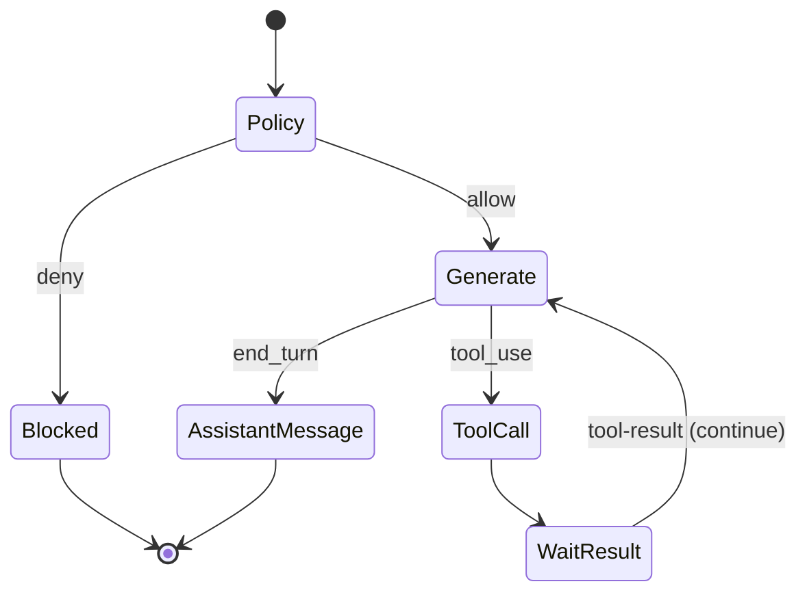

# Chat Orchestrator — Architecture

## Поток /v1/chat/run
0. Сгенерировать `messageStepId` (UUID) для нового пользовательского message-шага. Он будет записан в `chat_steps.message_step_id` и `tool_calls.message_step_id` всех записей этого шага и переиспользован при re-entry из `/chat/tool-result` вплоть до финального assistant_message. Это billing idempotency key (НЕ gateway `requestId`).
1. Загрузить/создать `chat_session` (mode фиксируется на сессию).
2. Вызвать **Policy Engine** `evaluate(state, mode)`.
   - `blocked` → записать audit policy_decision, вернуть `200 {status:blocked, blockReason}`. Списания нет.
3. Разрешить источник ключа:
   - `mode=credits` → сервисный `ANTHROPIC_API_KEY`.
   - `mode=byok` → запросить plaintext ключ у **BYOK Service** (in-memory).
4. Реконструировать контекст: системный промт (с `cache_control`) + история из `chat_steps` + новое сообщение.
5. Вызвать **Anthropic** `messages.create` с определением tools и prompt caching. Tool definitions строятся `anthropic_tool_definitions()` с **anthropic-именами** (`files_read`, `calendar_create_events`, …) — см. [02-api-contracts.md §Имена tools](02-api-contracts.md#имена-tools-доменный-ios-vs-anthropic-формат). Anthropic API требует `^[a-zA-Z0-9_-]{1,128}$`; dotted-имя → `400` (BUG-3).
6. Обработать ответ:
   - `end_turn` (текст) → `status=assistant_message`.
   - `tool_use` → применить **обратный маппинг** `anthropic-name → domain-name` (`files_read`→`files.read`); создать `tool_calls(status=pending)` с доменным `tool_name`, сгенерированным доменным `id` (UUID) и `provider_tool_use_id = <raw tool_use.id блока>` (`toolu_...`); вернуть `status=tool_call` с типизированным payload, где `toolCall.id` — **доменный UUID**, `toolCall.name` — **доменный формат с точкой**. Raw anthropic `tool_use.id` наружу не отдаётся.
7. Записать `chat_steps` (assistant, usage с `cacheReadTokens`/`cacheWriteTokens`). `payload` хранит content blocks **как есть** от Anthropic, включая raw `tool_use.id` (`toolu_...`) — для дословного реплея при continuation (см. [§ Согласованность tool_use.id](#согласованность-tool_useid-в-истории-anthropic-bug-4)).
8. **Списание кредитов** (`mode=credits`, [ADR-006](../../adr/ADR-006-credit-billing-and-subscription-grant.md)):
   - Debit происходит **только** при `status=assistant_message` (успешная финальная генерация),
     **после** записи `chat_steps`.
   - При `status=tool_call` (промежуточный tool-раунд) списание **НЕ выполняется** —
     ждём `tool-result` и продолжения.
   - Вызов: **Wallet** `consume(idempotency_key=messageStepId, amount=1)` — `messageStepId` передаётся
     в публичное поле `requestId` контракта `/wallet/consume`. `meta` хранит usage(inputTokens/outputTokens/model)
     для аудита (на `amount` не влияет). Затем audit `billing_debit`.
9. Audit шага.

## Поток /v1/chat/tool-result
1. Найти `tool_calls` по `toolCallId` (доменный UUID); проверить `session_id == sessionId` (иначе 404/403). Восстановить `messageStepId` из `tool_calls.message_step_id` (тот же на весь message-шаг; debit на финальном шаге использует его как idempotency key) и `provider_tool_use_id` (raw `toolu_...`).
2. Идемпотентность: если `status=completed` → вернуть ранее сохранённый следующий шаг, не вызывая Anthropic.
3. Атомарно `pending → completed/errored`; сохранить `result`.
4. Audit мутирующего tool-действия (для mutate-tools).
5. Re-evaluate Policy (доступ мог измениться); продолжить с шага 3 потока run (повторный вызов Anthropic с tool_result блоком). При сборке messages tool_result-блок формируется с `tool_use_id = tool_calls.provider_tool_use_id` (НЕ доменный UUID, НЕ свежий uuid4) — см. [§ Согласованность tool_use.id](#согласованность-tool_useid-в-истории-anthropic-bug-4).

## Маппинг имён tools (BUG-3)
Anthropic Messages API не принимает точку в имени tool (`^[a-zA-Z0-9_-]{1,128}$`). Чтобы не менять публичный iOS-контракт (доменные имена с точкой, ТЗ §5), вводится двунаправленный статический маппинг `domain ↔ anthropic` (замена `.`↔`_`, таблица — [02-api-contracts.md](02-api-contracts.md#имена-tools-доменный-ios-vs-anthropic-формат)).

Две и только две точки применения маппинга, обе в слое Anthropic-клиента:
1. **At request build** — `anthropic_tool_definitions()` отдаёт `tools[].name` в **anthropic-формате** (forward: `files.read`→`files_read`). Применяется и в `/chat/run` (шаг 5), и при продолжении из `/chat/tool-result` (повторный `messages.create` с tool_result-блоком).
2. **At tool_use parse** — при разборе `content` block `type=tool_use` из ответа Claude применяется **reverse** (`files_read`→`files.read`) до создания `tool_calls` и до формирования `toolCall.name`.

Инварианты:
- За пределами этих двух точек (БД `tool_calls.tool_name`, audit, ответы API, типизация args/result) — **только доменные имена с точкой**.
- Неизвестное anthropic-имя в ответе Claude → ошибка обработки (upstream-аномалия), не транслируется в iOS как валидный tool.
- Маппинг — статическая таблица из 8 пар; backend не «угадывает» преобразование строкой, а валидирует по таблице.

## Согласованность tool_use.id в истории Anthropic (BUG-4)

**Проблема.** Anthropic Messages API требует, чтобы при continuation `tool_result.tool_use_id` **точно** совпадал с `tool_use.id` соответствующего блока предыдущего assistant-хода в `messages`. Реальный Anthropic `tool_use.id` имеет формат `toolu_01...` (произвольная строка, **не** UUID). Ранее backend генерировал доменный `toolCallId` из id ответа: `uuid.UUID(id) if _is_uuid(id) else uuid.uuid4()`. Для реального Claude id не-UUID → подставлялся свежий `uuid4`. При этом `chat_steps.payload` реплеился дословно (raw `toolu_...`), а `tool_result.tool_use_id` строился из доменного `uuid4` → **рассогласование** → Anthropic `400` → backend `502`. Continuation ломался в production; unit-тесты не ловили, т.к. fake-клиент отдавал UUID-образный id.

**Решение ([ADR-008](../../adr/ADR-008-provider-tool-use-id.md)): хранить raw provider id отдельно.** Доменный `toolCallId` (UUID) генерируется **независимо** (`uuid4`, без попытки распарсить anthropic id), а raw `tool_use.id` сохраняется в `tool_calls.provider_tool_use_id`.

**Нормативный контракт согласованности id:**

1. **При генерации шага (`/chat/run`, разбор `tool_use`):**
   - Доменный `tool_calls.id` = свежий `uuid4`. **Запрещено** выводить доменный id из anthropic `tool_use.id` (исходный баг). `_is_uuid`-ветка удаляется.
   - `tool_calls.provider_tool_use_id` = raw `tool_use.id` блока ответа (`toolu_...`), сохраняется как есть.
   - `chat_steps.payload` сохраняет assistant content blocks **дословно** (с raw `tool_use.id`).
   - Наружу (`toolCall.id`) — только доменный UUID.

2. **При continuation (`/chat/run` re-entry и `/chat/tool-result`, сборка `messages` для `messages.create`):**
   - Прошлые assistant-ходы реплеятся из `chat_steps.payload` **дословно** — raw `tool_use.id` не переписывается.
   - tool_result-блок текущего раунда формируется с `tool_use_id = tool_calls.provider_tool_use_id` найденного по доменному `toolCallId` tool_call. **Никогда** не доменный UUID и **никогда** не свежий uuid4.
   - При `error` в tool-result — тот же `provider_tool_use_id`, плюс `is_error=true`.

**Инварианты:**
- Для любого `tool_use` блока в реплеемой истории существует ровно один `tool_calls` с `provider_tool_use_id == <этот tool_use.id>`; tool_result этого раунда ссылается на тот же `provider_tool_use_id`. Пара id в истории Anthropic согласована по построению.
- Domain `toolCallId` (UUID) — **публичный** (iOS-контракт, ответы API, request `/chat/tool-result`). Provider `tool_use.id` (`toolu_...`) — **внутренний** (только Anthropic message history: `tool_use.id` в реплее + `tool_result.tool_use_id`). Эти пространства id **не пересекаются** и не подменяют друг друга.
- Формат provider id **не** валидируется как UUID и **не** парсится — трактуется как непрозрачная строка провайдера.
- Parallel tool use (несколько `tool_use` блоков в одном assistant-ходе) поддержан: каждый блок → свой `tool_calls` с собственными доменным id и `provider_tool_use_id`; согласованность пар сохраняется поблочно.

## Prompt caching
- `cache_control: {type: ephemeral}` на системном промте и стабильном префиксе контекста.
- usage фиксирует `cache_read_input_tokens` / `cache_creation_input_tokens` Anthropic в `chat_steps.usage` как `cacheReadTokens` / `cacheWriteTokens`. Хранится для аудита/аналитики и **не влияет** на списание (1 кредит = 1 сообщение, [ADR-006](../../adr/ADR-006-credit-billing-and-subscription-grant.md)).

## Биллинг кредитов (правило списания)
- 1 завершённый пользовательский message-шаг (финальный `assistant_message`) → ровно **1 кредит**.
- Tool-loop из нескольких раундов в рамках одного сообщения списывает **один раз** на финальном шаге.
- Идемпотентность: `messageStepId` единый на весь message-шаг (все его tool-раунды и re-entry из `/chat/tool-result`) → повторный вызов `consume` с тем же `messageStepId` не списывает повторно (ADR-005). Гарантирует «1 списание на 1 message-шаг». `messageStepId` передаётся в публичное поле `requestId` контракта `consume`; gateway correlation `requestId` для биллинга не используется.
- Детали — [ADR-006](../../adr/ADR-006-credit-billing-and-subscription-grant.md).

## Логирование upstream-ошибок Anthropic (TD-014)

**Цель.** Сделать диагностируемой причину отказа Anthropic, не меняя контракт ошибки наружу. Anthropic-клиент (`src/app/chat/anthropic_client.py`) при перехвате ошибки SDK обязан залогировать структурированную запись **до** маппинга в доменный `UpstreamError`. Поведение API наружу неизменно: клиент по-прежнему мапит в `UpstreamError`, gateway отдаёт `502` (см. [01-architecture.md](../../01-architecture.md), error-contract). Детали Anthropic **не протекают** в HTTP-ответ пользователю — только во внутренний лог.

**Что логировать (структурированный JSON, событие `anthropic_upstream_error`):**

| Поле | Источник | Обяз. | Примечание |
|---|---|---|---|
| `status_code` | `APIStatusError.status_code` (int) | да (если есть) | для `APITimeoutError`/`APIConnectionError` отсутствует → не логировать поле |
| `errorType` | тело ошибки `error.type` (напр. `invalid_request_error`, `authentication_error`, `rate_limit_error`, `overloaded_error`) | да (если есть) | доменный тип ошибки Anthropic |
| `errorMessage` | тело ошибки `error.message` (человекочитаемое) | да (если есть) | напр. `"This organization has been disabled."` — **тело ошибки апстрима, не user-content** |
| `requestId` (anthropic) | `request_id` из заголовков/исключения SDK | да (если есть) | для обращения в саппорт Anthropic; логируется под ключом `anthropicRequestId`, **не путать** с gateway `requestId` (correlation id) |
| `model` | имя модели запроса | да | |
| `exceptionClass` | класс исключения SDK | да | `APIStatusError`/`APITimeoutError`/`APIConnectionError`/`AuthenticationError` |
| gateway `requestId`, `sessionId`, `messageStepId` | контекст | да | стандартные correlation-поля (см. [01-architecture.md §Наблюдаемость](../../01-architecture.md#наблюдаемость)) |

Если поле недоступно (например, тело не распарсилось или это network/timeout-ошибка без HTTP-статуса) — поле опускается; запись логируется с тем, что доступно (минимум `exceptionClass` + correlation-поля).

**Матрица уровней лога:**

| Условие | Уровень | Обоснование |
|---|---|---|
| `status_code` 4xx, **кроме** 429 (`400`/`401`/`403`/`404`/`422` и т.п.) | `WARNING` | клиентская/конфигурационная причина (невалидный запрос, отключённая org, плохой ключ) — требует внимания оператора, но не системный сбой |
| `status_code == 429` (`rate_limit_error`/`overloaded_error`) | `WARNING` | ожидаемый backpressure апстрима; не ошибка нашего кода |
| `status_code` 5xx (`500`/`502`/`503`/`529`) | `ERROR` | сбой на стороне Anthropic |
| `APITimeoutError` / `APIConnectionError` (нет HTTP-статуса) | `ERROR` | сетевой/таймаут-сбой связи с апстримом |

**Запрещено логировать (redaction, [05-security.md §Логирование](../../05-security.md#логирование-безопасное)):**
- `ANTHROPIC_API_KEY` (сервисный ключ, `mode=credits`);
- BYOK-ключ пользователя (`mode=byok`) — даже если ошибка апстрима связана с ключом, логируется `error.message` Anthropic, но **никогда сам ключ**;
- содержимое пользовательских сообщений / тело промпта (`messages[].content`, system prompt, tool args/result).

Логируется **только тело upstream-ошибки** (`error.type`/`error.message`) — это сообщение провайдера, а не user-content. Запись проходит через ту же redaction-middleware (вырезает `Authorization`, `*key*`, `*token*`, `*secret*`, BYOK/StoreKit payload).

**Области действия:** контракт одинаков для `mode=credits` (сервисный ключ) и `mode=byok` (ключ пользователя). На BYOK-пути особенно важно: `error.message` Anthropic логируется (для диагностики, в т.ч. «неверный/отключённый ключ пользователя»), а сам ключ — нет, чтобы диагностика ключа не превратилась в его утечку.

## Безопасность
- BYOK plaintext ключ только in-memory на время вызова, не пишется в `chat_steps`, логи, audit.
- `context` и tool args/result не содержат секретов; size-лимиты enforced.
- Upstream-ошибки Anthropic логируются по контракту [§Логирование upstream-ошибок Anthropic](#логирование-upstream-ошибок-anthropic-td-014): тело ошибки апстрима — да, api-key и user-content — нет.

## Конкурентность / TTL
- Soft TTL сессии 24h ([Q-001-1](../../99-open-questions.md)).
- Параллельные tool-result на один `toolCallId` разрешаются атомарным переходом статуса (ADR-005).
