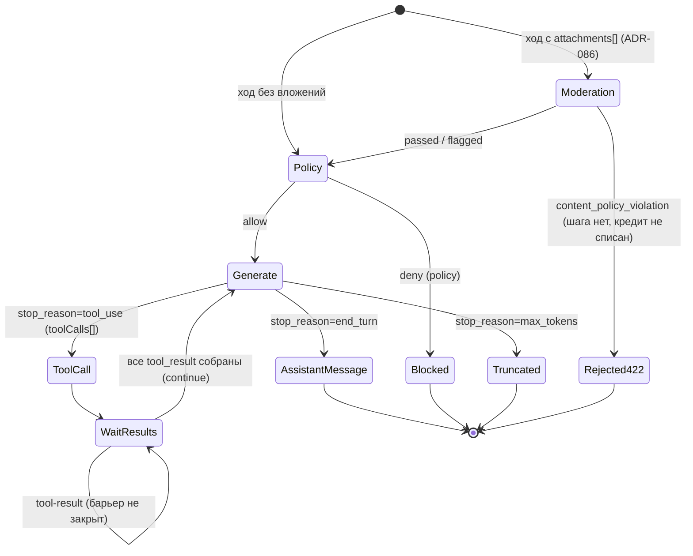

# Chat Orchestrator — Architecture

## Поток /v1/chat/run
0. Сгенерировать `messageStepId` (UUID) для нового пользовательского message-шага. Он будет записан в `chat_steps.message_step_id` и `tool_calls.message_step_id` всех записей этого шага и переиспользован при re-entry из `/chat/tool-result` вплоть до финального assistant_message. Это billing idempotency key (НЕ gateway `requestId`).
1. Загрузить/создать `chat_session` (`mode`, `assistant_mode`, `model` и `project_id` фиксируются на сессию при создании; при resume берутся из сессии — поля запроса игнорируются, [ADR-022 §4](../../adr/ADR-022-optional-project-and-tool-gating.md), [ADR-034](../../adr/ADR-034-user-model-selection.md)). `project_id` может быть `NULL` («чистый чат» без проекта, website-builder отключён для сессии). `model` может быть `NULL` (дефолтная модель инстанса: `ANTHROPIC_MODEL` / `OPENAI_MODEL` — на OpenAI-инстансах это **`gpt-4.1`**, [ADR-087 §1](../../adr/ADR-087-default-chat-model-gpt-4-1.md)). Валидация выбранной `model` по allowlist активного провайдера — при создании сессии (неизвестная → `422 unsupported_model`, [ADR-034 §3](../../adr/ADR-034-user-model-selection.md)). **Смена модели внутри начатой сессии не поддерживается** ([ADR-087 §3](../../adr/ADR-087-default-chat-model-gpt-4-1.md)): на resume поле запроса игнорируется, `chat_sessions.model` не переписывается — для другой модели клиент создаёт новый чат. **На resume ([ADR-044 §Связанное](../../adr/ADR-044-multi-provider-byok.md)):** если ранее зафиксированная `sess.model` НЕ в allowlist фактически используемого провайдера (например `claude-*` после перевода инстанса на `LLM_PROVIDER=openai`) → передать клиенту `model=None` (дефолт провайдера), **не падать**; БД `chat_sessions.model` не переписывается. См. [§Stale-model фолбэк](#stale-model-фолбэк-при-переводе-инстанса-на-другой-провайдер-adr-044).
2. Вызвать **Policy Engine** `evaluate(state, mode)`.
   - `blocked` → записать audit policy_decision, вернуть `200 {status:blocked, blockReason}`. Списания нет.
3. Разрешить источник ключа и провайдер генерации:
   - `mode=credits` → сервисный ключ активного провайдера инстанса (`get_llm_client()`, `ANTHROPIC_API_KEY`/`OPENAI_API_KEY`). При заданных запасных ключах ([ADR-074](../../adr/ADR-074-provider-key-failover.md)) оркестратор перебирает primary → backup того же провайдера, затем (если задана модель обхода) соседнего; BYOK не ротируется. `LLM_PROVIDER` и каталог без `LLM_PROVIDERS` не меняются.
   - `mode=byok` → запросить plaintext ключ у **BYOK Service** (in-memory) + провайдер ключа из `byok_keys.provider` (fallback — `detect_byok_provider(plaintext)`); генерация идёт клиентом `llm_client_for(byok_provider)` **независимо** от `LLM_PROVIDER` ([ADR-044](../../adr/ADR-044-multi-provider-byok.md), см. [§Мульти-провайдерный BYOK-роутинг](#мульти-провайдерный-byok-роутинг-adr-044)).
4. Реконструировать контекст: системный промт (с `cache_control`; порядок его слоёв — база `assistant_mode` → персонаж ([ADR-097](../../adr/ADR-097-character-personas.md)) → суффикс режима → workspace-инструкции → серверные подсказки хода, нормативно в [§Порядок слоёв системного промта](#порядок-слоёв-системного-промта)) + история из `chat_steps` (`list_steps`, **сортировка по `seq` ASC** — монотонный порядок вставки, НЕ `(created_at, id)`; [ADR-021](../../adr/ADR-021-deterministic-step-order-and-block-normalization.md)) + новое сообщение. **При наличии `attachments[]` ([ADR-020](../../adr/ADR-020-inline-base64-attachments-mvp.md)):** валидировать (allowlist `mediaType`, magic bytes, лимиты до декодирования, base64-валидность, PDF page-guard); собрать Anthropic content-блоки нового user-turn (image/document/text — полные, in-memory); в `chat_steps.payload` записать **лёгкий текстовый плейсхолдер вложения**, НЕ base64 (см. [§ Мультимодальные вложения](#мультимодальные-вложения-inline-base64-adr-020)). Вложения принимаются на **любом** ходе сессии, а не только на первом ([ADR-088](../../adr/ADR-088-attachments-per-turn-contract.md)).
4-bis. **Модерация хода с вложениями ([ADR-086](../../adr/ADR-086-ugc-moderation.md)) — ПОСЛЕ `prepare_attachments` и ДО `repo.add_step()`.** Ход с непустым `attachments[]` уходит в модерацию одним вызовом: текст `message` + декодированный текст `text`-вложений + все `image`-вложения (`document`/PDF — не уходит, [Q-086-1](../../99-open-questions.md)). Нарушение → **`422 content_policy_violation`**: шаг не записан, провайдер не вызван, кредит не списан, свежесозданная пустая сессия откатывается вместе с транзакцией запроса (тот же механизм, что у `404 message_not_found`, [ADR-040](../../adr/ADR-040-edit-message-and-regenerate.md)). Недоступен провайдер модерации → `503 moderation_unavailable` (fail-closed). **Ход без вложений модерацию не проходит** — см. [§Модерация UGC в чате](#модерация-ugc-в-чате-adr-086).
5. Вызвать **Anthropic** `messages.create` с определением tools и prompt caching. Tool definitions строятся `anthropic_tool_definitions()` с **anthropic-именами** (`files_read`, `calendar_create_events`, …) — см. [02-api-contracts.md §Имена tools](02-api-contracts.md#имена-tools-доменный-ios-vs-anthropic-формат). Anthropic API требует `^[a-zA-Z0-9_-]{1,128}$`; dotted-имя → `400` (BUG-3). **Набор tools фильтруется по наличию `chat_sessions.project_id` ([ADR-022](../../adr/ADR-022-optional-project-and-tool-gating.md)):** `project_id IS NULL` → `site.*` (`SERVER_SIDE_TOOLS`) исключаются; `project_id IS NOT NULL` → полный набор. См. [§Гейтинг site.* tools](#гейтинг-site-tools-по-наличию-проекта-adr-022).
6. Обработать ответ (диспетчеризация по `stop_reason`, [ADR-025](../../adr/ADR-025-parallel-tool-calls-and-max-tokens-truncation.md)):
   - `stop_reason="tool_use"` → ветка tool_use (ниже). **Условие — именно `stop_reason="tool_use"`** (не «есть tool_use-блоки в content»): при `stop_reason="max_tokens"` блоки `tool_use` могут присутствовать в content, но они **неполны** и в эту ветку не идут.
   - `stop_reason="max_tokens"` (**обрезка**, [ADR-025](../../adr/ADR-025-parallel-tool-calls-and-max-tokens-truncation.md)) → **НЕ** трактовать как финальный `assistant_message` и **НЕ** выдавать неполные `tool_use`. Персистировать обрезанный assistant-шаг (для истории/диагностики); вернуть `status=blocked`, `blockReason=max_tokens`, с `usage` обрезанного хода, `messageStepId` = ход, `stepId` = id обрезанного шага (НЕ null), `assistantMessage` = частичный текст (если был). **Кредит НЕ списывается** (см. §8). Обрезанные `tool_use`-блоки исключаются из continuation-реплея (re-entry по такому ходу не предусмотрен).
   - иначе (`end_turn`/`stop_sequence`, текст) → `status=assistant_message`.
   - **ветка `tool_use`** → применить **обратный маппинг** `anthropic-name → domain-name` (`files_read`→`files.read`); для **каждого** `tool_use`-блока хода создать `tool_calls(status=pending)` с доменным `tool_name`, сгенерированным доменным `id` (UUID) и `provider_tool_use_id = <raw tool_use.id блока>` (`toolu_...`); вернуть `status=tool_call` с **`toolCalls[]`** — все client-side tool-вызовы хода (типизированный payload), где каждый `id` — **доменный UUID**, `name` — **доменный формат с точкой**; `toolCall` (одиночный, deprecated) = `toolCalls[0]`. Server-side `site.*` исполняются на бэке немедленно и в `toolCalls[]` НЕ попадают ([ADR-011](../../adr/ADR-011-server-side-tools.md)). Raw anthropic `tool_use.id` наружу не отдаётся. См. [§Параллельные client-side tool-вызовы](#параллельные-client-side-tool-вызовы-и-барьер-хода-adr-025).
7. Записать `chat_steps` (assistant, usage с `cacheReadTokens`/`cacheWriteTokens`). `payload` хранит content blocks **нормализованными** ([ADR-021](../../adr/ADR-021-deterministic-step-order-and-block-normalization.md)): raw `tool_use.id` (`toolu_...`) сохраняется дословно — для реплея при continuation (см. [§ Согласованность tool_use.id](#согласованность-tool_useid-в-истории-anthropic-bug-4)), но служебные поля SDK (`caller` из `block.model_dump()`) вырезаются и не попадают в реплей (см. [§ Детерминированный порядок шагов и нормализация payload](#детерминированный-порядок-шагов-и-нормализация-payload-adr-021)). Порядок шага в сессии определяется `chat_steps.seq` (монотонный identity), НЕ `created_at`.
8. **Списание кредитов** (`mode=credits`, [ADR-006](../../adr/ADR-006-credit-billing-and-subscription-grant.md)):
   - Debit происходит **только** при `status=assistant_message` (успешная финальная генерация),
     **после** записи `chat_steps`.
   - При `status=tool_call` (промежуточный tool-раунд) списание **НЕ выполняется** —
     ждём `tool-result` и продолжения.
   - При `status=blocked` с `blockReason=max_tokens` (обрезка, [ADR-025](../../adr/ADR-025-parallel-tool-calls-and-max-tokens-truncation.md)) списание **НЕ выполняется** (обрыв — не успешный финальный assistant_message; trial-flip также не выполняется). Пользователь не платит за оборванную генерацию.
   - Вызов: **Wallet** `consume(idempotency_key=messageStepId, amount=1)` — `messageStepId` передаётся
     в публичное поле `requestId` контракта `/wallet/consume`. `meta` хранит usage(inputTokens/outputTokens/model)
     для аудита (на `amount` не влияет). Затем audit `billing_debit`.
9. Audit шага.

## Поток /v1/chat/tool-result
Принимает **батч** `results[]` (или одиночную deprecated-форму, [ADR-025](../../adr/ADR-025-parallel-tool-calls-and-max-tokens-truncation.md)).
1. Нормализовать вход: одиночная форма → `results = [{toolCallId, result|error}]`. Для **каждого** элемента найти `tool_calls` по `toolCallId` (доменный UUID); проверить `session_id == sessionId` (иначе 404/403) и принадлежность одному ходу (один `message_step_id`); дубль `toolCallId` в батче → `422`. Восстановить `messageStepId` из `tool_calls.message_step_id` (тот же на весь message-шаг; debit на финальном шаге использует его как idempotency key) и `provider_tool_use_id` (raw `toolu_...`) каждого.
2. Идемпотентность поэлементно: если `tool_call.status` уже `completed/errored` → результат не перезаписывать; если барьер хода уже закрыт и continuation-шаг сохранён → вернуть его, не вызывая Anthropic ([ADR-005](../../adr/ADR-005-idempotency-ledger.md)).
3. Атомарно для каждого элемента `pending → completed/errored`; сохранить `result`.
4. Audit мутирующего tool-действия (для mutate-tools), поэлементно.
5. **Барьер хода ([ADR-025](../../adr/ADR-025-parallel-tool-calls-and-max-tokens-truncation.md)):** собрать множество client-side `tool_calls` этого `message_step_id`. Если **не все** completed/errored → вернуть `status=tool_call` с `toolCalls[]` = оставшиеся (без вызова Anthropic, без биллинга). Если **все** собраны → продолжить (шаг 6).
6. Re-evaluate Policy (доступ мог измениться); продолжить с шага 3 потока run (повторный вызов Anthropic). При сборке messages **все** `tool_result`-блоки хода (client-side из этого/прошлых батчей + server-side, исполненные на бэке) формируются с `tool_use_id = tool_calls.provider_tool_use_id` (НЕ доменный UUID, НЕ свежий uuid4) — см. [§ Согласованность tool_use.id](#согласованность-tool_useid-в-истории-anthropic-bug-4). Continuation-виток выполняется **один раз** на закрытие барьера. **`system` пересобирается и на этом витке** (он не часть истории сообщений): персонаж сессии ([ADR-097](../../adr/ADR-097-character-personas.md)), суффикс режима хода и workspace-инструкции инъектируются заново — [§Порядок слоёв системного промта](#порядок-слоёв-системного-промта).


```mermaid
stateDiagram-v2
    [*] --> Moderation: ход с attachments[] (ADR-086)
    [*] --> Policy: ход без вложений
    Moderation --> Rejected422: content_policy_violation (шага нет, кредит не списан)
    Moderation --> Policy: passed / flagged
    Policy --> Blocked: deny (policy)
    Policy --> Generate: allow
    Generate --> AssistantMessage: stop_reason=end_turn
    Generate --> ToolCall: stop_reason=tool_use (toolCalls[])
    Generate --> Truncated: stop_reason=max_tokens
    ToolCall --> WaitResults
    WaitResults --> WaitResults: tool-result (барьер не закрыт)
    WaitResults --> Generate: все tool_result собраны (continue)
    AssistantMessage --> [*]
    Blocked --> [*]
    Truncated --> [*]
    Rejected422 --> [*]
```
> `Rejected422` = технический отказ `422 content_policy_violation` ([ADR-086](../../adr/ADR-086-ugc-moderation.md)), **не** бизнес-`blocked`: он описывает содержимое запроса, а не права пользователя, поэтому не участвует в `blockReason` и не приходит с HTTP 200 ([ADR-004](../../adr/ADR-004-blocked-http-200.md) здесь не применяется). Диаграмма выше — полный порядок хода, включая этот шаг.
>
> `Truncated` = `status=blocked`, `blockReason=max_tokens` ([ADR-025](../../adr/ADR-025-parallel-tool-calls-and-max-tokens-truncation.md)): неполные `tool_use` не отдаются, кредит не списывается, `usage`/`stepId` присутствуют. `toolCalls[]` — все client-side вызовы хода; continuation — только при закрытом барьере (все `tool_result` собраны).

## Модерация UGC в чате (ADR-086)

Точка вызова — единственная: `ChatOrchestrator.run`, между `prepare_attachments` и `repo.add_step`. Ни один другой слой чата модерацию не вызывает.

**Предикат срабатывания (симметричный, [ADR-086 §2–3](../../adr/ADR-086-ugc-moderation.md)):**

- **против недооценки:** ход с непустым `attachments[]` **обязан** пройти модерацию — вложение рендерится приложением как медиа в ленте сообщений;
- **против переоценки:** ход **без** вложений модерацию **не** проходит — он не порождает медиа и не оплачивает генерацию; лишний round-trip на каждом сообщении обесценил бы канал (ложные отказы и рост латентности там, где риска нет).

**Что уходит в один вызов:** `message` (сырой, до склейки с context-блоком [ADR-037](../../adr/ADR-037-chatrunrequest-context-allowlist-injection.md)) + декодированный текст вложений класса `text` (срез `MODERATION_TEXT_MAX_CHARS`) + **все** вложения класса `image` как data-URI. Лимита «сколько картинок проверяем» нет намеренно: любой такой лимит оставил бы часть контента непроверенной, а число уже ограничено `ATTACHMENT_MAX_COUNT`.

**Персистентность.** Отклонённый ход не создаёт шагов, поэтому вердикт нигде не хранится — след даёт структурный лог `moderation_outcome` и метрика `moderation_decisions_total{surface="chat",...}`. **Контраст с media:** там вердикт **персистится** (`media_jobs.moderation`), потому что задача переживает запрос и её результат показывается позже; в чате переживать нечему. Правило одного пути на другой не переносить.

**Отказ на пути chat-tools ход не роняет.** Отклонение модерацией внутри `media.generate_image`/`media.generate_video`/`mediaSelection` возвращается как tool-result error `{"code":"content_policy_violation"}` (`serverTools[].status=errored`), и ход продолжается — модель может переформулировать промпт. Это тот же режим деградации, что у `invalid_quiz` ([ADR-064 §5](../../adr/ADR-064-study-learn-quiz-generation-mode.md)). **Контраст:** на REST-пути `/v1/media/*` тот же отказ — жёсткий `422`, потому что переформулировать там некому.

## Маппинг имён tools (BUG-3)
Anthropic Messages API не принимает точку в имени tool (`^[a-zA-Z0-9_-]{1,128}$`). Чтобы не менять публичный iOS-контракт (доменные имена с точкой, ТЗ §5), вводится двунаправленный статический маппинг `domain ↔ anthropic` (замена `.`↔`_`, таблица — [02-api-contracts.md](02-api-contracts.md#имена-tools-доменный-ios-vs-anthropic-формат)).

Две и только две точки применения маппинга, обе в слое Anthropic-клиента:
1. **At request build** — `anthropic_tool_definitions()` отдаёт `tools[].name` в **anthropic-формате** (forward: `files.read`→`files_read`). Применяется и в `/chat/run` (шаг 5), и при продолжении из `/chat/tool-result` (повторный `messages.create` с tool_result-блоком).
2. **At tool_use parse** — при разборе `content` block `type=tool_use` из ответа Claude применяется **reverse** (`files_read`→`files.read`) до создания `tool_calls` и до формирования `toolCall.name`.

Инварианты:
- За пределами этих двух точек (БД `tool_calls.tool_name`, audit, ответы API, типизация args/result) — **только доменные имена с точкой**.
- Неизвестное anthropic-имя в ответе Claude → ошибка обработки (upstream-аномалия), не транслируется в iOS как валидный tool.
- Маппинг — статическая таблица: по одной паре на каждый инструмент реестра (число не дублируется здесь — см. [02-api-contracts.md §GET /v1/tools](02-api-contracts.md#get-v1tools--каталог-инструментов-adr-019)); backend не «угадывает» преобразование строкой, а валидирует по таблице.

## Провайдер-абстракция LLM (Anthropic | OpenAI) (ADR-033)

Сервис разворачивается мульти-инстансно на разных LLM-провайдерах **одним кодом** (не форк, [ADR-033](../../adr/ADR-033-llm-provider-abstraction.md)). Провайдер выбирается env **`LLM_PROVIDER ∈ {anthropic, openai}`, дефолт `anthropic`** — anthropic-инстанс переменную не задаёт, поведение не меняется. Какой инстанс на каком провайдере — **только** колонка «провайдер» реестра [07-deployment.md §CI/CD INSTANCES-loop](../../07-deployment.md#cicd-контракт-instances-loop-мульти-инстанс); здесь состав инстансов не дублируется. **Один провайдер на инстанс**: `chat_steps.payload` хранит wire-формат активного провайдера; кросс-провайдерный реплей в одной БД не поддерживается (инвариант, не дефект).

### Интерфейс `LLMClient` и нейтральный результат

Нейтральный Protocol/ABC `LLMClient` (`src/app/chat/llm_client.py`). `AnthropicClient` (`anthropic_client.py`, как есть) и новый `OpenAIClient` (`openai_client.py`) — реализации. Factory `get_llm_client()` по `LLM_PROVIDER`. Orchestrator/BYOK инжектят **`LLMClient`** (не `AnthropicClient`).

| Нейтральный тип | Поля | Замена |
|---|---|---|
| `LLMResult` | `stop_reason: NeutralStopReason`, `content_blocks: list[dict]` (wire активного провайдера, для персиста), `usage: LLMUsage`, `text: str`, `tool_uses: list[{id(provider raw), name(domain dotted), input(dict)}]` | `AnthropicResult` |
| `LLMUsage` | `input_tokens`, `output_tokens`, `model`, `cache_read_tokens`, `cache_write_tokens` | `AnthropicUsage` |
| `KeyValidation` | `valid` \| `invalid` \| `offline` | без изменений ([ADR-016](../../adr/ADR-016-extended-byok-statuses.md)) |

### Нормализованный `stop_reason` (канонический словарь)

Orchestrator диспетчеризует **только** по каноническим значениям `{tool_use, max_tokens, end_turn}` ([ADR-025](../../adr/ADR-025-parallel-tool-calls-and-max-tokens-truncation.md) — диспетчеризация по `stop_reason`, не по наличию tool_use-блоков). Каждый клиент мапит свой wire stop_reason:

| Канонический | Anthropic `stop_reason` | OpenAI `finish_reason` |
|---|---|---|
| `tool_use` | `tool_use` | `tool_calls` |
| `max_tokens` | `max_tokens` | `length` |
| `end_turn` | `end_turn` / `stop_sequence` / прочее | `stop` / `content_filter` / прочее |

**Backend-задача:** заменить в orchestrator строковые литералы Anthropic (`result.stop_reason == "max_tokens"`/`== "tool_use"`) на сравнение с каноническими значениями `NeutralStopReason`.

### Граница orchestrator ↔ client (ЦЕНТРАЛЬНОЕ — провайдер-агностичность персиста)

Вся провайдер-специфичная (де)сериализация wire-формата — **ВНУТРИ клиента**. Orchestrator и персист провайдер-агностичны.

**Что orchestrator ПЕРЕДАЁТ клиенту (`create_message`):**
1. `system_prompt: str` — как сейчас.
2. `messages` — **нейтральная история** из `chat_steps` (`_build_messages`): список `{role: user|assistant|tool, content_blocks: [...]}`, где `content_blocks` для user/assistant — wire-блоки активного провайдера из `payload`, для tool-шага — доменная запись `{toolCallId, providerToolUseId, toolName, result|error}`. **Клиент** строит из неё провайдер-messages (Anthropic — как сейчас `_build_messages`-логика уезжает в клиент или клиент принимает уже собранное; OpenAI — Chat Completions messages: assistant с `tool_calls`, role=`tool` с `tool_call_id`).
3. `tools` — **нейтральные определения** `{name(domain dotted), description, input_schema}`. Per-provider сериализацию делает клиент (см. ниже).
4. `attachments: PreparedAttachments | None` — нейтральные вложения первого turn. **Клиент строит провайдер content-блоки** (orchestrator больше не собирает Anthropic image/document-блоки сам, см. [§Мультимодальные вложения](#мультимодальные-вложения-inline-base64-adr-020)).
5. `api_key: str | None` — BYOK override, как сейчас.
6. `model: str | None` — выбранная модель сессии ([ADR-034](../../adr/ADR-034-user-model-selection.md)). Orchestrator передаёт `sess.model or None`; `None` (дефолт) → **клиент берёт свою дефолтную модель** (`settings.<provider>_model`) — текущее поведение. Orchestrator сам дефолт не подставляет (единая точка дефолта в клиенте, провайдер-агностично). Аддитивный kwarg, не ломает существующие вызовы.

**Что клиент ВОЗВРАЩАЕТ (`LLMResult`):**
- `content_blocks` — **wire-формат активного провайдера** для `chat_steps.payload` (Anthropic — как сейчас; OpenAI — нормализованный assistant-message, достаточный для реплея), **уже нормализованный** клиентом на границе персиста (per-provider allowlist, [ADR-021](../../adr/ADR-021-deterministic-step-order-and-block-normalization.md)).
- `tool_uses` — **доменные** `{id(provider raw), name(domain dotted), input(dict)}`. Клиент уже применил reverse-map имени и (OpenAI) распарсил `arguments` из JSON-строки в dict. Orchestrator получает однородный результат независимо от провайдера.

**Что orchestrator ХРАНИТ:** `content_blocks` дословно. Реплей читает payload как нейтральную историю и отдаёт клиенту.

**Инвариант минимизации изменений orchestrator:** биллинг, барьер хода, server-side tool-loop, idempotency, `seq`-порядок — **не меняются**; меняется только тип инъекции (`LLMClient`), нейтрализация `stop_reason` и перенос сборки provider-messages/attachment-блоков в клиент.

### `provider_tool_use_id` обобщается (ADR-008 → ADR-033)

`tool_calls.provider_tool_use_id` ([ADR-008](../../adr/ADR-008-provider-tool-use-id.md)) хранит raw provider id: Anthropic — `toolu_...`; **OpenAI — `call_...`** (`tool_calls[].id`). Семантика та же — непрозрачная строка провайдера для согласования tool_use↔tool_result в реплее. Имя колонки/поля не меняется (provider-нейтральная семантика). [§Согласованность tool_use.id](#согласованность-tool_useid-в-истории-anthropic-bug-4) и [§Доменная нормализация payload](#доменная-нормализация-payload-истории-при-отдаче-adr-024) работают поверх той же карты `provider_tool_use_id → domain id` независимо от провайдера.

### Tools per-provider (переиспользование underscore-map)

Нейтральное определение (single source — `tools.py`): `{name(domain dotted), description, input_schema}`. Per-provider сериализация внутри клиента:
- **Anthropic:** `{name(underscore), description, input_schema}` (`anthropic_tool_definitions()`).
- **OpenAI:** `{type:"function", function:{name(underscore), description, parameters(=input_schema)}}`.

**Underscore-map ([§Маппинг имён tools (BUG-3)](#маппинг-имён-tools-bug-3)) переиспользуется без изменений:** OpenAI function name тоже `^[a-zA-Z0-9_-]{1,64}$` — **точки запрещены у обоих** провайдеров. Та же таблица `_DOMAIN_TO_ANTHROPIC`/`to_anthropic_tool_name`/`to_domain_tool_name` применяется к OpenAI (имя/тип переименовываются в нейтральные, но значения и dot↔underscore-семантика идентичны). **Reverse-map при парсинге OpenAI tool_calls:** `function.name` (underscore) → domain через `to_domain_tool_name`; `function.arguments` — **JSON-строка**, клиент парсит в dict (невалидный JSON / неизвестное имя → `ValidationFailedError`, как upstream-аномалия). Anthropic отдаёт `input` уже dict — результат одинаков.

### Attachments per-provider

`prepare_attachments` даёт нейтральный `PreparedAttachments`; построение провайдер content-блоков параметризуется провайдером:
- **Anthropic:** image/document(PDF)/text — как сейчас.
- **OpenAI:** image → `{type:"image_url", image_url:{url:"data:<mediaType>;base64,<data>"}}`; text → текстовый блок; **PDF (class `document`) → content-часть `file`** (`{type:"file", file:{filename, file_data:"data:application/pdf;base64,..."}}`, основной путь) **либо извлечённый `pypdf`-текст как text-блок** (гарантированный фолбэк, если SDK/endpoint не принимает `file`-часть) — PDF **поддержан** ([ADR-041](../../adr/ADR-041-openai-native-pdf-attachment.md), закрывает [TD-023](../../100-known-tech-debt.md); точный wire-shape `file` backend сверяет с установленным `openai` SDK, [05-security.md](../../05-security.md)). Валидация (allowlist/magic-bytes/лимиты/page-guard) — общая, до провайдер-ветвления.

### Нормализация payload per-provider

[ADR-021](../../adr/ADR-021-deterministic-step-order-and-block-normalization.md) (стрип не-wire SDK-полей) — per-provider: Anthropic `_BLOCK_WIRE_FIELDS` (как сейчас); OpenAI — собственный allowlist полей assistant-message/tool_calls. Выполняется **внутри клиента** на границе персиста. `seq`-порядок и барьер хода — провайдер-агностичны.

### Observability per-provider

Вводится обобщённая метрика **`llm_upstream_errors_total`** с label `provider ∈ {anthropic, openai}` (+ `status_code`/`error_type`). **Факт реализации (`metrics.py`):** legacy `anthropic_upstream_errors_total` **сохранена ПАРАЛЛЕЛЬНО** с `llm_upstream_errors_total{provider}` — обе инкрементируются на anthropic-пути (`anthropic_client.py`), OpenAI-путь (`openai_client.py`) пишет только `llm_upstream_errors_total{provider="openai"}`. Legacy-имя оставлено осознанно для обратной совместимости дашбордов/тестов ([ADR-033 §10](../../adr/ADR-033-llm-provider-abstraction.md)). Контракт логирования upstream-ошибок ([§Логирование upstream-ошибок](#логирование-upstream-ошибок-anthropic-td-014)) применяется к обоим клиентам (OpenAI: `openai.AuthenticationError`/`APITimeoutError`/`APIConnectionError`/`APIStatusError` → те же доменные `AuthError`/`UpstreamError`; событие лога `llm_upstream_error`). OpenAI-ключ — под redaction (покрыт денилистом `key`/`secret`).

## Мульти-провайдерный BYOK-роутинг (ADR-044)

В **byok-режиме** генерация идёт через провайдера, **определённого по самому ключу** ([ADR-044](../../adr/ADR-044-multi-provider-byok.md)), а НЕ через активный провайдер инстанса (`self._deps.llm`). Credits-режим без `LLM_PROVIDERS` — по-прежнему один сервисный провайдер инстанса. Dual-credits ([ADR-073](../../adr/ADR-073-dual-credits-llm-providers.md)) — opt-in: клиент выбирается по session-fixed модели, mid-chat switch нет.

**Поток byok-генерации:**
1. `_resolve_api_key(mode=byok)`: `byok.get_plaintext_key(user_id)` (in-memory, не логируется) + провайдер ключа = `byok_keys.provider` (одно чтение, **без** расшифровки ради провайдера); `provider IS NULL` (легаси-строка) → fallback `detect_byok_provider(plaintext_key)`. Провайдер `None` после fallback → defensive-block `byok_invalid` (не достигается при `valid`-ключе).
2. Клиент генерации = `llm_client_for(byok_provider)` (детектор → фабрика; оба синглтона доступны на любом инстансе). Ключ пользователя — per-call `with_options(api_key=...)`.
3. **Модель byok-генерации:** `sess.model`, **только если** она в allowlist провайдера **ключа** (provider-aware `allowed_models_for(byok_provider)`); иначе orchestrator **ЯВНО** подставляет BYOK-дефолт провайдера ключа `byok_default_model_for(byok_provider)` (`BYOK_DEFAULT_MODEL`/`OPENAI_BYOK_DEFAULT_MODEL`) и передаёт его в `create_message(model=…)`. **`model=None` клиенту в byok-ветке НЕ передаётся:** при `model=None` клиент взял бы свой **сервисный** дефолт (`settings.<provider>_model`, как для credits), а НЕ BYOK-дефолт — поэтому BYOK-дефолт подставляется явно (факт `orchestrator.py::_generate_loop`). Сессионная модель чужого провайдера клиенту другого провайдера **не передаётся** (нет `create_message(model=чужая)`-ошибки).
4. Runtime-401 (`AnthropicAuthError`/`OpenAIAuthError`) на byok → `mark_expired` ([ADR-016](../../adr/ADR-016-extended-byok-statuses.md)) — оба типа уже ловятся в `_generate_loop`, без изменений.
5. Биллинг byok — бесплатно ([ADR-006](../../adr/ADR-006-credit-billing-and-subscription-grant.md)).

tool-loop / server-side tools / attachments / нормализация payload / барьер хода / `seq` — провайдер-агностичны ([ADR-033](../../adr/ADR-033-llm-provider-abstraction.md)), работают для byok-провайдера как для сервисного. byok-сессия одно-провайдерна по построению (провайдер ключа стабилен) → кросс-провайдерного реплея в одной сессии не возникает ([TD-024](../../100-known-tech-debt.md) не материализуется).

## Stale-model фолбэк при переводе инстанса на другой провайдер (ADR-044)

При смене `LLM_PROVIDER` инстанса существующие `chat_sessions.model` могут быть от другого провайдера (`claude-*` на ставшем-OpenAI инстансе). На resume в **credits-режиме** прямая передача такой модели активному клиенту → `create_message(model=claude-*)` на OpenAI → ошибка провайдера → `502`.

**Политика-фикс (credits-режим):**
- Перед передачей `model` клиенту проверять членство `sess.model` в `allowed_models()` **активного** провайдера.
- Не в allowlist → `create_message(model=None)` (клиент возьмёт свой провайдерный дефолт), **не падать**.
- `chat_sessions.model` в БД **не переписывается** (историческая отметка выбора; expand-only).
- Точка реализации: где сейчас `model=sess.model or None` передаётся в `_generate_loop` — заменить на helper «`sess.model` если в `allowed_models()` активного провайдера, иначе `None`». Применять к обоим входам: `run` (resume) и `tool_result` (continuation).
- Создание новой сессии не затронуто: allowlist-валидация на create ([ADR-034 §3](../../adr/ADR-034-user-model-selection.md)) уже отвергает чужую модель → `422`. Фолбэк нужен для **resume** ранее зафиксированных сессий.
- В byok-режиме аналог — проверка против allowlist провайдера **ключа** (см. [§Мульти-провайдерный BYOK-роутинг](#мульти-провайдерный-byok-роутинг-adr-044) п.3). Credits проверяет против активного провайдера, byok — против провайдера ключа.

## Параллельные client-side tool-вызовы и барьер хода (ADR-025)

Claude в одном assistant-ходе может вернуть **несколько** `tool_use`-блоков (parallel tool use). Хранение это уже поддерживает поблочно ([ADR-008](../../adr/ADR-008-provider-tool-use-id.md): каждый блок → свой `tool_calls` с domain id + `provider_tool_use_id`). [ADR-025](../../adr/ADR-025-parallel-tool-calls-and-max-tokens-truncation.md) распространяет это на публичный ответ и continuation.

**Нормативный контракт:**
1. **Surface всех client-side tool_use.** `_handle_tool_use` собирает **список** всех client-side `ToolCallOut` хода → `ChatResponse.toolCalls[]` (порядок = порядок блоков ответа Claude). `toolCall` (одиночный, deprecated) = `toolCalls[0]`. Server-side `site.*` исполняются на бэке немедленно и в `toolCalls[]` не попадают ([ADR-011](../../adr/ADR-011-server-side-tools.md)). **Прежний дефект:** `first_client_out` (только первый) — остальные client-side вызовы терялись для клиента → orphan `tool_use` на continuation → Anthropic `400` → `502`.
2. **Один assistant-шаг.** Все `tool_use`-блоки одного хода → **один** assistant-шаг (`chat_steps`, payload с несколькими блоками). `ChatResponse.stepId` ([ADR-023](../../adr/ADR-023-sync-ids-in-chat-response.md)) указывает на этот шаг; все `toolCalls[]` принадлежат ему; `messageStepId` — один ход. `assistantMessage` ([ADR-024](../../adr/ADR-024-history-payload-domain-normalization.md)) — сопутствующий `text` того же шага.
3. **Барьер хода.** Continuation-виток к Anthropic разрешён **только** когда все client-side `tool_use` хода имеют `tool_result` (completed/errored) — иначе orphan `tool_use`. До закрытия барьера `/chat/tool-result` отвечает `status=tool_call` с оставшимися `toolCalls[]`, без вызова Anthropic и без биллинга.
4. **Смешанный ход (server-side + client-side).** Server-side `site.*` исполнить немедленно (как [ADR-011](../../adr/ADR-011-server-side-tools.md)), записать их `tool_result` на бэке; client-side вернуть в `toolCalls[]` и ждать их результатов. Continuation-виток собирает `messages` со **всеми** `tool_result` хода (server-side + client-side) перед следующим `messages.create`; порядок шагов — по `seq` ([ADR-021](../../adr/ADR-021-deterministic-step-order-and-block-normalization.md)).
5. **Биллинг неизменен** ([ADR-006](../../adr/ADR-006-credit-billing-and-subscription-grant.md)): 1 кредит = 1 message-step; списание один раз на финальном `assistant_message` хода — **не** на каждый tool и **не** на каждый `/chat/tool-result`.

**Инвариант синка ([ADR-024](../../adr/ADR-024-history-payload-domain-normalization.md)):** для каждого `i` `toolCalls[i].name`/`.id` дословно совпадают с соответствующим `tool_use`-блоком шага `stepId` в `GET /v1/chats/{id}` → `steps[].payload.content[]` и с `name` в `/v1/tools`. Provider `toolu_...` наружу не утекает ни в одном из путей.

## Обработка обрезки по max_tokens (ADR-025)

`anthropic_client.create_message` — non-streaming, `max_tokens = ANTHROPIC_MAX_TOKENS`. При недостаточном лимите Claude обрывает ход с `stop_reason="max_tokens"`; в `content` могут быть **неполные** `tool_use`-блоки (например `files.write` без `content`).

**Нормативный контракт ([ADR-025](../../adr/ADR-025-parallel-tool-calls-and-max-tokens-truncation.md)):**
1. **Диспетчеризация по `stop_reason`, не по наличию tool_use-блоков.** Ветка tool_use берётся **только** при `stop_reason="tool_use"`. **Прежний дефект:** условие `if stop_reason == "tool_use"` без обработки `max_tokens` → обрезанный ход с tool_use-блоками уходил в else → `status=assistant_message`, `toolCall=null`, неполные `tool_use` молча терялись (но персистились в `chat_steps.payload` как неполные блоки).
2. **`stop_reason="max_tokens"` → `status=blocked`, `blockReason=max_tokens`** (HTTP 200, [ADR-004](../../adr/ADR-004-blocked-http-200.md)). Неполные `tool_use` наружу **НЕ** отдаются (`toolCall`/`toolCalls` отсутствуют) — `input` неполон, исполнять нельзя.
3. **Семантика id/usage (отличие от policy-blocked):** `messageStepId` = ход, `stepId` = id обрезанного assistant-шага (**НЕ** null — ход/шаг создаются, Claude сгенерировал контент); `usage` присутствует (реальный usage хода, `outputTokens ≈ max_tokens`); `assistantMessage` = частичный `text` (если был). policy-blocked (deny **до** генерации) остаётся `messageStepId=null`/`stepId=null`/без `usage`.
4. **Биллинг:** кредит **не** списывается (обрыв — не успешный финальный `assistant_message`); trial-flip не выполняется (см. [§Биллинг кредитов](#биллинг-кредитов-правило-списания) / поток run §8).
5. **Continuation:** re-entry по `max_tokens`-обрезанному ходу не предусмотрен (исполнять/реплеить неполные `tool_use` нельзя); обрезанный шаг персистится для истории, но его неполные `tool_use`-блоки исключаются из continuation-реплея. Клиентский UX — повторить/сократить запрос.
6. **Дефолт `ANTHROPIC_MAX_TOKENS=16000`** ([02-tech-stack.md](../../02-tech-stack.md), config + `.env*`, per-instance) делает обрезку редкой; п.2–5 — safety-net, не штатный путь. non-streaming сохраняется на MVP; streaming + partial-tool_use accumulation — [TD-018](../../100-known-tech-debt.md). `ANTHROPIC_TIMEOUT_SECONDS` поднят до 120 под более длинные ходы.

## Гейтинг site.* tools по наличию проекта (ADR-022)

Сервис — прежде всего **чат-агрегатор**; website-builder (`site.*`) — **опциональная** фича. Набор tools, предлагаемый Claude, **зависит от наличия `chat_sessions.project_id`** сессии ([ADR-022](../../adr/ADR-022-optional-project-and-tool-gating.md)).

**Нормативный контракт гейтинга:**
1. `project_id IS NULL` («чистый чат», создан без `projectId`) → tools для `messages.create` = все client-side (`files.*`/`calendar.*`/`reminders.*`) **минус** `SERVER_SIDE_TOOLS` (`site.*`). Claude `site.*` не видит и вызвать не может.
2. `project_id IS NOT NULL` → полный набор tools (включая `site.*`), как до ADR-022.
3. Гейт по `project_id` — **НЕ единственный целевой** фильтр `site.*`. **Целевой контракт (Q-012-1 Open):** доступность `site.*` определяется **И-композицией двух ортогональных осей** одного реестра: ось A — наличие проекта (`project_id IS NOT NULL`, ADR-022); ось B — тип ассистента (`assistant_mode` допускает `site.*`, [Q-012-1](../../99-open-questions.md)/[ADR-012 §25](../../adr/ADR-012-assistant-mode-vs-billing-mode.md): дефолт `code` — допускает, `chat` — реестр без `site.*`/`files.*`). Целевой итог: `offer(site.*) ⟺ (project_id IS NOT NULL) AND (assistant_mode допускает site.*)`. **Сейчас реализована ось A (`project_id`)**: `anthropic_tool_definitions(include_server_side=...)` фильтрует `SERVER_SIDE_TOOLS` по наличию проекта; orchestrator передаёт `include_server_side` в `_generate_loop` на основе `project_id` сессии. **Ось B (`assistant_mode`) — [Q-012-1](../../99-open-questions.md) Open, сознательно НЕ реализована** (согласовано с docstring `anthropic_tool_definitions` в `tools.py`). При закрытии Q-012-1 ось B складывается по И тем же параметром `include_server_side` (фильтрация реестра по `assistant_mode`), без слома оси A.
4. **Defensive-guard:** `_external_project_id()` (резолв проекта для исполнения `site.*`) вызывается **только** на ветке с непустым `project_id`. Если при `project_id IS NULL` Claude всё же вернёт `tool_use` с именем из `SERVER_SIDE_TOOLS` (не должно случиться — tool не предлагался), backend `site.*` **не исполняет**: трактует как upstream-аномалию обработки tool_use (как неизвестное имя tool, ADR-008), наружу как валидный tool не транслирует.

**Инвариант:** в «чистом чате» (`project_id IS NULL`) ни один `site.*` не предлагается и не исполняется → нет резолва проекта → IDOR по проекту невозможен по построению (усиление IDOR-guard [ADR-011](../../adr/ADR-011-server-side-tools.md)). Биллинг/policy от наличия `project_id` не зависят (1 кредит = 1 сообщение).

> **`time.now` под этот гейт НЕ подпадает.** `time.now` — **global** server-side tool ([ADR-026](../../adr/ADR-026-global-server-side-tools-and-time-now.md), `GLOBAL_SERVER_SIDE_TOOLS`), а не project-scoped `SERVER_SIDE_TOOLS`. Флаг `include_server_side` (= «есть проект») гейтит **только** `site.*`; `time.now` предлагается Claude **всегда** (включая `project_id IS NULL`). См. [§Global server-side tools и `time.now`](#global-server-side-tools-и-timenow-adr-026).
>
> **`quiz.generate` — тоже мимо этого гейта, но по своей оси.** Он global (проект не нужен), однако предлагается **только** при `generationMode=study_learn` (ось C, [ADR-064](../../adr/ADR-064-study-learn-quiz-generation-mode.md)). Не путать: ось A отвечает на «есть ли проект», ось C — на «тот ли режим хода». Полная картина — [§Оси гейтинга tool-набора](#оси-гейтинга-tool-набора-adr-022--adr-026--adr-064).

## Global server-side tools и `time.now` (ADR-026)

Сервис — чат-агрегатор; основной flow — «чистый чат» **без проекта** ([ADR-022](../../adr/ADR-022-optional-project-and-tool-gating.md)). Модели нужен инструмент текущей даты/времени, доступный **всегда** (репорт iOS: «модель отвечает 2024 год», т.к. системный промт статичен и не несёт даты). Существующий server-side класс `site.*` ([ADR-011](../../adr/ADR-011-server-side-tools.md)) для этого непригоден: он project-scoped (`assert external_project_id is not None`, предлагается только при `project_id IS NOT NULL`). Вводится **новый класс — server-side global** ([ADR-026](../../adr/ADR-026-global-server-side-tools-and-time-now.md)).

**Три класса инструментов:**

| Класс | Реестр | Исполнитель | Проект | Предлагается |
|---|---|---|---|---|
| client-side | `files.*`/`calendar.*`/`reminders.*`/`git.*` ([ADR-094](../../adr/ADR-094-code-assistant-tools.md))/`maps.*` ([ADR-102](../../adr/ADR-102-mapkit-client-tools.md)) | iOS (round-trip) | — | по `assistant_mode` ([Q-012-1](../../99-open-questions.md)); `git.*`+code-`files.*` дополнительно по оси D, `maps.*` — по оси E |
| server-side, project-scoped | `SERVER_SIDE_TOOLS` (`site.*`) | backend в loop | **да** | только при `project_id IS NOT NULL` |
| **server-side, global** | `GLOBAL_SERVER_SIDE_TOOLS` (`time.now`) | backend в loop | **нет** | **ВСЕГДА** |
| **server-side, global, режимный** | `GLOBAL_SERVER_SIDE_TOOLS` ∩ `TOOL_GENERATION_MODES` (`quiz.generate`, [ADR-064](../../adr/ADR-064-study-learn-quiz-generation-mode.md)) | backend в loop | **нет** | только при эффективном `generationMode = study_learn` (ось C) |

> **Внутри класса «global» предложение модели различается.** «Global» означает «**не требует проекта**», а НЕ «предлагается всегда»: `time.now` — utility, предлагается всегда; `quiz.generate` — режимный, предлагается только в `study_learn`. Правило одного из них **не переносится** на другой по соседству в реестре.

**Нормативный контракт маршрутизации (`_handle_tool_use`):**
1. Реестры `SERVER_SIDE_TOOLS` и `GLOBAL_SERVER_SIDE_TOOLS` **не пересекаются** (инвариант). Совокупность server-side = их объединение; остальное — client-side.
2. Для каждого `tool_use`-блока ветка global проверяется **ДО** project-scoped:
   - `tool_name ∈ GLOBAL_SERVER_SIDE_TOOLS` → исполнить немедленно через global-handler **без** `external_project_id` и **без** опоры на `has_project`; персистировать tool-шаг (`role="tool"`, `providerToolUseId`), записать `tool_call_completed` audit; продолжить loop к Anthropic. В `toolCalls[]` наружу **НЕ** отдавать.
   - иначе `tool_name ∈ SERVER_SIDE_TOOLS` → как [ADR-011](../../adr/ADR-011-server-side-tools.md)/[ADR-022](../../adr/ADR-022-optional-project-and-tool-gating.md): `assert external_project_id is not None`, исполнить через `SiteToolHandlers` (project-scoped).
   - иначе client-side → собрать в `toolCalls[]`, hand-off к iOS.
3. `assert external_project_id is not None` ([ADR-022](../../adr/ADR-022-optional-project-and-tool-gating.md) §guard) применяется **только** к project-scoped `SERVER_SIDE_TOOLS`. Global server-side tools проходят мимо guard'а — для них «нет проекта» не аномалия, а штатный режим.
4. `anthropic_tool_definitions(include_server_side=...)`: флаг `include_server_side` гейтит **только** `SERVER_SIDE_TOOLS`; `GLOBAL_SERVER_SIDE_TOOLS` под него не попадают. Ось B (`assistant_mode`, [Q-012-1](../../99-open-questions.md)) на `time.now` **не** действует — utility-tool полезен в обоих режимах. **Ось C (режим генерации, [ADR-064](../../adr/ADR-064-study-learn-quiz-generation-mode.md))** — отдельный параметр `generation_mode` тех же генераторов определений: `quiz.generate` включается в набор только при `study_learn`. См. [§Оси гейтинга tool-набора](#оси-гейтинга-tool-набора-adr-022--adr-026--adr-064).
5. Барьер хода ([ADR-025](../../adr/ADR-025-parallel-tool-calls-and-max-tokens-truncation.md)) учитывает **только client-side** вызовы. Global server-side (как `site.*`) исполнены немедленно — в барьер не входят.
6. **Валидация args и режим отказа различаются по реестру `ARGS_DEGRADE_TOOLS` ([ADR-064 §5](../../adr/ADR-064-study-learn-quiz-generation-mode.md)):** для инструментов из реестра (сейчас только `quiz.generate`) провал `validate_tool_args` **не** роняет ход (`422`), а превращается в tool-result error (`invalid_quiz`), и loop продолжается — модель исправляется в том же ходе. Для **всех прочих** инструментов поведение прежнее: `ValidationFailedError` → `422`. Две соседние ветки одного `except` ведут себя противоположно **намеренно** (у квиза ограничения не гарантирует ни один провайдер, у остальных args приходят из фиксированных схем).

**Executor (рекомендация [ADR-026 §5](../../adr/ADR-026-global-server-side-tools-and-time-now.md)).** Отдельный `GlobalToolHandlers` (`src/app/chat/global_tools.py`), **не зависящий** от `WebsiteService`/`SiteToolHandlers`/проекта; возвращает `ToolExecution` (тот же контракт, что `SiteToolHandlers`); время берёт через инъектируемый `Clock` (детерминизм qa). Регистрируется в `_Deps` рядом с `site_tools`.

**`time.now` — контракт результата/ошибок:** [02-api-contracts.md §`time.now`](02-api-contracts.md#timenow--server-side-global-tool-adr-026) (UTC всегда `utc`/`unix`/`weekday`; при валидном `tz` — `local`/`timezone`; невалидный `tz` → tool-result error `invalid_timezone`, ход не падает). Не мутирующий → нет `tool_mutation` audit. Биллинг неизменен ([ADR-006](../../adr/ADR-006-credit-billing-and-subscription-grant.md)).

**Системный промт (оба режима `assistant_mode`, статичен).** В `_SYSTEM_PROMPT_CHAT` и `_SYSTEM_PROMPT_CODE` добавляется одинаковая **статичная** EN-инструкция (дата НЕ вписывается): *«You do not have built-in knowledge of the current date or time. If the user's request depends on the current date, time, or day of the week, call the `time.now` tool to get it; do not guess.»* Поскольку строка статична (без даты), системный промт остаётся стабильным → **prompt cache (`cache_control: ephemeral`) не инвалидируется** ([ADR-026 §7](../../adr/ADR-026-global-server-side-tools-and-time-now.md), [§Prompt caching](#prompt-caching)). Дата приходит только в tool-result, вне кэшируемого префикса. **Уточнение после [ADR-064](../../adr/ADR-064-study-learn-quiz-generation-mode.md):** «статичен» здесь означает «не содержит динамических данных», а **не** «одинаков для всех ходов» — у режима генерации `study_learn` к base-промту добавляется собственный статичный суффикс, из-за чего у этого режима отдельная запись prompt-кэша (внутри режима префикс стабилен). См. [§Режим study_learn](#режим-study_learn-поток-квиза-adr-064). То же относится к персонажу ([ADR-097](../../adr/ADR-097-character-personas.md)): его фрагмент статичен, но у каждого персонажа своя запись кэша. **Полный порядок слоёв `system` — [§Порядок слоёв системного промта](#порядок-слоёв-системного-промта)** (единственное место, где он зафиксирован целиком).

**Память диалога в системном промте ([ADR-059](../../adr/ADR-059-system-prompt-conversation-memory.md)).** Рядом с инструкцией даты — вторая **статичная** EN-строка `_CONVERSATION_MEMORY_INSTRUCTION` (оба режима): *«You have access to the full history of the current conversation… Never claim you cannot remember, store, or recall information from this conversation.»* Мотивация: история диалога реплеится (`_build_messages` читает все `chat_steps` сессии), но на OpenAI-инстансе ([ADR-033](../../adr/ADR-033-llm-provider-abstraction.md)) gpt-4o трактует «запомни/remember» как межсессионное хранение и выдаёт шаблонный дисклеймер «не могу запоминать», хотя факт из прошлых ходов у неё есть. Строка прямо говорит модели использовать историю как память и запрещает дисклеймер. Тоже **статична** → prompt cache не инвалидируется. Workspace-инструкции ([ADR-036 §3](../../adr/ADR-036-workspaces-implementation.md)) по-прежнему добавляются ПОСЛЕ базового промта, т.е. после этой строки; между базой и ними теперь стоят ещё три слоя — персонаж ([ADR-097](../../adr/ADR-097-character-personas.md)), подсказка озвучки ([ADR-100](../../adr/ADR-100-assistant-speech-output.md)) и суффикс режима, полный порядок — [§Порядок слоёв системного промта](#порядок-слоёв-системного-промта).

## Персонаж сессии — слой системного промта (ADR-097)

**Что это.** Персонаж (`chat_sessions.character_id`, [ADR-097](../../adr/ADR-097-character-personas.md)) задаёт, **чьим голосом** отвечает ассистент, на всём протяжении чата. Реестр — статический модуль `src/app/chat/characters.py`; наружу отдаются только `id`/`name`/`tagline`/`icon` ([02-api-contracts §GET /v1/characters](02-api-contracts.md#get-v1characters--каталог-персонажей-adr-097)), а EN-фрагмент `persona` остаётся на сервере.

**Где собирается.** Внутри `_system_prompt_for` — той же единственной точки сборки, через которую проходят **и** turn 0, **и** continuation-виток `/chat/tool-result`. Это обязательное условие, а не деталь: `system` **не является частью истории сообщений** и передаётся отдельным параметром на КАЖДЫЙ вызов LLM, поэтому персонаж, добавленный в любом другом месте, исчезал бы на продолжении tool-loop — тот же отказ, который [ADR-036 §3](../../adr/ADR-036-workspaces-implementation.md) описал для workspace-инструкций.

<a id="порядок-слоёв-системного-промта"></a>
**Порядок слоёв `system` (нормативный, ПОЛНЫЙ — включая серверные подсказки хода):**

```
base(assistant_mode)                                   ADR-012, ADR-081 (снятые семейства)
  [+ code-tools instruction]                           ADR-094 (ось D И assistant_mode=code)
  [+ media-generate instruction]                       ADR-072 (CHAT_MEDIA_TOOLS_ENABLED)
  → persona + _CHARACTER_GUARDRAILS                    ADR-097 (только при CHARACTERS_ENABLED
                                                       И непустом chat_sessions.character_id)
  → _SPEECH_INSTRUCTION                                ADR-100 (только при VOICE_OUTPUT_ENABLED
                                                       И assistant_mode != code)
  → суффикс режима генерации                           ADR-064 (study_learn) | ADR-084 (research)
  → workspace.instructions                             ADR-036 §3
  → серверные подсказки хода:                          последняя media-job; блок памяти (ADR-091);
                                                       недавнее фото; строка документов (ADR-090)
```

> **Состав последней группы зависит от ноги хода.** На turn 0 применяются все четыре подсказки; на continuation-витке `/chat/tool-result` — только media-job и недавнее фото (блок памяти и строка документов собираются один раз, на turn 0). Слои выше группы — база, персонаж, подсказка озвучки, суффикс режима, workspace-инструкции — пересобираются на **каждом** обращении к модели.
>
> **Уточнение к формулировке «инструкции пользователя остаются ПОСЛЕДНИМИ» ([ADR-036 §3](../../adr/ADR-036-workspaces-implementation.md)).** Она верна **относительно базы, персонажа, подсказки озвучки и суффикса режима**, но не абсолютна: после `workspace.instructions` промт дополняют **серверные подсказки хода** (media-job / память / фото / документы). Это не пользовательский текст, и порядок здесь именно такой с момента их появления. Схема выше — единственное место, где порядок зафиксирован целиком; добавляя новый слой, дополняй её тем же коммитом.

**Почему персонаж стоит РАНЬШЕ суффикса режима.** Последний слой на практике весомее. Задача хода (`study_learn` — не раскрывать ответы и держать текст коротким; `research` — обязательно использовать живой веб-поиск) и собственные инструкции пользователя обязаны перебивать декоративный тон, а не наоборот.

**Почему подсказка озвучки стоит ПОСЛЕ персонажа и ДО суффикса режима ([ADR-100 §7](../../adr/ADR-100-assistant-speech-output.md)).** После персонажа — чтобы многословная Королева фэнтези всё равно отвечала коротко. **До суффикса режима — потому что режим важнее формы подачи:** `research` требует живого веб-поиска и ссылок, и подсказка «без ссылок», стоящая позже, испортила бы **текст**, который пользователь читает. Ссылки из **звука** убирает детерминированная чистка на чтении ([§Приведение к произносимому виду](#приведение-к-произносимому-виду-adr-100)) — это и есть разделение труда между двумя мерами: подсказка снижает частоту, чистка и потолок дают гарантию.

**Чего персонаж НЕ делает.** Не меняет набор инструментов и ни одну ось его гейтинга ([§Оси гейтинга](#оси-гейтинга-tool-набора-adr-022--adr-026--adr-064)), не меняет модерацию ([§Модерация UGC](#модерация-ugc-в-чате-adr-086)), реплей истории, нормализацию payload, policy и биллинг. В `assistant_mode=code` персонаж действует на прозу, но не отменяет требований к коду ([ADR-097 §6](../../adr/ADR-097-character-personas.md)). Общая оговорка `_CHARACTER_GUARDRAILS` дополнительно запрещает переносить стиль в **аргументы инструментов** (поисковый запрос, промт генерации медиа, содержимое файла, текст коммита) — стилизуется только видимый ответ.

**Prompt-кэш.** Фрагменты статичны (ни даты, ни счётчиков, ни содержимого хода), поэтому внутри пары «режим × персонаж» префикс побайтово стабилен. У каждого персонажа **своя** запись кэша — то же ожидаемое следствие, что у `study_learn` ([§Prompt caching](#prompt-caching)), не дефект.

**Выключенный флаг.** При `CHARACTERS_ENABLED=false` слой не собирается **никогда**, в том числе для сессий, у которых `character_id` уже сохранён (инстанс, где флаг сняли обратно): такие чаты продолжаются голосом обычного ассистента, значение в БД и в списке чатов сохраняется ([ADR-097 §7](../../adr/ADR-097-character-personas.md)).

## Озвучка ответа (ADR-100)

**Что это.** `POST /v1/chat/speech` синтезирует речь по **уже сохранённому** assistant-шагу и отдаёт звук inline base64 ([02-api-contracts §POST /v1/chat/speech](02-api-contracts.md#post-v1chatspeech--озвучка-ответа-adr-100)). Ход чата ручкой не выполняется, `ChatResponse` и SSE не меняются. Ось включения — `VOICE_OUTPUT_ENABLED` (дефолт `false`).

> **Это НЕ единственный путь синтеза.** Второй — **потоковый**, по сегментам, внутри голосового режима [`/v1/chat/voice`](#голосовой-режим-adr-104) ([ADR-104](../../adr/ADR-104-voice-mode-websocket.md)). Общие у них реестр голосов, резолв голоса, чистка, потолок `TTS_MAX_CHARS` и **ключ списания `tts:{stepId}:{voiceId}`** — то есть озвучка одного ответа одним голосом оплачивается один раз **любым** из путей, и второй отдаёт `creditsCharged: 0`. **Различаются транспорт звука** (здесь base64 в JSON, там бинарные кадры — контраст помечен с обеих сторон в [ADR-104 §4](../../adr/ADR-104-voice-mode-websocket.md)) **и момент списания** (здесь — после единственного синтеза, **в той же транзакции запроса**; там транзакции запроса нет, и списание идёт при закрытии озвученного шага, когда `stepId` уже существует, — [ADR-104 §6](../../adr/ADR-104-voice-mode-websocket.md)). **Единица там — озвученный assistant-шаг**, а не ход: в ходе с клиентскими инструментами озвученных шагов два, и у каждого свой ключ; сегменты одного шага дают одну строку леджера. Правило одного пути на другой не переносить.

**Где живёт.** Пакет `src/app/chat/`: реестр голосов `voices.py` (данные), клиент синтеза `speech.py` (тонкая обёртка над OpenAI `audio.speech`, по образцу `transcription.py` из [ADR-095](../../adr/ADR-095-voice-messages.md)), приведение текста — чистая функция там же; роутер `/v1/chat/speech` и `/v1/voices` — в `api_gateway/routers/`. Ключ — `OPENAI_API_KEY` (отдельной переменной нет, [ADR-100 §8](../../adr/ADR-100-assistant-speech-output.md)); пусто → `503 voice_output_not_configured`.

<a id="_speech_instruction-adr-100"></a>
### Подсказка озвучки в `system` (`_SPEECH_INSTRUCTION`, ADR-100)

Статичная EN-строка, добавляемая в `_system_prompt_for` **только** при `VOICE_OUTPUT_ENABLED` **и** `assistant_mode != code`. Требует от модели: отвечать прозой, предназначенной для слуха (без разметки, заголовков, списков, таблиц, блоков кода и ссылок), держать ответ коротким, не использовать эмодзи и декоративные символы.

- **`assistant_mode=code` исключён:** там ответ по построению состоит из кода, и просьба «без блоков кода» испортила бы **текст**, который пользователь читает. Такой ход просто не озвучивается (`422 nothing_to_speak` после чистки) — отказ честнее испорченного ответа.
- **Это просьба, а не гарантия.** Формата не гарантирует ни один провайдер — то же наблюдение, из которого [ADR-064 §5](../../adr/ADR-064-study-learn-quiz-generation-mode.md) вывел degrade-ветку для квиза. Гарантию дают чистка и потолок ниже; подсказка снижает частоту срезов и делает звучащий текст естественнее.
- **Prompt-кэш.** Строка статична и одинакова для **всех** ходов инстанса, поэтому новой записи кэша **не создаёт** — в отличие от персонажа ([§Персонаж](#персонаж-сессии--слой-системного-промта-adr-097)), у которого своя запись на каждого. При `VOICE_OUTPUT_ENABLED=false` строки нет вовсе, и `system` побайтово прежний.

<a id="реестр-голосов-adr-100"></a>
### Реестр голосов (ADR-100)

Статический модуль `src/app/chat/voices.py` — единственный источник истины, по образцу `characters.py` ([ADR-097 §1](../../adr/ADR-097-character-personas.md)) и `presets.py`. Ни таблицы, ни env-JSON, ни миграции под каталог.

| `id` | `gender` | `selectable` | `provider_voice_id` | Манера (`instructions`, EN, сокращённо) |
|---|---|---|---|---|
| `default_male` | male | **да** | `cedar` | ровный, дружелюбный, нейтральный темп |
| `default_female` | female | **да** | `marin` | ровный, дружелюбный, нейтральный темп |
| `char_anime_girl` | female | нет | `coral` | яркая, восторженная, быстрый темп |
| `char_fantasy_queen` | female | нет | `sage` | церемонная, неспешная, царственная теплота |
| `char_vampire_lord` | male | нет | `onyx` | медленная бархатная речь, сухая ирония |
| `char_cyber_assassin` | male | нет | `ash` | рубленые фразы, низкий тон, холодный профессионализм |
| `char_virtual_friend` | female | нет | `nova` | тёплая повседневная речь, живое участие |

> **Голоса подобраны на слух, а не по описанию.** Семь пробных дорожек синтезированы этими же
> голосами с этими же манерами на русских репликах и прослушаны владельцем 2026-09-08; карта
> выше — результат прослушивания. Исходный план назначал другие голоса; он не выдержал проверки
> звуком, и это ожидаемо: подобрать тембр по текстовому описанию нельзя.

- **`provider` у всех записей — `openai`, модель — `TTS_MODEL` (`gpt-4o-mini-tts`).** Тройка `provider` + `provider_voice_id` + `instructions` лежит в записи именно затем, чтобы перевод **отдельного** голоса на другого поставщика был правкой одной строки, а не веткой в коде синтеза; `id` при этом не меняется, поэтому сохранённые настройки пользователей и клиентские кэши не инвалидируются.
- **Запись персонажа ([ADR-097 §1](../../adr/ADR-097-character-personas.md)) получает поле `voice_id`** — slug отсюда. Голос в записи персонажа **не дублируется**: два источника истины о том, как звучит Лорд вампиров, разошлись бы при первой же правке манеры.
- **Наружу отдаются только `id` / `name` / `gender`** и только у `selectable`-записей ([`GET /v1/voices`](02-api-contracts.md#get-v1voices--каталог-голосов-adr-100)). `provider` / `provider_voice_id` / `instructions` — серверные, по основанию [ADR-097 §3](../../adr/ADR-097-character-personas.md).
- Соответствие `provider_voice_id` фактическому набору голосов поставщика и подбор манер **на слух** — [Q-100-4](../../99-open-questions.md); несуществующий идентификатор даёт `502` на первом же синтезе, то есть проверяется сразу.

<a id="резолв-голоса-adr-100"></a>
### Резолв голоса (ADR-100)

**Единственная** функция, три ступени — по образцу единственного моста цены ([ADR-064 §9](../../adr/ADR-064-study-learn-quiz-generation-mode.md)):

1. `CHARACTERS_ENABLED` **и** `chat_sessions.character_id` непуст и есть в реестре персонажей → `voice_id` этого персонажа;
2. `user_preferences.default_voice_id` непуст и указывает на `selectable`-запись → она;
3. `TTS_DEFAULT_VOICE_ID` (env, дефолт `default_female`).

Ступень, значение которой не разрешается в живую запись реестра (голос удалён деплоем, настройка устарела), **проваливается на следующую** с WARNING; последняя защита — первая `selectable`-запись в порядке реестра. `500` из-за отсутствующего голоса не бывает.

- **При `CHARACTERS_ENABLED=false` ступень 1 не срабатывает никогда**, даже у сессии с сохранённым `character_id`. Это буквальная симметрия с правилом слоя промта ([§Выключенный флаг](#персонаж-сессии--слой-системного-промта-adr-097) выше, [ADR-097 §7](../../adr/ADR-097-character-personas.md)): один выключатель гасит персонажа целиком, а не наполовину. Обратное дало бы чат, который отвечает голосом обычного ассистента, но **звучит** персонажем.
- **Голос резолвится в момент синтеза и на сессии НЕ фиксируется.** Смена голоса по умолчанию действует на уже начатые чаты сразу; уже скачанный клиентом звук остаётся старым, потому что ключ клиентского кэша — пара `(stepId, voiceId)`.
  > ⚠️ **Контраст с ЖИВЫМ СЕАНСОМ `/v1/chat/voice` помечен с обеих сторон, правило не переносить ни в одну сторону** ([ADR-104 §13.3](../../adr/ADR-104-voice-mode-websocket.md#133-voiceid--резолв-на-сеанс-а-не-на-ход)). Здесь, на `POST /v1/chat/speech`, резолв — **на запрос**: отдельные вызовы, между ними ничего не живёт, и настройка, действующая только на новые чаты, была бы неотличима от сломанной. Там резолв — **на сеанс**: кадр `ready {voiceId}` отдаёт голос один раз на соединение, и резолв на ход опроверг бы уже отданную клиенту величину. Функция резолва **одна и та же**, различается только момент вызова; следствие сеансового резолва названо прямо — смена `defaultVoiceId` посреди голосового разговора слышна лишь после переподключения.
  > **Контраст с session-fixed `characterId` ([ADR-097 §4](../../adr/ADR-097-character-personas.md)) — правила противоположны намеренно, не переносить ни в одну сторону.** Персонаж запрещено менять посреди чата потому, что история **реплеится модели** и в контексте остаются реплики прежнего собеседника. Голос никакого контекста не касается: это чистая функция от пары (готовый текст, запись реестра). Настройка, действующая только на ещё не заведённые чаты, для человека с полусотней чатов неотличима от сломанной.

<a id="приведение-к-произносимому-виду-adr-100"></a>
### Приведение к произносимому виду (ADR-100)

Чистая функция над текстом шага, применяемая **при чтении**, перед синтезом. `chat_steps.payload` не изменяется: он канон — его читает пользователь и его реплеит провайдер ([ADR-021](../../adr/ADR-021-deterministic-step-order-and-block-normalization.md)). Приём тот же, что у [ADR-042](../../adr/ADR-042-hide-context-block-from-user-facing-history.md) и [ADR-065 §2](../../adr/ADR-065-study-learn-advertisement-gate-and-history-spoiler-strip.md); **отличие названо: те два срезают то, что пользователь читает, этот — только то, что он слышит.**

**Порядок фиксирован** (перестановка меняет результат):

1. блоки кода — огороженные (``` / ~~~) и отступом — **удаляются целиком**;
2. inline-код — снимаются обратные кавычки, слово остаётся;
3. таблицы Markdown — удаляются (прочитанная вслух таблица — шум);
4. ссылки `[текст](url)` → `текст`; голые URL и адреса почты — удаляются;
5. маркеры разметки (заголовки, списки, нумерация, выделение, цитаты) — снимаются, слова остаются;
6. эмодзи и токены из одних символов — удаляются;
7. пробелы схлопываются;
8. **потолок** `TTS_MAX_CHARS` (дефолт 700) — срез по последней границе предложения внутри лимита, при её отсутствии — по границе слова; сработал → `truncated: true`.

- **Шаги 1–7 строго до шага 8.** В обратном порядке потолок отсчитал бы символы, которые всё равно будут удалены, и клип оказался бы вдвое короче задуманного.
- **Пустой результат → `422 nothing_to_speak`** (ответ целиком из кода, ход с квизом, шаг без текста). Тишина неотличима от зависшего плеера — основание то же, что у [ADR-095 §7](../../adr/ADR-095-voice-messages.md).
- **На сервере, а не на клиенте:** правила разошлись бы между платформами, а потолок обязан ограничивать **наш** счёт у поставщика.

<a id="наблюдаемость-озвучки-adr-100"></a>
### Наблюдаемость озвучки (ADR-100)

`speech_synthesis_total{outcome}` — единственный счётчик исходов ручки. **Producer** — точка формирования ответа `POST /v1/chat/speech` на рабочем пути (не хелпер синтеза: инкремент в хелпере не покрыл бы отказы, до него не дошедшие). **Consumer** — панель расходов и алерт на устойчивую долю `upstream_error`.

Классификация — по предикату «что случилось с деньгами пользователя», вычисляемому из наблюдаемых фактов пути, а не по суждению:

| `outcome` | Деньги пользователя | Предикат |
|---|---|---|
| `ok` | списаны, звук доставлен | синтез успешен И ключ идемпотентности создан этим вызовом |
| `repeat` | не тронуты, звук доставлен | синтез успешен И ключ идемпотентности уже существовал |
| `nothing_to_speak` | не тронуты | очищенный текст пуст |
| `upstream_error` / `timeout` | **не тронуты** | поставщик не вернул звук ⇒ списание не выполнялось |
| `disabled` / `not_configured` | не тронуты | флаг выключен / ключ пуст |

**Строки «списано, но не доставлено» в таблице нет**, потому что списание идёт после успешного синтеза в той же транзакции ([ADR-100 §9](../../adr/ADR-100-assistant-speech-output.md)); её появление было бы дефектом, а не новым случаем. Симметричный критерий против переоценки: `nothing_to_speak` и `disabled` — **не** аварии и в алерт не входят, иначе шум обесценит канал.

**Логирование** (общая redaction, [05-security.md](../../05-security.md#логирование-безопасное)): текст шага, очищенный текст и байты аудио **не логируются**; в логе — `stepId`, `voiceId`, `outcome`, `sourceChars`, `spokenChars`, `truncated`, `latencyMs`.

<a id="закрытие-хода-пометки-turnfailed-и-interrupted-adr-104"></a>
## Закрытие хода: пометки `turnFailed` и `interrupted` (ADR-104)

**Инвариант, общий для всех транспортов: транспорт можно оборвать в любой момент, ход — нельзя.** Шаг пользователя коммитится **до** сетевого вызова к провайдеру (`src/app/chat/orchestrator.py:2867`; обоснование — не держать соединение с БД открытым всю генерацию), поэтому откат транзакции его уже не достаёт. Ход, брошенный без шага ассистента, оставляет реплику **без ответа**, и на следующем ходу модель отвечает на неё, а не на новую — прод `avelyra` 2026-09-09 («сначала ответил по прошлому запросу, потом опять ошибка»).

Отсюда **две** пометки в `chat_steps.payload` шага ассистента, закрывающие ход. **Обе стороны помечены; ни одна не выводится из другой, правила не переносить.**

| Ключ | Смысл | Кто пишет | Списание хода |
|---|---|---|---|
| `turnFailed = {reason}` | ход **сломался**: исключение по пути генерации. Текст шага — локализованная строка «ход не удался», `reason` — **имя класса** исключения (не его текст: тот цитирует запрос целиком) | `_mark_turn_failed`; пишется **только** когда у хода нет **ЗАВЕРШАЮЩЕГО** шага ассистента (см. предикат ниже) | **нет** |
| `interrupted = {reason, spokenSegments}` | ход **остановлен пользователем** в голосовом режиме ([ADR-104 §5](../../adr/ADR-104-voice-mode-websocket.md)). Текст шага — **накопленный префикс** ответа, то есть ровно то, что человек услышал. `reason` ∈ `barge_in` \| `user_stop`; **`spokenSegments` — целое число** дослушанных сегментов, **не массив текстов**: произнесённый текст уже целиком лежит в `payload.content` этого же шага, и второй его копии в пометке не заводится | обработчик `/v1/chat/voice` при `interrupt` с непустым накопленным текстом | **полное** |

**Предикат «завершающего шага» — нормативно ([ADR-104 §13.1](../../adr/ADR-104-voice-mode-websocket.md#131-закрытие-хода-на-ноге-continuation--предикат-завершающего-шага)).** Закрывающая пометка пишется тогда и только тогда, когда у хода **нет завершающего шага ассистента**.

- **Завершающий шаг ассистента** — assistant-шаг этого хода, `payload.content` которого **не содержит ни одного блока `tool_use`**, либо шаг, уже несущий закрывающую пометку (`turnFailed`/`interrupted`). Предикат вычисляется из персистированного `payload`, а не из состояния процесса.
- **Шаг с `tool_use` завершающим НЕ является.** Он не ответил, а **попросил** устройство: за ним по построению ожидается continuation ([§Барьер хода](02-api-contracts.md#барьер-хода-и-continuation-adr-025)). Ход, оборвавшийся после него, ответа не дал — и предикат «есть хоть один assistant-шаг» на ноге `continuation` истинен **всегда**, то есть закрывающая пометка там не пишется никогда (`ChatRepository.has_assistant_step` матчит любой шаг с `role="assistant"` этого хода, фильтра по `payload` в нём нет).
- **Против переоценки:** ход, у которого завершающий шаг уже есть — обычный ответ, префикс с `interrupted`, ранее записанная пометка, — пометки **не** получает. Двух закрывающих шагов у одного хода не бывает; основание исходного гейта («вторая пометка была бы ложью о состоянии») сохранено дословно, уточнено лишь то, **что считать ответом**.
- **Норма — свойство ХОДА, а не транспорта:** действует на первой ноге, на ноге `continuation`, на сокете и на [`POST /v1/chat/tool-result`](02-api-contracts.md#post-v1chattool-result) одинаково. На HTTP-ручке это **изменение** предсуществующего поведения: упавшая continuation теперь оставляет в истории шаг с локализованной строкой «ход не удался».
- **Пометка — не continuation-шаг.** Идемпотентный реплей витка (`ChatRepository.next_step_after`) берёт первый assistant-шаг после якорного `tool`-шага; шаг с `turnFailed` витком **не считается и пропускается**, иначе клиент, повторивший тот же батч после транзиентного отказа, получал бы «ход не удался» навсегда, а провайдер не вызывался бы больше никогда. Шаг с `interrupted` **не** пропускается — это настоящий ответ (накопленный префикс), и реплей обязан вернуть именно его.

- **`turnFailed` документирован здесь как факт кода** (document-as-built): пометка существует с фикса 2026-09-09 и до [ADR-104](../../adr/ADR-104-voice-mode-websocket.md) не была описана ни в одном документе. Здесь она зафиксирована **как есть**, а не изменена — контраст с `interrupted` невозможно пометить, пока одна из сторон не названа.
- **Почему разные ключи.** Пользователь, перебивший ассистента, отказа не наблюдал: он услышал начало и решил, что услышал достаточно. Общая пометка сделала бы историю ложной и подняла бы ложную тревогу в диагностике — то же различение, что между `interrupted` и `upstream_error` в метрике исходов ниже.
- **Отмена задачи пометку НЕ пишет.** `_mark_turn_failed` вызывается из `except Exception` (`src/app/chat/orchestrator.py:1643`), а `asyncio.CancelledError` — это `BaseException`. Поэтому обрыв SSE-соединения (роут отменяет продюсер, `src/app/api_gateway/routers/chat.py:942-946`) закрывающей пометки не оставляет. В голосовом режиме этот путь не воспроизводится по построению: обрыв сокета ход **не отменяет** — он доходит до конца и персистится ([ADR-104 §9](../../adr/ADR-104-voice-mode-websocket.md)).

<a id="голосовой-режим-adr-104"></a>
## Голосовой режим — WebSocket `/v1/chat/voice` (ADR-104)

**Что это.** Живой голосовой диалог: устройство шлёт речь, сервер исполняет **обычный ход** и озвучивает ответ **по мере генерации**, пользователь вправе перебить. Wire-контракт — [02-api-contracts §`/v1/chat/voice`](02-api-contracts.md#v1chatvoice--голосовой-режим-websocket-adr-104). Ось включения — `VOICE_MODE_ENABLED` (дефолт `false`) **И** обе половины голоса (`VOICE_INPUT_ENABLED`, `VOICE_OUTPUT_ENABLED`).

**Почему сокет, а не SSE.** Прерывание — сообщение **от клиента к серверу** во время ответа; в `text/event-stream` такого направления нет, а `done` терминален и описывает **один ход на одно соединение** ([ADR-069 §1](../../adr/ADR-069-sse-text-streaming.md)). Единственное, что клиент может сделать по SSE, — разорвать соединение, а обрыв неотличим от потери сети и приходит как `CancelledError` (см. §Закрытие хода выше).

**Где живёт.** Роут `/v1/chat/voice` — `src/app/api_gateway/routers/chat_voice.py`; сегментация и потоковый синтез — в `src/app/chat/speech.py` рядом с уже существующими чисткой и клиентом синтеза (второй реализации «что такое произносимый текст» не заводится). Ход исполняется **тем же** `ChatOrchestrator.run(...)` с тем же `on_text_delta`, что у SSE-роута.

<a id="колбэки-хода-on_text_delta-on_transcript-on_turn_start"></a>
**Колбэки хода: `on_text_delta`, `on_transcript`, `on_turn_start` — и распознаёт на этих двух путях РАЗНЫЙ слой** ([ADR-104 §13.10](../../adr/ADR-104-voice-mode-websocket.md#1310-колбэки-хода-on_turn_start-вместо-on_transcript); уточнение факта, решение не меняется).

| Колбэк | Кто зовёт | Когда | Кто им пользуется |
|---|---|---|---|
| `on_text_delta(text)` | оркестратор, на каждом приращении текста | всю генерацию | SSE-роут (событие `delta`) **и** голосовой сокет (кадр `delta` + пища сегментатору озвучки) |
| `on_transcript(text)` | оркестратор, после **своего** предшага распознавания вложения класса `audio` ([ADR-095 §1](../../adr/ADR-095-voice-messages.md)) | до обращения к модели | **только** SSE-роут |
| `on_turn_start(message_step_id)` | оркестратор, **до** обращения к модели и до распознавания | один раз на ход | **только** голосовой сокет |

- **На голосовом пути `on_transcript` НЕ срабатывает никогда.** Реплику распознаёт **транспорт** (`chat_voice.py`, тот же `TranscriptionClient`, тот же ключ), в `run(...)` уходит уже готовый **текст**, и предшага распознавания там нет по построению — звук вложением не становится ([ADR-095 §1](../../adr/ADR-095-voice-messages.md)). Кадр `transcript` сокет отправляет **сам**, из `on_turn_start`.
- **`on_turn_start` обязателен по контракту кадров:** каждый кадр несёт `turnId` = `messageStepId` хода, а **первый** кадр (`transcript`) уходит раньше, чем модель позвана. Ключ хода выпускает оркестратор — транспорт обязан узнать его до первого кадра и **не выдумывать свой**: выдуманный разошёлся бы с `ChatResponse.messageStepId` в кадре `done`.
- **Обе стороны помечены:** правило «расшифровку производит оркестратор и отдаёт `on_transcript`» остаётся верным для HTTP/SSE-путей и на сокет **не** переносится; правило «расшифровку производит транспорт» обратно на HTTP-путь не переносится. Семантика самого кадра/события `transcript` при этом одна — «до обращения к модели».

**Что переиспользуется дословно и не имеет второй реализации:**

| Механизм | Источник | Что было бы при второй реализации |
|---|---|---|
| распознавание реплики | `TranscriptionClient` ([ADR-095 §6](../../adr/ADR-095-voice-messages.md)) | второй набор форматов и второй способ резолва ключа |
| резолв голоса | `resolve_voice`, три ступени ([§Резолв голоса](#резолв-голоса-adr-100)); **момент вызова здесь другой — один раз на СЕАНС, на кадре `start`** ([ADR-104 §13.3](../../adr/ADR-104-voice-mode-websocket.md#133-voiceid--резолв-на-сеанс-а-не-на-ход)) | голос персонажа и голос настройки разошлись бы между каналами |
| чистка текста | `to_spoken_text` ([§Приведение к произносимому виду](#приведение-к-произносимому-виду-adr-100)) | разошлись бы **неслышно для тестов и слышно для пользователя** |
| потолок длины | `TTS_MAX_CHARS`, **совокупный на ход** | посегментный потолок перестал бы ограничивать счёт у поставщика |
| ключ списания синтеза | `tts:{stepId}:{voiceId}` ([ADR-100 §9](../../adr/ADR-100-assistant-speech-output.md)); `stepId` — id **персистированного** assistant-шага, поэтому списание идёт при закрытии шага, а не раньше | один ответ оплачивался бы дважды — по кнопке и по сокету |
| форма ответа хода | `ChatResponse` целиком, кадр `done` | удвоение правил `toolCalls`/`quiz`/`mediaJobs`/`documents`/`blockReason` |
| барьер хода | [ADR-025 §B3](../../adr/ADR-025-parallel-tool-calls-and-max-tokens-truncation.md) | continuation до сбора всех результатов → `400` у провайдера |
| подсказка `_SPEECH_INSTRUCTION` | [§`_SPEECH_INSTRUCTION`](#_speech_instruction-adr-100) | новый слой промта и новая запись prompt-кэша |

**Сегментация ответа** (ответ на вопрос, который [Q-100-3](../../99-open-questions.md) назвал открытым): дельты копятся в буфере хода; кандидат в сегмент — наибольший префикс, который заканчивается на границе предложения (та же `_SENTENCE_END_RE`, `src/app/chat/speech.py:111`), не короче `VOICE_MODE_SEGMENT_MIN_CHARS` и **не находится внутри незакрытой конструкции** (ограда блока кода, строка таблицы, незакрытая ссылка). Незакрытая до конца хода ограда съедается той же чисткой, которая уже так устроена (`src/app/chat/speech.py:114-137`). Остаточный риск назван прямо: сегмент, очищенный в отрыве, может отличаться от того же текста, очищенного целиком; правило «не внутри незакрытой конструкции» закрывает известные конструкции, а не все мыслимые.

**Жизненный цикл сеанса — четыре величины, каждая со своей единицей** ([ADR-104 §13.4–§13.6, §13.9](../../adr/ADR-104-voice-mode-websocket.md#13-уточнения-по-итогам-первой-реализации-docs-only)).

| Величина | Единица и точка применения | Названное следствие |
|---|---|---|
| **Сессия чата** | создаётся кадром `start`; **заголовок** — по ПЕРВОЙ реплике сеанса, тем же `derive_title` и только если пуст | `start` без единой реплики оставляет в списке чатов сессию **без заголовка и без шагов**; уборка таких сессий не вводится |
| **`VOICE_MODE_IDLE_TIMEOUT_SECONDS`** | закрывает **молчащий** сокет; **пока идёт ход, отсчёт приостановлен** — по сокету идут `delta` и звук, а кадров от клиента в это время не ждут | сеанс с непрерывными ходами этим таймаутом не закрывается **никогда**; верхняя граница его жизни — `enforce_chat_limits` и лимит дескрипторов процесса, а не таймаут. Отсюда же обязательность проверки предельного idle-таймаута edge-Traefik на выкате ([07-deployment.md](../../07-deployment.md)) |
| **`VOICE_MODE_UTTERANCE_MAX_SECONDS`** | меряется **по часам** — от `utterance.begin` до последнего кадра звука, и перепроверяется на `utterance.end`; длительность декодированного аудио не используется (декодера в зависимостях нет, новую зависимость [ADR-104 §10](../../adr/ADR-104-voice-mode-websocket.md) запрещает) | риск назван **в обе стороны**: клиент, отправляющий реплику залпом, потолок обойдёт; медленная сеть на короткой записи даст **ложный** `attachment_too_large`. Второй рубеж от часов не зависит — байтовый `ATTACHMENT_MAX_BYTES_AUDIO` действует всегда, что сработает раньше, то и отказывает |
| **Ось `voice_mode_available`** | переспрашивается **на каждом ходу**, не только в рукопожатии: половина оси `VOICE_INPUT_ENABLED` меняется из панели на лету | снятие оси посреди сеанса → `error {code:"voice_mode_disabled", scope:"session"}` + close **`1000`**; шестой close-код не вводится, у `1000` теперь два производящих события |

**Граница «устройство ↔ сервер».** Сервер не выводит того, что знает устройство (граница реплики, барджин), а устройство не выводит того, что знает сервер (голос, цена, что считать произносимым). Полная таблица — [ADR-104 §11](../../adr/ADR-104-voice-mode-websocket.md).

<a id="наблюдаемость-голосового-режима-adr-104"></a>
### Наблюдаемость голосового режима (ADR-104)

| Серия | Producer (рабочий путь) | Consumer |
|---|---|---|
| `voice_mode_connections` (gauge) | точка `accept` / закрытия сокета | панель нагрузки; калибровка idle-таймаута |
| `voice_mode_turns_total{outcome}` | точка закрытия хода в обработчике сокета | доля прерванных ходов; алерт на `upstream_error` |
| `voice_mode_speech_segments_total{outcome}` | точка отправки `audio.end` и точка отказа синтеза | доля `capped` → калибровка потолка и `VOICE_MODE_SEGMENT_MIN_CHARS` ([Q-104-1](../../99-open-questions.md)); алерт на `upstream_error` |

`voice_mode_turns_total{outcome}` — предикат вычисляется из наблюдаемых фактов пути, не из суждения:

| `outcome` | Предикат | Класс |
|---|---|---|
| `ok` | ход закрыт `done`, `status ∈ {assistant_message, tool_call}`, прерывания не было | штатный |
| `interrupted` | получен кадр `interrupt`, ход закрыт по [ADR-104 §5](../../adr/ADR-104-voice-mode-websocket.md) | **штатный, в алерт не входит** |
| `blocked` | `status="blocked"` (policy, кредиты, `max_tokens`) | штатный бизнес-исход |
| `upstream_error` | провайдер не вернул результат, ход закрыт пометкой `turnFailed` | **авария** |
| `disconnected` | сокет закрыт до `done`, ход доведён до конца | наблюдение, не авария |

- **Против недооценки:** `upstream_error` не сливается с `disconnected` — первое поломка у поставщика, второе штатная мобильная сеть.
- **Против переоценки:** `interrupted` — **самый частый** штатный исход голосового режима; отнести его к тревожным значило бы обесценить всю серию, и вместе с шумом перестали бы замечать `upstream_error`.

`voice_mode_speech_segments_total{outcome}` — предикат вычисляется из наблюдаемых фактов **сегмента**, не хода:

| `outcome` | Предикат | Класс |
|---|---|---|
| `ok` | `audio.end` сегмента отправлен, `truncated: false` | штатный |
| `capped` | совокупный `TTS_MAX_CHARS` хода исчерпан **на этом кандидате** — либо сегмент отдан обрезанным (`audio.end` с `truncated: true`), либо не отдан вовсе (остаток бюджета ноль, синтезатор не вызывался). **Один инкремент на ход:** дальнейшие кандидаты гасятся уже выставленным признаком и метки не получают | **штатный, в алерт не входит** |
| `skipped_empty` | кандидат в сегмент после чистки пуст — синтезатор **не вызывался** | штатный, синтеза не было |
| `rate_limited` | токен бакета `rl:speech` не выдан перед **первым** обращением этого шага; синтезатор не вызывался, `audio.end` не отправлен, ушёл `error {code:"rate_limited", scope:"speech"}`. **Один инкремент на погашенный шаг** | **штатный отказ защиты бюджета, в алерт не входит** |
| `interrupted` | синтез сегмента оборван кадром `interrupt`, `audio.end` **не** отправлен | **штатный, в алерт не входит** |
| `upstream_error` | синтезатор отказал на этом сегменте (`error {code:"upstream_error", scope:"speech"}`) | **авария** |

- **Против недооценки:** `upstream_error` не сливается ни с `skipped_empty` (там синтезатор не звали — произносить было нечего), ни с `interrupted` (там отмену инициировал пользователь), ни с `rate_limited` (там поставщика **не звали вовсе**, и о его исправности мы ничего не знаем). Только он означает поломку поставщика синтеза, и только по нему строится алерт.
- **Против переоценки:** `capped` — штатный исход длинного ответа, ровно то, ради чего потолок существует; `interrupted` — штатный и самый частый; `rate_limited` — **работающая защита бюджета**, а не поломка. Отнести любой из трёх к тревожным значило бы обесценить серию. Доля `capped` и доля `rate_limited` — **продуктовые** сигналы калибровки `TTS_MAX_CHARS` и `TTS_RATE_LIMIT_PER_MIN` ([Q-104-1](../../99-open-questions.md)), а не алерты.

**Логирование.** Расшифровка, текст ответа и байты звука **не логируются** (пользовательский контент наравне с вложениями, [05-security.md](../../05-security.md#логирование-безопасное)); в логе — `sessionId`, `turnId`, `voiceId`, `outcome`, длины, число сегментов, латентность до первого звука и общая, причина прерывания.

## Оси гейтинга tool-набора (ADR-022 / ADR-026 / ADR-064)

> **Заголовок сохранён дословно ради устойчивости якоря** — на него ссылаются [01-architecture.md](../../01-architecture.md), [02-api-contracts.md](02-api-contracts.md), [10-generation-modes-implementation.md](10-generation-modes-implementation.md) и разделы этого документа. Осей с тех пор стало **пять**: добавились **D** ([ADR-094](../../adr/ADR-094-code-assistant-tools.md)) и **E** ([ADR-102](../../adr/ADR-102-mapkit-client-tools.md)); ADR в заголовке перечисляют происхождение якоря, а не полный состав осей.

> **Голосовой режим ([ADR-104](../../adr/ADR-104-voice-mode-websocket.md)) шестой осью НЕ является и набор не режет.** Голос — транспорт, а не режим: тот же вопрос, заданный вслух, обязан получать тот же ответ. **Контраст с осями D и E помечен с обеих сторон:** те гейтят инструменты, которые **устройство не умеет исполнить**, и позванный неисполнимый инструмент оставляет ход незавершённым; на голосовом транспорте исполнимость не меняется — меняется лишь канал запроса. Голосовой режим отклоняет **два входа целиком** (`generationMode=study_learn`, `assistantMode=code` — [02-api-contracts §`/v1/chat/voice`](02-api-contracts.md#v1chatvoice--голосовой-режим-websocket-adr-104)), но это отказ **хода или сеанса**, а не сужение tool-набора.

Набор инструментов, предлагаемый модели на конкретном витке, — **И-композиция пяти ортогональных осей** поверх одного статического реестра (`_ARGS_BY_TOOL`, `tools.py`). Плюс ортогональный им per-instance денилист семейств ([ADR-081](../../adr/ADR-081-disabled-tool-families.md)) и инстанс-гейт media ([ADR-072](../../adr/ADR-072-chat-media-tools-instance-gate.md)), которые режут и offer-set, и (денилист) каталог:

| Ось | Признак | Что гейтит | Статус |
|---|---|---|---|
| **A** | `chat_sessions.project_id IS NOT NULL` | `SERVER_SIDE_TOOLS` (`site.*`) | реализована ([ADR-022](../../adr/ADR-022-optional-project-and-tool-gating.md)) |
| **B** | `assistant_mode` (`chat`/`code`) | client-side реестр | **не реализована** — [Q-012-1](../../99-open-questions.md) Open |
| **C** | эффективный `generationMode` хода | `TOOL_GENERATION_MODES` (`quiz.generate`) | реализована ([ADR-064](../../adr/ADR-064-study-learn-quiz-generation-mode.md)) |
| **D** | `CODE_TOOLS_ENABLED` **и** `assistant_mode=code` | `CODE_TOOLS` (`files.search/patch/delete/move`, `git.*`) | реализована ([ADR-094 §3](../../adr/ADR-094-code-assistant-tools.md)); дефолт **выключено** |
| **E** | `MAPS_TOOLS_ENABLED` (с `assistant_mode` **не** складывается) | `maps.*` | ([ADR-102 §10](../../adr/ADR-102-mapkit-client-tools.md)); дефолт **выключено** |

**Sweep по всему реестру** (проверка, что новая ось не задела соседей — каждый инструмент проверен по всем пяти осям):

| Инструмент | Ось A (проект) | Ось B (assistant_mode) | Ось C (режим) | Ось D (код) | Ось E (карты) |
|---|---|---|---|---|---|
| `files.read` / `files.write` / `files.list` / `files.mkdir` | не гейтит | целевая, не реализована | **не гейтит** | не гейтит | не гейтит |
| `files.search` / `files.patch` / `files.delete` / `files.move` / `git.*` | не гейтит | **гейтит** (только `code`, вместе с осью D) | **не гейтит** | **гейтит: только при `CODE_TOOLS_ENABLED`** | не гейтит |
| `calendar.read` / `calendar.create_events` | не гейтит | целевая, не реализована | **не гейтит** | не гейтит | не гейтит |
| `reminders.read` / `reminders.create` | не гейтит | целевая, не реализована | **не гейтит** | не гейтит | не гейтит |
| `maps.show_place` / `maps.geocode` / `maps.reverse_geocode` / `maps.route` / `maps.search_places` | не гейтит | **не действует** (карты — обычный чат, не режим) | **не гейтит** (все режимы) | не гейтит | **гейтит: только при `MAPS_TOOLS_ENABLED`** |
| `site.write_file` / `site.preview` / `site.list` / `site.read` / `site.delete` | **гейтит** (только при проекте) | целевая, не реализована | **не гейтит** | не гейтит | не гейтит |
| `time.now` | не гейтит (всегда) | не действует (utility) | **не гейтит** (всегда) | не гейтит | не гейтит |
| `quiz.generate` | не гейтит (проект не нужен) | не действует | **гейтит: только `study_learn`** | не гейтит | не гейтит |
| `media.generate_image` / `media.generate_video` / `media.ask_params` | не гейтит | не действует | **не гейтит** | не гейтит | не гейтит |
| `document.create` / `document.list` / `document.read` / `document.update` | не гейтит (проект не нужен) | не действует | **не гейтит** | не гейтит | не гейтит |

> `media.*` гейтит отдельный инстанс-флаг `CHAT_MEDIA_TOOLS_ENABLED` ([ADR-072](../../adr/ADR-072-chat-media-tools-instance-gate.md)), не входящий в композицию осей; `files`/`calendar`/`reminders`/`site` дополнительно режет денилист [ADR-081](../../adr/ADR-081-disabled-tool-families.md). `maps` в денилист **не** входит намеренно ([ADR-102 §10](../../adr/ADR-102-mapkit-client-tools.md)): денилист — opt-out, а карты обязаны быть выключены по умолчанию.

**Нормативные инварианты осей:**
1. **Эффективный режим — одна величина.** Ось C считается по тому же значению, которое уходит провайдеру и в биллинг (`_effective_generation_mode`: v2 = режим запроса/реплей; legacy = `general`, либо `research` при `CHAT_LEGACY_WEB_SEARCH_ENABLED`, [ADR-082](../../adr/ADR-082-legacy-web-search.md)), а не по полю запроса и не по повторному вычислению с другой формулой. Следствие: `quiz.generate` (`study_learn`) на legacy не предлагается.
2. **Continuation наследует режим.** На `/v1/chat/v2/tool-result` эффективный режим восстанавливается из user-шага хода; поэтому tool-набор витков continuation **совпадает** с набором исходного `/v1/chat/v2/run`. Если восстановление не знает значения `study_learn`, оно молча деградирует к `general` — и тогда на continuation-витке пропадает и цена режима, и `quiz.generate`. Тихий класс ошибок → покрыт diff-тестом ([09-testing.md](09-testing.md#integration--study--learn-квиз-adr-064)).
3. **Каталог `/v1/tools` осями не параметризуется** ([ADR-019](../../adr/ADR-019-tools-catalog-endpoint.md)): он отдаёт **полный** технический реестр (состав и число — [02-api-contracts.md §GET /v1/tools](02-api-contracts.md#get-v1tools--каталог-инструментов-adr-019)), включая инструменты, которые в текущем ходе не предлагались бы ни по одной оси.
4. **Гейт ≠ guard.** Ось не защищает от исполнения — она лишь не показывает инструмент модели. На случай, если модель всё же вернёт `tool_use` негейтованного имени, у класса должен быть свой defensive guard, и guard'ы **различаются по последствию**: `site.*` без проекта → `UpstreamError`/`502` (резолв чужого проекта = граница изоляции данных); `quiz.generate` вне режима → tool-result `tool_not_available`, ход выживает (побочных эффектов нет); семейство из денилиста [ADR-081](../../adr/ADR-081-disabled-tool-families.md) и `media.*` при выключенном флаге → тот же мягкий `tool_not_available`; `maps.*` при выключенной оси E → мягкий `tool_not_available` ([ADR-102 §10](../../adr/ADR-102-mapkit-client-tools.md)) — **обязателен**, потому что без него выключенный флаг не спасал бы от подвисшего хода: клиентский вызов, который приложение не умеет исполнить, оставляет барьер [ADR-025](../../adr/ADR-025-parallel-tool-calls-and-max-tokens-truncation.md) открытым навсегда (ни таймаута, ни сборщика «протухших» вызовов в коде нет). **Контраст, обе стороны помечены:** у оси **D** guard'а **НЕТ** — `offered_code_tool` в оркестраторе не вызывается, поэтому выдуманный `git.push` на инстансе без `CODE_TOOLS_ENABLED` дойдёт до клиента и оставит ход незавершённым ([TD-044](../../100-known-tech-debt.md)). Наличие guard'а у E и его отсутствие у D — не аналогия, а разное фактическое состояние кода; не переносить ни в одну сторону. См. [§Гейтинг site.*](#гейтинг-site-tools-по-наличию-проекта-adr-022) п.4 и [§Режим study_learn](#режим-study_learn-поток-квиза-adr-064).

## Режим study_learn: поток квиза (ADR-064)

Обучающий режим ([ADR-064](../../adr/ADR-064-study-learn-quiz-generation-mode.md)) доступен только через `/v1/chat/v2/*` (`generationMode=study_learn`). Поток хода:

1. **Сборка запроса к провайдеру.** Системный промт = base-промт `assistant_mode` + **статичная** EN-строка режима `study_learn` (задавать вопросы только через `quiz.generate`; не повторять их формулировки в тексте; не раскрывать правильные варианты и пояснения; сопроводительный текст держать коротким) + workspace-инструкции ([ADR-036 §3](../../adr/ADR-036-workspaces-implementation.md), остаются **последними**). Tool-набор = обычный набор осей A/B **плюс** `quiz.generate` (ось C). Provider-knobs — как у `general` (ни web search, ни thinking).
   > **Prompt-кэш:** суффикс режима статичен, поэтому внутри `study_learn` префикс (`system`+`tools`) стабилен и кэш работает; у режима при этом **своя** запись кэша (префикс отличается от `general` и суффиксом, и tool-набором) — ожидаемое следствие, не дефект ([§Prompt caching](#prompt-caching)).
2. **Вызов инструмента.** Модель в том же ходе пишет текст и вызывает `quiz.generate` с пулом. Ветка global server-side (`_handle_tool_use`) исполняет инструмент немедленно: валидация пула → эхо-результат → tool-шаг → запись в `serverTools[]` → продолжение loop.
3. **Аккумулятор пула — turn-scoped.** Успешный пул складывается в аккумулятор вызова (last-wins) и прокидывается в терминальные ветки (`assistant_message`, `tool_call`, `blocked+max_tokens`) как `ChatRunOut.quiz`. **Если аккумулятор вызова пуст, а эффективный режим хода = `study_learn`,** применяется единый фолбэк: последний tool-шаг хода (`message_step_id`) с `toolName="quiz.generate"` и непустым `result`. Предикат режима держит выборку строго на квиз-ходах.
   > **Почему не per-call.** Ход, где модель в одном assistant-шаге вызвала `quiz.generate` и client-side инструмент, состоит из двух ног: `run` (пул + `tool_call`) и `tool-result` (финальный текст). Per-call-семантика отдала бы на второй ноге `quiz=null`, подавление `assistantMessage` (п.6) не сработало бы — и весь смысл §7 ADR-064 пропал бы ровно в самом частом обучающем сценарии. Фолбэк применяется на **всех** ногах, поэтому реплей (п.5-bis) — его частный случай, а не отдельное правило. **Контраст:** `server_tools` остаётся **per-call** (индикатор выполнения, реконструкции нет).
4. **Degrade при невалидном пуле.** См. [§Global server-side tools](#global-server-side-tools-и-timenow-adr-026) п.6 и [02-api-contracts.md §`quiz.generate`](02-api-contracts.md#quizgenerate--server-side-global-tool-режимный-adr-064): tool-result `invalid_quiz`, ход продолжается, аккумулятор не обновляется. Граница — общий `MAX_SERVER_TOOL_ROUNDS`.
5. **Guard вне режима.** `quiz.generate` в ходе, где он не предлагался → **не исполняется**: `tool_calls` → `errored` с `tool_not_available`, ход продолжается, `quiz` остаётся `null` (контраст с жёстким guard'ом `site.*` — см. §Оси гейтинга, инвариант 4).
5-bis. **Реплей закрытого хода — частный случай п.3, не отдельное правило.** `_render_saved_step` (повторный `/v1/chat/v2/tool-result` уже закрытого хода) проходит тот же turn-scoped фолбэк: аккумулятора нет → режим хода читается из user-шага → последний валидный quiz-шаг хода попадает в `quiz`, и подавление `assistantMessage` срабатывает так же, как в исходном ответе. **Контраст:** `server_tools` при реплее остаётся пустым ([ADR-028](../../adr/ADR-028-projectid-in-chat-list-and-server-tools-in-chat-response.md)) — он индикатор выполнения в этом вызове. Правила этих двух полей **противоположны намеренно**.
6. **Маппинг ответа (единственная точка).** `_to_response` кладёт пул в `ChatResponse.quiz` и, **если `quiz` непуст**, принудительно выставляет `assistantMessage = null` — детерминированная защита от дубля вопросов и спойлера ответов. Правило ключевано на присутствии `quiz`, поэтому не может сработать на legacy-ходе; для не-квиз ходов правило [ADR-024 п.3](../../adr/ADR-024-history-payload-domain-normalization.md) действует без изменений.
7. **Хранение не меняется, отдача истории — фильтруется ([ADR-065 §2](../../adr/ADR-065-study-learn-advertisement-gate-and-history-spoiler-strip.md)).** `chat_steps` хранит assistant-шаг с его текстом (если он был) и tool-шаг с пулом; провайдеру реплеится полный текст. Но при **отдаче** истории (`GET /v1/chats/{id}`, `/steps`, превью) у ходов с непустым квизом текстовые блоки assistant-шагов **срезаются** — read-time strip по образцу [ADR-042](../../adr/ADR-042-hide-context-block-from-user-facing-history.md), правило и контраст: [chats/02-api-contracts.md §квиз-ход](../chats/02-api-contracts.md#quiz-strip-adr-065). Прежнее решение «strip не вводится» ([ADR-064 §7](../../adr/ADR-064-study-learn-quiz-generation-mode.md)) **отменено**: оно опиралось на непроверенное утверждение о поведении клиента и ОС (холодный старт посреди квиза показывал спойлер).
8. **Биллинг.** Списание — один раз на финальном `assistant_message`, сумма = `chat_generation_credit_cost("study_learn")` (env `CHAT_CREDIT_COST_STUDY_LEARN`, дефолт 2), идемпотентно по `messageStepId`. Раунды `quiz.generate` списаний не добавляют.

## Согласованность tool_use.id в истории Anthropic (BUG-4)

**Проблема.** Anthropic Messages API требует, чтобы при continuation `tool_result.tool_use_id` **точно** совпадал с `tool_use.id` соответствующего блока предыдущего assistant-хода в `messages`. Реальный Anthropic `tool_use.id` имеет формат `toolu_01...` (произвольная строка, **не** UUID). Ранее backend генерировал доменный `toolCallId` из id ответа: `uuid.UUID(id) if _is_uuid(id) else uuid.uuid4()`. Для реального Claude id не-UUID → подставлялся свежий `uuid4`. При этом `chat_steps.payload` реплеился дословно (raw `toolu_...`), а `tool_result.tool_use_id` строился из доменного `uuid4` → **рассогласование** → Anthropic `400` → backend `502`. Continuation ломался в production; unit-тесты не ловили, т.к. fake-клиент отдавал UUID-образный id.

**Решение ([ADR-008](../../adr/ADR-008-provider-tool-use-id.md)): хранить raw provider id отдельно.** Доменный `toolCallId` (UUID) генерируется **независимо** (`uuid4`, без попытки распарсить anthropic id), а raw `tool_use.id` сохраняется в `tool_calls.provider_tool_use_id`.

**Нормативный контракт согласованности id:**

1. **При генерации шага (`/chat/run`, разбор `tool_use`):**
   - Доменный `tool_calls.id` = свежий `uuid4`. **Запрещено** выводить доменный id из anthropic `tool_use.id` (исходный баг). `_is_uuid`-ветка удаляется.
   - `tool_calls.provider_tool_use_id` = raw `tool_use.id` блока ответа (`toolu_...`), сохраняется как есть.
   - `chat_steps.payload` сохраняет assistant content blocks **дословно** (с raw `tool_use.id`).
   - Наружу (`toolCall.id`) — только доменный UUID.

2. **При continuation (`/chat/run` re-entry и `/chat/tool-result`, сборка `messages` для `messages.create`):**
   - Прошлые assistant-ходы реплеятся из `chat_steps.payload` **дословно** — raw `tool_use.id` не переписывается.
   - tool_result-блок текущего раунда формируется с `tool_use_id = tool_calls.provider_tool_use_id` найденного по доменному `toolCallId` tool_call. **Никогда** не доменный UUID и **никогда** не свежий uuid4.
   - При `error` в tool-result — тот же `provider_tool_use_id`, плюс `is_error=true`.

**Инварианты:**
- Для любого `tool_use` блока в реплеемой истории существует ровно один `tool_calls` с `provider_tool_use_id == <этот tool_use.id>`; tool_result этого раунда ссылается на тот же `provider_tool_use_id`. Пара id в истории Anthropic согласована по построению.
- Domain `toolCallId` (UUID) — **публичный** (iOS-контракт, ответы API, request `/chat/tool-result`). Provider `tool_use.id` (`toolu_...`) — **внутренний** (только Anthropic message history: `tool_use.id` в реплее + `tool_result.tool_use_id`). Эти пространства id **не пересекаются** и не подменяют друг друга.
- Формат provider id **не** валидируется как UUID и **не** парсится — трактуется как непрозрачная строка провайдера.
- Parallel tool use (несколько `tool_use` блоков в одном assistant-ходе) поддержан: каждый блок → свой `tool_calls` с собственными доменным id и `provider_tool_use_id`; согласованность пар сохраняется поблочно.

## Доменная нормализация payload истории при отдаче (ADR-024)

`chat_steps.payload` хранится в **сыром Anthropic wire-виде** (обязательно для реплея `_build_messages`: `tool_use.name` — underscore, `tool_use.id`/`tool_result.tool_use_id` — provider `toolu_...`; нормализация перед персистом [ADR-021](../../adr/ADR-021-deterministic-step-order-and-block-normalization.md) убирает только не-wire SDK-поля). Публичная история `GET /v1/chats/{id}` обязана отдавать **доменный** вид, согласованный с `/chat/run` `toolCall.*` и `/v1/tools`. Решение ([ADR-024](../../adr/ADR-024-history-payload-domain-normalization.md)): нормализация **только на границе сериализации ответа истории**, хранение и реплей не меняются.

**Нормативный контракт нормализации (на отдаче `GET /v1/chats/{id}`, на копии payload):**
1. Построить карту сессии `provider_tool_use_id → domain tool_call_id` **одним** запросом (`SELECT id, provider_tool_use_id FROM tool_calls WHERE session_id=:s`) — без N+1.
2. Для каждого блока `payload.content[]`:
   - `type=tool_use`: `name` → `to_domain_tool_name(name)` (underscore→dot, та же функция, что и при парсинге ответа Claude в `toolCall.name`); `id` (`toolu_...`) → domain `tool_calls.id` по карте.
   - `type=tool_result`: `tool_use_id` (`toolu_...`) → domain `tool_calls.id` по карте.
   - `type=text` и `tool_use.input` — **не меняются**.
3. Запись без соответствия в карте/маппинге (неизвестное имя или provider id без `tool_calls`-строки) — отдаётся как есть + warning-лог (история read-only, не 500 на чтении).

**Двойная форма хранения tool-результата (факт реализации).** `tool_use.id`/`tool_result.tool_use_id` в wire-виде существуют только для **assistant**-блоков `content[]`. Сам **результат** tool-шага (`role="tool"`) хранится в **кастомной** доменной форме `{toolCallId, providerToolUseId, toolName, result|error}` (`orchestrator.py`), а **НЕ** как wire `tool_result`-блок в `content[]` — см. [04-data-model.md](04-data-model.md). Нормализация ADR-024 покрывает **оба** пути: для `role="tool"` стрипает `providerToolUseId`; для wire `tool_result`-блока (`_normalize_tool_result_block`, forward-compat — оркестратор сейчас не пишет) подменяет `tool_use_id` `toolu_...`→domain. На обоих путях provider id наружу не утекает.

**Инварианты:**
- Provider `tool_use.id`/`tool_result.tool_use_id`/`providerToolUseId` (`toolu_...`) **никогда** не появляется в ответе `GET /v1/chats/{id}` (усиление [ADR-008](../../adr/ADR-008-provider-tool-use-id.md): provider id — внутренний).
- `tool_use.name`/`tool_use.id`/`tool_result.tool_use_id` истории == `/chat/run` `toolCall.name`/`toolCall.id` того же вызова == `/v1/tools` `name`.
- Хранение `chat_steps.payload` **не мутируется** нормализацией (underscore + provider id остаются для реплея); пары id в Anthropic history согласованы по построению ([ADR-008](../../adr/ADR-008-provider-tool-use-id.md)).
- Шаг с `[text, tool_use]` отдаётся **полностью** (оба блока) — история каноничнее дискриминированного `ChatResponse` (нестыковка 3, [ADR-024](../../adr/ADR-024-history-payload-domain-normalization.md)).

## Детерминированный порядок шагов и нормализация payload (ADR-021)

### Порядок реконструкции — по `seq`, не по `created_at` (BUG-5)

**Проблема.** Реконструкция истории (`_build_messages`) читает `chat_steps` через `list_steps`, который ранее сортировал по `(created_at, id)`. На **server-side** ветке tool-loop (`_execute_server_side_tool`, `site.*`, [ADR-011](../../adr/ADR-011-server-side-tools.md)) assistant-шаг (`tool_use`) и tool-шаг (`tool_result`) пишутся в `chat_steps` в **одной транзакции** → равный transaction-time `created_at`. Tie-break по `id` (UUID v4, не монотонный) с вероятностью ~50% ставил `tool_result` **раньше** породившего `tool_use` → `_build_messages` собирал `messages` с tool_result **перед** assistant-tool_use → orphan `tool_result` → Anthropic `400 invalid_request_error` → `502`. Client-side loop не затронут (шаги пишутся в разных транзакциях/запросах → разный `created_at`). `repository.py` уже отмечал ненадёжность `created_at` при transaction-time `now()` (комментарий у `next_step_after`).

**Решение ([ADR-021](../../adr/ADR-021-deterministic-step-order-and-block-normalization.md)).** Колонка `chat_steps.seq BIGINT GENERATED ALWAYS AS IDENTITY` (глобальный монотонный identity) присваивается БД при INSERT в порядке вставки. `tool_use` (вставлен первым) → меньший `seq`, `tool_result` → больший.

**Нормативный контракт порядка:**
1. `list_steps` сортирует `WHERE session_id=:s ORDER BY seq ASC` (НЕ `(created_at, id)`).
2. `next_step_after` определяет следующий шаг по `seq` (НЕ `created_at`).
3. `created_at` — информационный timestamp (отдаётся в `steps[].createdAt`), **не** порядковый ключ.
4. Глобальный identity (не per-session): гэпы в `seq` от других сессий/откатов безвредны — `ORDER BY seq` в пределах `session_id` корректен при любых гэпах; конкурентные вставки безопасны без блокировки сессии.

**Инвариант:** для любой сессии порядок шагов = возрастание `seq`; в server-side tool-loop пара `tool_use`/`tool_result` одной транзакции всегда реконструируется в порядке вставки (`tool_use` → `tool_result`) независимо от значений `id`/`created_at`.

### Нормализация content-блоков перед персистом

**Проблема.** Сохранённый assistant `tool_use`-блок содержит служебное SDK-поле `"caller":{"type":"direct"}` (из `block.model_dump()`, `anthropic_client.py`) — не wire-валидное поле Anthropic; попадает в `chat_steps.payload` и реплеится на wire (мусор; не причина 400, но нарушение инварианта чистоты payload).

**Решение ([ADR-021](../../adr/ADR-021-deterministic-step-order-and-block-normalization.md)).** При сборке payload из ответа Anthropic (граница персиста) блоки нормализуются: остаются **только wire-валидные поля** Anthropic Messages API; служебные SDK-поля (`caller` и любые будущие аннотации) вырезаются.
- Нормализация — allowlist/denylist по wire-схеме блока (не точечное удаление одного ключа `caller`) — устойчивость к новым служебным полям SDK.
- Для `tool_use` сохраняются `type`/`id`/`name`/`input`; raw `tool_use.id` (`toolu_...`) — дословно (инвариант [ADR-008](../../adr/ADR-008-provider-tool-use-id.md)).
- Выполняется один раз на границе персиста → все последующие реплеи читают уже чистые блоки (hot path continuation не нормализует повторно).

**Инвариант:** `chat_steps.payload` не содержит полей вне wire-схемы Anthropic; собранные `messages` к Anthropic не несут `caller`/служебных SDK-полей.

## Мультимодальные вложения (inline base64, ADR-020)

Поддержка фото/PDF/текстовых файлов в user-turn **любого** хода `/v1/chat/run`, `/v1/chat/v2/run`, `/v1/chat/v2/run/stream` ([ADR-020](../../adr/ADR-020-inline-base64-attachments-mvp.md), заменяет транспорт [ADR-014](../../adr/ADR-014-multimodal-attachments.md); контракт хода уточнён [ADR-088](../../adr/ADR-088-attachments-per-turn-contract.md)). Контракт поля `attachments[]` — [02-api-contracts.md](02-api-contracts.md#attachments-per-turn-adr-088).

> **«Первый» здесь — первый виток tool-loop ХОДА, а не первое сообщение сессии** ([ADR-088](../../adr/ADR-088-attachments-per-turn-contract.md)). `prepare_attachments` вызывается на каждом запросе с непустым `attachments[]`, ветвления по «новая сессия / resume» в этом месте нет.

**Сборка content-блоков (виток 0 message-шага).** Orchestrator валидирует каждое вложение и собирает блок по классу:
- `image` → `{"type":"image","source":{"type":"base64","media_type":<mediaType>,"data":<base64>}}`;
- `document` (PDF) → нативный `{"type":"document","source":{"type":"base64","media_type":"application/pdf","data":<base64>}}` (без извлечения текста — Claude разбирает PDF сам);
- `text` → `{"type":"text","text":"<filename>\n```\n<декодированный UTF-8>\n```"}`.

Эти блоки добавляются к текстовому блоку сообщения в `content` нового user-turn и отправляются Anthropic **один раз** — на первом вызове `messages.create` message-шага.

> **Провайдер OpenAI ([ADR-033](../../adr/ADR-033-llm-provider-abstraction.md), PDF — [ADR-041](../../adr/ADR-041-openai-native-pdf-attachment.md)).** Построение content-блоков параметризуется провайдером (билдер уезжает в клиент): `image` → `{type:"image_url", image_url:{url:"data:<mediaType>;base64,<data>"}}`; `text` → текстовый блок; **`document` (PDF) → content-часть `file`** (`{type:"file", file:{filename, file_data:"data:application/pdf;base64,..."}}`, основной) **или извлечённый `pypdf`-текст как text-блок** (фолбэк) при `LLM_PROVIDER=openai` — PDF **поддержан** ([ADR-041](../../adr/ADR-041-openai-native-pdf-attachment.md), закрывает [TD-023](../../100-known-tech-debt.md)). Общая валидация (allowlist/magic-bytes/лимиты/PDF page-guard) выполняется до провайдер-ветвления. Хранение/реплей (плейсхолдеры, без base64) — без изменений и провайдер-агностичны.

**Хранение и реплей (нормативно, [ADR-020 §3](../../adr/ADR-020-inline-base64-attachments-mvp.md)).** `chat_steps.payload["content"]` для user-turn с вложениями сохраняет текстовый блок сообщения **+ лёгкие плейсхолдеры** вида `{"type":"text","text":"[attachment: <mediaType> \"<filename>\", <size>B — прикреплено к этому сообщению]"}`. **Сырой base64 в `chat_steps.payload` не хранится никогда.**
- **Текст плейсхолдера изменён ([ADR-088 §2](../../adr/ADR-088-attachments-per-turn-contract.md)).** Прежняя формулировка «— отправлено в первом обращении к модели» **user-facing** (плейсхолдер возвращается в истории `GET /v1/chats/{id}` и реплеится модели) и повторяла ту же неверную трактовку «первого». **Backfill не выполняется:** уже сохранённые шаги остаются с прежним текстом, в истории сосуществуют две формулировки — переписывать историю ради формулировки нельзя (expand-only).
- На витках tool-loop ≥1 и при re-entry из `/chat/tool-result` `_build_messages` реконструирует user-turn из payload → реплеится **только плейсхолдер**, тяжёлый base64-контент НЕ повторяется в запросе к Anthropic. То же — на **следующих ходах** сессии: прежние вложения модели больше не подаются, поэтому «посмотри на прошлое фото» без нового вложения будет отвечено по тексту плейсхолдера.
- Обоснование: vision/PDF нужны модели в момент первичного анализа (виток 0); на tool-continuation повторная отправка мегабайтов base64 — лишние токены без пользы.
- Инвариант хранения совместим с TD-002 (реконструкция из `chat_steps`) и не усугубляет [TD-009](../../100-known-tech-debt.md) (байты в БД).

**Область ([ADR-088 §1](../../adr/ADR-088-attachments-per-turn-contract.md)).** Роуты генерации, принимающие user-turn: `/v1/chat/run`, `/v1/chat/v2/run`, `/v1/chat/v2/run/stream` — на **любом** ходе сессии, включая ход с `editMessageStepId` (вложения при редактировании **не наследуются** — старый user-шаг усечён, base64 не хранится). Обе версии `tool-result` вложения не принимают (`ChatToolResultRequest` не расширяется).

> **Контраст с файлами-знаниями workspace.** Они подаются **только на turn 0 новой сессии** и не переинъектируются ни на resume, ни при редактировании ([ADR-036 §6](../../adr/ADR-036-workspaces-implementation.md), [ADR-038 §3.2](../../adr/ADR-038-move-chat-to-workspace.md)) — у них правило «только первый ход сессии» действительно верно. У inline-вложений — противоположное. Оба соседних механизма помечены намеренно: правило одного на другой не переносить.

**Биллинг.** Без изменений — 1 кредит = 1 сообщение ([ADR-006](../../adr/ADR-006-credit-billing-and-subscription-grant.md)). usage с возросшими inputTokens пишется в `chat_steps.usage` для аудита.

**SDK-замечание ([TD-016](../../100-known-tech-debt.md)).** `anthropic 0.39.0` не типизирует `document`-блок (есть только `ImageBlockParam`). Backend передаёт messages как сырые dict (`cast(Any, ...)`), поэтому `document`-dict проходит без отказа SDK; wire-совместимость PDF-блока для `claude-sonnet-4-5/4-6` подтверждается e2e с реальным Anthropic ([06-testing-strategy.md](../../06-testing-strategy.md)). Bump SDK — при необходимости типобезопасности ([TD-016](../../100-known-tech-debt.md)).

## Prompt caching
- `cache_control: {type: ephemeral}` на системном промте и стабильном префиксе контекста.
- usage фиксирует `cache_read_input_tokens` / `cache_creation_input_tokens` Anthropic в `chat_steps.usage` как `cacheReadTokens` / `cacheWriteTokens`. Хранится для аудита/аналитики и **не влияет** на списание (1 кредит = 1 сообщение, [ADR-006](../../adr/ADR-006-credit-billing-and-subscription-grant.md)).

## Биллинг кредитов (правило списания)
- 1 завершённый пользовательский message-шаг (финальный `assistant_message`) → ровно **1 кредит**.
- Tool-loop из нескольких раундов в рамках одного сообщения списывает **один раз** на финальном шаге.
- Идемпотентность: `messageStepId` единый на весь message-шаг (все его tool-раунды и re-entry из `/chat/tool-result`) → повторный вызов `consume` с тем же `messageStepId` не списывает повторно (ADR-005). Гарантирует «1 списание на 1 message-шаг». `messageStepId` передаётся в публичное поле `requestId` контракта `consume`; gateway correlation `requestId` для биллинга не используется.
- Детали — [ADR-006](../../adr/ADR-006-credit-billing-and-subscription-grant.md).

## Логирование upstream-ошибок Anthropic (TD-014)

**Цель.** Сделать диагностируемой причину отказа Anthropic, не меняя контракт ошибки наружу. Anthropic-клиент (`src/app/chat/anthropic_client.py`) при перехвате ошибки SDK обязан залогировать структурированную запись **до** маппинга в доменный `UpstreamError`. Поведение API наружу неизменно: клиент по-прежнему мапит в `UpstreamError`, gateway отдаёт `502` (см. [01-architecture.md](../../01-architecture.md), error-contract). Детали Anthropic **не протекают** в HTTP-ответ пользователю — только во внутренний лог.

**Что логировать (структурированный JSON, событие `anthropic_upstream_error`):**

| Поле | Источник | Обяз. | Примечание |
|---|---|---|---|
| `status_code` | `APIStatusError.status_code` (int) | да (если есть) | для `APITimeoutError`/`APIConnectionError` отсутствует → не логировать поле |
| `errorType` | тело ошибки `error.type` (напр. `invalid_request_error`, `authentication_error`, `rate_limit_error`, `overloaded_error`) | да (если есть) | доменный тип ошибки Anthropic |
| `errorMessage` | тело ошибки `error.message` (человекочитаемое) | да (если есть) | напр. `"This organization has been disabled."` — **тело ошибки апстрима, не user-content** |
| `requestId` (anthropic) | `request_id` из заголовков/исключения SDK | да (если есть) | для обращения в саппорт Anthropic; логируется под ключом `anthropicRequestId`, **не путать** с gateway `requestId` (correlation id) |
| `model` | имя модели запроса | да | |
| `exceptionClass` | класс исключения SDK | да | `APIStatusError`/`APITimeoutError`/`APIConnectionError`/`AuthenticationError` |
| gateway `requestId`, `sessionId`, `messageStepId` | контекст | да | стандартные correlation-поля (см. [01-architecture.md §Наблюдаемость](../../01-architecture.md#наблюдаемость)) |

Если поле недоступно (например, тело не распарсилось или это network/timeout-ошибка без HTTP-статуса) — поле опускается; запись логируется с тем, что доступно (минимум `exceptionClass` + correlation-поля).

**Матрица уровней лога:**

| Условие | Уровень | Обоснование |
|---|---|---|
| `status_code` 4xx, **кроме** 429 (`400`/`401`/`403`/`404`/`422` и т.п.) | `WARNING` | клиентская/конфигурационная причина (невалидный запрос, отключённая org, плохой ключ) — требует внимания оператора, но не системный сбой |
| `status_code == 429` (`rate_limit_error`/`overloaded_error`) | `WARNING` | ожидаемый backpressure апстрима; не ошибка нашего кода |
| `status_code` 5xx (`500`/`502`/`503`/`529`) | `ERROR` | сбой на стороне Anthropic |
| `APITimeoutError` / `APIConnectionError` (нет HTTP-статуса) | `ERROR` | сетевой/таймаут-сбой связи с апстримом |

**Запрещено логировать (redaction, [05-security.md §Логирование](../../05-security.md#логирование-безопасное)):**
- `ANTHROPIC_API_KEY` (сервисный ключ, `mode=credits`);
- BYOK-ключ пользователя (`mode=byok`) — даже если ошибка апстрима связана с ключом, логируется `error.message` Anthropic, но **никогда сам ключ**;
- содержимое пользовательских сообщений / тело промпта (`messages[].content`, system prompt, tool args/result).

Логируется **только тело upstream-ошибки** (`error.type`/`error.message`) — это сообщение провайдера, а не user-content. Запись проходит через ту же redaction-middleware (вырезает `Authorization`, `*key*`, `*token*`, `*secret*`, BYOK/StoreKit payload).

**Области действия:** контракт одинаков для `mode=credits` (сервисный ключ) и `mode=byok` (ключ пользователя). На BYOK-пути особенно важно: `error.message` Anthropic логируется (для диагностики, в т.ч. «неверный/отключённый ключ пользователя»), а сам ключ — нет, чтобы диагностика ключа не превратилась в его утечку.

## Безопасность
- BYOK plaintext ключ только in-memory на время вызова, не пишется в `chat_steps`, логи, audit.
- `context` и tool args/result не содержат секретов; size-лимиты enforced.
- Upstream-ошибки Anthropic логируются по контракту [§Логирование upstream-ошибок Anthropic](#логирование-upstream-ошибок-anthropic-td-014): тело ошибки апстрима — да, api-key и user-content — нет.

## Конкурентность / TTL
- Soft TTL сессии 24h ([Q-001-1](../../99-open-questions.md)).
- Параллельные tool-result на один `toolCallId` разрешаются атомарным переходом статуса (ADR-005).
- **Параллельные tool-вызовы одного хода** ([ADR-025](../../adr/ADR-025-parallel-tool-calls-and-max-tokens-truncation.md)): результаты на разные `toolCallId` хода могут приходить разными `/chat/tool-result` (накопительный путь); каждый — атомарный переход статуса; continuation-виток к Anthropic — один раз при закрытии барьера хода (защищён `messageStepId`-идемпотентностью дебита). Конкурентные батчи, закрывающие барьер одновременно, разрешаются той же идемпотентностью (повторный continuation возвращает сохранённый шаг).
