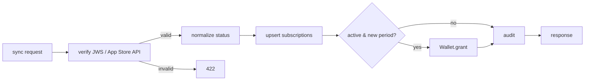

# Subscription — Architecture

## Поток sync
1. Принять `transaction` payload.
2. Верифицировать:
   - Проверка JWS-подписи Apple (цепочка сертификатов) и/или запрос статуса через App Store Server API.
   - Извлечь `productId` (plan), `expiresDate`, `transactionId`, состояние (active/expired/revoked).
3. Нормализовать статус:
   - `expiresDate > now()` и не revoked → `active`.
   - иначе → `expired`.
4. Upsert `subscriptions(user_id, status, plan, expires_at, updated_at)`.
5. Если переход в `active` и новый период (по transactionId, идемпотентно) → Wallet.grant фикс. пакета `SUBSCRIPTION_CREDITS_PER_PERIOD` (дефолт 1000) кредитов ([ADR-006](../../adr/ADR-006-credit-billing-and-subscription-grant.md)).
6. Audit `subscription_change`.
7. Вернуть `{isSubscribed, expiresAt, plan}`.

## Ленивое истечение
- Policy Engine трактует `active` с `expires_at <= now()` как `expired` (см. policy-engine/04). Sync приводит хранимый статус к актуальному.

## Начисление кредитов (grant)
- Фиксированный пакет на период: `SUBSCRIPTION_CREDITS_PER_PERIOD` кредитов (конфигурируемый env/config-параметр, дефолт **1000**), как `ledger_transactions(type=credit)`. См. [ADR-006](../../adr/ADR-006-credit-billing-and-subscription-grant.md).
- Начисляется при активации **или продлении** (новый период) подписки.

## Идемпотентность grant
- По `transactionId` периода (в meta ledger, `idempotency_key`) — повторный sync той же транзакции/периода не начисляет повторно (ADR-005).

## Окружения
- Sandbox и production App Store endpoints — переключение через config ([Q-007-1]).

## Test-mode верификации (STOREKIT_TEST_MODE)
Env-gated режим для e2e/CI ([TD-007](../../100-known-tech-debt.md), полная семантика —
[09-e2e-testing.md §2](../../09-e2e-testing.md#2-storekit_test_mode--env-gated-режим-тестовой-верификации)).
- **`STOREKIT_TEST_MODE=false` (дефолт, prod):** поведение не меняется — реальная JWS-верификация
  (`x5c` → цепочка до Apple root CA → ES256-подпись), fail-closed при отсутствии root CA.
- **`STOREKIT_TEST_MODE=true` (e2e/CI):** в `StoreKitVerifier.verify` добавляется ветка для
  **HS256-JWS**, подписанного `STOREKIT_TEST_SECRET`. Признак тестового пути — `alg=HS256` в
  заголовке (вместо `ES256`/`x5c`). Невалидная подпись → `422`. Транзакции с `alg=ES256`/`x5c`
  всегда идут реальной веткой (флаг её не ослабляет).
- Извлекаемые поля совпадают с `VerifiedTransaction`: `transactionId`, `originalTransactionId`
  (дефолт = `transactionId`), `productId`→`plan`, `expiresDate`(ms)→`expires_at`, `revocationDate`→
  `revoked`, `environment`, опц. сверка `bundleId`. Далее — обычный поток sync (upsert + grant
  идемпотентно по `transactionId` + audit), без изменений.
- Активен только при `STOREKIT_TEST_MODE=true` И непустом `STOREKIT_TEST_SECRET`; при включении —
  WARNING в лог на старте. Test-payload не логируется.
