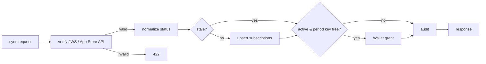

# Subscription — Architecture

## Поток sync
1. Принять `transaction` payload.
2. Верифицировать:
   - Проверка JWS-подписи Apple (цепочка сертификатов) и/или запрос статуса через App Store Server API.
   - Извлечь `productId` (plan), `expiresDate`, `transactionId`, состояние (active/expired/revoked/upgraded).
3. Нормализовать статус:
   - `expiresDate > now()`, не revoked и не `isUpgraded` → `active` ([ADR-106](../../adr/ADR-106-apple-billing-single-grant.md) §C4).
   - иначе → `expired`.
4. **Предикат устаревания** ([ADR-106](../../adr/ADR-106-apple-billing-single-grant.md) §C1): строка есть, `status=active`, её `expires_at` позже `expiresDate` транзакции → `stale`: шаг 5 пропускается.
5. Upsert `subscriptions(user_id, status, plan, expires_at, updated_at)` (только если не `stale`).
6. Если транзакция `active` → проверить `sub-grant:{transactionId}` и `adapty-txn:{transactionId}` (`has_idempotency_key`); нет ни одного → Wallet.grant под `sub-grant:{transactionId}`; занятый ключ с другой суммой — исход «уже начислено», не `409` ([ADR-106](../../adr/ADR-106-apple-billing-single-grant.md) §A). Сумма — `subscription_credits(productId, storekit)`; фолбэк по продукту вне каталога → WARNING + audit `subscription_product_unmapped` ([ADR-106](../../adr/ADR-106-apple-billing-single-grant.md) §D).
7. Audit `subscription_change` (+ `stale`, `upgraded`).
8. Вернуть `{isSubscribed, expiresAt, plan}` — при `stale` из строки `subscriptions`, иначе из транзакции.

```mermaid
flowchart LR
    R[sync request] --> V[verify JWS / App Store API]
    V -->|valid| N[normalize status]
    V -->|invalid| E[422]
    N --> S{stale?}
    S -->|no| U[upsert subscriptions]
    S -->|yes| G
    U --> G{active & period key free?}
    G -->|yes| GR[Wallet.grant]
    G -->|no| A[audit]
    GR --> A
    A --> RESP[response]
```

## Ленивое истечение
- Policy Engine трактует `active` с `expires_at <= now()` как `expired` (см. policy-engine/04). Sync приводит хранимый статус к актуальному.

## Начисление кредитов (grant)
- Фиксированный пакет на период: `SUBSCRIPTION_CREDITS_PER_PERIOD` кредитов (конфигурируемый env/config-параметр, дефолт **1000**), как `ledger_transactions(type=credit)`. См. [ADR-006](../../adr/ADR-006-credit-billing-and-subscription-grant.md).
- Начисляется при активации **или продлении** (новый период) подписки.

## Идемпотентность grant
- Ключ `sub-grant:{transactionId}` — **общий с вебхуком Adapty** ([ADR-106](../../adr/ADR-106-apple-billing-single-grant.md) §A); до гранта проверяется и исторический ключ вебхука `adapty-txn:{transactionId}`. Повторный sync, как и транзакция, уже зачисленная вебхуком, не начисляет повторно (ADR-005). Уникальность — в пределах `userId` ([ADR-106](../../adr/ADR-106-apple-billing-single-grant.md) §A5).
- ⚠️ **Контраст с `WalletService.grant`:** сам `grant` на тот же ключ с другой суммой поднимает `ConflictError` (`409`, [ADR-005](../../adr/ADR-005-idempotency-ledger.md)) — это правило **не меняется**; `sync` на ключе периода обязан трактовать такой исход как «уже начислено» и отвечать `200`.

## Окружения
- Sandbox и production App Store endpoints — переключение через config ([Q-007-1]).

## Test-mode верификации (STOREKIT_TEST_MODE)
Env-gated режим для e2e/CI ([TD-007](../../100-known-tech-debt.md), полная семантика —
[09-e2e-testing.md §2](../../09-e2e-testing.md#2-storekit_test_mode--env-gated-режим-тестовой-верификации)).
- **`STOREKIT_TEST_MODE=false` (дефолт, prod):** поведение не меняется — реальная JWS-верификация
  (`x5c` → цепочка до Apple root CA → ES256-подпись), fail-closed при отсутствии root CA.
- **`STOREKIT_TEST_MODE=true` (e2e/CI):** в `StoreKitVerifier.verify` добавляется ветка для
  **HS256-JWS**, подписанного `STOREKIT_TEST_SECRET`. Признак тестового пути — `alg=HS256` в
  заголовке (вместо `ES256`/`x5c`). Невалидная подпись → `422`. Транзакции с `alg=ES256`/`x5c`
  всегда идут реальной веткой (флаг её не ослабляет).
- Извлекаемые поля совпадают с `VerifiedTransaction`: `transactionId`, `originalTransactionId`
  (дефолт = `transactionId`), `productId`→`plan`, `expiresDate`(ms)→`expires_at`, `revocationDate`→
  `revoked`, `environment`, опц. сверка `bundleId`. Далее — обычный поток sync (upsert + grant
  идемпотентно по `transactionId` + audit), без изменений.
- Активен только при `STOREKIT_TEST_MODE=true` И непустом `STOREKIT_TEST_SECRET`; при включении —
  WARNING в лог на старте. Test-payload не логируется.

## Источник числа кредитов после [ADR-099](../../adr/ADR-099-crm-admin-economics-and-instance-settings.md)

Число кредитов, начисляемых по продукту, берётся **единым резолвером** в порядке
**оверлей `admin_products` → env-карта этого канала → фиксированный грант канала**. Оверлей
заполняется оператором из CRM (`POST`/`PATCH /v1/admin/products`), лежит в БД инстанса и **всегда
серверный**: анти-тампер не ослабляется — число кредитов по-прежнему **никогда** не приходит из
тела пользовательского запроса.

- **Пустая таблица оверлея = сегодняшнее поведение бит-в-бит.** Ни один продукт, заведённый в env,
  не меняет суммы начисления этим выкатом.
- **Правка применяется не мгновенно:** значение читается из снимка процесса, обновляемого раз в
  `ADMIN_OVERRIDES_REFRESH_SECONDS` (дефолт 30 с). Окно объявляется оператору полем
  `effective_after_seconds` admin-контракта.
- **Архивный продукт (`archived: true`) начисляет как обычно.** Архив снимает продукт **с
  витрины** приложения и не является запретом операций — иначе он ломал бы уже оплаченное и
  активные подписки.
- ⚠️ **После правки величины из CRM правка `.env` по ней ничего не меняет** — оверлей приоритетнее
  env ([ADR-099 §2](../../adr/ADR-099-crm-admin-economics-and-instance-settings.md)).
- ⛔ **«Строка оверлея есть» ≠ «оверлей задал число».** Колонки `purchase_kind`/`tokens` —
  nullable со смыслом «оверлей этого поля не задаёт»
  ([ADR-099 §6.1](../../adr/ADR-099-crm-admin-economics-and-instance-settings.md)), поэтому оверлей
  читается, **только если и класс совпал, и `tokens` задан**; иначе резолвер проваливается к карте
  канала и его фолбэку. Строка, созданная правкой одного `archived`, не несёт числа — и не имеет
  права обнулить грант: это было бы изменением начисления правкой, его не касавшейся (§2).

⚠️ **Этот путь единственный, где до [ADR-099](../../adr/ADR-099-crm-admin-economics-and-instance-settings.md)
продукт вообще не участвовал в сумме гранта:** StoreKit-подписка начисляла фиксированный
`SUBSCRIPTION_CREDITS_PER_PERIOD` независимо от `productId`. Теперь сумма ищется сначала в оверлее
по `productId` верифицированной транзакции и **только при его отсутствии** берётся прежняя
фиксированная величина. Изменение **аддитивно**: у продуктов, заведённых в env, строки оверлея нет,
поэтому сегодняшние начисления не меняются. Ключ идемпотентности (`sub-grant:{transaction_id}`) и
ленивое истечение не затрагиваются.
