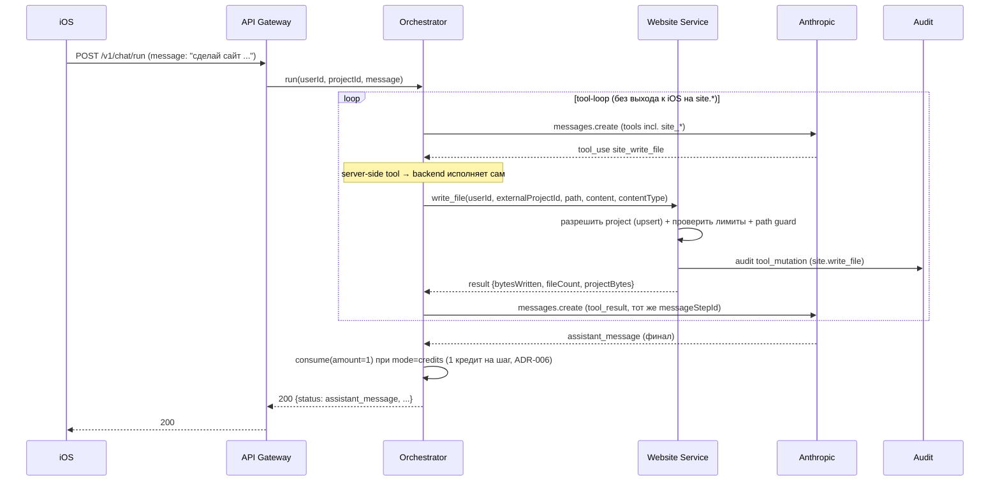

# Website Builder — Architecture

> **Опциональность ([ADR-022](../../adr/ADR-022-optional-project-and-tool-gating.md)).** Website-builder — необязательная фича. Server-side `site.*` предлагаются Claude **только** когда у сессии есть `chat_sessions.project_id` (сессия создана с `projectId`). В «чистом чате» (`project_id IS NULL`) `site.*` в tool-набор не включаются → нижеописанный tool-loop website-builder не активируется. Гейтинг — [chat-orchestrator/03-architecture.md §Гейтинг site.* tools](../chat-orchestrator/03-architecture.md#гейтинг-site-tools-по-наличию-проекта-adr-022).

## Размещение
- Новый пакет `src/app/website/` (service: проекты/файлы, signed URL, лимиты; tool-хэндлеры `site.*`).
- Tool-хэндлеры регистрируются в каталоге tools Chat Orchestrator как **server-side** ([ADR-011](../../adr/ADR-011-server-side-tools.md)); предлагаются Claude только при наличии проекта у сессии ([ADR-022](../../adr/ADR-022-optional-project-and-tool-gating.md)).
- Публичный роутер `api_gateway/routers/preview.py` (`GET /v1/preview/*`) — без `get_current_user`, со security-заголовками превью.

## Server-side tool-loop (ADR-011)

- `site.*` исполняется **синхронно** внутри обработки `/chat/run` (или `/chat/tool-result`), без `status=tool_call` клиенту.
- Смешанные шаги: если в шаге встречается client-side tool (`files.*`/…), он уходит на iOS как обычно; server-side между ними
  исполняются на backend. `messageStepId` един на весь шаг (ADR-006).
- Guard: ≤ `MAX_SERVER_TOOL_ROUNDS` (дефолт 16) последовательных server-side раундов на шаг; превышение → контролируемый отказ + audit.

## Разрешение проекта
- При `site.write_file` backend разрешает `projects` по `(user_id, external_project_id)` (idempotent upsert,
  `ux_projects_user_external`): существует → используется, нет → создаётся. `user_id` — из сессии шага (не из args),
  `external_project_id` — `chat_sessions.project_id` текущей сессии (непустой — иначе `site.*` не были бы предложены, [ADR-022](../../adr/ADR-022-optional-project-and-tool-gating.md)). Так модель не может писать в чужой/произвольный проект.
- `site.preview`/`site.list`/`site.read`/`site.delete` требуют существующего проекта владельца; нет → tool `is_error`.

## Signed URL (ADR-010)
- `site.preview` строит `token = base64url(exp) . base64url(HMAC_SHA256(PREVIEW_URL_SECRET, "projectId|ownerUserId|exp"))`,
  TTL = `PREVIEW_URL_TTL_SECONDS` (дефолт 900s). URL: `/v1/preview/{projectId}/{token}/{entry}` (entry дефолт `index.html`).
- Эндпоинт превью: парсит `exp`+HMAC, проверяет TTL и подпись (constant-time), сверяет `projects.user_id == ownerUserId`,
  нормализует `path`, читает `site_files` по `(project_id, path)`, отдаёт `content` с `content_type` и security-заголовками.

```mermaid
flowchart TB
    BR[Browser] -->|GET /v1/preview/{projectId}/{token}/{path}| PV[Preview endpoint]
    PV --> SIG{HMAC + exp валидны?}
    SIG -- нет --> F403[403]
    SIG -- да --> OWN{projects.user_id == ownerUserId?}
    OWN -- нет --> F404[404]
    OWN -- да --> PATH{path нормализован, не traversal?}
    PATH -- нет --> F404b[404]
    PATH -- да --> FILE{site_files(project_id, path) есть?}
    FILE -- нет --> F404c[404]
    FILE -- да --> OK[200 + content_type + sandbox CSP + nosniff + no-store]
```

## Хранение
- Контент — `site_files.content` (BYTEA) в БД ([04-data-model.md](04-data-model.md)). Лимиты проверяются в `site.write_file`.
- Миграция в object-storage — [TD-009](../../100-known-tech-debt.md); интерфейс Website Service спроектирован так, чтобы
  замена backend'а хранения (БД → object-storage) не меняла контракты `site.*`/preview.

## Биллинг
- Генерация сайта — обычный chat-шаг: 1 кредит на финальный assistant_message ([ADR-006](../../adr/ADR-006-credit-billing-and-subscription-grant.md)),
  server-side `site.*` раунды кредитов **не** списывают (как client-side tool-раунды). Хранение/превью не тарифицируются ([Q-010-4](../../99-open-questions.md)).
